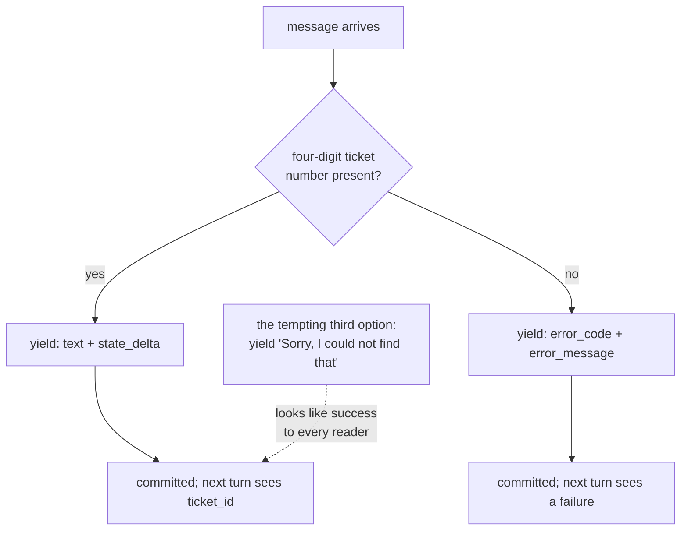

# 3.3 — Your own emitter, including the bad reading

## One-line answer

When you write an agent that emits its own events, an error is **another event to yield** — carried
on `error_code` and `error_message` — not something to catch and turn into a polite sentence.

---

## The story

On a hospital ward, a nurse goes round every few hours with a chart at the foot of each bed.
Temperature, pulse, blood pressure, written down with the time.

Most of the readings are unremarkable. Occasionally one is not. A blood pressure that is too low, or
a temperature that has climbed since the last round.

The bad reading goes on the chart. It goes on in the same handwriting, in the same column, at the
right time. Nobody rewrites it kinder, and nobody leaves the box empty and mentions it verbally to
whoever is on next.

There are two reasons, and the second is the one people underestimate.

The first is obvious: the doctor needs to know. A patient's blood pressure dropping is the thing the
chart exists to catch.

The second is that **the shape of the chart is what makes it readable at a glance.** A doctor coming
onto the ward reads twenty charts quickly, and what they are reading is the *line* — is it flat, is
it climbing, did something change at four in the morning. A missing box breaks the line. A softened
number bends it. Either way, the fast read that the whole system depends on stops working, and the
one chart with a gap in it looks exactly like the nineteen that are fine.

An event stream is a chart. A failure that is caught and converted into a friendly string does not
appear as a dip in the line — it appears as a perfectly normal reading. And everything downstream
that reads the stream, which by the end of this curriculum is the logger, the tracing, the evals and
the resumption machinery, sees a healthy patient.

---

## The idea in plain language

[3.1](3.1-one-paper-at-a-time.md) taught the contract: yield events as they happen. This part is
about the events people do not think to yield.

Two of the thirty-four fields from [1.2](../01-the-event-object/1.2-the-fields-that-were-renamed.md)
exist for this:

- **`error_code`** — a short string. What kind of failure. It is deliberately a string rather than an
  enum, because "code varies by model", as the field's own docstring says, and a provider's code is
  more useful to you than a category ADK invented.
- **`error_message`** — the human-readable detail.

They are inherited from `LlmResponse`, which is the class `Event` extends, and that inheritance is a
piece of information in itself: **an event is a model response with bookkeeping attached**, so
anything the model layer can report, an event can carry.

This connects to a trap you have not reached yet. The plan's §5.1 lists **trap #4**:

> *1.x habit: tool/model errors caught and returned as strings, hiding failures. 2.x reality: 2.x
> surfaces exceptions through the runtime so callbacks/plugins can act on them. Swallowing them
> silently breaks retries, tracing, and honesty.*

Day 21 is where that trap gets its own day. It is named here because the shape of the fix is
something you can practise today, in an agent you write yourself, for free: **when something goes
wrong, yield an event that says so.** The alternative — catching it and yielding a normal-looking
text event that says "Sorry, I could not find that" — produces a stream in which nothing failed.

This is Principle 10, *fail honestly*, at the level of a single object. The principle says agents
never fabricate a result to cover an error, and the reason it appears in a section about generators
is that the generator is where the choice is physically made. You are standing at the `yield`. What
you put in the event is what the rest of the system will believe.

One caution so the lesson does not overshoot: **yielding an error event is not the same as handling
the error.** Sometimes the right thing is to let the exception propagate and let the runtime deal
with it, which is what "surfaces exceptions through the runtime" means. The error event is for when
your own code has detected something wrong that is not an exception — a validation that failed, a
result that came back empty, a precondition that does not hold. Day 21 draws the line properly. Today
you learn that the field exists and what an honest stream looks like.

---

## Why Sutra needs it

**Day 21** closes ADK-23 and SEC-02 on exactly this, and arrives much easier if you have already
emitted an error event by hand and watched what a reader sees.

**Day 22**'s structured logging distinguishes a failed turn from a successful one, and the field it
reads to do that is `error_code`. A swallowed error is a turn the log will report as fine.

**Day 79 onwards** is evals. An eval that measures "how often does Sutra fail to find an answer"
counts error events. Every swallowed failure is a missing data point, and the metric is
optimistic in exactly the cases you most need to see.

**Day 84**'s tracing marks a span as failed from the same field. A trace of a system that never
records a failure is a trace nobody will trust after the first incident.

---

## The mechanism

An emitter that reports a bad reading rather than smoothing it. This one is a lab experiment, not
product code — Sutra's own agent stays an `LlmAgent` — and it costs nothing to run:

```python
# lab/emitter.py - an agent that yields what actually happened, including the failure.
import asyncio
import re
from collections.abc import AsyncGenerator

from google.adk.agents import BaseAgent
from google.adk.agents.invocation_context import InvocationContext
from google.adk.events import Event, EventActions
from google.adk.runners import Runner
from google.adk.sessions import InMemorySessionService
from google.genai import types

from sutra.desk.events import describe

TICKET = re.compile(r"\b(\d{4})\b")


class Intake(BaseAgent):
    """Pulls a ticket number out of the user's message, honestly."""

    async def _run_async_impl(self, ctx: InvocationContext) -> AsyncGenerator[Event, None]:
        asked = ctx.user_content
        text = "".join(p.text or "" for p in (asked.parts if asked else []))

        found = TICKET.search(text)
        if not found:
            yield Event(
                author=self.name,
                error_code="NO_TICKET_ID",
                error_message=f"no four-digit ticket number in {text[:40]!r}",
            )
            return

        yield Event(
            author=self.name,
            content=types.Content(
                role="model",
                parts=[types.Part(text=f"Ticket {found.group(1)} accepted for triage.")],
            ),
            actions=EventActions(state_delta={"ticket_id": found.group(1)}),
        )


async def ask(question: str) -> None:
    service = InMemorySessionService()
    session = await service.create_session(app_name="probe", user_id="u")
    runner = Runner(agent=Intake(name="intake"), app_name="probe", session_service=service)

    print(f"--- {question!r}")
    async for event in runner.run_async(
        user_id="u",
        session_id=session.id,
        new_message=types.Content(role="user", parts=[types.Part(text=question)]),
    ):
        print("   ", describe(event), "err=", event.error_code)

    stored = await service.get_session(app_name="probe", user_id="u", session_id=session.id)
    print("    state:", stored.state)


asyncio.run(ask("please look at ticket 4521, users keep getting logged out"))
asyncio.run(ask("the thing is broken again"))
```

**Line by line:**

- `TICKET = re.compile(r"\b(\d{4})\b")` — compiled once at module level rather than inside the
  method, because compiling a pattern on every run is work you can do once. `\b` on both sides so
  that a four-digit run inside a longer number does not match.
- `ctx.user_content` — the message that started this run, handed to the agent by the runtime. Reading
  it from the context rather than from the session's last event is the difference between working
  and *usually* working: the session's last event is the user's message today, and stops being it as
  soon as anything else appends first.
- `asked.parts if asked else []` — the guard from
  [1.1](../01-the-event-object/1.1-an-event-is-a-line-in-a-ledger.md) again. `user_content` is
  optional; a resumed run can start without one.
- `if not found:` … `yield Event(error_code=..., error_message=...)` — **the line this part exists
  for.** The failure becomes an event. Note there is no `content` on it at all: it says nothing to
  the user, it reports to the system. Deciding what the *user* sees is a separate job, done by
  whatever reads the stream, and separating the two is what stops an error message written for an
  engineer being shown to a customer.
- `f"no four-digit ticket number in {text[:40]!r}"` — the message says what was expected and shows
  what arrived, truncated and `repr`'d so whitespace is visible. An error message that does not
  contain the input is an error message that makes you go and reproduce it.
- `return` immediately after the error yield — a bare `return` inside an async generator is legal and
  means *stop*, unlike `return <value>`, which is a syntax error in a generator and is exactly the
  1.x habit that [5.1](../05-failure-lab/5.1-the-mechanic-who-billed-at-the-end.md) breaks on purpose.
- The success `yield` carrying **both** a message and a `state_delta` — one event, one thing that
  happened, said and recorded together, as [1.4](../01-the-event-object/1.4-the-half-that-is-not-text.md)
  described.
- `event.error_code` printed next to `describe(event)` — because today's `describe` does not include
  it. That is a gap, and closing it is one of the day's `TODO(me)` items rather than something this
  document does for you.
- Two `asyncio.run(...)` calls at the bottom, one good input and one bad — the same code path,
  exercised both ways, which is the smallest possible version of the eval discipline Principle 11
  asks for.

The output:

```text
--- 'please look at ticket 4521, users keep getting logged out'
             intake       text    final=True  'Ticket 4521 accepted for triage.' err= None
    state: {'ticket_id': '4521'}
--- 'the thing is broken again'
             intake       other   final=True  '' err= NO_TICKET_ID
    state: {}
```

Two runs, two shapes. The second produced no text, changed no state, and left a record saying exactly
what was wrong with the input. Nothing was smoothed over, and nothing pretended to be an answer.

Notice `kind_of` labelled the error event `other`, which is honest and unhelpful — the function from
[1.5](../01-the-event-object/1.5-which-run-which-agent-which-branch.md) does not know about error
events yet. That is a real gap in code you wrote this morning, discovered by using it, which is the
usual way.



---

## When it breaks

**💥 The error that was turned into a sentence.**

```python
try:
    ticket = extract(text)
except ValueError:
    yield note(self.name, "Sorry, I could not find a ticket number.")
```

There is no error text for this, which is the finding. The run succeeds. `describe` prints a normal
text event. The log shows a completed turn, the trace shows a green span, and the eval scores it as a
response. The only place the failure exists is in the wording of a sentence, which nothing downstream
parses. **A failure you can only detect by reading English is a failure you have not recorded.**

**💥 `return` with a value inside a generator.**

```text
  File "lab/emitter.py", line 31
    return events
    ^^^^^^^^^^^^^
SyntaxError: 'return' with value in async generator
```

Python itself refuses this, at import time, before anything runs. It is the friendliest possible
version of trap #3 and [5.1](../05-failure-lab/5.1-the-mechanic-who-billed-at-the-end.md) shows the
unfriendly version — the one where you also remove the `yield` and get no syntax error at all.

**💥 An error event with no message.**

```text
             intake       other   final=True  '' err= ERROR
```

`error_code="ERROR"` with no `error_message` is a record that something went wrong and nothing about
what. It passes every schema, satisfies every "did you handle the error" review, and is worth
approximately nothing at the moment you need it. The test is simple: could somebody fix the problem
from this line alone?

---

## In production

**What a professional writes instead of the teaching version** keeps two things apart that this small
agent already keeps apart, and that most first attempts merge: **the record of the failure** and
**what the user is told**. The event carries the code and the technical detail. A separate layer —
the reader, the API server, the chat surface — decides what a person sees, which is usually shorter,
never contains an identifier, and is chosen by the `error_code` rather than by string-matching a
message.

**What degrades at scale** is the code vocabulary. One agent with three error codes is fine. Forty
agents, each inventing codes as they go, gives you a dashboard where `NO_TICKET`, `TICKET_MISSING`
and `NO_TICKET_ID` are three names for one thing and none of them has a useful count. Teams end up
with a module of constants and a review rule, and the ones that get there early spend a lot less time
reconciling dashboards.

**The failure that only shows with real traffic** is the error path that was never exercised. The
`if not found` branch above runs on maybe one message in fifty in testing and one in three in
production, where people paste screenshots and write "same issue as before". An error path that is
rare in your tests and common in reality is the code most likely to contain a typo nobody has ever
executed — which is the argument for the second `asyncio.run` call at the bottom of the script being
there from the first version rather than added later.

**The review comment a senior engineer leaves:** *"This catches the failure and returns a friendly
sentence, so as far as the logs, the traces and the evals are concerned this turn succeeded. Yield an
event with `error_code` set, and let the surface decide what the user reads. And put the input in the
message — right now I'd have to reproduce it to know what we were given."*

**The interview question:** *"how should an agent report a failure?"* The answer that shows you have
been on call: "As a first-class record in the same stream as everything else, with a stable code and
a message that contains the input. The failure mode I watch for is catching an error and returning an
apologetic sentence — the run then looks successful to every consumer of the stream, so the log says
fine, the trace is green, and the eval scores it as a response. You've converted a signal into prose,
and prose isn't queryable. Separately, I keep the record and the user-facing message apart, because
the thing the system needs to know and the thing a customer should read are almost never the same
sentence."

---

## Check yourself

```bash
uv run python days/day-07-events-and-streaming/lab/emitter.py
```

**Answer out loud, without scrolling up:**

> Give the two fields an event uses to report a failure, and say why an error event usually carries no
> `content`. Then say what a swallowed error looks like to the logger, the trace and the eval, and why
> that is worse than a crash.

---

**Next:** [4.1 — The meter that cuts off](../04-the-brakes/4.1-the-meter-that-cuts-off.md)
