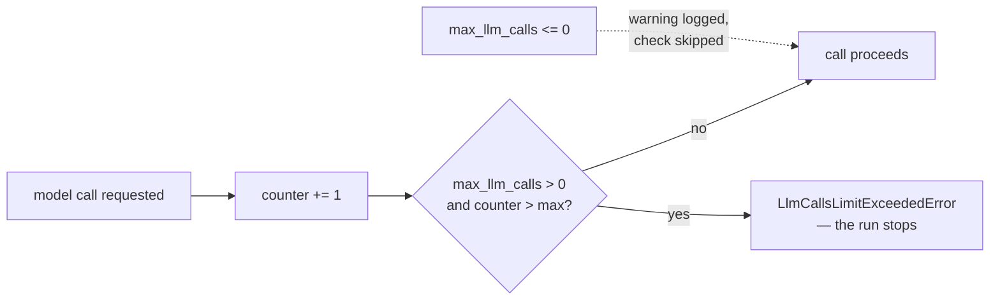

# 4.1 — The meter that cuts off

## One-line answer

`RunConfig.max_llm_calls` is the framework's version of the step budget you wrote by hand on Day 3 —
it defaults to **500**, it is enforced per run, and setting it to zero or a negative number turns the
brake off entirely with nothing but a log warning.

---

## The story

Some houses have a prepaid electricity meter. You pay first, the meter counts down, and when the
balance reaches zero the supply stops.

The first time it happens it feels harsh. The fridge stops, the fan stops, and it is eleven at night.

But think about the alternative, which plenty of people live with: the postpaid connection, where
nothing stops and a bill arrives at the end of the month. If a water pump switch sticks on and runs
for eleven days, the postpaid house finds out on the thirtieth, in the form of a number they cannot
pay. The prepaid house finds out when the balance drains faster than usual, and the very worst case
is that the supply cuts off — annoying, survivable, and over.

Neither meter prevented the stuck switch. What the prepaid meter did was **put a floor under how bad
it could get**, without needing to understand anything about pumps.

That is the whole idea of a limit that is not about correctness. Nobody sets a prepaid balance
expecting to hit it. You set it because the ways a thing can go wrong are not all known in advance,
and a ceiling contains the ones you did not think of.

---

## The idea in plain language

On [Day 3, part 5.1](../../../day-03-loop-hand-rolled/parts/05-containment/5.1-the-step-budget.md)
you wrote a step budget into your own loop by hand: a counter, a maximum, and a stop. You wrote it
because a think→act→observe loop with no ceiling can run forever, and on a free tier "forever" means
"until midnight tomorrow", since your daily quota is gone.

ADK has the same brake, and it is one field on the object you met in
[2.2](../02-the-stream/2.2-the-partial-flag.md):

> `RunConfig(max_llm_calls=...)`

Four facts about it, each of which matters:

**It defaults to 500.** Not unlimited. If you have never passed a `RunConfig` at all — which is every
run you have done so far — the brake is on, at five hundred model calls per run.

**It counts model calls, not turns and not events.** One user message can cause many model calls
once tools are involved: the model asks for a tool, the tool runs, the model is called again with the
result. Day 10 makes that routine.

**It is per run, not per session and not per process.** The counter lives on the invocation and dies
with it. Two runs of five hundred each are fine. That is the right scope for a runaway-loop brake and
the wrong scope for a daily budget, and confusing the two is [4.2](4.2-the-note-the-machine-refuses.md)'s
neighbour rather than this part's subject — the daily budget is Day 24's job.

**Zero or negative turns it off.** ADK's validator does not refuse this. It logs a warning and
continues, and the warning says exactly what you have done:

```text
WARNING:google_adk.google.adk.agents.run_config:max_llm_calls is less than or equal to 0. This
will result in no enforcement on total number of llm calls that will be made for a run. This
may not be ideal, as this could result in a never ending communication between the model and
the agent in certain cases.
```

A warning in a log is not a guard. It scrolls past during startup and nobody reads it again.

When the limit is hit, the run raises:

```text
LlmCallsLimitExceededError: Max number of llm calls limit of `500` exceeded
```

That is an exception, not an event — it stops the run. Which is the correct design and worth being
explicit about: this brake exists for the case where **the system is misbehaving in a way it cannot
report on**, so a graceful "I'm sorry, I used too many calls" answer would be exactly the wrong
outcome. You want the noise.

This is Principle 13, *blast radius before capability*, in one field. Sutra has no tools yet, so it
cannot loop. From Day 10 it can, and the containment story arrives with the capability rather than
after the first incident.

---

## Why Sutra needs it

**Day 10** puts a tool on Sutra, which is the day a loop becomes physically possible: a model that
keeps deciding to search, with a tool that keeps returning nothing useful, will keep going.

**Day 16** adds code execution and search grounding — the day Sutra's tools stop being read-only —
and SEC-01's sandboxing concept lands alongside them. A ceiling on calls is one wall of that box.

**Day 24** is token accounting in RPM and RPD. `max_llm_calls` is *not* that budget: it is per run,
it counts calls rather than tokens, and it protects against a loop rather than against a month. Both
exist, and knowing which one you are setting is half of Day 24.

**Day 70** is the Quota-Router, which routes calls to whichever provider has headroom. It needs an
honest count of calls made, and the counter this field enforces is where that count starts.

---

## The mechanism

The free half first — the validator's own behaviour, which needs no model at all:

```python
# lab/brakes.py - what RunConfig will and will not let you set.
import logging
import sys

logging.basicConfig(level=logging.WARNING, format="%(levelname)s:%(name)s:%(message)s")

from google.adk.agents.run_config import RunConfig

print("default          :", RunConfig().max_llm_calls)
print("a sensible limit :", RunConfig(max_llm_calls=8).max_llm_calls)
print()
print("--- turning it off ---")
print("built            :", RunConfig(max_llm_calls=0).max_llm_calls)
print()
print("--- asking for the maximum possible ---")
try:
    RunConfig(max_llm_calls=sys.maxsize)
except Exception as exc:
    print(type(exc).__name__)
    print(str(exc))
```

**Line by line:**

- `logging.basicConfig(level=logging.WARNING, ...)` **before** the ADK import — because the warning
  this script exists to show is emitted through the `logging` module, and with no handler configured
  Python's default only surfaces it in a reduced form. Configuring logging first is the difference
  between seeing the warning and concluding there isn't one.
- The import sitting *after* a statement — normally a lint error, and here it is deliberate and would
  need a `# noqa: E402` in real code. It is in the lab, where the point is the ordering, and in
  product code you would configure logging in an entry point instead.
- `RunConfig().max_llm_calls` — the default, read from the object rather than from a document. This
  is [1.2](../01-the-event-object/1.2-the-fields-that-were-renamed.md)'s rule applied to a number.
- `RunConfig(max_llm_calls=0)` — **builds successfully.** The warning is printed and the object is
  returned. That is the finding: turning the brake off is not an error.
- `sys.maxsize` — the largest integer Python's platform layer uses, and the one thing the validator
  genuinely refuses. Somebody clearly wrote "unlimited" as `sys.maxsize` once and it became a
  special case.
- `except Exception` rather than `except ValueError` — because Pydantic wraps the validator's
  `ValueError` in a `ValidationError`, and catching the inner type would miss it. Worth knowing
  generally: a validator raising `ValueError` surfaces as `ValidationError` to the caller.

Which prints:

```text
WARNING:google_adk.google.adk.agents.run_config:max_llm_calls is less than or equal to 0. This will result in no enforcement on total number of llm calls that will be made for a run. This may not be ideal, as this could result in a never ending communication between the model and the agent in certain cases.
default          : 500
a sensible limit : 8

--- turning it off ---
built            : 0

--- asking for the maximum possible ---
ValidationError
1 validation error for RunConfig
max_llm_calls
  Value error, max_llm_calls should be less than 9223372036854775807. [type=value_error, input_value=9223372036854775807, input_type=int]
    For further information visit https://errors.pydantic.dev/2.13/v/value_error
```

Note where the warning landed — at the **top**, before the first `print`, because it was emitted
while the `RunConfig(max_llm_calls=0)` line was being validated and Python's output ordering does not
care about your narrative. In a real service it lands in a startup log among two hundred other lines.

Now the counter itself. ADK keeps it on a private class, so this script borrows a private name, which
is allowed **here and only here** for the same reason
[Day 6, part 3.1](../../../day-06-instructions-and-personas/parts/03-the-instruction-fields/3.1-where-your-instruction-lands.md)
allowed it: this is the lab, nothing under `sutra/` may import it, and a name with a leading
underscore can be renamed in a patch release without warning.

```python
# lab/counter.py - the brake, exercised without a single model call.
# Borrows a PRIVATE ADK name. Lab only; nothing under sutra/ may import this.
from google.adk.agents.invocation_context import (
    LlmCallsLimitExceededError,
    _InvocationCostManager,
)
from google.adk.agents.run_config import RunConfig

config = RunConfig(max_llm_calls=3)
meter = _InvocationCostManager()

for attempt in range(1, 6):
    try:
        meter.increment_and_enforce_llm_calls_limit(config)
        print(f"  call {attempt}: allowed")
    except LlmCallsLimitExceededError as exc:
        print(f"  call {attempt}: {type(exc).__name__}: {exc}")
        break
```

**Line by line:**

- `_InvocationCostManager` — the private class that holds the counter. ADK's real
  `InvocationContext` owns one of these per run, which is what makes the limit per-run.
- `LlmCallsLimitExceededError` is **public** while the manager is private — a useful signal from the
  library's authors: they expect you to catch the exception and do not expect you to touch the
  counter.
- `RunConfig(max_llm_calls=3)` — three rather than five hundred, so the limit is reachable in a
  script you can read.
- `increment_and_enforce_llm_calls_limit(config)` — the name says the order, and the order matters:
  it increments first, then checks. So the limit is the number of calls **allowed**, and the failure
  arrives on the one after.
- `range(1, 6)` — five attempts against a limit of three, so you can see both that it allows three
  and that it refuses the fourth. Testing only up to the limit would prove half of it.
- `break` in the `except` — because once the limit is exceeded the run is over. Continuing the loop
  would demonstrate that the exception keeps being raised, which is not in doubt.

```text
  call 1: allowed
  call 2: allowed
  call 3: allowed
  call 4: LlmCallsLimitExceededError: Max number of llm calls limit of `3` exceeded
```

Three allowed, the fourth refused. The brake is off-by-nothing, which is the behaviour you want from
a number you are going to reason about.



---

## When it breaks

**💥 The limit that was hit for a boring reason.**

```text
LlmCallsLimitExceededError: Max number of llm calls limit of `500` exceeded
```

Five hundred model calls in one run is almost never a legitimate workload — it is a loop. The
temptation on seeing this is to raise the number, and raising it is almost always wrong. **Read the
events first.** The session holds all five hundred calls, and looking at the last ten will usually
show the same tool being called with the same arguments, which is a prompt problem or a tool problem,
not a limit problem.

**💥 The brake that was turned off in a config file.**

```text
max_llm_calls: 0
```

Somewhere in a YAML file, added during an incident, with a comment saying `# temporary`. Six months
later a prompt change puts an agent into a loop and there is nothing to stop it. There is no error to
show here, which is exactly the problem: the only evidence is a warning line at startup.

**💥 Mistaking it for a token budget.**

Five hundred calls that each send a fifty-thousand-token context is an enormous amount of work
inside a limit that was never exceeded. `max_llm_calls` counts **calls**. A run can stay comfortably
under it and still exhaust a daily quota, and the number that would have caught that is Day 24's, not
this one.

---

## In production

**What a professional writes instead of the teaching version** is a limit chosen from the workload
rather than left at the default. Sutra's triage path will make a small, knowable number of model
calls per ticket — one to classify, one or two to research, one to write — so a limit of eight is
both generous and diagnostic: hitting eight means something is wrong, and you find out on the ticket
it happened on rather than after five hundred calls. **A limit you never hit teaches you nothing; a
limit set just above the real workload is an alarm.**

**What degrades at scale** is that the limit is per run while every quota you actually have is per
minute and per day. One runaway run is contained. Two hundred concurrent runs each making a
legitimate eight calls is sixteen hundred calls in a minute, which no free tier survives, and
`max_llm_calls` will not have complained once. This is precisely why Addendum 02 denominates budgets
in RPM and RPD per provider and why Day 70 builds a router: the per-run brake and the per-provider
budget are different instruments, and you need both.

**The failure that only shows with real traffic** is the limit hit by a legitimate long task. A
ticket with a very long thread, or a customer who pastes a whole log file, can genuinely need more
calls than the tidy case you tuned against. If the only response to hitting the limit is an
exception, that customer gets nothing at all. The mature shape is a limit generous enough that
hitting it means malfunction, plus an alert, plus a path for the rare legitimate case — usually a
different agent configuration rather than a bigger number.

**The review comment a senior engineer leaves:** *"`max_llm_calls=0` here turns off the only brake we
have on a runaway loop, and the only trace of that decision is a warning in the startup log. What was
the actual problem? If a legitimate run needs more than eight calls I'd rather know which run it is
than remove the ceiling."*

**The interview question:** *"what stops an agent from looping forever?"* The answer that shows you
have run one: "A per-run ceiling on model calls — the framework has one and it defaults to a few
hundred. The important thing is what kind of control it is: it's a blast-radius limit, not a budget.
It's per invocation, so it contains one runaway run and does nothing about two hundred concurrent
ones, which is why you also need a per-provider rate budget. And when you hit it, the first instinct
is to raise the number, which is nearly always wrong — the events from that run are still there, and
the last few of them usually show the same tool being called with the same arguments, which is a
prompt bug."

---

## Check yourself

```bash
uv run python days/day-07-events-and-streaming/lab/brakes.py
uv run python days/day-07-events-and-streaming/lab/counter.py
```

**Answer out loud, without scrolling up:**

> Say what `max_llm_calls` counts, what scope it counts over, and what happens when you set it to
> zero. Then explain why a limit you never hit is less useful than one set just above your real
> workload.

---

**Next:** [4.2 — The note the machine refuses](4.2-the-note-the-machine-refuses.md)
