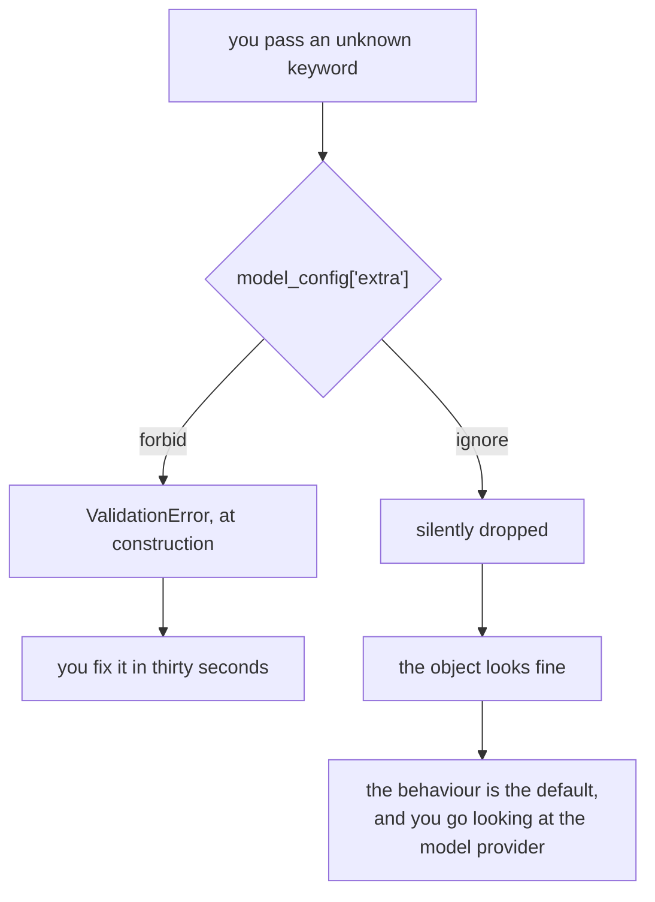

# 4.2 — The note the machine refuses

## One-line answer

`RunConfig` **rejects** any keyword it does not recognise while `Event` silently **ignores** one, so
a typo in a setting stops you at the door and a typo in an event disappears — and knowing which kind
of object you are holding is what decides whether you find out.

---

## The story

You are at a ticket machine at the station with a hundred-rupee note that has been in your pocket
too long. Soft, slightly torn at one corner.

You feed it in. The machine makes a noise, pauses, and pushes it back out at you.

Mildly irritating. You flatten it against the wall, try again, it comes back again, and you go and
find a different note.

Now imagine the other machine. You feed the note in, it takes it, and nothing happens. No ticket, no
credit, no message. The note is inside and you are standing there pressing buttons.

Which machine do you want? The one that refused you, obviously, and it is not close. The refusal cost
you thirty seconds and told you exactly what the problem was. The acceptance cost you a hundred
rupees and a conversation with somebody at the counter who cannot open the machine.

The rule underneath is simple: **when something cannot be used, the best moment to say so is
immediately, in a way that cannot be missed.** A refusal at the door is a good error. Silent
acceptance is the worst possible one, because it looks like success.

Two objects you have used today make opposite choices about this, on purpose, and the whole part is
about not confusing them.

---

## The idea in plain language

Both `RunConfig` and `Event` are Pydantic models. Pydantic lets a model say what should happen when
somebody passes a keyword the model does not declare, and there are three answers: forbid it, ignore
it, or keep it.

ADK's two objects chose differently, and both configurations are visible in their source:

| Object | Configuration | Behaviour on an unknown keyword |
| --- | --- | --- |
| `RunConfig` | `ConfigDict(extra='forbid')` | Raises a `ValidationError` immediately |
| `Event` | `ConfigDict(extra='ignore')` | Accepts it, drops it, says nothing |

**Why `RunConfig` forbids.** A run config is written by a person, once, in code. Every key in it is a
deliberate instruction. If somebody writes `streaming=True` instead of
`streaming_mode=StreamingMode.SSE`, the only two possible outcomes are an error now or a mystery
later — because a setting that was silently discarded produces a run that behaves like the default,
and "it isn't streaming" is a very long thing to debug when the config *looks* right.

**Why `Event` ignores.** An event is written by a person occasionally and read from storage
constantly. Sessions get written by one version of ADK and read by another, and a version that has
added a field will produce events that an older version does not recognise. If `Event` forbade
extras, every upgrade would make old sessions unreadable. Ignoring is what lets a stored transcript
survive the library moving underneath it.

So neither choice is the *right* one in general. Each is right for what the object is for. And the
consequence for you is a habit rather than a rule:

> **When you set something, check that it took.**

For `RunConfig` the check is free — the object refuses. For `Event`, and for anything else configured
with `extra='ignore'`, the check is yours to write, and it is one line: read the field back after you
set it.

This is the same discipline as [1.2](../01-the-event-object/1.2-the-fields-that-were-renamed.md)'s
"check the package, not the tutorial", pointed at a different failure. There, the danger was a name
that never existed. Here, it is a name that exists somewhere else.

---

## Why Sutra needs it

**Day 13** (callbacks), **Day 14** (plugins) and **Day 16** (built-in tools) each introduce more
configuration objects, and each of them has made one of these two choices. The habit of finding out
which — one line, `Model.model_config`— is worth more than memorising any individual answer.

**Day 31** is the quality gate, where `./m check` grows a lint that catches an OpenRouter model
string missing its `:free` suffix. That lint exists for exactly the reason this part exists: a
mistyped setting that costs money is a mistyped setting nothing else would have caught.

**Day 86 onwards** is deployment, where configuration arrives from environment variables and files
rather than from Python. A YAML key nobody reads is the most common configuration bug there is, and
the defence — *assert the setting took effect* — is the one being learned here on a small object.

---

## The mechanism

Both behaviours, side by side, in a script that costs nothing:

```python
# lab/strictness.py - two objects in one library, two answers to the same question.
from google.adk.agents.run_config import RunConfig
from google.adk.events import Event

print("RunConfig  extra:", RunConfig.model_config.get("extra"))
print("Event      extra:", Event.model_config.get("extra"))
print()

print("--- a typo in a RunConfig ---")
try:
    RunConfig(streaming=True)
except Exception as exc:
    print(type(exc).__name__)
    print(str(exc))
print()

print("--- the same kind of typo in an Event ---")
event = Event(author="sutra_desk", invocation_id="run-1", is_final=True)
print("constructed without complaint:", event.author)
print("does it have `is_final`?     :", hasattr(event, "is_final"))
```

**Line by line:**

- `RunConfig.model_config.get("extra")` — read off the **class**, so no instance is needed, and read
  rather than remembered. This is the one line worth keeping: point it at any Pydantic model in any
  library and it tells you whether that model will protect you.
- `.get("extra")` rather than `["extra"]` — a model that never set the option has no such key, and
  `.get` returns `None` instead of raising, which is the honest answer for "the library did not
  choose".
- `RunConfig(streaming=True)` — a plausible typo. Not a nonsense word: `streaming` is what you would
  guess if you had not read [2.2](../02-the-stream/2.2-the-partial-flag.md), and guessable typos are
  the ones that actually happen.
- `except Exception` — Pydantic raises `ValidationError`, which lives in `pydantic` and would need
  importing to catch by name. In a lab script that is noise; in product code you would import it,
  because catching `Exception` hides everything else.
- `Event(..., is_final=True)` — the same kind of mistake against the other object. `is_final` sounds
  exactly like the method from
  [1.3](../01-the-event-object/1.3-is-final-response-is-not-the-last-one.md), which is why it is the
  typo somebody will actually make.
- `hasattr(event, "is_final")` — the read-back. This is the whole defensive habit in one call: you
  set something, so ask whether it is there.

The output:

```text
RunConfig  extra: forbid
Event      extra: ignore

--- a typo in a RunConfig ---
ValidationError
1 validation error for RunConfig
streaming
  Extra inputs are not permitted [type=extra_forbidden, input_value=True, input_type=bool]
    For further information visit https://errors.pydantic.dev/2.13/v/extra_forbidden

--- the same kind of typo in an Event ---
constructed without complaint: sutra_desk
does it have `is_final`?     : False
```

Read the error text once, properly, because it is the best-behaved error message you will meet
today. It names the model, names the offending key on its own line, says the rule in English, gives
the value and its type, and links to a page about this specific rule. When you write validation of
your own, that is the standard.

And then read the last two lines again. `constructed without complaint`, followed by
`does it have is_final? False`. Nothing failed. The object is simply not what you asked for.



---

## When it breaks

**💥 The setting that never took.**

The one everybody meets, and it produces no error at all:

```python
runner.run_config = RunConfig(streaming_mode=StreamingMode.SSE)
```

`Runner` is an ordinary Python class, not a Pydantic model, so it will happily accept a brand-new
attribute you invented. There is no `extra='forbid'` to save you here, because there is no Pydantic
model involved. The run does not stream, the config object is perfect, and the thing that is wrong is
the *object you attached it to*. [2.2](../02-the-stream/2.2-the-partial-flag.md) named this; it is
repeated here because this part explains why nothing caught it.

**💥 Catching `ValidationError` by the wrong name.**

```text
NameError: name 'ValidationError' is not defined
```

It comes from `pydantic`, not from `google.adk`. Write `from pydantic import ValidationError` — and
notice what that means: `pydantic` is now something your code depends on by name, which is worth a
moment's thought before doing it in the product package rather than the lab.

**💥 Assuming `extra='ignore'` means "harmless".**

An event built from a dictionary you loaded from somewhere — a fixture, a test file, an old export —
will drop every key ADK does not know about, silently. If that dictionary was your record of what
happened, you have just loaded a lossy copy of it and nothing told you. The check is to compare the
key count before and after, once, when you write the loader.

---

## In production

**What a professional writes instead of the teaching version** is a configuration layer that is
strict at the edge. Settings that arrive from outside the program — environment variables, a YAML
file, a request body — go through one model with `extra='forbid'`, so an unknown key stops the
service at startup rather than being ignored into production. The internal objects that read from
storage stay permissive, for the version-skew reason above. **Strict where humans write, permissive
where machines read** is the shape, and ADK's own two objects are a working example of it.

**What degrades at scale** is the number of places a setting can come from. One `RunConfig` built in
one function is easy. The same setting expressible in an environment variable, a request header, a
per-tenant record and a default, all merged, is where a typo hides — because each layer individually
looks correct and the merge is where the key was misspelled. Teams that survive this log the
**effective** configuration once at the start of each run, which is the same read-back habit applied
to a whole object.

**The failure that only shows with real traffic** is the per-request override that never applied. It
is invisible in testing because your tests set it explicitly and assert on the result. In production
it arrives from a client, gets mapped through a translation layer, and one field is dropped by a
model configured to ignore extras. The symptom is "the setting works for us and not for that
customer", which is unpleasant to chase and instant to see if the effective config is in the log.

**The review comment a senior engineer leaves:** *"This builds the config from a dict that comes off
the request. `Event` and half the model classes ignore unknown keys, so if the client sends
`stream: true` instead of `streaming_mode` we'll silently do the wrong thing. Parse it through a
strict model at the edge, and log the effective config with the run id."*

**The interview question:** *"how do you catch a mistyped configuration key?"* The answer that shows
you have been burned: "Make the object that reads external input strict, so an unknown key raises at
construction instead of being dropped. Libraries differ — in the framework I've been using,
`RunConfig` forbids extras and the event model ignores them, and both are right for their jobs:
config is written by a person once, events get read back from storage written by a different version.
So the habit is to check which kind of object you're holding — it's one attribute on the class — and
where it's permissive, read the field back after you set it. And log the effective configuration per
run, because the typo is usually in a merge layer rather than in the place you're looking."

---

## Check yourself

```bash
uv run python days/day-07-events-and-streaming/lab/strictness.py
```

Then try the same `model_config` read on `LlmAgent` and on `Session`, and write down which of the
objects you use every day will protect you from a typo.

**Answer out loud, without scrolling up:**

> Give the two answers `RunConfig` and `Event` make to an unknown keyword, and give the reason each
> one is right for that object. Then state the habit that covers you when an object is permissive.

---

**Next:** [5.1 — 💥 The mechanic who billed at the end](../05-failure-lab/5.1-the-mechanic-who-billed-at-the-end.md)
