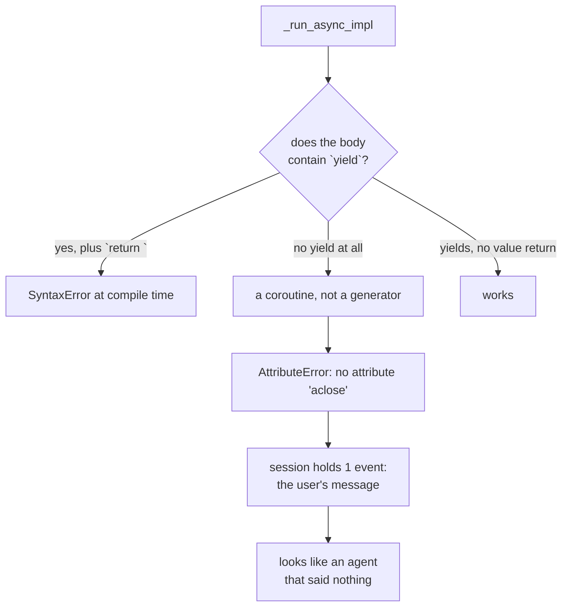

# 5.1 — 💥 The mechanic who billed at the end

## One-line answer

Today's deliberate failure is trap #3 done on purpose: write an agent that collects its events and
returns them, watch it fail two different ways depending on one keyword, and see what the session
holds afterwards.

---

## The story

🎬 **The scene.** You leave a scooter at a garage in the morning. "Bit of a noise from the back," you
say. The mechanic nods. You go to work.

You come back in the evening. He hands you a bill: brake shoes, a bearing, a chain, a service, and
labour. Four thousand rupees.

😬 **The naive fix.** You look at the bill and try to work out which of those you would have said no
to. The bearing, probably. The chain had a year left in it. But it is on the scooter now and the old
one is in a bin, so this conversation is not going anywhere.

💥 **Why it fails.** He did the whole job and reported once. Everything he found, he acted on, and
the acting and the telling were separated by nine hours. So there was no moment at which you could
have said "stop there" — not because he refused you one, but because the shape of the arrangement did
not contain one. And now neither of you can reconstruct what happened in what order, so a
disagreement about the bearing has no evidence on either side.

The other garage rings you at eleven. "Brake shoes are gone, shall I do them?" Yes. Rings again at
one. "There's a bearing making that noise, it's eight hundred." You think about it and say do it.
Same work, same bill, and at every point you knew where you stood.

💡 **The insight.** Reporting as you go is not politeness. It is what creates the *moments* — the
places where somebody else can act, where a decision can be recorded, where the job can stop cleanly.
A worker who reports once at the end has, structurally, removed all of them.

An agent that collects its events into a list and returns them is the first garage. Today you write
it, twice, and watch Python refuse it two different ways.

---

## The idea in plain language

The plan's §17.7 says every day carries at least one part whose subject is a deliberate failure. This
is today's, and its subject is trap #3 from [3.1](../03-the-yield-contract/3.1-one-paper-at-a-time.md):

> *1.x habit: custom agents collected events into a list and returned them. 2.x reality: custom
> agents and nodes **yield** events as they happen.*

The interesting thing — and the reason this deserves a part rather than a warning — is that the
mistake has **two different failure modes**, and which one you get depends on whether you left a
`yield` anywhere in the method.

**Arm A: you keep a `yield` somewhere.** Maybe an unreachable one after the `return`, put there
because a type checker complained, or a leftover from an earlier version. Python refuses to compile
the file. You never run anything.

**Arm B: you remove every `yield`.** Now the method is an ordinary `async def` that returns a list.
It compiles fine, it imports fine, and it fails at runtime inside ADK with a message about a method
you have never heard of.

Arm A is the friendly failure. Arm B is the one you will actually meet, because a person converting
1.x code deletes the yields as part of the conversion.

What makes this worth doing on purpose rather than reading about: in arm B, **the run does not simply
crash and leave nothing.** The user's message has already been appended by the runner. So the session
ends up with one event and no state, which looks like an agent that ran and said nothing — a
different diagnosis from the true one, and one you can waste an evening on.

---

## Why Sutra needs it

**Phase 8, from Day 53**, is the graph Workflow Runtime, and a node is written the same way a custom
agent is. This is the mistake most likely to be made there, by you, on a day when you are thinking
about graph topology rather than about generators.

**Phase 9, from Day 60**, is durability. A collect-then-return agent has one commit point at the end,
so there is nothing to resume from. Meeting the failure now means that when Day 60 says "yield
boundaries are commit boundaries" it lands on something you have already broken.

**Day 21** is trap #4, and the two traps rhyme: one hides what happened inside a returned list, the
other hides it inside a caught exception. Both produce a run that looks fine from outside.

And immediately: this is the part of today that can **go RED**, which Principle 11 requires. Both
arms are deterministic, both cost zero requests, and both are things you can put in a test.

---

## The mechanism

Start from the working version — the `Counter` agent from
[3.1](../03-the-yield-contract/3.1-one-paper-at-a-time.md) — and break it twice.

**Arm A — keep the yield, return a list.**

```python
# lab/collecting_a.py - the 1.x habit with a leftover yield. This file does not compile.
import asyncio
from collections.abc import AsyncGenerator

from google.adk.agents import BaseAgent
from google.adk.agents.invocation_context import InvocationContext
from google.adk.events import Event
from google.genai import types


def note(author: str, text: str) -> Event:
    return Event(
        author=author,
        content=types.Content(role="model", parts=[types.Part(text=text)]),
    )


class Appending(BaseAgent):
    async def _run_async_impl(self, ctx: InvocationContext) -> AsyncGenerator[Event, None]:
        collected = [note(self.name, "step 1"), note(self.name, "step 2")]
        return collected  # <-- the 1.x habit
        yield  # unreachable, kept so the annotation still looks honest


print("this line never runs")
asyncio.run(asyncio.sleep(0))
```

**Line by line:**

- `collected = [...]` — the shape of the mistake. Events are built and put in a list, exactly as a
  1.x custom agent did.
- `return collected` — the line Python objects to. Note it is `return` **with a value**; a bare
  `return` inside a generator is legal and means "stop", which is what
  [3.3](../03-the-yield-contract/3.3-your-own-emitter.md) used.
- `yield` on the line after — unreachable, and it is what makes the method a generator. The comment
  is honest about why it is there: somebody wanted the `AsyncGenerator` annotation to be true.
- `print("this line never runs")` at the bottom — put there to prove the point. It is at module
  level, so it would run at import; it does not, because the file is rejected before any of it
  executes.

Run it:

```text
  File "lab/collecting_a.py", line 21
    return collected  # <-- the 1.x habit
    ^^^^^^^^^^^^^^^^
SyntaxError: 'return' with value in async generator
```

**Python itself** refused, at compile time, before importing ADK and before touching the network.
The clearest error you will get all day, and one you can never ship.

**Arm B — remove the yield.**

```python
# lab/collecting_b.py - the same habit, with the yield deleted. This one compiles.
import asyncio

from google.adk.agents import BaseAgent
from google.adk.agents.invocation_context import InvocationContext
from google.adk.events import Event
from google.adk.runners import Runner
from google.adk.sessions import InMemorySessionService
from google.genai import types


def note(author: str, text: str) -> Event:
    return Event(
        author=author,
        content=types.Content(role="model", parts=[types.Part(text=text)]),
    )


class Appending(BaseAgent):
    # No yield anywhere, so this is a coroutine and not an async generator.
    async def _run_async_impl(self, ctx: InvocationContext):
        collected = [note(self.name, "step 1"), note(self.name, "step 2")]
        return collected


async def main() -> None:
    service = InMemorySessionService()
    session = await service.create_session(app_name="probe", user_id="u")
    runner = Runner(agent=Appending(name="appending"), app_name="probe", session_service=service)
    message = types.Content(role="user", parts=[types.Part(text="go")])
    async for event in runner.run_async(user_id="u", session_id=session.id, new_message=message):
        print(event.author)
    stored = await service.get_session(app_name="probe", user_id="u", session_id=session.id)
    print("stored events:", len(stored.events), "| state:", stored.state)


asyncio.run(main())
```

**Line by line:**

- The **missing return annotation** on `_run_async_impl` — deliberately dropped, because
  `-> AsyncGenerator[Event, None]` would now be a lie and a type checker would say so. That is worth
  noticing: the annotation was doing real work, and deleting it to make the code "compile" is the
  moment the safety net went.
- The comment above the method — stating the actual rule. A function is a generator **because it
  contains `yield`**, not because of what it is annotated as. Remove every yield and the same method
  becomes an ordinary coroutine.
- `return collected` with no complaint — legal now, because this is no longer a generator.
- `async for event in runner.run_async(...)` — unchanged, and this is where it will fail. Your code
  is fine; the object ADK gets back from your method is not what it expects.
- `print("stored events:", ...)` after the loop — will not be reached, and that is worth seeing. The
  interesting question is what the session holds anyway, which the next command answers.

Run it, and here is the whole tail of the traceback, verbatim:

```text
  File "lab\collecting_b.py", line 30, in main
    async for event in runner.run_async(user_id="u", session_id=session.id, new_message=message):
  File ".venv\Lib\site-packages\google\adk\runners.py", line 1364, in run_async
    async for event in agen:
  File ".venv\Lib\site-packages\google\adk\runners.py", line 1353, in _run_with_trace
    async for event in agen:
  File ".venv\Lib\site-packages\google\adk\runners.py", line 1613, in _exec_with_plugin
    async for event in agen:
  File ".venv\Lib\site-packages\google\adk\runners.py", line 1342, in execute
    async for event in agen:
  File ".venv\Lib\site-packages\google\adk\agents\base_agent.py", line 306, in run_async
    async with Aclosing(self._run_async_impl(ctx)) as agen:
               ^^^^^^^^^^^^^^^^^^^^^^^^^^^^^^^^^^^
  File "contextlib.py", line 386, in __aexit__
    await self.thing.aclose()
          ^^^^^^^^^^^^^^^^^
AttributeError: 'coroutine' object has no attribute 'aclose'. Did you mean: 'close'?
sys:1: RuntimeWarning: coroutine 'Appending._run_async_impl' was never awaited
```

Read it from the bottom, which is how tracebacks are read.

- `AttributeError: 'coroutine' object has no attribute 'aclose'` — ADK asked your object to close
  itself the way an async generator closes. Coroutines have `close`, generators have `aclose`, and
  the difference is the whole bug. Python's `Did you mean: 'close'?` is being helpful and pointing
  in exactly the wrong direction: you do not want `close`, you want the object to have been a
  generator.
- `async with Aclosing(self._run_async_impl(ctx))` at `base_agent.py:306` — the line that reveals the
  contract. ADK wraps whatever your method returns in a helper whose only job is to close it
  properly on the way out, which is the machinery
  [3.1](../03-the-yield-contract/3.1-one-paper-at-a-time.md) mentioned. It is doing the right thing
  and you handed it the wrong kind of object.
- `RuntimeWarning: coroutine ... was never awaited` — the second, quieter message, and the one that
  actually names your method. Your coroutine was created and never run, so the two events you built
  were never even constructed.
- The four ADK frames in between — `run_async`, `_run_with_trace`, `_exec_with_plugin`, `execute` —
  are the runner's layers. They are noise for this bug and they are worth glancing at once, because
  they tell you where plugins and tracing hook in, which is Day 14 and Day 84.

Now the part that costs an evening. Comment out the `async for` loop and run only the last two lines:

```text
stored events: 1 | state: {}
```

**One event in the session.** Not zero. The runner appended the user's message before it ever called
your agent, so the transcript records a question that was asked and never answered. If you were
looking at this session in the dev UI, without the traceback, you would see a user turn and silence —
and "the agent produced nothing" points at the model, the instruction, or the key. It points
anywhere except at the word `yield`.



---

## When it breaks

This part *is* the break, so this section is the opposite: the two things that are **not** the
diagnosis, and which you will reach for first.

**💥 Not the model.** There is no model in either arm. Both agents are `BaseAgent` subclasses with no
model, no key and no network, and both fail identically on a machine with no internet. If your first
move on seeing `stored events: 1 | state: {}` is to check `GOOGLE_API_KEY`, you have lost twenty
minutes to a file that never made a request.

**💥 Not the session service.** The session is working perfectly — it stored exactly what it was
given, which was one event. Swapping `InMemorySessionService` for a database-backed one changes
nothing at all, and the temptation to try it is strong precisely because "the events are missing"
sounds like storage.

**💥 Not `is_final_response()`.** The loop never received an event, so no filter is involved. This is
worth naming because [1.3](../01-the-event-object/1.3-is-final-response-is-not-the-last-one.md) has
just taught you a filter that can swallow output, and a recently learned cause is the most attractive
one.

The actual diagnostic is one line, and it works before you run anything:

```python
import inspect

print(inspect.isasyncgenfunction(Appending._run_async_impl))
```

**Line by line:**

- `inspect.isasyncgenfunction(...)` — asks Python directly whether that method is an async generator.
  It answers `True` for the working version and `False` for arm B, statically, with no run and no
  session.
- Passing the **unbound** method off the class rather than an instance — so this can be checked at
  import time, in a test, before anything is constructed.
- One line, no framework, and it turns a five-frame traceback into a boolean. This is the assertion
  worth adding to `tests/` for every custom agent you ever write.

---

## In production

**What a professional writes instead of the teaching version** is the assertion above, in a test,
once per custom agent or node. It costs nothing, it runs in milliseconds, and it converts the
worst-diagnosed failure in this area into a named test failure. Teams that write nodes regularly end
up with a base-class test that walks every subclass and asserts it, which is three lines and pays for
itself the first time somebody converts old code.

**What degrades at scale** is the diagnosis, not the bug. In a single-agent script the traceback
points at your file. In a graph of fifteen nodes, the traceback points at ADK's runner and the
`RuntimeWarning` names one node among fifteen — and warnings are frequently filtered out of
production logs entirely, which removes the only line that identified the culprit. Check your logging
configuration is not swallowing `RuntimeWarning` before you need it.

**The failure that only shows with real traffic** is the *partial* version of this mistake: a node
that yields correctly on its main path and returns early — with a value — on an error path that is
rare in testing. Arm A's `SyntaxError` protects you from that, which is a good argument for keeping
the `AsyncGenerator` annotation and a type checker: the version of this bug that compiles is the
version that hides.

**The review comment a senior engineer leaves:** *"This node builds a list and returns it. That's not
a generator, so the runtime will fail closing it, and the only thing left in the session will be the
user's message — which reads as 'the agent said nothing'. Yield each event as you produce it, keep
the `AsyncGenerator` annotation, and add the `isasyncgenfunction` assertion to the node tests."*

**The interview question:** *"tell me about a bug that was hard to diagnose."* This one answers it
honestly, with a mechanism rather than an adjective: "An agent that collected its events and returned
a list instead of yielding them. It compiled, it imported, and it failed inside the framework with an
`AttributeError` about `aclose` — which is the framework trying to close an async generator and being
handed a coroutine. What made it expensive is that the session still had one event in it, the user's
message, because the runtime appends that before calling the agent. So the symptom was 'the agent
answered nothing', and I went looking at the model and the key first. The diagnostic turned out to be
one line — `inspect.isasyncgenfunction` on the method — and that's now an assertion in the test suite
for every node we write."

---

## Check yourself

```bash
uv run python days/day-07-events-and-streaming/lab/collecting_a.py
uv run python days/day-07-events-and-streaming/lab/collecting_b.py
uv run python days/day-07-events-and-streaming/lab/yielding.py
```

Run all three, in that order, and read the third one as the fix rather than as a separate script.

**Answer out loud, without scrolling up:**

> Give the two different failures a collect-then-return agent produces, and say which keyword decides
> which one you get. Then say why the session containing exactly one event makes this bug harder to
> find than an empty session would.

---

**Next:** [6.1 — The camera you already installed](../06-reading-a-run/6.1-the-camera-you-already-installed.md)
