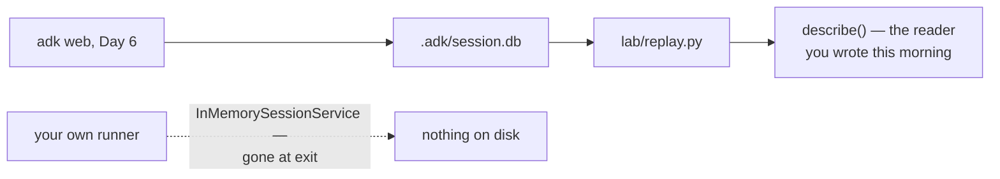

# 6.1 — The camera you already installed

## One-line answer

Every conversation you had in `adk web` yesterday was written to a database on your disk, event by
event — so the first move when something goes wrong is not to reproduce it, it is to **go and read
the run that already happened**.

---

## The story

A shop gets a camera put in. Not for any particular reason; the insurance was cheaper and the fellow
next door had one.

For eight months nobody looks at it. It sits above the till, blinking, and the owner half forgets it
is there.

Then one evening the cash does not add up. Four thousand short, and there were maybe thirty customers
that day, and two of the staff, and no idea when it happened.

The old way to handle this is to reason about it. Who was on the counter. Who seemed nervous. Who has
needed money lately. It is an argument that nobody wins, and it usually ends with everybody feeling
accused.

Then somebody says: there is a camera.

Twenty minutes later they know. Not because anybody was clever about it, but because the answer was
recorded at the time, by something that was not paying attention and had no theory about who did it.

Here is the part that matters more than the theft. **The camera was not installed after the problem.
It had been running for eight months.** Nobody had to have predicted this particular evening. The
recording exists because recording is what the thing does, and that is exactly why it could answer a
question nobody knew they would ask.

Your agent has one, and you have not looked at the footage yet.

---

## The idea in plain language

On [Day 6, part 5.3](../../../day-06-instructions-and-personas/parts/05-the-dev-ui/5.3-an-unauthenticated-server.md)
you learned that `adk web` writes a file called `.adk/session.db` into the agent's folder, and you
checked that Day 0's `.gitignore` covers it. It was presented as a hazard — real conversations, on
disk, in a repo that goes public in Phase 14.

It is also an asset, and today is when it becomes one. That file is a SQLite database, and inside it
are your sessions and every event in them, exactly as
[1.1](../01-the-event-object/1.1-an-event-is-a-line-in-a-ledger.md) described: authors, run ids,
timestamps, content, actions. Yesterday's conversations, in full, ready to be read.

**SQLite** is a database that is one ordinary file, with no server to run and nothing to install. ADK
uses it as the default store for the dev UI, which is why a folder appeared without you asking for
one.

The habit this part exists to install is one sentence long:

> **Before you reproduce a problem, read the run in which it happened.**

That sounds obvious. It is not what people do. What people do is change the prompt, run it again, get
a different answer, change something else, and run it again — which on a free tier with twenty
requests a day is an expensive way to think, and which throws away the one run that actually
contained the evidence.

Reading a stored run costs **zero requests**. It is the cheapest debugging you will ever do, and the
data is better than a reproduction, because it is what actually happened rather than what happens
when you try to make it happen again.

There is a Principle-8 finding here worth carrying: `SqliteSessionService` is **not** exported from
`google.adk.sessions`. Ask for it there and you get an `ImportError`, complete with a suggestion that
sends you the wrong way. It has to be imported from its own module. That is not a bug and not a
secret — it simply is not in the package's `__all__`, and the only way to find out is to look.

---

## Why Sutra needs it

**Day 8** is sessions and services, and this part is its doorstep: you will meet
`InMemorySessionService`'s central weakness, which is that everything in it disappears when the
process ends. The file you are about to read is what the alternative looks like.

**Day 22** builds structured logging, and the honest question to ask on that day is *what does a log
give me that the session does not?* The answer is real and worth arriving at rather than assuming:
the session records what the agent did, and the log records what your program around it did.

**Day 79 onwards** is evals. An evalset is, largely, a set of recorded runs with expectations
attached. Reading stored runs is the skill that makes building one possible.

**Day 92** is the pre-publication security review, SEC-16, before the repo goes public. `.adk/` is
gitignored and that is one line of defence. Having read the file yourself — and seen your own words
in it — is what makes the second line, checking before you publish, something you actually do.

---

## The mechanism

The replay tool. It reads a stored database and prints every event through the reader you wrote in
[1.5](../01-the-event-object/1.5-which-run-which-agent-which-branch.md):

```python
# lab/replay.py - read a run that already happened. Zero requests.
#
#     uv run python days/day-07-events-and-streaming/lab/replay.py sutra/desk/.adk/session.db
#
# Verified against the installed google-adk 2.7.1 on 2026-08-26: SqliteSessionService is NOT
# exported from google.adk.sessions and must be imported from its own module.
import asyncio
import sys

from google.adk.sessions.sqlite_session_service import SqliteSessionService

from sutra.desk.events import describe


async def main(db_path: str, app_name: str) -> None:
    service = SqliteSessionService(db_path)

    listing = await service.list_sessions(app_name=app_name)
    print(f"{len(listing.sessions)} session(s) under app_name={app_name!r}")
    if not listing.sessions:
        print("nothing here - try a different app_name (see the note below)")
        return

    for stub in listing.sessions:
        full = await service.get_session(
            app_name=app_name, user_id=stub.user_id, session_id=stub.id
        )
        print(f"\n--- {full.id} | user={full.user_id} | {len(full.events)} events")
        for event in full.events:
            print("   ", describe(event))
        print("    state:", full.state)


asyncio.run(main(sys.argv[1], sys.argv[2] if len(sys.argv) > 2 else "sutra.desk"))
```

**Line by line:**

- `from google.adk.sessions.sqlite_session_service import SqliteSessionService` — the full module
  path, and the comment above the import records why. Importing from `google.adk.sessions` raises
  `ImportError`, which is the "When it breaks" section below.
- `SqliteSessionService(db_path)` — one positional argument, unlike almost every other ADK
  constructor you have met, which are keyword-only. Worth noticing rather than being annoyed by:
  signatures are read, not assumed, exactly as
  [Day 5, part 4.3](../../../day-05-first-adk-agent/parts/04-the-runner/4.3-read-the-signature-not-the-tutorial.md)
  established.
- `list_sessions(app_name=...)` **then** `get_session(...)` for each — two calls, and the reason is
  the finding in the output below: the listing does not include events. Calling only `list_sessions`
  and reporting "0 events" is a wrong conclusion you can reach in one line.
- `stub.user_id` passed through to `get_session` — a session is addressed by three things, not one,
  and Day 8 is about why. Here it means you cannot fetch a session without knowing whose it is.
- `describe(event)` — your own reader, now pointed at data you did not produce in this process. That
  is the moment a small utility becomes a tool.
- `app_name` as an argument with a default of `"sutra.desk"` — because the name `adk web` used is not
  the one you would guess, and hard-coding a guess would make the script look broken.
- `sys.argv[1]` with no check — this is a lab script, and an `IndexError` on a missing argument is a
  perfectly clear message for a tool with one user.
- `|` as the separator rather than a nicer character — a Windows console defaults to a code page that
  cannot print `·`, and a decorative character that turns into `?` in your own tool is a small,
  permanent irritation. Plain ASCII in anything that prints to a terminal.

Run it against the database `adk web` wrote while you were doing Day 6:

```bash
uv run python days/day-07-events-and-streaming/lab/replay.py sutra/desk/.adk/session.db
```

**Line by line:**

- The path is the one Day 6 warned you about: `.adk/` inside the agent folder you pointed `adk web`
  at, not the repository root.
- No `app_name` argument, so the default is used. If your Day 6 session was under a different name,
  pass it as a second argument.
- Zero requests. No key is needed and the network is never touched.

Real output, from a database written on Day 6:

```text
4 session(s) under app_name='sutra.desk'

--- bc2bd676-cebf-404c-a61f-4d2162df4c37 | user=user | 6 events
    e-f2db45 user         text    final=True  "jjj'"
    e-f2db45 sutra_desk   text    final=True  'It looks like your message might have been sent by mistak...'
    e-b5c285 user         text    final=True  'hello'
    e-b5c285 sutra_desk   other   final=True  ''
    e-0450d1 user         text    final=True  'hii'
    e-0450d1 sutra_desk   other   final=True  ''
    state: {'__session_metadata__': {'displayName': "jjj'"}}

--- 408c3294-f4f2-4fc4-b4d4-70b35905f603 | user=user | 2 events
    e-107fb9 user         text    final=True  'hiii'
    e-107fb9 sutra_desk   text    final=True  "Hello! I'm Sutra, your support-ticket triage assistant. ..."
    state: {'__session_metadata__': {'displayName': 'hiii'}}
```

Five things in that output are worth a moment each, and two of them are surprises.

**`app_name='sutra.desk'`.** Not `"sutra"`, which is what `sutra/desk/run_once.py` uses. The dev UI
derived a name from the folder path and joined it with a dot. So the sessions you make with `adk web`
and the sessions you make with your own runner live under **different app names in the same store** —
and a session is found by app name. Day 8 turns that into a failure lab of its own.

**Events pair up by `invocation_id`.** `e-f2db45` on a question and on its answer, `e-b5c285` on the
next pair, `e-0450d1` on the one after: three runs inside one session, exactly as
[1.5](../01-the-event-object/1.5-which-run-which-agent-which-branch.md) said. Read the id column
alone and the turns are visible without reading a word of the content. The `e-` prefix is the dev
UI's; ids minted by your own code look different, which is harmless and worth not being surprised by.

**The user's message is in the transcript**, as an event with `author='user'`. The runner appended it
before the agent ever ran, which is the same fact that made
[5.1](../05-failure-lab/5.1-the-mechanic-who-billed-at-the-end.md)'s failure hard to diagnose.

**Two of the agent's events are `other` with an empty body** — the label `kind_of` gives an event it
cannot classify. Those turns produced a reply in the browser and stored an event with no text on it,
which means today's `kind_of` has a gap. Finding a gap in your own morning's code by pointing it at
real data is the ordinary way this goes, and closing it is one of the day's `TODO(me)` items.

**`state` is not empty, and you did not put anything in it.** `__session_metadata__` with a
`displayName` is the **dev UI** writing into your session's state so it has something to show in its
session list. It is a good reminder that state is a shared dictionary rather than yours alone, and it
is the first thing you have seen written there by something that is not your code. Day 17's prefix
rules exist for exactly this kind of coexistence.



The dotted line is Day 8's subject in one arrow.

---

## When it breaks

**💥 The import that looks right.**

```text
ImportError: cannot import name 'SqliteSessionService' from 'google.adk.sessions'
(...\site-packages\google\adk\sessions\__init__.py). Did you mean: 'BaseSessionService'?
```

`InMemorySessionService` and `DatabaseSessionService` are both importable from the package, so
assuming the third one is too is entirely reasonable. Python's suggestion — `BaseSessionService` — is
worse than no suggestion, because it is an abstract class you cannot use. The fix is the full module
path, and the general lesson is that `__all__` is a curated list rather than an inventory: what a
package exports and what it contains are different questions.

**💥 The right database and the wrong app name.**

```text
0 session(s) under app_name='sutra'
nothing here - try a different app_name (see the note below)
```

No error. The file is right there, the sessions are right there, and the query found nothing because
it asked under a name nothing was stored under. This is the single most common way a session goes
missing, and it is [Day 8's](../../../day-08-sessions-and-services/LESSON.md) failure lab because it
happens with `user_id` too, and with both at once.

**💥 The database that is not there.**

```text
0 session(s) under app_name='sutra.desk'
```

Also no error. `SqliteSessionService` will create an empty database at a path that does not exist, so
a typo in the filename gives you a working service with nothing in it — plus a stray empty `.db` file
you did not mean to make. If the count is zero, check the file exists and has a size before you
suspect the app name.

---

## In production

**What a professional writes instead of the teaching version** is a read-only replay tool with a
session id as its argument, wired to the same reader the logs use, and available to whoever handles
support. The important word is **read-only**: a debugging tool that can write to the session store
will eventually be used to "fix" a conversation, and the append-only property from
[1.1](../01-the-event-object/1.1-an-event-is-a-line-in-a-ledger.md) — the thing that makes the record
trustworthy — survives exactly as long as nobody can edit it.

**What degrades at scale** is that transcripts are the most sensitive data your system holds, and
they accumulate silently. A support desk's sessions contain whatever customers typed, which includes
things they should not have typed: account numbers, passwords, other people's names. Nobody decided
to collect that; it arrived, and the same append-only property that makes the record trustworthy
makes it permanent. Real systems answer three questions before they have a problem — **how long do we
keep sessions, who can read them, and what do we redact on the way in** — and the honest thing to say
is that answering them late is much more expensive than answering them early.

**The failure that only shows with real traffic** is the store growing without anybody watching. One
SQLite file on a laptop is fine. The same design under a real load becomes a single file being
written by every request, and SQLite serialises writers, so it becomes the bottleneck long before it
becomes a storage problem. This is why Day 8's ADK-07 matters and why the service is an interface:
the swap from a file to a real database changes one line, provided nothing outside that line assumed
a file.

**The review comment a senior engineer leaves:** *"Good tool, but it takes a writable service. Open
it read-only, and put the session id on the command line rather than dumping every session — right
now this prints every conversation the desk has had, and it'll get run on a shared screen during an
incident."*

**The interview question:** *"an agent gave a user a bad answer yesterday. What do you do first?"*
The answer that separates people who have operated one: "Read the run. The events are stored — the
user's message, every model turn, every tool call and result, in order, with a run id — so I go and
look at what actually happened before I change anything. Reproducing it is the expensive move: it
costs a request, it can produce a different answer because sampling is not deterministic, and it
throws away the one artefact that has the real evidence in it. What I'm looking for is the gap
between what a tool returned and what the model said next. And the reason this works at all is that
recording isn't something we turned on for debugging — it's how the runtime works, so the footage was
already there."

---

## Check yourself

```bash
uv run python days/day-07-events-and-streaming/lab/replay.py sutra/desk/.adk/session.db
git check-ignore -v sutra/desk/.adk/session.db
```

The second command is the Day 6 check, repeated now that you have seen what is actually inside the
file. Read your own words back out of your own database, and then confirm they are not going to
GitHub.

**Answer out loud, without scrolling up:**

> Say why reading a stored run beats reproducing a problem, and give two reasons rather than one.
> Then say what `app_name` your `adk web` sessions were stored under, and why that is not the name
> your own runner uses.

---

**Next:** [back to the hub](../../LESSON.md) — then write the day's tests, and read §11's ledger rows.
