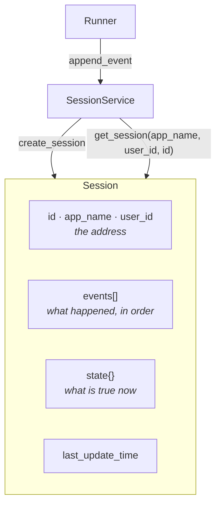

# 1.1 — A conversation with an address

## One-line answer

A **session** is one conversation, held as an ordered list of events plus a small dictionary of
stored values, and the thing that makes it useful is that it has an **address** you can come back to.

---

## The story

There is a tailor near most people's homes with a book on the counter. Not a computer — a book, with
a rubber band round it.

You go in with cloth for a shirt. He does not measure you. He opens the book, turns to a page, reads
it, and says "same as last time, or a little loose?"

On that page is your name, your phone number, and everything he has ever done for you. Chest, waist,
sleeve. The date of each order. A note in the margin from two years ago saying you prefer the pocket
slightly lower. He wrote that down at the time and never thought about it again until now.

Two things about the page are worth pausing on.

**The page has an address.** Your name and number at the top. That is how he found it among four
hundred others. Without that, the measurements would still be written down and would be completely
useless — a book full of chest sizes belonging to nobody.

**The page is not the shirt.** He does not keep your shirts. He keeps the record of them: what was
made, when, and what you said about it. From that record he can make the next shirt without asking
you a single question you have already answered.

Now imagine he loses the book. Nothing about his skill has changed. His scissors are the same, his
machine is the same, he is the same tailor. But every customer who walks in tomorrow is a new
customer, and the first thing every one of them hears is "let me take your measurements."

That is exactly what happens to an agent when its session goes, and it is the difference between a
support desk and a stranger who answers the phone.

---

## The idea in plain language

On [Day 5, part 4.2](../../../day-05-first-adk-agent/parts/04-the-runner/4.2-sessions-and-the-transcript.md)
you used a session and were told it was "the transcript". That was enough to get through the day.
Today it is the subject.

A **session** is **one conversation between one user and your agent app**. It holds six things, and
you can print all six:

| Field | What it is |
| --- | --- |
| `id` | this conversation's own identifier |
| `app_name` | which application it belongs to |
| `user_id` | whose conversation it is |
| `events` | the ordered list of everything that has happened, from Day 7 |
| `state` | a small dictionary of stored values |
| `last_update_time` | when it last changed, as a float |

Three of those are the **address** — `app_name`, `user_id`, `id` — and
[1.2](1.2-three-parts-to-one-key.md) is entirely about why it takes three and not one. Two of them
are the **contents**: `events` and `state`, which are different things in a way that catches people,
and which [1.3](1.3-the-register-and-the-key-board.md) separates properly.

The reason the session exists at all goes back to something you built by hand.
[Day 2, part 3.1](../../../day-02-llm-mechanics/parts/03-context-and-memory/3.1-the-desk-that-gets-wiped.md)
established the uncomfortable fact underneath this whole field: **the model remembers nothing.** Every
request is the first request as far as it is concerned. What looks like memory is somebody re-sending
the earlier messages, and on
[Day 2, part 3.2](../../../day-02-llm-mechanics/parts/03-context-and-memory/3.2-history-is-a-list-you-own.md)
that somebody was you, holding a Python list.

The session is that list, with three things added:

1. **An address**, so it can be found again after your program has stopped holding it.
2. **A place for values that are not messages** — `state` — so "this conversation is about ticket
   4521" does not have to be re-derived from the text every turn.
3. **Somebody else's job to store it.** Which is [section 3](../03-the-services/3.1-the-tap-and-the-pipe.md),
   and it is the reason the same code can keep sessions in memory today and in a database on Day 86
   without the agent noticing.

One piece of vocabulary that will otherwise trip you: a session is **not** a user, and it is not a
login. One user can have many sessions — the tailor's regular customer has one page, but a support
desk user genuinely has one conversation per problem, and mixing two problems into one conversation
is a design mistake rather than a saving. Deciding when to start a new session is a real product
question, and it is one you will answer for Sutra on Day 46.

---

## Why Sutra needs it

**Every remaining day of this curriculum runs inside a session.** That is not an exaggeration and it
is the reason this day exists in Phase 1.

**Day 17** is the state deep dive: prefixes, scopes and lifetimes, all of them properties of the
dictionary you meet today.

**Day 46 onwards** is memory and retrieval — the phase where Sutra learns to answer "has anything like
ticket 4521 happened before?" That question is asked *across* sessions, which is only a meaningful
question because a session is a bounded thing with an address.

**Day 64** is human-in-the-loop resumption: a run pauses, a person approves something, and the run
continues, possibly in a different process. What survives the pause is the session, and nothing else.

And immediately: today's build brief adds `sutra/desk/sessions.py`, one small module that owns Sutra's
session bookkeeping — because right now `run_once.py`, `multi_turn.py` and `stream.py` each build
their own service, and three files each holding a different conversation is a bug waiting for a
reason to happen.

---

## The mechanism

Everything about a session, printed. No model, no key, no cost:

```python
# lab/anatomy.py - the six fields of a session, and where they come from.
import asyncio

from google.adk.events import Event, EventActions
from google.adk.sessions import InMemorySessionService
from google.genai import types


async def main() -> None:
    service = InMemorySessionService()
    session = await service.create_session(app_name="sutra", user_id="local")

    print("fields          :", sorted(type(session).model_fields.keys()))
    print("id              :", session.id)
    print("app_name        :", session.app_name)
    print("user_id         :", session.user_id)
    print("events          :", session.events)
    print("state           :", session.state)
    print("last_update_time:", session.last_update_time)

    await service.append_event(
        session,
        Event(
            author="user",
            invocation_id="run-1",
            content=types.Content(role="user", parts=[types.Part(text="ticket 4521 logs me out")]),
        ),
    )
    await service.append_event(
        session,
        Event(
            author="sutra_desk",
            invocation_id="run-1",
            content=types.Content(
                role="model", parts=[types.Part(text="Looks like a session bug.")]
            ),
            actions=EventActions(state_delta={"ticket_id": "4521"}),
        ),
    )

    print()
    print("after two events:")
    print("  events        :", len(session.events))
    print("  state         :", session.state)

    found = await service.get_session(app_name="sutra", user_id="local", session_id=session.id)
    print()
    print("fetched by address, and it is the same conversation:")
    print("  events        :", len(found.events))
    print("  state         :", found.state)
    print("  first line    :", found.events[0].content.parts[0].text)


asyncio.run(main())
```

**Line by line:**

- `type(session).model_fields` — the same Pydantic trick as
  [Day 7, part 1.2](../../../day-07-events-and-streaming/parts/01-the-event-object/1.2-the-fields-that-were-renamed.md),
  pointed at a different class. Six fields, read off the installed package rather than off this page.
- `create_session(app_name=..., user_id=...)` with **no** `session_id` — so the service mints one. You
  can pass your own, and [1.4](1.4-minted-or-chosen.md) is about when that is a good idea and when it
  is a bug.
- Both arguments keyword-only and the call awaited — the signature you verified on
  [Day 5, part 4.3](../../../day-05-first-adk-agent/parts/04-the-runner/4.3-read-the-signature-not-the-tutorial.md).
- `session.events` printed before anything has happened — an empty list, not `None`. A brand-new
  session is a real object with real empty containers, which is why nothing downstream needs to guard
  against a missing one.
- Two `append_event` calls, one with `author="user"` — because in a real run the **runner** appends
  the user's message too, which
  [Day 7, part 5.1](../../../day-07-events-and-streaming/parts/05-failure-lab/5.1-the-mechanic-who-billed-at-the-end.md)
  made painfully concrete. Doing it by hand here keeps the transcript honest.
- The second event carrying a `state_delta` — one event, saying something and recording something, as
  [Day 7, part 1.4](../../../day-07-events-and-streaming/parts/01-the-event-object/1.4-the-half-that-is-not-text.md)
  established.
- `get_session(...)` at the end — the whole point of the part. The session object you were holding is
  not the only way to reach this conversation; the **address** is. That distinction is what makes a
  session useful across processes, requests and days.
- `found.events[0].content.parts[0].text` — reading the first line back out of the fetched copy, so
  the output proves the content came back and not just the shape.

Which prints:

```text
fields          : ['app_name', 'events', 'id', 'last_update_time', 'state', 'user_id']
id              : 040d8293-6faa-463a-ab87-e36e7ad95da3
app_name        : sutra
user_id         : local
events          : []
state           : {}
last_update_time: 1787767546.5504305

after two events:
  events        : 2
  state         : {'ticket_id': '4521'}

fetched by address, and it is the same conversation:
  events        : 2
  state         : {'ticket_id': '4521'}
  first line    : ticket 4521 logs me out
```

The shape, drawn:



Note that the arrows into the session all come from the **service**, never from the agent. The agent
never touches this object directly, which is the same separation
[Day 7, part 1.4](../../../day-07-events-and-streaming/parts/01-the-event-object/1.4-the-half-that-is-not-text.md)
drew for state changes, now visible at the level of the whole conversation.

---

## When it breaks

**💥 Holding the session object instead of the address.**

```python
session = await service.create_session(app_name="sutra", user_id="local")
# ... a request ends, a new request arrives ...
answer = await say(runner, session.id, "and what about the other one?")
```

This works perfectly in a script and fails the moment your program handles more than one request,
because the `session` variable is gone between requests. The fix is not to hold the object longer —
it is to hold the **id** and fetch the session when you need it. A script teaches the wrong habit
here, and today's build brief exists partly to break it.

**💥 Treating a returned session as live.**

```python
found = await service.get_session(app_name="sutra", user_id="local", session_id=session.id)
found.state["priority"] = "high"
```

No error. What you have modified is a **copy** — `InMemorySessionService` copies on the way out — so
the change is invisible to everybody else and vanishes when `found` goes out of scope. This is the
same rule as
[Day 7, part 1.4](../../../day-07-events-and-streaming/parts/01-the-event-object/1.4-the-half-that-is-not-text.md)'s
warning about assigning to `session.state`, and it is worse here, because with a copy it does not
even appear to work in your own process.

**💥 One session for two problems.**

Not a crash; a product bug. A user reports a login issue, gets an answer, and then asks about an
invoice in the same conversation. Every subsequent turn carries the login discussion in its context,
because the events are all there, which costs tokens and quietly biases every answer toward the first
topic. Nothing errors, the transcript is correct, and the agent gets slowly worse in a way that looks
like the model being unreliable.

---

## In production

**What a professional writes instead of the teaching version** is code that passes a session **id**
around and never a session object. Ids are small, serialisable, safe to log, and meaningful in
another process; a session object is a snapshot that was true when it was fetched. Every service that
gets this right looks the same: the request carries an id, the handler fetches, does one thing, and
lets go.

**What degrades at scale** is the size of `events`. A session is a list that only grows, and
`get_session` returns all of it by default. A support conversation that ran for an hour has a few
dozen events; an ambient agent looping every ten minutes for a week has thousands, each carrying its
full content. ADK's answer is `GetSessionConfig(num_recent_events=...)`, which
[2.3](../02-the-run/2.3-a-journey-and-a-pass.md) shows working — but the design habit matters more
than the parameter: **decide what ends a session** before the answer becomes "nothing ever does".

**The failure that only shows with real traffic** is two requests for the same session arriving at
once. The user hits send twice, or a client retries. Both handlers fetch the session, both see the
same events, and both append. With an in-memory service on one process you get an interleaved
transcript; with several processes you get two divergent copies, and which one survives depends on
who wrote last. ADK's database-backed service uses row-level locking for exactly this reason, and
`InMemorySessionService`'s own docstring says it is *"not suitable for multi-threaded production
environments"* — a sentence that is easy to skim and is describing this.

**The review comment a senior engineer leaves:** *"This holds the `Session` object across requests.
Hold the id and fetch it — what you've got here is a snapshot from whenever this handler started, and
the second it stops being a single-threaded script it's stale. Also: what closes a session? Right now
nothing does, and we'll find out in three months when someone's conversation has four thousand events
in it."*

**The interview question:** *"what is a session in an agent framework, and what would you keep in it?"*
The answer that shows you have shipped one: "It's one conversation, addressed by app, user and
session id, holding an ordered event list and a small state dictionary. It exists because the model
is stateless — every request is its first — so somebody has to hold the history and re-send it, and
the session is that somebody, with an address so it survives the process. What I keep in state is
identifiers and decisions, not payloads: the ticket id, the chosen route, not the document. And the
question I'd want answered before shipping is what *ends* a session, because the event list only
grows, and 'nothing ends it' is how you get a conversation that costs more every turn and slowly
drifts toward whatever the user asked about first."

---

## Check yourself

```bash
uv run python days/day-08-sessions-and-services/lab/anatomy.py
```

**Answer out loud, without scrolling up:**

> Name the six fields of a session and sort them into the address and the contents. Then say why
> holding a session object across two requests is a bug, and what you should hold instead.

---

**Next:** [1.2 — Three parts to one key](1.2-three-parts-to-one-key.md)
