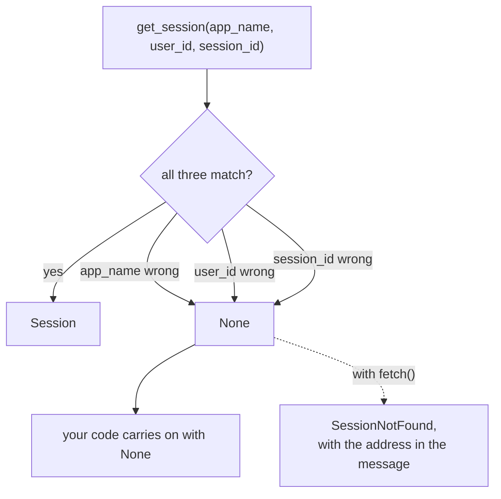

# 1.2 — Three parts to one key

## One-line answer

A session is found by **`app_name` + `user_id` + `session_id` together**, so getting any one of the
three wrong returns `None` rather than an error — and the day you find this out is usually the day
you have been debugging the wrong thing for an hour.

---

## The story

Two boys in a school are both called Rahul Sharma. Same name, same spelling.

The office has files. When a teacher comes down and says "I need Rahul Sharma's file", the clerk does
not go and get one. He asks: "Which class?"

Say the teacher answers "class 8". Still not enough — there is 8-A and 8-B, and there is one in each.
So the clerk asks again, and only when he has all three — name, class, section — does he open the
right drawer.

Now here is the part that costs somebody a morning. Suppose the teacher says "8-B" and is wrong; the
boy is in 8-A. The clerk goes to the 8-B drawer, looks under S, and finds nothing.

What does he say?

He says: **"No file."**

He does not say "there is a Rahul Sharma in 8-A, did you mean him?", because he has no reason to look
there and no way to know. From where he is standing, the honest answer to the question he was asked
is that there is nothing. The file exists, it is thirty feet away, and the search was conducted
perfectly.

That answer — *nothing here* — is exactly what a session service returns when one part of the address
is wrong. It is correct. It is also the least helpful correct answer in this entire framework, and
knowing that in advance is worth more than any amount of cleverness afterwards.

---

## The idea in plain language

[1.1](1.1-a-conversation-with-an-address.md) said a session has an address. This part is about the
address having three parts, and about what each one is for.

**`app_name`** is which application the conversation belongs to. Not which agent, and not which
company — which *app*, in the sense of a deployed thing with a name. One store can hold sessions for
several apps, and they do not see each other. In Sutra it is `"sutra"`, set in
`sutra/desk/run_once.py` as a constant on Day 5.

**`user_id`** is whose conversation it is. Sutra uses `"local"` because there is one of you. In a real
system it is whatever your authentication layer says a person is — an account id, usually. It is also
a **security boundary**: a session fetched with the wrong `user_id` is not found, which is exactly the
behaviour you want if the id came from a request.

**`session_id`** is which conversation. One user has many.

All three are required on `get_session`, and all three are keyword-only:

> `await service.get_session(app_name=..., user_id=..., session_id=...)`

And the return type is `Optional[Session]`. When the address does not match anything, you get `None`.
Not an exception, not a warning, not a hint about the near miss. `None`.

**Why not an exception?** Because "does this session exist" is a perfectly ordinary question with a
perfectly ordinary negative answer, and a service that raised for it would force a `try` around every
lookup. The design is right. The consequence is that **your code has to notice**, and the code that
does not notice does not crash — it goes on to do something with `None`.

There is a second place the address bites, and it is the one that surprises people, because the
mistake is not in your lookup at all. The **runner** also carries an `app_name`. If the runner's name
and the session's name differ, the runner cannot find the session either — and there it *does* raise,
which is [5.1](../05-failure-lab/5.1-the-name-called-in-the-waiting-room.md)'s subject and the reason
today has a failure lab.

You have already seen this happen for real. On
[Day 7, part 6.1](../../../day-07-events-and-streaming/parts/06-reading-a-run/6.1-the-camera-you-already-installed.md)
you read your own conversations out of `sutra/desk/.adk/session.db` and found them stored under
`app_name='sutra.desk'` — because `adk web` derived a name from the folder path. Your own runner uses
`'sutra'`. **Same database, two app names, and neither can see the other's sessions.** That is not a
bug in either one; it is this rule, working.

---

## Why Sutra needs it

**Day 46 onwards** is memory across sessions, where `user_id` stops being the constant `"local"` and
starts being the thing that decides whose history you are allowed to search. A memory lookup with the
wrong user id is a privacy incident rather than an empty result.

**Day 66 onwards** is safety and security. Any identifier that arrives from outside — a request
parameter, a header — and is used as `user_id` is an access-control decision. Getting `None` for
somebody else's session is the correct outcome, and it is only correct because all three parts must
match.

**Day 85** puts Sutra behind an API server, where `app_name`, `user_id` and `session_id` all arrive
from somewhere else, and any of them can be missing, misspelled or attacker-supplied.

**Day 92** is the pre-publication security review. "Can a user read another user's session?" is on
that list, and the answer is a property of this three-part key.

---

## The mechanism

All the ways to be nearly right, side by side:

```python
# lab/near_misses.py - one real session, four lookups, one of them correct.
import asyncio

from google.adk.sessions import InMemorySessionService


async def main() -> None:
    service = InMemorySessionService()
    real = await service.create_session(app_name="sutra", user_id="local")
    print("created:", real.id)
    print()

    attempts = [
        ("everything right   ", "sutra", "local", real.id),
        ("wrong app_name     ", "sutra.desk", "local", real.id),
        ("wrong user_id      ", "sutra", "someone_else", real.id),
        ("wrong session_id   ", "sutra", "local", "not-a-real-id"),
    ]
    for label, app, user, sid in attempts:
        found = await service.get_session(app_name=app, user_id=user, session_id=sid)
        print(f"{label} -> {type(found).__name__}")


asyncio.run(main())
```

**Line by line:**

- One session created, four lookups against it — so every difference in the output is caused by the
  address and by nothing else.
- `"sutra.desk"` as the wrong app name rather than `"nonsense"` — because that is the name `adk web`
  actually used on your machine, so this is a mistake you can really make rather than a contrived
  one.
- `"someone_else"` as the wrong user — the security-relevant miss, and the one that must not leak.
- `type(found).__name__` rather than `found` — printing the session itself would fill the screen with
  a Pydantic dump, and the only thing being asked is *did anything come back*. `NoneType` is a clear
  answer.
- No `try` anywhere, because none is needed. That is the finding: nothing here raises.

The output:

```text
created: 4f1cb3e2-2c96-4a9b-9d29-8f5d2b6a11c7

everything right    -> Session
wrong app_name      -> NoneType
wrong user_id       -> NoneType
wrong session_id    -> NoneType
```

Three `NoneType`s that are indistinguishable from each other. Whatever went wrong, the answer is the
same, which is why "the session is missing" is a symptom with three causes and no evidence.

The guard that turns it back into information:

```python
# sutra/desk/sessions.py - the lookup, with the near-miss named.
from google.adk.sessions import BaseSessionService, Session


class SessionNotFound(LookupError):
    """A session address matched nothing. The address is in the message."""


async def fetch(
    service: BaseSessionService, *, app_name: str, user_id: str, session_id: str
) -> Session:
    """Get a session, or raise with all three parts of the address in the message."""
    found = await service.get_session(app_name=app_name, user_id=user_id, session_id=session_id)
    if found is None:
        raise SessionNotFound(
            f"no session for app_name={app_name!r} user_id={user_id!r} session_id={session_id!r}"
        )
    return found
```

**Line by line:**

- `class SessionNotFound(LookupError)` — a specific exception type, subclassing the stdlib's
  `LookupError` because that is what this is. Callers can catch exactly this rather than everything,
  which is the plan's *raise specific ones* rule.
- The docstring on the exception rather than a comment — because the docstring is what a reader sees
  in a traceback context and in an editor.
- `service: BaseSessionService` as a parameter, typed against the **base** class — so this function
  works unchanged when Day 86 swaps the in-memory service for a real one. That is
  [3.1](../03-the-services/3.1-the-tap-and-the-pipe.md)'s whole point, applied before you have read
  it.
- `*` after `service` — forcing the three address parts to be passed by keyword, matching ADK's own
  convention and making a call site that mixes up `user_id` and `session_id` impossible rather than
  merely unlikely. Two strings in the wrong order is the exact mistake this prevents.
- **All three parts in the message.** Not "session not found" — the address. This is the difference
  between an error you can act on and an error you have to reproduce, and it costs one f-string.
- `{app_name!r}` rather than `{app_name}` — `repr`, so an accidental trailing space or an empty string
  shows up as `'sutra '` or `''` instead of looking correct.
- Returning `Session` rather than `Session | None` — the whole point. After this function, the caller
  has a session, and no downstream code needs a `None` check.



---

## When it breaks

**💥 The `None` that travelled.**

```text
Traceback (most recent call last):
  File "sutra/desk/run_once.py", line 41, in say
    print(len(session.events))
              ^^^^^^^^^^^^^^
AttributeError: 'NoneType' object has no attribute 'events'
```

The traceback points at the line that used the session. The bug is at the line that fetched it,
which may be in a different file and a different function. This is the standard shape of a `None`
bug and it is why the guard above exists.

**💥 The `user_id` that came from the request.**

```python
found = await service.get_session(
    app_name=APP_NAME, user_id=request.query["user"], session_id=request.query["session"]
)
```

No error, and worse than no error: this works. If both parameters come from the caller, the caller
can read **anybody's** session by supplying their ids. The three-part key is a lookup key, not an
authorisation check — it stops accidents, not attackers. The `user_id` must come from whatever your
system trusts, and the fact that it makes the lookup succeed is not evidence that it should have.

**💥 The app name that drifted.**

```python
# sutra/desk/run_once.py
APP_NAME = "sutra"

# somewhere else, six weeks later
runner = Runner(agent=root_agent, app_name="sutra-desk", session_service=service)
```

Two constants, one hyphen, two disjoint universes of sessions in one store. Nothing errors on the
write path — sessions are happily created under the new name — and everything written before is
simply unreachable. This is the same shape as the `sutra` / `sutra.desk` split you already found on
your own disk, and it is why today's build brief puts `APP_NAME` in exactly one module.

---

## In production

**What a professional writes instead of the teaching version** is a single module owning the address:
one `APP_NAME` constant, one `fetch` that raises with the address in it, and `user_id` sourced from
one place that everybody imports. The value is not the code, which is twenty lines — it is that
"where does `app_name` come from" has one answer, so it cannot drift.

**What degrades at scale** is `app_name` becoming a deployment concept rather than a code constant.
Staging and production, two tenants, a blue-green rollout: all of them are reasons somebody
eventually makes `app_name` configurable, and the moment it is configurable it can differ between the
writer and the reader. Teams that have been through this log the effective `app_name` at startup —
the same read-back habit as
[Day 7, part 4.2](../../../day-07-events-and-streaming/parts/04-the-brakes/4.2-the-note-the-machine-refuses.md).

**The failure that only shows with real traffic** is a session id that is valid, findable, and
belongs to somebody else — because it was cached, logged, or shared in a URL. Session ids are
generated as UUIDs and are unguessable, which protects you from enumeration and not at all from
leakage. Anything that puts a session id in a URL, a screenshot or a support ticket has made it
public, and the only thing standing between a leaked id and someone else's conversation is that the
`user_id` also has to match. **That is why the three-part key is three parts.**

**The review comment a senior engineer leaves:** *"`user_id` is coming straight off the query string.
That makes the lookup succeed for any id the caller can name — the three-part key is a lookup key,
not an access check. Take the user from the authenticated context, and while you're here, raise on
`None` with the address in the message. Right now a wrong app name and a wrong session id are the
same log line."*

**The interview question:** *"how do you look up a conversation, and what stops one user reading
another's?"* The answer that shows you have shipped it: "The address is three parts — app, user,
session — and all three have to match, so a lookup with the wrong user simply returns nothing. That's
the right default, but it's a lookup key rather than an authorisation check: it only protects you if
the user id comes from something you trust rather than from the request. The operational problem is
that all three near misses return the same `None`, so 'session not found' is a symptom with three
causes and no evidence — I wrap the lookup and raise with all three values in the message, because
the alternative is an `AttributeError` on `NoneType` in a different file three frames later."

---

## Check yourself

```bash
uv run python days/day-08-sessions-and-services/lab/near_misses.py
uv run python days/day-07-events-and-streaming/lab/replay.py sutra/desk/.adk/session.db sutra
```

The second command asks yesterday's replay tool for `app_name='sutra'` in the database `adk web`
wrote under `'sutra.desk'`. Watch it find nothing, and notice that nothing is wrong.

**Answer out loud, without scrolling up:**

> Name the three parts of a session address and say what each one is for. Then say what
> `get_session` returns when one of them is wrong, and why that is both the right design and the
> reason you should wrap it.

---

**Next:** [1.3 — The register and the key board](1.3-the-register-and-the-key-board.md)
