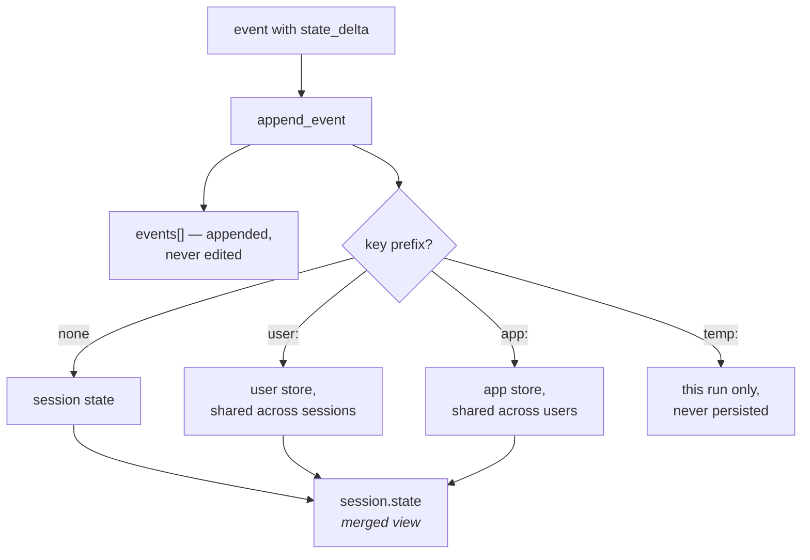

# 1.3 — The register and the key board

## One-line answer

`events` is the **history** — everything that happened, in order, never edited — and `state` is
**what is true now**, a small dictionary rebuilt from that history, and confusing the two is how
people end up storing a conversation in a dictionary or a fact in a transcript.

---

## The story

Walk into a small hotel and there are two things behind the desk.

On the counter is a register. A big ruled book. Every guest who has checked in since the book was
started has a line in it: name, date in, room number, date out, signature. Nobody erases anything.
When somebody leaves, you do not scratch out their line — you write a date in the "out" column. The
book only grows.

On the wall behind is a board with hooks and keys hanging on them. One hook per room.

Now ask the man at the desk a question: **is room 12 free?**

He does not open the register. He looks at the wall. If the key is on the hook, the room is free. One
glance, no reading, no adding up.

Ask him a different question: **who was in room 12 last Tuesday?** Now he opens the register, and it
takes a while.

Two ways of holding the same information, both of them necessary, neither replacing the other.

The board is fast and small and only tells you about *now*. It also cannot be trusted on its own —
if somebody puts a key on the wrong hook, the board is simply wrong and nothing about it says so.

The register is complete and slow and can answer anything, including questions nobody has asked yet.
And it is the thing you go back to when the board and reality disagree, because you can walk through
it and work out what the board *should* say.

**The board is derived from the register.** Not stored separately for the fun of it — derived,
because deriving it fresh every time somebody asks about a room would be absurd.

That is `state` and `events`, exactly, including the part about the board being wrong.

---

## The idea in plain language

A session holds both, and they answer different questions.

**`events`** is the list from
[Day 7, part 1.1](../../../day-07-events-and-streaming/parts/01-the-event-object/1.1-an-event-is-a-line-in-a-ledger.md):
append-only, ordered, and complete. It is what the model gets re-sent on every turn, which is what
makes a conversation feel like a conversation. It answers *what happened*.

**`state`** is an ordinary Python dictionary of small values. It answers *what is true now*: this
conversation is about ticket 4521, the priority is high, the user has already been asked for their
account number.

The relationship between them is the important part, and it is the hotel's relationship exactly:
**state is built from events.** Every value in `state` arrived through a `state_delta` on an event
(Day 7, part 1.4), and applying all the deltas in order reproduces the dictionary. The service keeps
the dictionary because rebuilding it on every read would be wasteful, not because it is a second
source of truth.

Which gives you the rule for deciding where something goes, and it is a question rather than a
convention:

> **Would you want this re-sent to the model as part of the conversation?**
> Yes → it is a message, and it belongs in an event's `content`.
> No, but the agent needs to know it → it belongs in `state`.

A ticket number the user typed is both, and that is not a contradiction: it is in the transcript
because they said it, and it is in state because the agent extracted it and does not want to re-read
the transcript looking for it every turn.

Two things about `state` you should know today and will not use until later:

**A key can carry a prefix.** `user:something` and `app:something` are not stored on the session at
all — the service pulls them out and keeps them in separate stores, one per user and one per app, so
they are shared across sessions. `temp:something` lives only for the current run and is deliberately
never persisted. All three are **Day 17**, ADK-19 and ADK-20, and this is the address for the
explanation rather than the explanation. What is worth seeing today is that they exist, because you
will see them in the output below and an unexplained thing in your own output is a thing you will
worry about.

**State is not only yours.** On
[Day 7, part 6.1](../../../day-07-events-and-streaming/parts/06-reading-a-run/6.1-the-camera-you-already-installed.md)
you read a stored session and found `__session_metadata__` in it, with a `displayName` — written by
the dev UI so it had something to show in its session list. Nothing you wrote put it there. The
dictionary is shared with the framework and its tools, which is one of the reasons the prefixes on
Day 17 exist at all.

---

## Why Sutra needs it

**Day 17** is the state deep dive. Arriving there already knowing that state is a fold over the
events, and that deltas are how it moves, turns a difficult day into a detailed one.

**Day 19 and 20** are context engineering: deciding what earns a place in the model's context window,
and compacting a conversation that has grown too long. Both are decisions about the **events** list,
and both become confused if you think of state as a place to stash conversation.

**Day 24** is token accounting. Events cost tokens because they are re-sent; state costs almost
nothing because it is not, unless you template it into the instruction — which
[Day 6, part 4.1](../../../day-06-instructions-and-personas/parts/04-state-templating/4.1-the-instruction-is-a-template.md)
showed you how to do. Knowing which of the two you are growing is how you keep a budget.

**Day 49** is retrieval, where "has anything like this happened before?" is answered by searching
across many sessions' **events**. A fact that only ever lived in a state dictionary is invisible to
that search.

---

## The mechanism

Both, side by side, with the prefixes visible:

```python
# lab/register_and_board.py - what goes in the history, what goes on the board.
import asyncio

from google.adk.events import Event, EventActions
from google.adk.sessions import InMemorySessionService
from google.genai import types


async def main() -> None:
    service = InMemorySessionService()
    session = await service.create_session(
        app_name="sutra",
        user_id="local",
        state={"stage": "intake", "user:locale": "en-IN", "app:desk_version": "0.1.0"},
    )

    print("what the session shows you:")
    print("  state :", session.state)
    print()
    print("where the service actually put it:")
    print("  session store:", service.sessions["sutra"]["local"][session.id].state)
    print("  user store   :", service.user_state)
    print("  app store    :", service.app_state)
    print()

    await service.append_event(
        session,
        Event(
            author="user",
            invocation_id="run-1",
            content=types.Content(role="user", parts=[types.Part(text="ticket 4521 logs me out")]),
        ),
    )
    await service.append_event(
        session,
        Event(
            author="sutra_desk",
            invocation_id="run-1",
            actions=EventActions(state_delta={"ticket_id": "4521", "stage": "triaged"}),
        ),
    )

    print("after one turn:")
    print("  events:", [e.author for e in session.events])
    print("  state :", session.state)
    print()
    print("the same fact, in both places:")
    print("  in the register:", session.events[0].content.parts[0].text)
    print("  on the board   :", session.state["ticket_id"])


asyncio.run(main())
```

**Line by line:**

- `state={...}` on `create_session` — a session can start with values rather than empty. Useful for
  anything the conversation is *about* before it begins: a ticket already assigned, a locale already
  known.
- `"stage": "intake"` with no prefix — plain session state, belonging to this conversation alone.
- `"user:locale"` and `"app:desk_version"` — the two prefixes, included so the split below is
  visible. **Day 17 is where these are taught**; today they are here so the output makes sense.
- `service.sessions["sutra"]["local"][session.id]` — reaching into the service's own dictionaries.
  This is a **lab-only** move: `sessions` is a public attribute on `InMemorySessionService` and it is
  still an implementation detail of *that* service, so nothing under `sutra/` should touch it. It is
  here because it is the only way to see the split.
- `service.user_state` and `service.app_state` — the other two stores, and the point of this half of
  the script: the prefixed keys were **removed from the session** and put somewhere shared, and the
  prefix was stripped on the way in.
- The two `append_event` calls — one carrying a message, one carrying only a delta, so the output can
  show the register and the board changing independently.
- `[e.author for e in session.events]` — authors rather than content, because what matters here is
  that there are two entries and who made them.
- The last two prints — the same ticket number, reached two different ways. That redundancy is
  deliberate and correct, and being able to say *why* it is not duplication is the point of the part.

Which prints:

```text
what the session shows you:
  state : {'stage': 'intake', 'app:desk_version': '0.1.0', 'user:locale': 'en-IN'}

where the service actually put it:
  session store: {'stage': 'intake'}
  user store   : {'sutra': {'local': {'locale': 'en-IN'}}}
  app store    : {'sutra': {'desk_version': '0.1.0'}}

after one turn:
  events: ['user', 'sutra_desk']
  state : {'stage': 'triaged', 'app:desk_version': '0.1.0', 'user:locale': 'en-IN', 'ticket_id': '4521'}

the same fact, in both places:
  in the register: ticket 4521 logs me out
  on the board   : 4521
```

Three things worth stopping on.

**The session you were handed shows all three stores merged.** `state` on the object has the prefixed
keys in it, prefixes and all, even though the session itself only stores `stage`. The service merges
them on the way out so that reading state is one lookup rather than three. Convenient, and worth
knowing, because it means what you read is not exactly what is stored.

**The prefix is stripped in the underlying store.** `user:locale` is stored as `locale` under
`sutra → local`. The prefix is routing, not part of the name.

**After one turn, `stage` has changed and the old value is gone from the board** — but not from the
register. The event carrying `stage: triaged` is still there, in order, with its author and its run
id. The board shows now; the register shows how you got here.



---

## When it breaks

**💥 The conversation stored in state.**

```python
state["history"] = state.get("history", []) + [user_message]
```

Not an error. It works, and it is what somebody writes when they have not noticed that `events`
already exists. The costs arrive later and all at once: the history is now duplicated, the copy in
state is not append-only so it can be silently corrupted, it is not visible to the dev UI or to any
tracing, and it grows the state dictionary that gets written on every single event. You have
rebuilt `events`, worse, alongside `events`.

**💥 The fact that only lived in the transcript.**

The opposite mistake. The ticket number is in the user's message and nowhere else, so every turn the
agent has to find it again by reading the conversation — which means every turn it can find it
*differently*, and a message mentioning two numbers is a coin toss. `state` exists so that a decision
gets made once.

**💥 The unserialisable value.**

```text
WARNING:google_adk.google.adk.events.event_actions:Failed to serialize `state_delta`; some
values are not JSON-serializable (e.g. callables) and will be replaced with a string
representation in the persisted event.
```

State is written out as JSON. Strings, numbers, booleans, and lists or dictionaries of those. Put a
class instance in and it does not crash; it warns and stores something that looks like your object,
which is
[Day 7, part 1.4](../../../day-07-events-and-streaming/parts/01-the-event-object/1.4-the-half-that-is-not-text.md)'s
version of the same trap and is worse than crashing, because the run continues.

---

## In production

**What a professional writes instead of the teaching version** is a state dictionary with a
**declared shape** — a small set of known keys, written down, and ideally a Pydantic model checked
against it. ADK has machinery for this, though not where you would first look: the schema is declared
on a **workflow node** (`state_schema`, in `google.adk.workflow`), not on the session service, and a
write to an undeclared key then raises `StateSchemaError` naming the field. That is Phase 8's
territory, from Day 53. Until then the discipline is yours to keep, and it is worth keeping, because
state becomes a place where any part of the system can put anything and after a year nobody can tell
you what keys exist or which code still reads them.

**What degrades at scale** is that `state` is written on every event and `events` is read in full on
every turn, so the two grow in different ways and hurt in different places. A large state makes every
write expensive; a long event list makes every read expensive **and** every model call expensive,
because the events are the context. Teams notice the second one first, because it shows up as a
token bill, and then discover the first one when a state dictionary someone used as a cache has
grown to a megabyte.

**The failure that only shows with real traffic** is state drifting from the events that produced it.
It should not be possible — state is derived — but it becomes possible the moment anything writes to
the dictionary without going through an event, which is exactly what
[Day 7, part 3.2](../../../day-07-events-and-streaming/parts/03-the-yield-contract/3.2-saved-is-not-submitted.md)
warned about. Then you have a board with a key on the wrong hook: the state says the ticket was
escalated and no event in the transcript says so. Nothing is inconsistent enough to crash, and
nobody can reconstruct what happened.

**The review comment a senior engineer leaves:** *"You're keeping a `history` list in state. That's
the event list, and we already have it — this copy isn't append-only, isn't visible to tracing, and
gets written on every turn. Take the decisions into state, leave the conversation in the events. And
put a schema on this state; right now three modules write to it and I can't tell you what keys
exist."*

**The interview question:** *"a session has an event list and a state dictionary. What goes where?"*
The answer that shows you have designed one: "Events are the history — append-only, ordered, and
what gets re-sent to the model, so anything that's part of the conversation lives there. State is
what's true now: identifiers and decisions the agent shouldn't have to re-derive from the transcript
every turn. The important relationship is that state is derived from events — every value got there
through a delta on an event, so replaying the events reproduces the dictionary, which is what makes
resuming a killed run possible. The two mistakes are symmetrical: keeping the conversation in state,
which is rebuilding the event list badly next to the real one, and keeping a fact only in the
transcript, so the agent re-extracts it every turn and can extract it differently."

---

## Check yourself

```bash
uv run python days/day-08-sessions-and-services/lab/register_and_board.py
```

Then add a `temp:scratch` key to the initial state and look at where it ends up. Write down your
prediction first.

**Answer out loud, without scrolling up:**

> Give the one question that decides whether something belongs in `events` or in `state`. Then say
> what it means that state is *derived* from events, and name one capability that depends on it.

---

**Next:** [1.4 — Minted, or chosen](1.4-minted-or-chosen.md)
