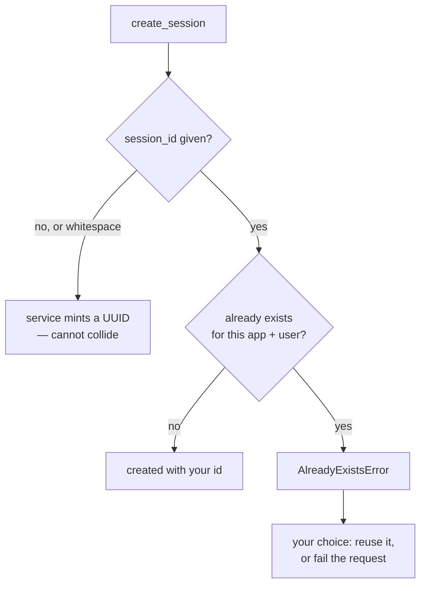

# 1.4 — Minted, or chosen

## One-line answer

Leave `session_id` off and the service mints a unique one; pass your own and you take responsibility
for it being unique — which is occasionally exactly what you want and is otherwise an
`AlreadyExistsError` waiting for a busy afternoon.

---

## The story

At the bank there is a little machine by the door that prints a token. You press the button, it gives
you B-47, and you sit down.

Nobody else can get B-47. The machine counts, and it does not care what you would have preferred.

Now picture the other arrangement, which plenty of small offices still run. There is a register on a
table by the door and you write your own name and a number on the next line. It works. It is free, it
needs no electricity, and for eleven customers a day it is completely fine.

Then a busy morning comes. Two people arrive at once, both look at the last line, both see 46, and
both write 47. Neither of them did anything wrong. Neither of them will find out until their number
is called and two people stand up.

The token machine cannot produce that situation. Not because it is clever, but because there is
exactly one of it and it is the only thing allowed to decide.

And yet — the register is not simply worse. If somebody has an appointment, written down last week
with a number already on it, the register can honour that and the machine cannot. Choosing your own
number is a real capability. It is just one that comes with the job of making sure nobody else
chooses the same one.

---

## The idea in plain language

`create_session` takes an optional `session_id`.

**Leave it off** and the service generates a UUID — a long random identifier that is unique in
practice without anybody coordinating. This is the default and it is right almost always. Two callers
creating sessions at the same instant cannot collide.

**Pass one** and the service uses it, after checking that it does not already exist. If it does, you
get:

```text
AlreadyExistsError: Session with id fixed already exists.
```

An exception, not a silent overwrite, which is the correct choice: quietly replacing an existing
conversation with a new empty one would destroy data.

There are three genuine reasons to choose an id, and it is worth knowing them so that "always let the
service mint it" does not become a superstition:

1. **Tests.** A test that creates `session_id="test-triage-1"` is readable, reproducible, and can
   assert on its own transcript afterwards. A UUID in a test is noise.
2. **Mapping to something you already have.** If a conversation corresponds one-to-one with a support
   ticket, `session_id=f"ticket-{ticket_id}"` means you never have to store the mapping anywhere,
   because the mapping is the name.
3. **Idempotency.** If the same request can arrive twice — and over a network it can — a chosen id
   lets the second arrival find the existing session instead of creating a second one. That is Phase
   9's territory, and it is the most valuable of the three.

And two reasons not to:

1. **Collisions are yours now.** Reason 2 above is only safe if the thing you are naming after is
   genuinely unique and genuinely stable. Ticket ids from two systems, or a "ticket id" that is
   really a sequence number reset each year, will collide.
2. **A chosen id can be guessable.** `session-1`, `session-2` is an invitation to try
   `session-3`. The three-part key from [1.2](1.2-three-parts-to-one-key.md) means an attacker also
   needs the right `user_id`, so this is not a hole on its own — but it removes one layer that was
   free.

There is a related setting on the runner worth knowing today, because it changes what happens when a
session is missing. `Runner(..., auto_create_session=True)` makes the runner create a session rather
than raise when the id it was given does not exist. The default is `False`. Which of the two you want
is a real decision: `False` is right when a missing session means something has gone wrong, and
`True` is right when a client is allowed to name its own conversation and start it by talking. Both
are defensible; choosing by accident is not.

One small behaviour that will save you a puzzled minute: an id made only of whitespace is treated as
no id at all. `session_id="  "` mints a UUID rather than creating a session called two spaces. The
service strips before it checks.

---

## Why Sutra needs it

**Day 23** is testing agents — unit tests for tools and callbacks — and every one of those tests
wants a session with a name you chose, so that the assertion at the end can be read by a person.

**Day 60 onwards** is durability, where idempotency stops being a nicety. A run that was killed and
retried must not become two conversations, and a chosen id is the cheapest way to make sure it does
not.

**Day 64** is human-in-the-loop resumption. A run pauses, a person approves, and something resumes it
— possibly a different process, hours later, holding nothing but an id. Whether that id was minted or
chosen decides how it got to the approver.

**Day 85** puts Sutra behind an API server, where the client sends a session id, and "what happens
when it does not exist" becomes an interface decision rather than an internal one.

---

## The mechanism

Both routes and the collision, in one script that costs nothing:

```python
# lab/ids.py - who decides the session id, and what happens when two callers agree.
import asyncio

from google.adk.errors.already_exists_error import AlreadyExistsError
from google.adk.sessions import InMemorySessionService


async def main() -> None:
    service = InMemorySessionService()

    minted = await service.create_session(app_name="sutra", user_id="local")
    print("minted  :", minted.id)

    chosen = await service.create_session(
        app_name="sutra", user_id="local", session_id="ticket-4521"
    )
    print("chosen  :", chosen.id)

    blank = await service.create_session(app_name="sutra", user_id="local", session_id="   ")
    print("blank   :", blank.id, "(whitespace is treated as no id at all)")

    print()
    print("--- the same chosen id, twice ---")
    try:
        await service.create_session(app_name="sutra", user_id="local", session_id="ticket-4521")
    except AlreadyExistsError as exc:
        print(f"{type(exc).__name__}: {exc}")

    print()
    print("--- the same chosen id under a different user ---")
    other = await service.create_session(
        app_name="sutra", user_id="someone_else", session_id="ticket-4521"
    )
    print("created:", other.id, "for", other.user_id)


asyncio.run(main())
```

**Line by line:**

- `from google.adk.errors.already_exists_error import AlreadyExistsError` — the full module path,
  because this is another symbol that is not re-exported from a friendly package name. Checking where
  an exception actually lives is the same discipline as
  [Day 7, part 1.2](../../../day-07-events-and-streaming/parts/01-the-event-object/1.2-the-fields-that-were-renamed.md)'s
  rule about fields: read the package, not a guess.
- `minted` with no `session_id` — a UUID, and you can see from the output that nothing about it is
  guessable.
- `session_id="ticket-4521"` — the mapping case. The name *is* the mapping, so nothing else has to
  store it.
- `session_id="   "` — three spaces, and the output shows a UUID. The service strips and treats an
  empty result as absent. Worth knowing because a session id read from a form or a header can very
  easily be whitespace.
- The `try` around the second `create_session` with the same id — and it is a `try`, not an `if`,
  because there is no "does this exist" check that would be safe anyway: between checking and
  creating, another caller can create it. **Asking forgiveness is correct here and asking permission
  is a race.**
- The last block, creating `ticket-4521` again under a **different** `user_id` — and it succeeds,
  because the key is three parts ([1.2](1.2-three-parts-to-one-key.md)). Session ids only have to be
  unique within one app and one user. That is either a useful property or a nasty surprise, depending
  on whether you knew.

The output:

```text
minted  : 2ed12ecb-6906-4b62-9ac7-7c0edd4d81e5
chosen  : ticket-4521
blank   : 7a20d29b-9b04-4e9d-90a8-df1c2c33d2b1 (whitespace is treated as no id at all)

--- the same chosen id, twice ---
AlreadyExistsError: Session with id ticket-4521 already exists.

--- the same chosen id under a different user ---
created: ticket-4521 for someone_else
```

The decision, drawn:



The branch at the bottom is the one this part is really about. `AlreadyExistsError` is not a failure
in itself — it is the service telling you the conversation is already there, and whether that is a
problem depends entirely on what you were trying to do. Retrying a request: not a problem, fetch it.
Starting a genuinely new conversation with a name you thought was fresh: a real problem, and the
message contains the id that was not.

---

## When it breaks

**💥 The id that was already there.**

```text
AlreadyExistsError: Session with id ticket-4521 already exists.
```

The whole message. Not "already exists in app sutra for user local" — just the id. So when this
arrives from a service handling several users, you have the id and not the address, and you will be
back at [1.2](1.2-three-parts-to-one-key.md)'s complaint about near misses. Catch it and re-raise
with the full address if you are choosing ids in anger.

**💥 The check-then-create race.**

```python
if await service.get_session(app_name=APP, user_id=user, session_id=sid) is None:
    await service.create_session(app_name=APP, user_id=user, session_id=sid)
```

Looks careful. It is a race: between the check and the create, another request can create the same
session, and then `create_session` raises anyway — from inside a branch you wrote specifically to
avoid it. With one process and one thread you will never see this. It appears the week you run two
workers.

**💥 The session that was created instead of found.**

With `auto_create_session=True`, a typo in a session id does not fail — it starts a brand-new empty
conversation. The user sends their third message and the agent has no idea who they are, because it
is answering in a session that was born a moment ago. No error, and the symptom is "the bot forgot
me", which sends you to look at the session store rather than at the id that reached it.

---

## In production

**What a professional writes instead of the teaching version** is one function that means *get or
create*, written the forgiveness way, and used everywhere:

> try to create with the chosen id → on `AlreadyExistsError`, fetch it → return whichever you have.

That is four lines, and it is the shape that survives concurrency, retries and a client that sends
the same request twice. Notice it does the create **first**: creating and catching is safe, checking
and creating is a race.

**What degrades at scale** is the choice of what to name sessions after. `ticket-4521` is elegant
until a second system supplies tickets, or until the same ticket legitimately needs two conversations
— a customer's and an engineer's. The rule that holds up is to name sessions after something that is
**globally unique and never reused**, and to accept a minted UUID everywhere else, keeping the
mapping in your own data rather than in the id.

**The failure that only shows with real traffic** is the retry storm. A client times out, retries,
and both requests are in flight. With minted ids you now have two conversations for one question and
the user sees only one of them, so half the transcript is invisible. With a chosen id you get one
conversation and one `AlreadyExistsError` you can handle. This is why idempotency is worth the
naming problem, and it is why Phase 9 spends a day on it rather than a paragraph.

**The review comment a senior engineer leaves:** *"This checks whether the session exists and then
creates it — that's a race, and `create_session` already tells us. Create first and catch
`AlreadyExistsError`. Also, `auto_create_session=True` on this runner means a bad session id silently
starts a new conversation; is that what we want on the API path? I'd rather it 404."*

**The interview question:** *"should you let the framework generate conversation ids, or supply your
own?"* The answer that shows judgement: "Default to letting it mint one — a UUID can't collide and
isn't guessable. Supply your own for three reasons: readable tests, mapping to something you already
have, and idempotency, which is the one that actually matters. If a request can arrive twice, a
chosen id means the second one finds the existing conversation instead of creating a duplicate the
user will never see. The cost is that uniqueness becomes your problem, so I'd only name a session
after something globally unique and never reused — and I'd write the get-or-create as create-then-
catch, because check-then-create is a race that only shows up once you're running more than one
worker."

---

## Check yourself

```bash
uv run python days/day-08-sessions-and-services/lab/ids.py
```

Then write the four-line get-or-create described above, and run it twice in a row to prove the second
call finds the first call's session rather than raising.

**Answer out loud, without scrolling up:**

> Give the three reasons to choose a session id yourself, and the two reasons not to. Then explain
> why `create` then `catch` beats `check` then `create`, in terms of what happens between the two
> lines.

---

**Next:** [2.1 — One dish from one recipe](../02-the-run/2.1-one-dish-from-one-recipe.md)
