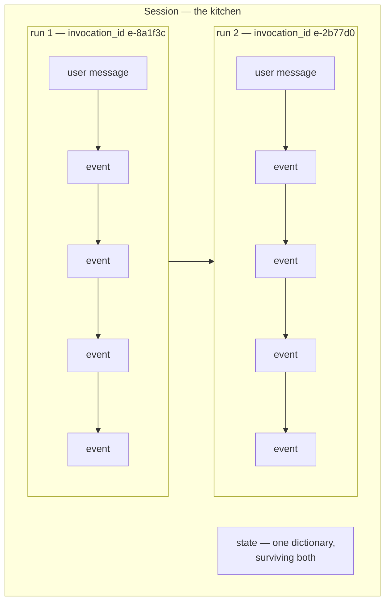

# 2.1 — One dish from one recipe

## One-line answer

A **run** — ADK also calls it an **invocation** — is everything that happens between one user message
and the agent being finished with it, however many model calls, tool calls and events that takes, and
every event in it shares one `invocation_id`.

---

## The story

You are making one dish. Say a dal.

You wash the dal. You put it on. While it boils you chop an onion, and by the time the onion is
chopped the dal needs stirring, so you stir it and go back to the onion. You fry the onion, add the
tomato, taste, decide it needs salt, add salt, taste again, decide it needs a little more, add a
little more. You take it off the heat.

One dish. Somewhere between twenty and forty separate actions, several of them repeats of each other,
one of them a decision you took twice because the first taste was not conclusive.

Now: how many things did you cook? One. Nobody would say "I made a dal and then I made some more
dal." The tasting-and-salting was not a second dish. It was part of making the first one, and it took
as many rounds as it took.

And when it is done, the kitchen is not reset. The pan is dirty, the onion skins are on the counter,
there is less salt in the container than there was. The next dish starts in that kitchen.

**The dish is the run. The kitchen is the session.**

The reason this distinction is worth a page is that the number of steps inside one dish is not fixed
and not knowable in advance. If somebody asked you "how many actions is a dal", the honest answer is
"depends on the dal." Your program has to be written for that, and the whole shape of `run_async` —
a generator that yields an unknown number of events — is what "depends on the dal" looks like in
code.

---

## The idea in plain language

Three words that get used interchangeably and are not the same thing:

- A **run** (or **invocation**) is one user message going in and the agent finishing with it. It is
  the unit `run_async` gives you.
- A **turn** is a looser, human word: usually "the user said something and the agent replied". Most
  of the time a turn and a run are the same thing, which is why the words get mixed up, and they come
  apart the moment a run produces more than one displayable answer —
  [Day 7, part 1.3](../../../day-07-events-and-streaming/parts/01-the-event-object/1.3-is-final-response-is-not-the-last-one.md)'s
  subject.
- A **session** is the whole conversation: many runs, in order, in one place.

Inside one run there can be, and from Day 10 there routinely will be:

- one model call, or five, because the model asked for a tool and had to be called again with the
  result;
- one event, or twenty;
- more than one thing that looks like an answer.

What ties them together is `invocation_id`, from
[Day 7, part 1.5](../../../day-07-events-and-streaming/parts/01-the-event-object/1.5-which-run-which-agent-which-branch.md).
Every event produced during one run carries the same one. That is what lets you take a session's flat
list of events and group it back into turns.

The shape of the call is worth reading carefully once, because six of its seven arguments are things
you will use across the next ninety days:

> `run_async(*, user_id, session_id, invocation_id=None, new_message=None, state_delta=None,
> run_config=None, yield_user_message=False)`

- `user_id` and `session_id` — two thirds of the address from
  [1.2](../01-the-session/1.2-three-parts-to-one-key.md). The third, `app_name`, is on the runner.
- `new_message` — what the user said, as a `types.Content`.
- `run_config` — the per-call settings from
  [Day 7, part 2.2](../../../day-07-events-and-streaming/parts/02-the-stream/2.2-the-partial-flag.md).
- `state_delta` — values to apply to the session *before* the run starts. Useful for handing a run
  something the user did not say.
- `invocation_id` — pass one **to resume an interrupted run**. That is Phase 9's door, and its
  presence in the signature today is a small preview of why runs have identities at all. 🅿️
- `yield_user_message` — whether the user's own message is handed back to your loop. It defaults to
  `False`, and [2.2](2.2-the-complaint-book.md) is about what that means.

Every one of them is keyword-only. Nothing here can be passed positionally, which is the same
defence [1.2](../01-the-session/1.2-three-parts-to-one-key.md) built by hand into `fetch`.

---

## Why Sutra needs it

**Day 10** gives Sutra a tool, and that is the day one run stops being one model call. Code written
under the assumption "one message in, one answer out" starts being wrong then, quietly.

**Day 13** adds callbacks that fire around each model and tool call — several times per run — and
their bookkeeping only makes sense if you know what a run is.

**Day 24** is quota accounting, denominated in requests per minute and per day. The number you are
counting is model calls, and the number a user sees is runs, and on a tool-using agent those differ
by a factor you cannot predict from the outside. Confusing them is how a budget silently
under-reports.

**Phase 9, from Day 60**, is durability, where the `invocation_id` argument above becomes the thing
you pass to pick up a run that was killed halfway.

---

## The mechanism

One run, several events, one id — with a custom agent so it costs nothing:

```python
# lab/one_run.py - what "one run" contains, and what the session keeps between runs.
import asyncio
from collections.abc import AsyncGenerator

from google.adk.agents import BaseAgent
from google.adk.agents.invocation_context import InvocationContext
from google.adk.events import Event, EventActions
from google.adk.runners import Runner
from google.adk.sessions import InMemorySessionService
from google.genai import types


class Triage(BaseAgent):
    """Four events for one message - the shape of a real run, without a model."""

    async def _run_async_impl(self, ctx: InvocationContext) -> AsyncGenerator[Event, None]:
        for text, delta in [
            ("Reading the ticket.", {"stage": "reading"}),
            ("Looking for similar ones.", {"stage": "searching"}),
            ("Nothing similar found.", {"stage": "searched"}),
            ("Looks like a session bug. Priority: high.", {"stage": "done", "priority": "high"}),
        ]:
            yield Event(
                author=self.name,
                invocation_id=ctx.invocation_id,
                content=types.Content(role="model", parts=[types.Part(text=text)]),
                actions=EventActions(state_delta=delta),
            )


async def main() -> None:
    service = InMemorySessionService()
    session = await service.create_session(app_name="sutra", user_id="local")
    runner = Runner(agent=Triage(name="triage"), app_name="sutra", session_service=service)

    for message in ["ticket 4521 logs me out", "and ticket 4600?"]:
        print(f"--- run for {message!r}")
        seen = set()
        async for event in runner.run_async(
            user_id="local",
            session_id=session.id,
            new_message=types.Content(role="user", parts=[types.Part(text=message)]),
        ):
            seen.add(event.invocation_id)
            print(f"    {event.invocation_id[:8]} {event.author}")
        print(f"    distinct invocation ids in this run: {len(seen)}")

    stored = await service.get_session(app_name="sutra", user_id="local", session_id=session.id)
    print()
    print("across both runs:")
    print("  events in the session :", len(stored.events))
    print("  distinct runs         :", len({e.invocation_id for e in stored.events}))
    print("  state                 :", stored.state)


asyncio.run(main())
```

**Line by line:**

- `class Triage(BaseAgent)` — a custom agent, so the whole script is free. The four steps stand in for
  what a real triage run will do once it has tools: read, search, evaluate, conclude.
- The list of `(text, delta)` pairs — each iteration is one event carrying both a message and a state
  change, which is the ordinary shape from
  [Day 7, part 1.4](../../../day-07-events-and-streaming/parts/01-the-event-object/1.4-the-half-that-is-not-text.md).
- `"stage"` overwritten four times — deliberately, so the final state shows only the last value while
  the events show all four. That is
  [1.3](../01-the-session/1.3-the-register-and-the-key-board.md)'s register-and-board distinction,
  arriving in a place you did not go looking for it.
- `invocation_id=ctx.invocation_id` — **you stamp it yourself, and the runner will not do it for
  you.** This is worth dwelling on, because the natural assumption is the opposite. The runner mints a
  run id and puts it on the user's message; events your own agent yields keep whatever you set, which
  by default is `""`. Leave this line out and everything still runs, the events are still stored, and
  the run id column in your trace is eight blank spaces — the exact failure
  [Day 7, part 1.5](../../../day-07-events-and-streaming/parts/01-the-event-object/1.5-which-run-which-agent-which-branch.md)
  named and the reason ADK's own source says the field *"should be non-empty before appending to a
  session"*. Delete it, re-run, and watch `distinct runs` at the bottom go from 2 to 3.
- `ctx.invocation_id` as the source — the `InvocationContext` from
  [Day 7, part 3.1](../../../day-07-events-and-streaming/parts/03-the-yield-contract/3.1-one-paper-at-a-time.md)
  carries the id of the run it belongs to. Reading it from the context rather than generating one is
  what makes your events group with the user's message rather than beside it.
- `seen = set()` inside the loop and `len(seen)` after — the assertion of this part, made by
  counting rather than by claiming.
- The **same `session.id`** for both messages — two runs, one conversation. Changing that one line to
  a new session is the whole of
  [Day 5, part 4.2](../../../day-05-first-adk-agent/parts/04-the-runner/4.2-sessions-and-the-transcript.md)'s
  memory demonstration.
- `{e.invocation_id for e in stored.events}` — a set comprehension over the stored events, which is
  the one-line version of "group the transcript into turns".

The output:

```text
--- run for 'ticket 4521 logs me out'
    e-8a1f3c triage
    e-8a1f3c triage
    e-8a1f3c triage
    e-8a1f3c triage
    distinct invocation ids in this run: 1
--- run for 'and ticket 4600?'
    e-2b77d0 triage
    e-2b77d0 triage
    e-2b77d0 triage
    e-2b77d0 triage
    distinct invocation ids in this run: 1

across both runs:
  events in the session : 10
  distinct runs         : 2
  state                 : {'stage': 'done', 'priority': 'high'}
```

Read the last three lines together, because they are the part.

**Ten events, two runs.** Four from the agent each time, plus the user's message each time — which is
[2.2](2.2-the-complaint-book.md)'s subject and is already visible in the arithmetic.

**Two distinct runs.** The id is the grouping, and nothing else in the list would have told you where
one turn ended.

**One state.** `stage` was set eight times across the two runs and holds one value. The kitchen after
the second dish.



---

## When it breaks

**💥 Counting runs when you meant model calls.**

Not an error — a number that is wrong in a report. A tool-using agent makes several model calls per
run, so "we handled 200 conversations today" and "we made 200 model calls today" are different
statements, and only one of them tells you anything about your quota. The free tier is denominated in
requests, and a request is a model call.

**💥 One run per message, assumed.**

```python
answer = None
async for event in runner.run_async(...):
    if event.is_final_response():
        answer = event.content.parts[0].text
return answer
```

The shape currently in `sutra/desk/run_once.py`. It survives while Sutra has no tools, and from Day
10 it silently means "the last of several answers", which is usually right and occasionally throws
away the sentence the agent said *before* it went and looked something up. Nothing errors.

**💥 Reusing a session for two unrelated questions.**

Also not an error. Every run in a session carries all the previous events into the model's context,
which is the point — until the user changes subject. Then you are paying for the old conversation on
every turn and biasing every answer toward it. The framework has no opinion about when a conversation
ends. You do, and Day 46 makes you write it down.

---

## In production

**What a professional writes instead of the teaching version** is code that treats the run as the unit
of work: one run per request, one trace span per run, one log line per run summarising it, and the
`invocation_id` as the correlation key across all three. Day 84's tracing does this properly; the
habit worth starting today is that **the run id goes in every log line**, because a log without it is
a diary.

**What degrades at scale** is the variance. In testing, every run is four events and one model call.
In production, the distribution has a long tail: most runs are small, some are twenty model calls
because a tool kept returning nothing useful, and the mean tells you nothing about either. Teams that
only measure averages are surprised twice — by a quota that empties faster than the arithmetic
suggests, and by a p99 latency nobody can reproduce.

**The failure that only shows with real traffic** is two runs in one session at the same time. The
user sends a second message before the first has finished, or a client retries. Both runs read the
session, both append, and the resulting transcript is interleaved — which the model then reads on the
next turn as though it were a coherent conversation. There is no exception, and the symptom is an
agent that answers a question nobody asked. Serialising runs per session is the fix, and it is a
decision you have to make rather than a setting you can turn on.

**The review comment a senior engineer leaves:** *"Nothing here stops two runs starting in the same
session concurrently, and the UI lets a user send while the previous answer is still streaming. Put a
per-session lock in front of this, or at minimum reject the second one — an interleaved transcript is
almost impossible to diagnose from a bug report."*

**The interview question:** *"what's the difference between a turn, a run and a session?"* The answer
that shows you have built one: "A session is the whole conversation and has an address; a run is one
user message going in and the agent finishing with it; a turn is the human word that usually matches
a run and stops matching once a run produces more than one displayable answer. The reason the
distinction earns its keep is quota and tracing: a run can be one model call or fifteen, so if you
count runs you have no idea what you're spending, and if you don't stamp the run id on your logs you
can't group a flat event list back into turns. And the thing I'd check before shipping is whether two
runs can start in one session at once, because that produces an interleaved transcript that the model
then reads as if it made sense."

---

## Check yourself

```bash
uv run python days/day-08-sessions-and-services/lab/one_run.py
```

Then change the second call to use a **new** session and watch the last three numbers change.

**Answer out loud, without scrolling up:**

> Define a run, a turn and a session in one sentence each, and say which of the three has an address.
> Then say what ties the events of one run together, and give one thing you could not do without it.

---

**Next:** [2.2 — The complaint book](2.2-the-complaint-book.md)
