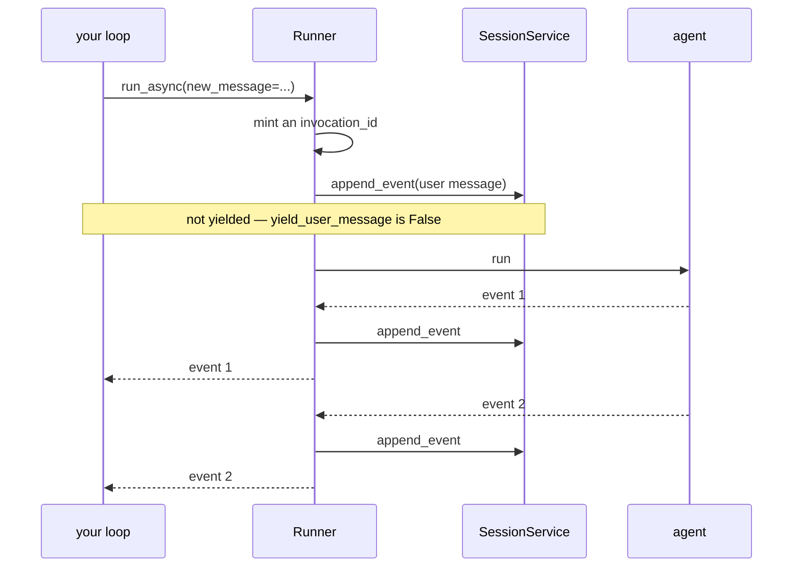

# 2.2 — The complaint book

## One-line answer

The runner writes the user's message into the session **before your agent runs**, and does not hand
it to your loop — so a session always has one more event than your loop counted, and a run that
crashed instantly still leaves a record that somebody asked something.

---

## The story

There is a shop that has to keep a complaint book. It sits at the end of the counter with a pen tied
to it.

You have a complaint. You write it: date, what happened, your name and number. You sign it. You
leave.

Nothing has been fixed. Nobody has read it. The manager is not in today. As far as anything you can
see is concerned, writing in that book changed nothing at all.

But something did change, and it is worth being precise about what. **There is now a record that you
complained.** Independent of whether anybody acts on it, independent of whether the shop admits it,
independent of whether the problem is ever solved. If you come back in a month and they say nobody
told us, the book says otherwise. If an inspector comes, the book is what he reads.

The record and the response are two different things, and the book exists because the record has to
survive even when the response does not happen.

That is exactly what the runner does with the user's message, and the day you notice is usually the
day an agent crashed and you found the session had one event in it and could not work out where it
came from.

---

## The idea in plain language

When you call `run_async`, the runner does several things before your agent is asked to do anything.
One of them is this: it takes `new_message` and **appends it to the session as an event**, with
`author="user"`.

That event has a run id — the runner mints one for this invocation and puts it on this event — and it
is stored exactly like any other. It is now part of the transcript, permanently, whatever happens
next.

And by default, **your loop is not given it.** `run_async` has an argument:

> `yield_user_message: bool = False`

Set to `False`, which is the default, the user's event is written to the session and never handed to
you. Set to `True`, it is yielded before the agent's events, so your loop sees it first.

Why is the default `False`? Because you already have the message. You just passed it in. Handing it
straight back would mean every consumer has to filter out an event that tells them nothing new, which
is a tax on the common case for the benefit of the rare one.

Why does the rare one exist? Because some consumers are not the caller. A UI that renders a session
by walking an event stream wants the whole conversation, including the user's side, and turning the
flag on means it can render one uniform list rather than special-casing the message it happened to
send.

Three consequences fall out of the default, and the third is the one that costs an evening.

**The arithmetic is always off by one per run.** Four events yielded, five stored. If you have
written a test asserting the session's length, you will meet this immediately.

**A crashed run is not an empty run.** If the agent fails before yielding anything, the session still
has the user's message in it. That is the shape that made
[Day 7, part 5.1](../../../day-07-events-and-streaming/parts/05-failure-lab/5.1-the-mechanic-who-billed-at-the-end.md)
so hard to diagnose: `stored events: 1` reads as "the agent ran and said nothing", which points at the
model, the prompt or the key — anywhere except at the actual bug.

**Your loop's view and the stored transcript are different lists.** Not in a subtle way, in exactly
one way: the stored one has the user's messages and yours does not. Any code that compares them, or
that rebuilds one from the other, has to know.

---

## Why Sutra needs it

**Day 23** is testing agents, and every assertion about a session's contents has to account for this.
A test that says `assert len(session.events) == 4` after a four-event run is a test that fails for a
reason that has nothing to do with what it was checking.

**Day 79 onwards** is evals. An evalset compares what the agent did against what it should have done,
and reading a stored session means reading a list that includes the user's turns — which is what you
want, and which differs from what your runner loop saw.

**Day 85** puts Sutra behind an API server that streams a session to a browser. That is the consumer
`yield_user_message=True` exists for, and it is worth knowing the flag is there before you write a
special case to work around not having it.

**Day 22**'s structured logging counts events per run. Whether that count includes the user's message
is a decision, and an undocumented one produces two dashboards that disagree by exactly one.

---

## The mechanism

Count both lists in the same run:

```python
# lab/off_by_one.py - what your loop sees, and what the session keeps.
import asyncio
from collections.abc import AsyncGenerator

from google.adk.agents import BaseAgent
from google.adk.agents.invocation_context import InvocationContext
from google.adk.events import Event
from google.adk.runners import Runner
from google.adk.sessions import InMemorySessionService
from google.genai import types


class Two(BaseAgent):
    """Yields exactly two events, so the arithmetic is easy to check."""

    async def _run_async_impl(self, ctx: InvocationContext) -> AsyncGenerator[Event, None]:
        for text in ("Reading the ticket.", "Looks like a session bug."):
            yield Event(
                author=self.name,
                invocation_id=ctx.invocation_id,
                content=types.Content(role="model", parts=[types.Part(text=text)]),
            )


async def main() -> None:
    service = InMemorySessionService()
    session = await service.create_session(app_name="sutra", user_id="local")
    runner = Runner(agent=Two(name="two"), app_name="sutra", session_service=service)

    yielded = []
    async for event in runner.run_async(
        user_id="local",
        session_id=session.id,
        new_message=types.Content(role="user", parts=[types.Part(text="ticket 4521")]),
    ):
        yielded.append(event.author)

    stored = await service.get_session(app_name="sutra", user_id="local", session_id=session.id)

    print("your loop saw   :", yielded)
    print("the session has :", [e.author for e in stored.events])
    print("difference      :", len(stored.events) - len(yielded), "event")
    print()
    print("the extra one:")
    first = stored.events[0]
    print("  author        :", first.author)
    print("  invocation_id :", first.invocation_id)
    print("  text          :", first.content.parts[0].text)


asyncio.run(main())
```

**Line by line:**

- `class Two(BaseAgent)` — two events, chosen so the off-by-one is unmistakable rather than lost in a
  bigger number. The whole script is a subtraction.
- `invocation_id=ctx.invocation_id` — stamped, for the reason
  [2.1](2.1-one-dish-from-one-recipe.md) gave. It also matters here: the output shows the user's
  event carrying the *same* id, which is how you know the runner minted one before it appended.
- `yielded.append(event.author)` — collecting authors rather than whole events, because the question
  is "who is in this list", and authors fit on one line.
- `service.get_session(...)` **after** the loop rather than reading the `session` object — for
  [1.1](../01-the-session/1.1-a-conversation-with-an-address.md)'s reason: fetching by address is what
  a later process would do, and it is the honest view.
- `len(stored.events) - len(yielded)` printed as a number — because a reader who is skimming will
  believe a number and argue with a sentence.
- `stored.events[0]` — the **first** event, not the last. The user's message is at the front, because
  it was appended before the agent produced anything.

The output:

```text
your loop saw   : ['two', 'two']
the session has : ['user', 'two', 'two']
difference      : 1 event

the extra one:
  author        : user
  invocation_id : e-af8edfcc-ae06-4e8b-89dc-67838d134de3
  text          : ticket 4521
```

The user's event carries a run id, and it is the same one the agent's events carry. That is not
decoration: it means the transcript can be grouped into turns *including* the question, which is what
makes a stored session readable at all.

The id itself is worth one look: `e-` and then a UUID. The prefix is the runner's, and it is the same
shape you saw in the stored database on
[Day 7, part 6.1](../../../day-07-events-and-streaming/parts/06-reading-a-run/6.1-the-camera-you-already-installed.md).
Yesterday's replay tool truncated it to eight characters for readability, which is why the ids there
looked shorter than this one.



---

## When it breaks

**💥 The test that counts events.**

```text
assert len(stored.events) == 2
AssertionError: assert 3 == 2
```

The first time everybody meets this, and it looks like the agent produced a phantom event. It did
not; the runner did, before the agent started. Write the assertion against the authors rather than
the length and it both passes and says what it means.

**💥 The one-event session.**

```text
stored events: 1 | state: {}
```

Day 7's failure lab, restated with its cause now visible. The agent produced nothing at all, and the
session is not empty, because the user's message was already in it. This is the reason "the agent
said nothing" is a misleading symptom: it is indistinguishable, from the transcript alone, from "the
agent crashed before its first yield".

**💥 The flag that did nothing.**

`yield_user_message=True` is honoured on ADK's node runtime path — which is what runs when your root
agent is an `LlmAgent`, and what will run for the graph nodes of Phase 8. It is **not** honoured when
your root is a plain custom `BaseAgent` subclass, as the lab script above is. Observed on
`google-adk` 2.7.1:

```text
--- custom BaseAgent root, yield_user_message=True
    yielded: author='two' text='Reading the ticket.'
    yielded: author='two' text='Looks like a session bug.'

--- LlmAgent root, yield_user_message=True
    yielded: author='user' text='hello'
    yielded: author='probe' text=''
```

Same flag, same runner, different root, and no error either way. If you turn it on and nothing
changes, look at what kind of agent is at the root before you look at anything else.

---

## In production

**What a professional writes instead of the teaching version** is code that never derives the
transcript from its own loop. If you want the conversation, read the session; the loop is for
reacting to events as they happen, not for reconstructing history. Teams that blur the two end up
with a "transcript" that is missing every user message and nobody notices until somebody reads one.

**What degrades at scale** is the assumption that the user's message is small. It is stored verbatim,
forever, and users paste log files, stack traces and whole email threads into support forms. One
session's first event can be larger than everything the agent produced in it, and it is re-sent to
the model on every subsequent turn in that session. This is Day 19 and 20's problem — context
engineering — and it starts here, with an event you did not create and did not size.

**The failure that only shows with real traffic** is the run that dies between the append and the
agent. It is a narrow window, and at real volume it is hit: a cancelled request, a timeout in a
before-run callback, a worker killed mid-deploy. The session is left with a question and no answer,
forever, and it looks exactly like an agent that ignored somebody. Systems that care about this
count *user events with no following agent event in the same run* as a metric, and it is a
surprisingly good early warning that something is wrong upstream.

**The review comment a senior engineer leaves:** *"This builds the transcript from the events the loop
yielded, so every user message is missing from it. Read the session instead. And the length assertion
in the test is going to keep breaking — assert on the authors, it's what you actually mean."*

**The interview question:** *"a user's conversation shows one event and no reply. What are the
possibilities?"* The answer that shows you have debugged one: "The runner appends the user's message
before the agent runs, so one event means the question got in and nothing came back. That's two very
different situations: the agent crashed before its first yield, or the run was cancelled between the
append and the agent starting. Neither leaves anything else behind, which is why the transcript alone
can't tell you — you need the log line for that run id. It's also why a one-event session is a better
alarm than an empty one: an empty session means nobody asked anything, and a one-event session means
somebody asked and we lost it."

---

## Check yourself

```bash
uv run python days/day-08-sessions-and-services/lab/off_by_one.py
```

Then add `yield_user_message=True` to the `run_async` call and run it again. Note what changes, and
what does not, and check the "when it breaks" section before concluding the flag is broken.

**Answer out loud, without scrolling up:**

> Say who puts the user's message into the session and when. Then say why a session with exactly one
> event is a more informative alarm than an empty one, and what it cannot tell you on its own.

---

**Next:** [2.3 — A journey and a pass](2.3-a-journey-and-a-pass.md)
