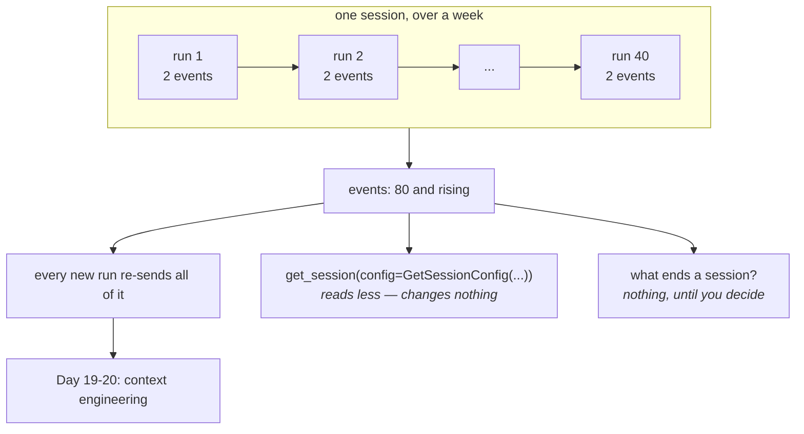

# 2.3 — A journey and a pass

## One-line answer

A session outlives every run inside it and **only ever grows**, so the two questions that decide
whether an agent stays affordable are *what ends a session* and *how much of it you actually load* —
and ADK gives you `GetSessionConfig` for the second and nothing at all for the first.

---

## The story

You buy a monthly bus pass. One card, one photograph, one number, valid until the end of the month.

Every morning you use it. The conductor glances at it and you sit down. Sometimes you use it four
times in a day, sometimes not at all. Each journey is a separate thing — a different bus, a different
route, a different set of people — and none of them is the pass.

Two things about the arrangement are worth noticing.

**The pass does not know about the journeys.** It is not a log. You cannot look at it and see where
you went. If somebody asks how many trips you made this month, the pass has no answer, and neither do
you.

**And the pass has an end date.** Somebody decided that. Not because thirty days is a natural unit of
travel, but because a card that never expires becomes a card nobody can reason about — you would have
no idea whether it was still yours, still valid, still the same person's photograph.

Now imagine the pass *did* record every journey, on the card, in tiny writing, and never ran out. By
March it is unreadable. By June the conductor takes a minute to find your photograph among the
scribbles. Nothing has broken. It has simply become slower and heavier every single day, and there is
no day on which anybody decides to do something about it.

That is a session with no end, and the reason this part is at `production` level is that nothing in
the framework will ever tell you that you have one.

---

## The idea in plain language

[2.1](2.1-one-dish-from-one-recipe.md) established the three units. This part is about what happens
to them **over time**, which is the part a script never shows you.

**A run is bounded.** It starts, it produces some events, it ends. Its cost is a few model calls.

**A session is unbounded.** Nothing in ADK ends one. `delete_session` exists, and something has to
call it. Until something does, every run appends to the same list, and that list is what gets
re-sent to the model on every turn.

So a session has a cost that grows quadratically with use, and it is worth saying that out loud
because it is not obvious. Turn 1 sends one turn's worth of context. Turn 20 sends twenty. Over
twenty turns you have not sent twenty units of context, you have sent about two hundred. On a free
tier denominated in requests this is invisible until the token-per-minute limit arrives instead of
the request limit, which is a confusing way to meet it.

ADK gives you one instrument, and it is a load-time filter rather than a fix:

> `GetSessionConfig(num_recent_events=..., after_timestamp=...)`

Pass it to `get_session` and you get a session whose `events` list is trimmed — the last N, or
everything after a timestamp. The stored session is untouched; this changes what you *read*, not what
exists.

That distinction matters, because it makes `GetSessionConfig` the right tool for exactly one job and
the wrong tool for the one people reach for it with:

- **Right:** reading a session to show or inspect it, where you want the recent part and not four
  thousand events. Your replay tool from
  [Day 7, part 6.1](../../../day-07-events-and-streaming/parts/06-reading-a-run/6.1-the-camera-you-already-installed.md)
  wants this.
- **Wrong:** trimming what the model sees. That is context engineering, it is Day 19 and Day 20's
  subject, and it is done with compaction and summarisation — because dropping the first half of a
  conversation is not free, it is a decision about what the agent is allowed to remember.

Which leaves the question the framework does not answer: **what ends a session?** There is no
built-in idle timeout, no maximum length, no automatic archive. Real answers people use:

- **One session per unit of work.** For Sutra: one ticket, one session. Bounded by the thing itself,
  which is the cleanest answer available.
- **Idle timeout.** Nothing for an hour and the next message starts a new session. Simple, and it
  cuts conversations in half occasionally.
- **A length ceiling.** At N events, summarise and start a new session carrying the summary. This is
  Day 20's compaction with an extra step, and it is the most work.

Sutra will take the first, and the place that decision gets written down is the module today's build
brief creates.

---

## Why Sutra needs it

**Day 19 and 20** are context engineering — what earns a place in the window, and how to compact a
conversation that has outgrown it. Both are about the growth this part names, and both are much
easier to motivate once you have watched a session get longer and done the arithmetic.

**Day 24** is quota accounting. The number that runs out first on a growing session is tokens per
minute, not requests per day, and knowing why is the difference between a budget that predicts and
one that reports.

**Day 46 onwards** is memory across sessions. The whole idea only makes sense if sessions end: "has
anything like this happened before?" is a question about *other* sessions, and if every user has one
eternal session there is no *other*.

**Day 51** is caching, which pays for itself precisely because a long session re-sends the same
prefix on every turn.

---

## The mechanism

The growth, and the instrument, in one script:

```python
# lab/growth.py - a session gets longer; get_session lets you read less of it.
import asyncio

from google.adk.events import Event
from google.adk.sessions import InMemorySessionService
from google.adk.sessions.base_session_service import GetSessionConfig
from google.genai import types


async def main() -> None:
    service = InMemorySessionService()
    session = await service.create_session(app_name="sutra", user_id="local")

    for turn in range(1, 11):
        for author, text in [("user", f"question {turn}"), ("sutra_desk", f"answer {turn}")]:
            await service.append_event(
                session,
                Event(
                    author=author,
                    invocation_id=f"run-{turn}",
                    content=types.Content(
                        role="user" if author == "user" else "model",
                        parts=[types.Part(text=text)],
                    ),
                ),
            )

    everything = await service.get_session(app_name="sutra", user_id="local", session_id=session.id)
    print("events stored           :", len(everything.events))

    recent = await service.get_session(
        app_name="sutra",
        user_id="local",
        session_id=session.id,
        config=GetSessionConfig(num_recent_events=4),
    )
    print("read with num_recent=4  :", len(recent.events))
    print("which ones              :", [e.invocation_id for e in recent.events])

    still_there = await service.get_session(
        app_name="sutra", user_id="local", session_id=session.id
    )
    print("still stored afterwards :", len(still_there.events))

    sent = sum(range(1, 11))
    print()
    print("if every turn re-sends the whole conversation:")
    print("  turns                 : 10")
    print(f"  turn-units sent       : {sent}")


asyncio.run(main())
```

**Line by line:**

- The nested loop appending a `user` and a `sutra_desk` event per turn — a plausible transcript
  built by hand, because building it with a model would cost ten requests to demonstrate arithmetic.
- `invocation_id=f"run-{turn}"` — a readable id rather than a UUID, so the trimmed output below shows
  *which* events survived rather than an unreadable set of hashes. In real code the runner mints
  these; here the readability is worth more than the realism.
- `get_session` with **no** config first — the default, and the number to compare against.
- `GetSessionConfig(num_recent_events=4)` — the instrument. Note it goes in a `config=` argument
  rather than as a keyword on `get_session` itself, which is a small thing that costs a minute the
  first time you look for it.
- `[e.invocation_id for e in recent.events]` — printing which ones came back, because "4 events" does
  not tell you whether they are the first four or the last four, and the answer matters.
- The **third** `get_session` with no config — the point of the script. Reading less did not delete
  anything. `GetSessionConfig` is a view, and confusing a view with a fix is the mistake this
  demonstration exists to prevent.
- `sum(range(1, 11))` — the quadratic. Ten turns, fifty-five turn-units of context sent, because turn
  *n* re-sends everything before it. That single number is the argument for Day 20's compaction, and
  it is arithmetic rather than opinion.

The output:

```text
events stored           : 20
read with num_recent=4  : 4
which ones              : ['run-9', 'run-9', 'run-10', 'run-10']
still stored afterwards : 20

if every turn re-sends the whole conversation:
  turns                 : 10
  turn-units sent       : 55
```

The last four events are the last two turns, which is what you would want, and the store is untouched.



---

## When it breaks

**💥 The session that got slow.**

No error. A conversation that was fine on Monday takes noticeably longer on Friday, costs more, and
starts giving worse answers because the useful part of the context is now buried under forty turns of
history. Every individual turn looks correct. The regression is in the *shape* of the thing, and
nothing in the framework reports on shape.

**💥 `GetSessionConfig` used as a fix.**

```python
session = await service.get_session(..., config=GetSessionConfig(num_recent_events=10))
```

...in the belief that the agent will now only see ten events. It will not: the runner loads the
session itself, and what you loaded in your own code has no bearing on what the run does. The stored
session is unchanged, the model still gets everything, and you have a false sense of having fixed
something — which is worse than not having tried.

**💥 The token-per-minute limit arriving instead of the request limit.**

```text
429 RESOURCE_EXHAUSTED
```

On a free tier you expect to run out of *requests*. A long session runs out of *tokens per minute*
first, because each request carries more of them, and the error text does not spell out which limit
you hit unless you read the detail carefully. Day 2 established that these quotas are read off live
429s rather than a table; this is the case where the two limits behave differently and the arithmetic
above is what tells them apart.

---

## In production

**What a professional writes instead of the teaching version** is a session lifecycle written down
somewhere a person can read: what starts one, what ends one, and what happens to it afterwards. For a
support desk that is usually *one ticket, one session*, archived when the ticket closes. The value is
not the rule, it is that the rule exists — because the default, which every system has until somebody
writes one, is that sessions live forever and nobody owns the decision.

**What degrades at scale** is storage in a way that surprises people, because the growth is in two
dimensions at once. More users means more sessions; longer conversations means bigger sessions. Both
grow, and the product of them is what your store holds. A support desk with ten thousand tickets a
month and forty events per ticket is four hundred thousand events a month, every one of them holding
the full text it carried. That is a data-retention question long before it is a performance one.

**The failure that only shows with real traffic** is the pathological session. Almost every
conversation is short. One is not: an automated client in a retry loop, or a user who never starts a
new chat, and it has eleven thousand events. Every read of it is slow, every model call on it is
expensive or refused, and it will not show up in an average. The defence is a ceiling with an alarm —
*no session should exceed N events* — set at a number that ordinary use never approaches, which is
the same instrument as
[Day 7, part 4.1](../../../day-07-events-and-streaming/parts/04-the-brakes/4.1-the-meter-that-cuts-off.md)'s
`max_llm_calls` and for the same reason.

**The review comment a senior engineer leaves:** *"Nothing here ends a session. That's fine for the
demo and it means our first heavy user gets an unbounded conversation that costs more every turn. One
ticket, one session — write it down, and add the event-count alarm now rather than after we meet the
one with eleven thousand."*

**The interview question:** *"an agent gets slower and more expensive the longer a conversation goes
on. Why, and what do you do about it?"* The answer that shows you have run one: "Because the model is
stateless, so the whole conversation is re-sent every turn — turn twenty sends twenty turns of
context, and over twenty turns you've sent about two hundred turn-units rather than twenty. It's
quadratic, and on a free tier you meet it as a tokens-per-minute limit rather than a request limit,
which is confusing the first time. Reading fewer events doesn't help, because the runner loads the
session itself — that's a view, not a fix. The real answers are ending sessions on a natural boundary,
one ticket one conversation for a support desk, and compaction for the ones that legitimately run
long. And I'd put an alarm on session length, because the distribution has a tail and the average
will never show it to you."

---

## Check yourself

```bash
uv run python days/day-08-sessions-and-services/lab/growth.py
```

Change `num_recent_events=4` to `after_timestamp` with a value from the middle of the run, and see
which events come back.

**Answer out loud, without scrolling up:**

> Say what `GetSessionConfig` changes and what it does not. Then say what ends a session in ADK, and
> give the rule you would write down for Sutra.

---

**Next:** [3.1 — The tap and the pipe](../03-the-services/3.1-the-tap-and-the-pipe.md)
