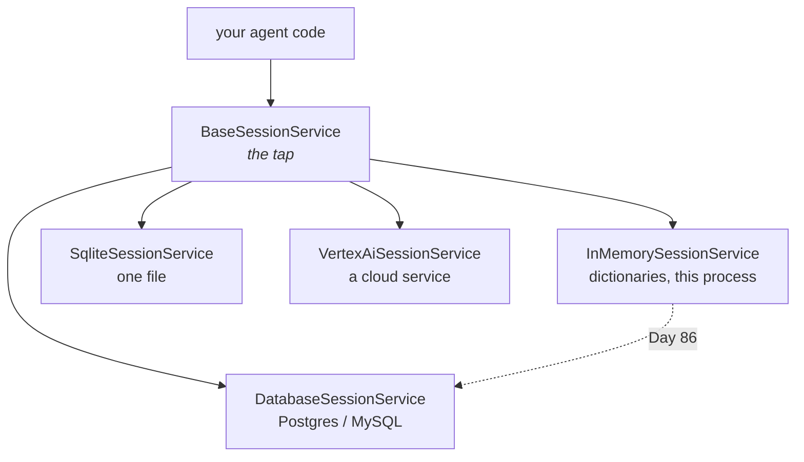

# 3.1 — The tap and the pipe

## One-line answer

A **service** in ADK is an interface — a list of methods with no opinion about where the data goes —
and every "in-memory" thing you have used today is one implementation of one, which is what lets Day
86 swap a dictionary for a database without your agent noticing.

---

## The story

There is a tap in your kitchen. You turn it and water comes out.

Behind the wall, one of several things is true. It might be a municipal line. It might be a borewell
with a pump. It might be a tank on the roof that a tanker fills twice a week, or a tank the pump
fills at four in the morning when the supply comes.

You do not know which. More usefully: **you do not need to know**, and you have never once needed to
know in order to wash a plate.

That is not laziness on your part. It is a property of the tap. The tap makes a promise — turn it,
water comes out — and everything behind it is somebody else's arrangement. A house can switch from
municipal to borewell without a single thing in the kitchen changing, and nobody has to teach the
family a new way to wash plates.

Two things follow, and the second is the one people forget.

**You can swap what is behind the wall.** That is the point.

**And what is behind the wall still matters.** Municipal supply arrives at fixed hours. A roof tank
runs out. A pump is dead in a power cut. The tap's promise is *turn it and water comes out*, and
every one of those arrangements breaks that promise in its own way, at its own moment, and the family
has to know which one they have.

The tap hides the plumbing from your **code**. It does not hide it from your **operations**, and a
day that only taught you the first half would leave you thinking `InMemorySessionService` and a
database are interchangeable. They are interchangeable in exactly one sense and not at all in the
others, which is [section 4](../04-what-in-memory-means/4.1-the-tab-you-did-not-save.md).

---

## The idea in plain language

Some vocabulary, defined properly, because "interface" gets used loosely.

An **interface** is a promise about what you can call and what you get back, with no statement about
how. In Python it is usually an **abstract base class**: a class that declares methods and refuses to
be instantiated, so it exists only to be inherited from.

ADK's session interface is `BaseSessionService`. It declares five things:

| Method | What it promises |
| --- | --- |
| `create_session` | make a new session and return it |
| `get_session` | find one by its three-part address, or return `None` |
| `list_sessions` | all the sessions for an app, optionally for one user |
| `delete_session` | remove one |
| `append_event` | add an event, apply its state delta, return the event |

That is all. Nothing about dictionaries, files, SQL or the network appears anywhere in it.

ADK ships four implementations of that interface, and the differences between them are entirely
about where the data lives:

| Implementation | Where the data lives | Survives a restart? |
| --- | --- | --- |
| `InMemorySessionService` | Python dictionaries in this process | no |
| `SqliteSessionService` | one file on disk | yes |
| `DatabaseSessionService` | PostgreSQL, MySQL or SQLite via SQLAlchemy | yes |
| `VertexAiSessionService` | a Google Cloud service | yes, and off your machine |

Your agent code calls the same five methods against all four.

Sessions are not the only service. ADK has the same shape for three other things, and today's ID —
ADK-07 — is about the in-memory implementation of each:

- **Artifacts** (`BaseArtifactService`) — files that outlive a turn. Day 18.
- **Memory** (`BaseMemoryService`) — searchable recall across sessions. Phase 7, from Day 46.
- **Credentials** (`BaseCredentialService`) — tokens a tool needs to reach something. Phase 6.

Four services, one pattern: an interface, a throwaway implementation for development, and a real one
for production.

**Why the pattern is worth having** is the honest question, since it costs an extra layer. The answer
is not "flexibility", which is what people say when they have added an abstraction they cannot
justify. It is:

1. **The swap is a real, planned event in this project.** Day 86 deploys Sutra in a container, where
   a dictionary in a process that gets restarted on every deploy is not a store. That is a
   commitment on the roadmap, not a hypothetical.
2. **Tests need a fast store.** Day 23 writes tests for agent behaviour, and a test that needs a
   database is a test that gets skipped.
3. **The interface is where the guarantees are written down.** `get_session` returns `Optional` for
   *every* implementation, so the `None` from [1.2](../01-the-session/1.2-three-parts-to-one-key.md)
   is not an in-memory quirk you can outgrow.

Which gives one rule you can apply immediately, and it is the rule today's build brief enforces:
**type your parameters against the base class, never the implementation.** A function that takes a
`BaseSessionService` works on all four. A function that takes an `InMemorySessionService` has hard-
coded a decision that was supposed to be swappable, and nothing will tell you until the day of the
swap.

---

## Why Sutra needs it

**Day 18** brings artifacts, **Day 27 onwards** brings credentials for MCP servers, and **Day 46
onwards** brings memory. Each of those days is much shorter if "it is a service, with an in-memory
implementation and a real one" is already familiar.

**Day 86** is the deployment day where the swap actually happens. Every file that typed against
`InMemorySessionService` becomes a change on that day, and every file that typed against
`BaseSessionService` does not.

**Day 91** is the interop survey. The pattern you are learning here — an interface with several
backings — is the same one MCP applies to data sources and A2A applies to peers. Recognising it is
half of that day.

---

## The mechanism

The interface, its implementations, and the one line that decides how portable your code is:

```python
# lab/interfaces.py - the promise, and the things that keep it.
from google.adk.sessions import BaseSessionService, InMemorySessionService
from google.adk.sessions.sqlite_session_service import SqliteSessionService

print("BaseSessionService declares:")
for name in sorted(BaseSessionService.__abstractmethods__):
    print("   ", name)
print()

for cls in (InMemorySessionService, SqliteSessionService):
    print(f"{cls.__name__}:")
    print("   is a BaseSessionService:", issubclass(cls, BaseSessionService))
    print("   declared in            :", cls.__module__)
print()

print("--- the abstract class refuses to be used ---")
try:
    BaseSessionService()
except TypeError as exc:
    print(type(exc).__name__ + ":", exc)
```

**Line by line:**

- `BaseSessionService.__abstractmethods__` — a `frozenset` Python builds for any class using
  `abc.ABC`, listing the methods a subclass **must** implement. This is the promise, read off the
  class rather than off a page, and it is the same discipline as
  [Day 7, part 1.2](../../../day-07-events-and-streaming/parts/01-the-event-object/1.2-the-fields-that-were-renamed.md).
- `SqliteSessionService` imported from its own module — the finding from
  [Day 7, part 6.1](../../../day-07-events-and-streaming/parts/06-reading-a-run/6.1-the-camera-you-already-installed.md):
  it is not re-exported from the package.
- `issubclass(cls, BaseSessionService)` — proving the relationship rather than asserting it. This is
  the line that says your code can hold either one.
- `cls.__module__` — where each implementation lives, which is how you find its source when you need
  to know what "in memory" actually costs. Reading the implementation is not cheating; it is
  [section 4](../04-what-in-memory-means/4.1-the-tab-you-did-not-save.md).
- `BaseSessionService()` inside a `try` — an abstract class cannot be instantiated, and the error
  message names every method that is missing. Worth seeing once, because it is also the error you get
  when you write your own implementation and forget one.

The output:

```text
BaseSessionService declares:
    create_session
    delete_session
    get_session
    list_sessions

InMemorySessionService:
   is a BaseSessionService: True
   declared in            : google.adk.sessions.in_memory_session_service
SqliteSessionService:
   is a BaseSessionService: True
   declared in            : google.adk.sessions.sqlite_session_service

--- the abstract class refuses to be used ---
TypeError: Can't instantiate abstract class BaseSessionService without an implementation for abstract methods 'create_session', 'delete_session', 'get_session', 'list_sessions'
```

Four abstract methods, not five — because `append_event` is **implemented** on the base class rather
than left abstract. That is worth a moment: the base class does the state-delta application and the
partial-event skip from
[Day 7, part 2.4](../../../day-07-events-and-streaming/parts/02-the-stream/2.4-nothing-is-credited-until-the-receipt.md)
itself, and a subclass only has to say where things go. It is why every implementation behaves
identically on the rules you learned yesterday, rather than each one having its own opinion.

Now the rule, in code you are about to write:

```python
# sutra/desk/sessions.py - typed against the promise, not the plumbing.
from google.adk.sessions import BaseSessionService, InMemorySessionService, Session

APP_NAME = "sutra"
USER_ID = "local"


def default_service() -> BaseSessionService:
    """The store Sutra uses today. One line to change on Day 86."""
    return InMemorySessionService()


async def start(service: BaseSessionService, *, user_id: str = USER_ID) -> Session:
    """Begin a conversation and return it."""
    return await service.create_session(app_name=APP_NAME, user_id=user_id)
```

**Line by line:**

- `def default_service() -> BaseSessionService` — the return type is the **interface**, so every
  caller is typed against the promise even though today's answer is the dictionary one. A type
  checker will then stop anybody reaching for an in-memory-only attribute.
- The choice of implementation confined to **one function body** — which is what "one line to change
  on Day 86" actually means. If `InMemorySessionService()` appears in five files, the swap is a
  five-file change and one of them will be missed.
- `service: BaseSessionService` as the first parameter of `start` — passed in rather than fetched
  from a global. That is what makes this testable and what makes two stores in one process possible,
  which Day 23 will want.
- `APP_NAME` and `USER_ID` as module constants — the single source of truth
  [1.2](../01-the-session/1.2-three-parts-to-one-key.md) asked for. `run_once.py`, `stream.py` and
  `multi_turn.py` all import from here instead of each declaring their own.
- `*` before `user_id` — keyword-only, so a future call site cannot pass a session id into the user
  slot.



---

## When it breaks

**💥 The type that pinned the implementation.**

```python
def start(service: InMemorySessionService) -> Session: ...
```

Nothing fails today. On Day 86 the type checker objects, or worse, does not — because you are not
running one — and the code reaches for `service.sessions`, which only the in-memory implementation
has:

```text
AttributeError: 'DatabaseSessionService' object has no attribute 'sessions'
```

That is the swap failing at the point of use rather than at the point of change, which is the
expensive shape.

**💥 The abstract class instantiated.**

```text
TypeError: Can't instantiate abstract class BaseSessionService without an implementation for abstract methods 'create_session', 'delete_session', 'get_session', 'list_sessions'
```

Usually a copy-paste, and occasionally your own subclass that is missing a method — in which case the
message is a to-do list. Read the names in it rather than the first line.

**💥 The service that needs an extra you have not installed.**

```text
ImportError: The 'sqlalchemy' package is required to use this feature. Please install it by running: pip install google-adk[db]
```

`DatabaseSessionService` is imported lazily for exactly this reason: the package does not drag
SQLAlchemy in for everybody. So the failure arrives at import time on the day of the swap rather than
at install time, which is worth knowing before that day.

---

## In production

**What a professional writes instead of the teaching version** is a single factory — the
`default_service()` above — reading its choice from configuration, so the same image runs against an
in-memory store in a test and a database in a deployment. The thing that makes it work is not the
factory, it is the discipline of never naming the implementation anywhere else.

**What degrades at scale** is the assumption that the interface hides everything. It hides the API and
not the behaviour: latency, failure modes, transactional guarantees and concurrency are all different
between the four, and none of that appears in the method signatures. `append_event` against a
dictionary cannot fail; against a database it can time out, deadlock, or find the session has been
modified by another process. Code written against the in-memory one has never handled any of that,
and the day of the swap is the day it needs to.

**The failure that only shows with real traffic** is a store-specific error surfacing through a
call site that has no idea it exists. ADK's database service raises `StaleSessionError` when the
session you are appending to has been superseded by a newer stored revision — a genuinely useful
signal, and one that cannot occur in memory. Your handler will meet it for the first time in
production, under concurrency, in a code path written when it was impossible.

**The review comment a senior engineer leaves:** *"Type this against `BaseSessionService`, and put the
one `InMemorySessionService()` behind a factory. Not for flexibility we might never use — Day 86 is
on the plan and this is the change. And when we swap, `append_event` can fail; nothing in this
handler assumes it can."*

**The interview question:** *"why does an agent framework give you a session *service* rather than
just storing sessions?"* The answer that shows judgement rather than enthusiasm for patterns:
"Because the storage decision changes and the agent code shouldn't. You develop against an in-memory
implementation because it's fast and needs nothing, and you deploy against a database, and the agent
calls the same five methods. The part I'd want a team to be honest about is that the interface hides
the API and not the behaviour — the in-memory one can't time out, can't deadlock, and can't tell you
somebody else modified the session, so code written against it has never handled any of that. Typing
against the base class is what makes the swap a one-line change; testing against the real store
before the swap is what makes it a safe one."

---

## Check yourself

```bash
uv run python days/day-08-sessions-and-services/lab/interfaces.py
```

**Answer out loud, without scrolling up:**

> Name the four methods `BaseSessionService` requires, and say why `append_event` is not one of them.
> Then say what the interface hides from your code and what it does not hide from your operations.

---

**Next:** [3.2 — Three drawers deep](3.2-three-drawers-deep.md)
