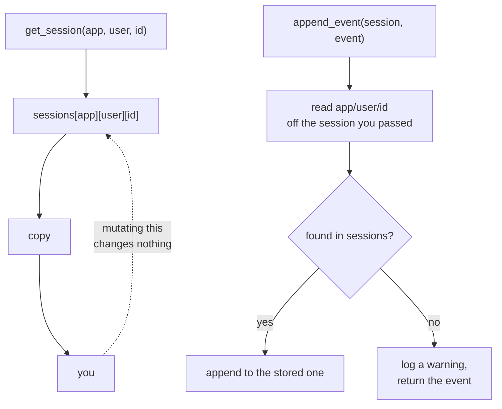

# 3.2 — Three drawers deep

## One-line answer

`InMemorySessionService` is three nested dictionaries keyed by app, then user, then session id — it
hands you a **copy** when you read, and it looks the session up **by its address** when you write,
which is why writing to a session it has never heard of produces a log warning and nothing else.

---

## The story

An office has a steel filing cabinet with four drawers.

The top drawer is labelled *Sales*. The next one, *Purchases*. Inside the Sales drawer are hanging
folders, one per customer, and inside each folder are sheets, one per order.

Ask for the third order from the customer named Verma, and the clerk goes: Sales drawer → Verma
folder → third sheet. Three steps, in that order, and each step narrows what is possible. He cannot
go straight to the sheet, because there are four sheets called "third order" in that drawer and they
belong to different people.

Two habits of that office are the whole part.

**When you ask to see something, he photocopies it.** You get a copy at your desk. Scribble on it all
you like — the original is still in the folder, unmarked. That is deliberate: a document that leaves
the cabinet and comes back changed is a document nobody can trust.

**When you hand something in to be filed, he does not put it wherever you say.** He reads the
customer name and the order number off the top of the sheet and goes and finds the right folder
himself. That is also deliberate, and it has a consequence: if the name on your sheet is a customer
who does not exist, he does not file it and he does not chase you across the office. He puts it on a
pile and mentions it, once, to nobody in particular.

Your sheet is gone. Nothing broke. Somebody said something and you were not listening.

---

## The idea in plain language

`InMemorySessionService` is the simplest thing that satisfies the interface from
[3.1](3.1-the-tap-and-the-pipe.md), and reading it is worth twenty minutes because everything it does
is visible.

Its whole storage is three attributes:

| Attribute | Shape | Holds |
| --- | --- | --- |
| `sessions` | `{app_name: {user_id: {session_id: Session}}}` | the conversations |
| `user_state` | `{app_name: {user_id: {key: value}}}` | `user:`-prefixed state, shared across a user's sessions |
| `app_state` | `{app_name: {key: value}}` | `app:`-prefixed state, shared across everybody |

The first is the filing cabinet: drawer, folder, sheet — which is
[1.2](../01-the-session/1.2-three-parts-to-one-key.md)'s three-part key, made literal. Now you can
see why a wrong `app_name` returns `None` rather than a near miss: the lookup opened a drawer that
does not exist and stopped.

The other two are where the prefixed keys from
[1.3](../01-the-session/1.3-the-register-and-the-key-board.md) went. Day 17 teaches them; today they
explain a shape you have already seen in your own output.

Two behaviours matter more than the shape, and both come from the photocopy habit.

**Reading gives you a copy.** `get_session` copies the session before returning it. Change what you
get back and you have changed nothing that anybody else can see. This is the same rule adk.dev states
for the persistent services — *"changes made this way will likely NOT be saved"* — and here it is
stricter, because the copy means the change is not even visible in your own process.

**Writing is by address, not by object.** `append_event(session, event)` reads `app_name`, `user_id`
and `id` off the session you passed and goes and finds the stored one. So handing it a copy works
perfectly, which is convenient. And handing it a session whose address matches nothing does **not**
raise:

```text
WARNING:google_adk.google.adk.sessions.in_memory_session_service:Failed to append event to
session made-up: app_name sutra not in sessions
```

A warning, and the event is returned to you unchanged as though it had been stored. That is one line
in a log, in a library logger nobody has configured, on the way past.

Finally, the sentence in the class's own docstring that is easy to skim:

> *"It is not suitable for multi-threaded production environments. Use it for testing and development
> only."*

That is not boilerplate modesty. There is no locking on `sessions`, so two coroutines appending to the
same session interleave, and [4.2](../04-what-in-memory-means/4.2-two-counters-two-notebooks.md) is
what that means when you run more than one worker.

---

## Why Sutra needs it

**Day 17** is the state deep dive, and the `user_state` and `app_state` dictionaries above are the
mechanism it explains. Having seen the three stores makes the prefixes a routing rule rather than
magic.

**Day 23** is testing agents, where this service is the right tool and not a compromise: it needs
nothing, it is fast, and its contents are inspectable from the test.

**Day 86** is the swap. Everything in this part that is *not* in the interface — `sessions`,
`user_state`, `app_state`, the copy-on-read, the silent append — is a property of this
implementation and is gone that day.

**Day 92**, the pre-publication security review, will ask where conversation data lives. Today the
honest answer is "in the process, and nowhere else", which is both the safest possible answer and the
least useful one.

---

## The mechanism

Open the drawers and look:

```python
# lab/drawers.py - the three dictionaries, and the two behaviours that follow.
import asyncio
import logging

logging.basicConfig(level=logging.WARNING, format="%(levelname)s:%(name)s:%(message)s")

from google.adk.events import Event
from google.adk.sessions import InMemorySessionService, Session


async def main() -> None:
    service = InMemorySessionService()
    session = await service.create_session(
        app_name="sutra",
        user_id="local",
        state={"stage": "intake", "user:locale": "en-IN", "app:desk_version": "0.1.0"},
    )
    await service.append_event(session, Event(author="user", invocation_id="run-1"))

    print(
        "sessions  :",
        {a: {u: list(s) for u, s in users.items()} for a, users in service.sessions.items()},
    )
    print("user_state:", service.user_state)
    print("app_state :", service.app_state)
    print()

    print("--- reading gives you a copy ---")
    fetched = await service.get_session(app_name="sutra", user_id="local", session_id=session.id)
    print("same object as the store?", fetched is service.sessions["sutra"]["local"][session.id])
    fetched.state["sneaky"] = True
    again = await service.get_session(app_name="sutra", user_id="local", session_id=session.id)
    print("state after mutating the copy:", again.state)
    print()

    print("--- writing is by address ---")
    orphan = Session(id="made-up", app_name="sutra", user_id="local")
    returned = await service.append_event(orphan, Event(author="a", invocation_id="run-2"))
    print("append returned :", type(returned).__name__)
    print("orphan events   :", len(orphan.events))
    print("did it raise?   : no")


asyncio.run(main())
```

**Line by line:**

- `logging.basicConfig(...)` before the ADK import — the same ordering as
  [Day 7, part 4.1](../../../day-07-events-and-streaming/parts/04-the-brakes/4.1-the-meter-that-cuts-off.md),
  and for the same reason: the whole second half of this script is a warning you will otherwise not
  see. In real code you configure logging in an entry point rather than mid-file.
- The dictionary comprehension around `service.sessions` — printing the raw structure would dump
  three full `Session` objects and bury the shape. Replacing the innermost dictionary with
  `list(s)` shows the **keys**, which is what the drawer metaphor is about.
- `service.user_state` and `service.app_state` printed alongside — so the split from
  [1.3](../01-the-session/1.3-the-register-and-the-key-board.md) is visible in its own place rather
  than merged.
- `fetched is service.sessions[...]` — an identity check, not equality. `is` is the only way to ask
  "is this the same object", and the answer being `False` is the copy behaviour.
- `fetched.state["sneaky"] = True` followed by a **second** `get_session` — because checking `fetched`
  again would prove nothing. Going back to the store is the only honest test.
- `Session(id="made-up", app_name="sutra", user_id="local")` — a session object built directly rather
  than through `create_session`, which is legal: `Session` is an ordinary Pydantic model. Nothing
  stops you making one that corresponds to nothing.
- `print("did it raise?   : no")` — a line that states a negative, because the absence of an
  exception is the finding and an absence is easy to read past.

The output:

```text
WARNING:google_adk.google.adk.sessions.in_memory_session_service:Failed to append event to session made-up: session_id made-up not in sessions[app_name][user_id]
sessions  : {'sutra': {'local': ['309e8bbe-f0b1-4986-af04-51164f21a698']}}
user_state: {'sutra': {'local': {'locale': 'en-IN'}}}
app_state : {'sutra': {'desk_version': '0.1.0'}}

--- reading gives you a copy ---
same object as the store? False
state after mutating the copy: {'stage': 'intake', 'app:desk_version': '0.1.0', 'user:locale': 'en-IN'}

--- writing is by address ---
append returned : Event
orphan events   : 0
did it raise?   : no
```

Three things.

**`sneaky` is not in the state.** The copy took it and the copy is gone.

**The warning is printed at the very top**, above output from lines that ran long before it. Logging
goes to standard error and writes immediately; `print` goes to standard output and is buffered when
that is not a terminal, so the two streams arrive in an order that has nothing to do with when things
happened. In a terminal that is mildly annoying. In a service, where the warning goes to a log file
and the output goes to a response, it means the warning and the thing it is about are never seen
together by anybody — which is most of why this failure is so easy to miss.

That is also the same mechanism as
[Day 7, part 2.1](../../../day-07-events-and-streaming/parts/02-the-stream/2.1-the-number-read-out-loud.md)'s
un-streamed demo. Buffering shows up in three different disguises this week.

**`append returned : Event`, `orphan events : 0`.** The method did what its signature promises — it
returns an `Event` — and stored nothing. From the call site there is no difference between this and
success.



---

## When it breaks

**💥 The event that was never stored.**

```text
WARNING:google_adk.google.adk.sessions.in_memory_session_service:Failed to append event to
session 8f2c...: user_id someone_else not in sessions[app_name]
```

The whole failure. No exception, no return value that differs from success. It happens when the
session you are appending to was built by hand, or came from a different service instance, or has an
address that has drifted — which is [5.1](../05-failure-lab/5.1-the-name-called-in-the-waiting-room.md).
If events are missing and nothing failed, **look at your log for this string** before anything else.

**💥 The change to a fetched session.**

```python
found = await service.get_session(...)
found.state["priority"] = "high"
```

Covered in [1.1](../01-the-session/1.1-a-conversation-with-an-address.md) and worth repeating with the
mechanism now visible: `found` is a photocopy. On the persistent services the same code fails
differently — the object may be live in your process and simply never written — so the *symptom*
changes between implementations while the *rule* does not. Changes travel in events.

**💥 Reaching into `service.sessions` from product code.**

It is a public attribute and it works, which is exactly the problem. Any code that touches it is
pinned to this implementation and will break on Day 86 with an `AttributeError`, at the call site
rather than at the swap. The lab may do it. `sutra/` may not.

---

## In production

**What a professional writes instead of the teaching version** is nothing — you do not write this
class, you choose it or you do not. What a professional *does* is read it once, which takes a few
minutes and is what makes the rest of this part possible. The general habit is worth naming: **when a
library gives you a "simple" implementation of an interface, read it.** It is short by design, it
tells you exactly what the interface guarantees and what it does not, and it is the reference you
compare the real implementation against.

**What degrades at scale** is everything, immediately, and that is fine because this class is not
meant to scale. The honest list: no locking, so concurrent appends interleave; no bound, so memory
grows with every conversation until the process is restarted; no sharing, so a second process sees
nothing. Each of those is a deliberate omission in exchange for having no dependencies at all.

**The failure that only shows with real traffic** is the silent append under concurrency. Two
coroutines call `append_event` for the same session at the same moment; both read the storage
session, both append. In CPython the list append itself is safe, so you do not get a crash — you get
a transcript in an order neither run intended, which the model then reads next turn. Nothing in this
class will tell you it happened.

**The review comment a senior engineer leaves:** *"You're reading `service.sessions` directly. That's
this implementation's internals — it goes away on Day 86 and takes this function with it. And the
event this handler appends can silently vanish if the session address is wrong; check the return, or
better, don't build `Session` objects by hand."*

**The interview question:** *"what's actually inside an in-memory session store, and what does that
cost you?"* The answer that shows you have read one: "Three nested dictionaries — app, user, session
— which is the same three-part key the API exposes, so a wrong app name means you opened a drawer
that isn't there and the lookup just stops. Reads give you a copy, so mutating what you fetched
changes nothing, and writes are addressed rather than by object, which means appending to a session
the store has never heard of logs a warning and silently does nothing. The costs are the ones it
admits to: no locking, no persistence, no sharing between processes. It's the right choice for tests
and development precisely because it has no dependencies, and the mistake is letting code reach into
its internals, because that's the part the interface never promised."

---

## Check yourself

```bash
uv run python days/day-08-sessions-and-services/lab/drawers.py
```

**Answer out loud, without scrolling up:**

> Name the three dictionaries and say what each is keyed by. Then say what happens when you
> `append_event` to a session the store has never heard of, and why that is harder to notice than an
> exception.

---

**Next:** [3.3 — Ctrl+F is not understanding](3.3-ctrl-f-is-not-understanding.md)
