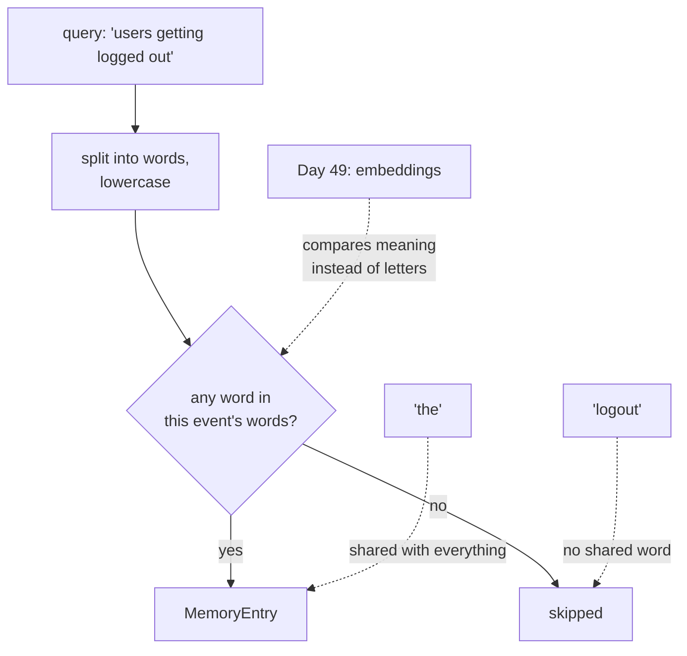

# 3.3 — Ctrl+F is not understanding

## One-line answer

`InMemoryMemoryService` finds a past conversation by **matching words**, not meaning — its own
docstring says so — which makes it a perfectly good way to learn the shape of a memory service and a
completely inadequate way to answer "has anything like this happened before?"

---

## The story

You have a forty-page policy document open and you need to know whether it says anything about
working from home.

You press Ctrl+F and type *work from home*. Nothing.

You try *remote*. Two results, both in a footnote about remote servers.

You give up and ask a colleague who read the thing last month. She says, "yes — it's under
'flexible arrangements', page nineteen. It doesn't use the words you were searching for."

Ctrl+F did not fail. It did exactly what it promises: it finds the letters you typed. The document
simply expresses the idea in different letters, and Ctrl+F has no way to know that *flexible
arrangements* and *working from home* are the same subject, because it does not know what a subject
is.

Your colleague has something Ctrl+F does not, and it is worth naming precisely. It is not that she is
cleverer. It is that she **read the document and formed an idea of what each part was about**, and
she can compare your question to those ideas rather than to the text.

Both are useful. Ctrl+F is instant, free, and exactly right when you know the word — a policy number,
a name, an error code. The colleague is slow, occasionally wrong, and the only one of the two who can
answer the question you actually asked.

The memory service you get for free today is Ctrl+F.

---

## The idea in plain language

**Memory**, in ADK, means something specific and narrower than the everyday word: the ability to
search **across sessions**. The session from [1.1](../01-the-session/1.1-a-conversation-with-an-address.md)
already remembers the current conversation. Memory is for the other ones.

The interface is `BaseMemoryService`, and it is small:

| Method | What it does |
| --- | --- |
| `add_session_to_memory(session)` | put a finished conversation in |
| `add_events_to_memory(...)` | put some events in without a whole session |
| `search_memory(app_name, user_id, query)` | ask for anything relevant |

`search_memory` returns a `SearchMemoryResponse` holding `memories`, a list of `MemoryEntry` objects.
Each entry carries the `content` of one matching event, its `author`, and a `timestamp` — a string,
formatted for a model to read, rather than the float an event carries.

Note the second argument on the search: **`user_id`**. Memory is scoped per user, so one person's
history cannot be searched from another's session. That is the same boundary as
[1.2](../01-the-session/1.2-three-parts-to-one-key.md)'s three-part key, and it is the whole of the
privacy story until Phase 7 builds a real one.

Now the implementation you get today. Its docstring says:

> *"An in-memory memory service for prototyping purpose only. Uses keyword matching instead of
> semantic search."*

Which is exactly what it does. It splits your query into words, splits each stored event's text into
words, lowercases both, and returns the event if **any** query word appears in it. That is the whole
algorithm — roughly a dozen lines you can read.

Three consequences, and each of them is a real limit rather than a rough edge:

**It cannot match meaning.** Search for `three` and an event containing `3` does not match. Search
for `logout` and an event saying `signed out` does not match. There is no relationship between words
that Ctrl+F does not have.

**`any` is a very low bar.** One shared word is a match. Search for *the login problem* and every
event containing *the* comes back, which on a real transcript is all of them.

**There is no ranking.** The list comes back in whatever order the events were stored. A perfect
match and an accidental one are adjacent and indistinguishable.

None of that makes the class useless. It makes it a **shape**: the same three methods a real memory
service exposes, so the code you write around it on Day 46 does not change when the searching gets
good. Phase 7 is where it gets good — Day 49 is the retrieval and embeddings day, closing AG-33 —
and the honest framing is that today you are learning the socket, not the bulb.

---

## Why Sutra needs it

**Phase 7, Days 46 to 52**, is the memory and retrieval phase, and its gate is stated in the plan as
*"has anything like this happened before?" answered at $0*. That question is this service's job, and
the reason it takes a phase rather than a day is precisely the gap this part is about.

**Day 49** closes AG-33 — retrieval and embeddings, one honest RAG day, including *when RAG is the
wrong tool*. The comparison it makes only lands if you have watched keyword search fail on something
obvious first.

**Day 46** is where Sutra decides what goes into memory and when. `add_session_to_memory` takes a
whole session, so the decision is "which conversations are worth remembering", and it is a product
decision rather than a technical one.

**Day 92**'s security review will ask what is in memory and who can search it. `user_id` on
`search_memory` is the answer today, and knowing that is the entire mechanism keeps you honest about
how thin it is.

---

## The mechanism

The failure, on purpose, in a script that costs nothing:

```python
# lab/keyword_memory.py - what the free memory service can and cannot find.
import asyncio

from google.adk.events import Event
from google.adk.memory import InMemoryMemoryService
from google.adk.sessions import InMemorySessionService
from google.genai import types

PAST = [
    ("user", "ticket 4521: users keep getting logged out after 3 minutes"),
    ("sutra_desk", "That looks like the session token expiring early."),
]


async def main() -> None:
    sessions = InMemorySessionService()
    memory = InMemoryMemoryService()

    old = await sessions.create_session(app_name="sutra", user_id="local")
    for author, text in PAST:
        await sessions.append_event(
            old,
            Event(
                author=author,
                invocation_id="run-old",
                content=types.Content(
                    role="user" if author == "user" else "model",
                    parts=[types.Part(text=text)],
                ),
            ),
        )
    finished = await sessions.get_session(app_name="sutra", user_id="local", session_id=old.id)
    await memory.add_session_to_memory(finished)
    print("remembered a conversation of", len(finished.events), "events")
    print()

    for query in ["4521", "logged", "logout", "signed out", "3", "three", "the"]:
        found = await memory.search_memory(app_name="sutra", user_id="local", query=query)
        print(f"  {query!r:<12} -> {len(found.memories)} memories")

    print()
    print("--- and from another user's session ---")
    other = await memory.search_memory(app_name="sutra", user_id="someone_else", query="4521")
    print(f"  {'4521'!r:<12} -> {len(other.memories)} memories")


asyncio.run(main())
```

**Line by line:**

- Two services built, not one — memory and sessions are separate things with separate stores, and a
  conversation is put into memory **deliberately** rather than automatically. That is worth seeing:
  nothing remembers anything until somebody decides it should.
- `sessions.get_session(...)` before `add_session_to_memory` — passing the fetched session rather than
  the one you were holding, because [3.2](3.2-three-drawers-deep.md) established that the stored copy
  is the authoritative one. Passing a stale local copy would remember a stale conversation.
- The query list, chosen to fail in four different ways rather than to succeed: an exact identifier,
  an exact word, a *related* word, a *synonymous phrase*, a digit, its English name, and a stop word.
- `"logout"` against text containing `"logged out"` — no shared whole word, so no match. This is the
  single most instructive line in the script, because *logout* and *logged out* are the same thing to
  every human who has ever read a support ticket.
- `"signed out"` immediately after it — a two-word query, and the reason it is next to `"logout"` is
  that it produces the opposite result for a reason that is not an improvement. Watch what it matches
  on before you decide the service understood you.
- `"the"` — the low-bar demonstration. One shared word is enough, and *the* is in nearly everything.
- The last block searching as `someone_else` — the per-user boundary, checked rather than assumed.
- No ranking anywhere in the output, because there is none to print.

The output:

```text
remembered a conversation of 2 events

  '4521'       -> 1 memories
  'logged'     -> 1 memories
  'logout'     -> 0 memories
  'signed out' -> 1 memories
  '3'          -> 1 memories
  'three'      -> 0 memories
  'the'        -> 1 memories

--- and from another user's session ---
  '4521'       -> 0 memories
```

Four lines are worth reading closely, and one of them is a trap.

**`logged` finds it and `logout` does not.** Same idea, different letters, and that is the whole
limitation in two lines.

**`3` finds it and `three` does not.** The digit is a word to this algorithm and its English name is
a different word.

**`signed out` finds it — and not for the reason you want.** Nothing in the stored text says "signed
out". What matched is the word **`out`**, which the query happens to share with "logged out". So the
right answer arrived by coincidence, and the same query would match a conversation about a power cut,
a sold-out item or an out-of-office reply. A false positive that looks like a success is worse than a
miss, because you will believe it.

**`the` finds one of the two events**, because only the agent's reply contains that word. Add a
handful more conversations and it finds all of them, which is the same uselessness pointing the other
way.

Meanwhile `4521` — an exact identifier — works perfectly, and that is the honest half of this
service. **Keyword search is genuinely good at identifiers**, which is not nothing for a support
desk: ticket numbers, error codes, order references. Day 49's job is not to replace it but to add the
other half.



---

## When it breaks

**💥 The search that found nothing, correctly.**

```text
  'logout'     -> 0 memories
```

There is no error and nothing is misconfigured. The past conversation is in memory, it is about
exactly this, and the words do not overlap. The failure mode to internalise is that **a keyword
search returning nothing is not evidence that nothing is there** — and if an agent is wired to say
"I have no record of a similar issue" on an empty result, it has just made a confident false
statement, which is Principle 10's territory.

**💥 The search that found everything.**

```text
  'the'        -> 1 memories
  'signed out' -> 1 memories
```

One stored conversation makes these look harmless. Feed a whole user question in as the query — which
is the obvious thing to do — and every stop word in it matches every event you have ever stored. The
result is not a search, it is a dump, and if it goes into a prompt it is a very expensive one. The
second line is the nastier half: it matched, so it looks like it worked, and what it matched on was
the word *out*.

**💥 Memory that was never written to.**

`add_session_to_memory` is a call somebody has to make. Nothing in the runner does it for you. A
memory service that has never been written to returns zero results for every query, forever, and
looks exactly like a memory service that has nothing relevant — which is the same empty list, from a
completely different cause.

---

## In production

**What a professional writes instead of the teaching version** is a search layer that never lets an
empty result become a confident answer. The agent is told, in its instruction, that an empty search
means *nothing was found by this method*, not *this has never happened* — which is
[Day 6, part 1.2](../../../day-06-instructions-and-personas/parts/01-writing-the-handbook/1.2-six-sections-of-a-handbook.md)'s
honesty section doing real work. The retrieval layer itself gets replaced on Day 49; the instruction
around it does not.

**What degrades at scale** is the cost of the naive query. Keyword search over a hundred conversations
is instant. Over a hundred thousand it is a full scan, in Python, holding a lock, on every search —
because this implementation walks every stored event on every query. It is not indexed, and nothing
in the interface says it should be, so a real implementation has to do that work behind the same
three methods.

**The failure that only shows with real traffic** is memory poisoning the answer. Search returns a
past conversation that shares a word and nothing else; it goes into the prompt as context; the model
treats it as relevant, because it arrived in a slot labelled "relevant past conversations", and
answers a different customer's question. Nothing errors, the trace looks fine, and the answer is
confidently wrong in a way that is very hard to attribute. This is why Day 49 spends time on *when
retrieval is the wrong tool* rather than only on making it better.

**The review comment a senior engineer leaves:** *"This passes the user's whole message to
`search_memory`. Every stop word in it matches everything we've ever stored, so we're pasting the
entire history into the prompt. Extract identifiers and search for those — this implementation is
good at exact tokens and useless at meaning, and we shouldn't pretend otherwise until Day 49."*

**The interview question:** *"how would you give an agent memory across conversations?"* The answer
that shows you have thought about it rather than reached for a library: "Behind an interface with
three operations — add a conversation, add some events, search — so the storage can change without
the agent changing. The framework's development implementation does keyword matching, and it's worth
being blunt about what that means: 'logout' doesn't match 'logged out', a digit doesn't match its
English name, and any stop word in the query matches everything. It's genuinely good at exact
identifiers, which for a support desk is ticket numbers and error codes, so it isn't nothing. The
part I'd get right before improving the search is what an empty result *means* — if the agent treats
'found nothing' as 'never happened', you've built something that lies confidently, and no amount of
better retrieval fixes that."

---

## Check yourself

```bash
uv run python days/day-08-sessions-and-services/lab/keyword_memory.py
```

Add a query of your own that you are confident *should* match and watch it fail. Write down the two
words that would have had to be the same.

**Answer out loud, without scrolling up:**

> Say what `InMemoryMemoryService` compares when it searches, and give two searches that fail for
> opposite reasons. Then say what an empty result does and does not tell you.

---

**Next:** [3.4 — The cloakroom, and the one you were not given](3.4-the-cloakroom-and-the-one-you-were-not-given.md)
