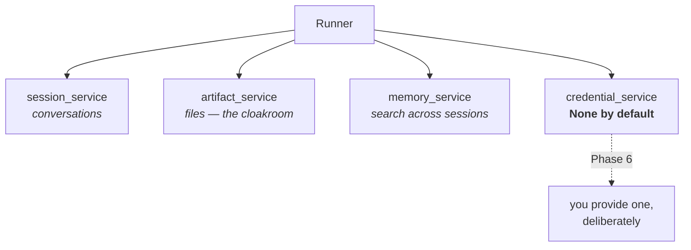

# 3.4 — The cloakroom, and the one you were not given

## One-line answer

`InMemoryArtifactService` is the place files live between turns — versioned, addressed like a session
and namespaced by `user:` when they should outlive one — and the **credential** service is the fourth
one ADK has and does not give you by default, which is a decision rather than an oversight.

---

## The story

You arrive at a wedding hall with a bag. Somebody's laptop bag, actually, that you were asked to
carry.

By the door there is a counter. You hand the bag over, they write a number on a paper slip, tear it
in half, and give you one half. Your hands are free.

The slip is not the bag. It is small, it fits in a pocket, you can lose it in a way you could not
lose a laptop bag. But it is the only thing standing between you and the bag, and everybody in the
hall understands that arrangement without anybody explaining it.

Now the other half of the story, which is the part this page is actually about.

You also have your car key. Nobody offered to take that. There is no counter for keys, and if you had
asked they would have looked at you strangely. A cloakroom takes coats and bags — things you want to
be rid of for an evening and get back unchanged. A key is not that. A key **opens something**, and
handing it to a stranger at a door is a completely different act with completely different
consequences, even though it is physically smaller than the bag.

So you keep the key in your pocket. Not because the hall forgot to build a counter for it, but
because a counter for keys would need a different design, a different level of trust, and a different
conversation.

ADK gives you a cloakroom by default and does not give you a key counter. That asymmetry is today's
part.

---

## The idea in plain language

Two of ADK's four services, and the second one is defined by its absence.

### Artifacts — the cloakroom

An **artifact** is a file that belongs to a conversation: an uploaded log file, a generated report, a
screenshot. It does not go in `state`, because state holds small values and this could be five
megabytes, and it does not go in an event's content, because that would be re-sent to the model on
every turn.

`BaseArtifactService` handles them, and `InMemoryArtifactService` is today's implementation. The
shape:

> `save_artifact(*, app_name, user_id, filename, artifact, session_id=None, custom_metadata=None)`

Four things about it are worth knowing today, and Day 18 does the rest:

**It returns a version number**, an integer starting at `0`. Save the same filename again and you get
`1`. Nothing is overwritten — the same append-only instinct as the event list, applied to files.

**The address is the same three-part key** from [1.2](../01-the-session/1.2-three-parts-to-one-key.md),
plus the filename. A file belongs to a conversation the way an event does.

**A filename beginning `user:` escapes the session.** `user:signature.png` is stored under the user
rather than the session, so it survives into their next conversation. The prefix is doing the same
routing job as the `user:` prefix on state keys in
[1.3](../01-the-session/1.3-the-register-and-the-key-board.md) — which is a pleasant consistency once
you notice it.

**The artifact itself is a `types.Part`** — the same `google.genai` type that carries text and
function calls inside an event. ADK did not invent a file type either.

### Credentials — the counter that is not there

`BaseCredentialService` is the fourth service. It holds the tokens a tool needs to reach something
that requires authentication — the OAuth token for a calendar, the key for an internal API.

`InMemoryCredentialService` exists. And when you build a runner, **you do not get one**:

> `credential_service: Optional[BaseCredentialService] = None`

`InMemoryRunner`, which fills in the other three for you ([3.5](3.5-the-furnished-flat.md)), leaves
this one empty.

That is worth reading as a design statement rather than an omission. Sessions, artifacts and memory
are storage: losing them is annoying. Credentials are **access**: mishandling them is a security
incident. So the framework does not quietly hand you a default place to put secrets — you have to ask
for one, and asking is a moment where somebody might think about it.

It is the same instinct as Principle 9, *secrets never touch git*, one level up: **secrets do not get
a convenient default.**

You will meet the credential service properly in Phase 6, when Sutra's MCP servers need
authentication. Today it is here so that the fourth slot on the runner is not a mystery. 🅿️

---

## Why Sutra needs it

**Day 18** is the artifacts day, ADK-21 — files that survive turns — and it is much shorter if the
version number, the `user:` prefix and the `Part` type are already familiar.

**Day 16** adds code execution, and code execution produces files. Where they go is this service.

**Phase 6, Days 39 to 45**, is MCP in production, where Sutra's servers need credentials and the
fourth service stops being parked.

**Day 92**'s security review will ask where files and credentials live. "Artifacts in memory,
credentials nowhere because we have not needed them yet" is a good answer today and will not be one
in Phase 6.

---

## The mechanism

The cloakroom, used:

```python
# lab/cloakroom.py - files that belong to a conversation, and their versions.
import asyncio

from google.adk.artifacts import InMemoryArtifactService
from google.genai import types

APP, USER, SESSION = "sutra", "local", "session-1"


async def main() -> None:
    artifacts = InMemoryArtifactService()

    first = await artifacts.save_artifact(
        app_name=APP,
        user_id=USER,
        session_id=SESSION,
        filename="triage-notes.txt",
        artifact=types.Part(text="ticket 4521: token expires early"),
    )
    second = await artifacts.save_artifact(
        app_name=APP,
        user_id=USER,
        session_id=SESSION,
        filename="triage-notes.txt",
        artifact=types.Part(text="ticket 4521: token expires early; priority high"),
    )
    print("first save  -> version", first)
    print("second save -> version", second)

    keys = await artifacts.list_artifact_keys(app_name=APP, user_id=USER, session_id=SESSION)
    print("filenames in this session:", keys)

    latest = await artifacts.load_artifact(
        app_name=APP, user_id=USER, session_id=SESSION, filename="triage-notes.txt"
    )
    older = await artifacts.load_artifact(
        app_name=APP, user_id=USER, session_id=SESSION, filename="triage-notes.txt", version=0
    )
    print("latest      :", latest.text)
    print("version 0   :", older.text)

    print()
    print("--- a file that outlives the session ---")
    await artifacts.save_artifact(
        app_name=APP,
        user_id=USER,
        session_id=SESSION,
        filename="user:signature.png",
        artifact=types.Part(text="(pretend this is an image)"),
    )
    other_session = await artifacts.list_artifact_keys(
        app_name=APP, user_id=USER, session_id="a-different-session"
    )
    print("visible from another session:", other_session)


asyncio.run(main())
```

**Line by line:**

- `APP, USER, SESSION = ...` on one line — three constants that are the address, grouped so the
  repetition below reads as one idea rather than three.
- `save_artifact(...)` with every argument keyword-only, including `session_id` — which is
  **optional** in the signature and required in practice for anything not `user:`-prefixed. Omitting
  it for a session-scoped file raises rather than guessing, which is the right trade.
- `artifact=types.Part(text=...)` — text standing in for a file, because a real image would make the
  script depend on a file you do not have. A `Part` can carry bytes through `inline_data`; the point
  here is the type, not the payload.
- The **same filename twice** — the version demonstration. The second save does not overwrite; it
  becomes version 1, and version 0 is still retrievable.
- `list_artifact_keys(...)` — filenames, not versions. There is a separate call for versions, and
  knowing which one you want saves a confused minute.
- `load_artifact(..., version=0)` — reaching back to the earlier version explicitly. Without
  `version` you get the latest, which is the sane default and the one that hides the versioning from
  you until you need it.
- `filename="user:signature.png"` — the prefix that changes where the file goes. Note it is on the
  **filename**, not a separate flag: the routing is in the name, exactly as with state keys.
- The final `list_artifact_keys` under a **different** `session_id` — proving the `user:` file is
  visible there and the session-scoped one is not.

The output:

```text
first save  -> version 0
second save -> version 1
filenames in this session: ['triage-notes.txt']
latest      : ticket 4521: token expires early; priority high
version 0   : ticket 4521: token expires early

--- a file that outlives the session ---
visible from another session: ['user:signature.png']
```

The last line is the one to look at twice. The session-scoped `triage-notes.txt` is invisible from
another conversation and the `user:`-prefixed file is not — from a store that was never told about a
second session, because there is no second session. The prefix is the entire mechanism.

And the fourth service, or its absence:

```python
# lab/no_credentials.py - what a runner gives you, and what it does not.
from google.adk.agents import LlmAgent
from google.adk.runners import InMemoryRunner

runner = InMemoryRunner(agent=LlmAgent(name="probe", model="gemini-3.7-flash", instruction="x"))

for name in ("session_service", "artifact_service", "memory_service", "credential_service"):
    service = getattr(runner, name)
    print(f"{name:<20}: {type(service).__name__ if service else 'None'}")
```

**Line by line:**

- `InMemoryRunner(agent=...)` — the convenience constructor that
  [3.5](3.5-the-furnished-flat.md) is about. Used here purely because it is the shortest way to get a
  runner with defaults filled in.
- `getattr(runner, name)` in a loop rather than four separate prints — because the finding is the
  *comparison* between the four, and a loop puts them in a column where the odd one out is obvious.
- `type(service).__name__ if service else 'None'` — the `if` matters: three of these are objects and
  one is `None`, and calling `type(None).__name__` would print `NoneType`, which reads like a class
  rather than an absence.
- No model call anywhere. Building a runner and reading its attributes costs nothing.

```text
session_service     : InMemorySessionService
artifact_service    : InMemoryArtifactService
memory_service      : InMemoryMemoryService
credential_service  : None
```

Three filled in, one left empty, on purpose.



---

## When it breaks

**💥 The session-scoped file with no session.**

```text
InputValidationError: Session ID must be provided for session-scoped artifacts.
```

Leave `session_id` off a filename that does not start with `user:` and this is what you get. It is a
good error: it names the rule rather than the missing argument, so it tells you what the two cases
are rather than just which one you failed.

**💥 The tool that wanted a credential.**

There is no error to show, because the shape of the failure depends on the tool. What you will meet
in Phase 6 is a tool asking for authentication through
`event.actions.requested_auth_configs` — the field you saw in
[Day 7, part 1.2](../../../day-07-events-and-streaming/parts/01-the-event-object/1.2-the-fields-that-were-renamed.md)'s
list and had no use for — and nothing on the runner able to answer it. Recognising *why* that field
exists is worth more today than a traceback you cannot yet produce.

**💥 Artifacts treated as state.**

Not an error, a bill. A five-megabyte log file put into `state` is written into an event, stored
forever, and — depending on how it is used — re-sent to the model. The artifact service exists so
that the conversation carries a **filename** and the bytes live elsewhere, which is the same
identifiers-not-payloads rule as
[Day 7, part 1.4](../../../day-07-events-and-streaming/parts/01-the-event-object/1.4-the-half-that-is-not-text.md)'s
production section.

---

## In production

**What a professional writes instead of the teaching version** is code that puts the artifact's
**name and version** into state and never the bytes. That pair is small, serialisable, meaningful in
another process, and enough to fetch the file when it is genuinely needed. It is the paper slip
rather than the bag, and the discipline is the same one as holding a session id rather than a session
object.

**What degrades at scale** is that `InMemoryArtifactService` keeps every version of every file in the
process, forever. Versioning is a feature until somebody writes a file on every turn, at which point
you have twenty copies of a growing document in memory and nothing prunes them. Real artifact stores
are object storage with a lifecycle policy, and the lifecycle policy is not optional — it is the part
that stops the feature from being a leak.

**The failure that only shows with real traffic** is what customers upload. An artifact store attached
to a support desk receives whatever people attach to tickets: screenshots containing other people's
data, logs containing credentials, documents that should never have left their company. It arrives
without anybody choosing to collect it, and it is stored under the same append-only instinct as
everything else. **What you retain and for how long is a decision that has to be made before the
store exists**, not after, and it is the same conversation as
[Day 7, part 6.1](../../../day-07-events-and-streaming/parts/06-reading-a-run/6.1-the-camera-you-already-installed.md)'s
about transcripts, with sharper edges.

**The review comment a senior engineer leaves:** *"Don't put the file contents in state — save the
artifact and keep the name and version. And there's no retention on this store: every version of
every upload stays until the process dies, which is fine today and is a compliance question the week
we deploy."*

**The interview question:** *"where do files go in an agent system?"* The answer that shows you have
built one: "Into an artifact store, addressed the same way a conversation is, with the conversation
carrying only the filename and version. They don't go in state, because state is small values that
get written on every event, and they don't go in the message history, because that gets re-sent to
the model every turn. The two things I'd want decided up front are retention — the store keeps every
version forever unless somebody says otherwise — and what we're prepared to receive, because a
support desk's artifact store fills up with whatever customers attach, and nobody chose to collect
any of it."

---

## Check yourself

```bash
uv run python days/day-08-sessions-and-services/lab/cloakroom.py
uv run python days/day-08-sessions-and-services/lab/no_credentials.py
```

Then remove `session_id` from the first `save_artifact` call and read the error.

**Answer out loud, without scrolling up:**

> Say what an artifact service holds and why that is neither state nor an event. Then say which of
> ADK's four services a runner leaves empty by default, and give the reason that is a decision rather
> than an oversight.

---

**Next:** [3.5 — The furnished flat](3.5-the-furnished-flat.md)
