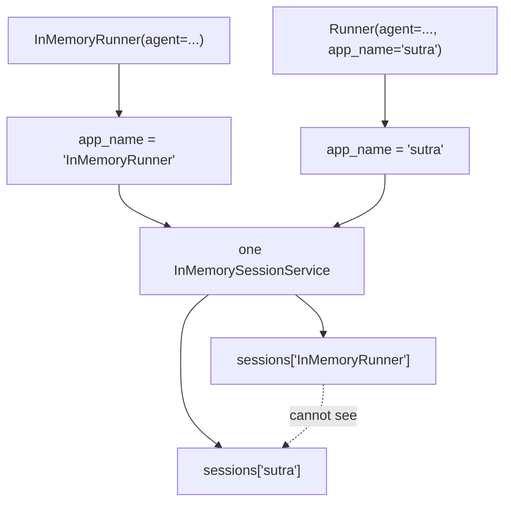

# 3.5 — The furnished flat

## One-line answer

`InMemoryRunner` fills in three services and an app name so you can run an agent in one line — which
is exactly right for a test and exactly wrong for anything that has to be found again, because the
app name it chooses is `"InMemoryRunner"` and you did not choose it.

---

## The story

You take a furnished flat because you are starting work on Monday and you cannot spend three weeks
buying furniture.

It is the right decision. There is a bed, a table, a fridge, curtains. You move in with two bags and
you are working on Monday.

By month three you have noticed things. The table is slightly too low to work at. The fridge shelf is
in the wrong place and you cannot move it. The curtains do not quite block the morning light. None of
these is a fault — the flat is fine — they are simply somebody else's choices, made for an average
tenant who is not you.

And there is one that is not a preference. The mattress is bad, and you sleep badly, and you have
been sleeping badly for three months without connecting it to anything, because the mattress came
with the flat and things that came with the flat do not feel like decisions.

**That is the real cost of furnished: not that the choices are wrong, but that they are invisible.**
You never chose the mattress, so you never think about the mattress, so a problem caused by the
mattress gets attributed to work stress.

`InMemoryRunner` is a furnished flat. It is genuinely the right thing to reach for, and every default
it fills in is a choice somebody made that you should be able to name.

---

## The idea in plain language

Everything you have built today has needed four objects: a session service, a runner, an app name and
a user id. `InMemoryRunner` collapses the first three:

> `runner = InMemoryRunner(agent=my_agent)`

And you have a working runner. What it filled in:

| What | With | Where it is taught |
| --- | --- | --- |
| `session_service` | `InMemorySessionService()` | [3.2](3.2-three-drawers-deep.md) |
| `artifact_service` | `InMemoryArtifactService()` | [3.4](3.4-the-cloakroom-and-the-one-you-were-not-given.md) |
| `memory_service` | `InMemoryMemoryService()` | [3.3](3.3-ctrl-f-is-not-understanding.md) |
| `credential_service` | **nothing** | [3.4](3.4-the-cloakroom-and-the-one-you-were-not-given.md) |
| `app_name` | the string `"InMemoryRunner"` | this part |

The last row is the mattress.

`app_name` defaults to the literal string `"InMemoryRunner"`. Not your app's name, not the agent's
name. And from [1.2](../01-the-session/1.2-three-parts-to-one-key.md) you know that `app_name` is one
third of every session address, so:

- sessions created through an `InMemoryRunner` are filed under `"InMemoryRunner"`;
- sessions created through your own `Runner(app_name="sutra", ...)` are filed under `"sutra"`;
- **neither can find the other's**, in the same store, with no error.

You have already met this exact failure once, from a different direction: on
[Day 7, part 6.1](../../../day-07-events-and-streaming/parts/06-reading-a-run/6.1-the-camera-you-already-installed.md)
your `adk web` sessions were under `"sutra.desk"` and your runner's were under `"sutra"`. Three
different components, three different app names, one store. That is not a coincidence — it is what
happens when a name has a convenient default.

There is a second convenience on the same class worth knowing about, because it will save you writing
a script one day. `Runner` has a `run_debug` method: give it a string, or a list of strings, and it
creates a session if needed, sends them, and returns the events. It exists for exactly the situation
where you want to poke an agent and do not want a runner, a service and an async loop to do it. Its
own docstring is clear about the boundary — for custom services, fine-grained event processing, error
recovery or resumability, use `run_async` with proper configuration. 🅿️

**So the rule is not "avoid `InMemoryRunner`".** It is:

> Use it where the session is throwaway. Use an explicit `Runner` where the session has to be found
> again.

A test is the first case. Sutra's actual desk is the second, which is why today's build brief writes
an explicit runner into `sutra/desk/sessions.py` rather than reaching for the convenience.

---

## Why Sutra needs it

**Day 23** is testing agents, and `InMemoryRunner` is the right tool there: a test wants a fresh
everything and throws it away afterwards. Knowing that it is right *there* and wrong in the desk is
the distinction worth having.

**Day 31** is the quality gate, where `./m check` runs the whole suite. Tests that each build four
services by hand are slower to write and no better; tests that use the convenience are shorter and
identical in effect.

**Day 86** is the deployment day. Anything using `InMemoryRunner` in the product path becomes a bug
that day, because there is no way to give it a real session service — the constructor does not take
one.

**Day 84**'s tracing groups spans by app name. An app named `InMemoryRunner` in a dashboard is a
puzzle for whoever is on call.

---

## The mechanism

What the convenience chose, printed:

```python
# lab/furnished.py - what InMemoryRunner fills in, and the one that matters.
import asyncio
from collections.abc import AsyncGenerator

from google.adk.agents import BaseAgent
from google.adk.agents.invocation_context import InvocationContext
from google.adk.events import Event
from google.adk.runners import InMemoryRunner, Runner
from google.adk.sessions import InMemorySessionService
from google.genai import types


class Echo(BaseAgent):
    """One event, so the run is free and the session is real."""

    async def _run_async_impl(self, ctx: InvocationContext) -> AsyncGenerator[Event, None]:
        yield Event(
            author=self.name,
            invocation_id=ctx.invocation_id,
            content=types.Content(role="model", parts=[types.Part(text="ok")]),
        )


async def main() -> None:
    convenient = InMemoryRunner(agent=Echo(name="echo"))
    print("InMemoryRunner filled in:")
    print("  app_name        :", repr(convenient.app_name))
    for name in ("session_service", "artifact_service", "memory_service", "credential_service"):
        service = getattr(convenient, name)
        print(f"  {name:<16}:", type(service).__name__ if service else "None")

    session = await convenient.session_service.create_session(
        app_name=convenient.app_name, user_id="local"
    )
    async for _ in convenient.run_async(
        user_id="local",
        session_id=session.id,
        new_message=types.Content(role="user", parts=[types.Part(text="hi")]),
    ):
        pass

    print()
    print("--- can an explicit runner find that session? ---")
    explicit = Runner(
        agent=Echo(name="echo"),
        app_name="sutra",
        session_service=convenient.session_service,
    )
    found = await explicit.session_service.get_session(
        app_name=explicit.app_name, user_id="local", session_id=session.id
    )
    print("same store, app_name='sutra' ->", type(found).__name__)
    again = await explicit.session_service.get_session(
        app_name="InMemoryRunner", user_id="local", session_id=session.id
    )
    print(
        "same store, the right name  ->", type(again).__name__, "with", len(again.events), "events"
    )


asyncio.run(main())
```

**Line by line:**

- `class Echo(BaseAgent)` — one event, no model, so the whole demonstration is free and the session
  it produces is a real one with real contents.
- `convenient.app_name` printed with `repr` — so the quotes are visible and the string is
  unmistakably a literal rather than something derived from your agent.
- The loop over the four service attributes — the same shape as
  [3.4](3.4-the-cloakroom-and-the-one-you-were-not-given.md)'s script, repeated here because the
  point of this part is the **fifth** row and the four are the context for it.
- `create_session(app_name=convenient.app_name, ...)` — using the runner's own name rather than
  hard-coding one, which is the only correct way to create a session for a runner you did not
  configure. Hard-coding `"sutra"` here is precisely the bug the second half demonstrates.
- `explicit = Runner(..., session_service=convenient.session_service)` — **the same store object**,
  passed to a differently-named runner. This is the control: nothing about storage differs between
  the two lookups, only the name.
- Two `get_session` calls, one with each name — and the outputs differ. That is the whole part in two
  lines.
- `len(again.events)` on the successful one — proving the session is not just present but full, so
  the earlier `None` cannot be explained away as an empty session.

The output:

```text
InMemoryRunner filled in:
  app_name        : 'InMemoryRunner'
  session_service : InMemorySessionService
  artifact_service: InMemoryArtifactService
  memory_service  : InMemoryMemoryService
  credential_service: None

--- can an explicit runner find that session? ---
same store, app_name='sutra' -> NoneType
same store, the right name  -> Session with 2 events
```

One store, one session, two lookups, and the only difference between them is a string somebody never
chose.



---

## When it breaks

**💥 The session that is in the store and cannot be found.**

```text
same store, app_name='sutra' -> NoneType
```

No error, no warning, and the session is right there. This is
[1.2](../01-the-session/1.2-three-parts-to-one-key.md)'s near miss with a specific cause: a default
app name that nobody typed and therefore nobody suspects.

**💥 The runner that cannot take a real store.**

```python
runner = InMemoryRunner(agent=root_agent, session_service=SqliteSessionService("sutra.db"))
```

```text
TypeError: InMemoryRunner.__init__() got an unexpected keyword argument 'session_service'
```

The constructor does not accept one — that is the whole point of the class. Which is fine, and it
means any code path built on `InMemoryRunner` has to be rewritten rather than reconfigured on Day 86.
A convenience you cannot back out of is a decision, not a shortcut.

**💥 `app_name` set on the runner and not on `create_session`.**

```python
runner = InMemoryRunner(agent=root_agent, app_name="sutra")
session = await runner.session_service.create_session(app_name="Sutra", user_id="local")
```

A capital letter. The session is filed under `"Sutra"`, the runner looks under `"sutra"`, and the run
fails with `SessionNotFoundError` — which is
[5.1](../05-failure-lab/5.1-the-name-called-in-the-waiting-room.md), and which at least raises,
unlike the two failures above.

---

## In production

**What a professional writes instead of the teaching version** is an explicit `Runner` everywhere the
session outlives the request, with `app_name` coming from the one module that owns it, and
`InMemoryRunner` confined to tests. The rule of thumb that survives review: **if you cannot say what
`app_name` this code is using without looking it up, you are using the wrong constructor.**

**What degrades at scale** is the number of places an app name can come from. A convenience default,
a constant in a module, an environment variable, and a dev UI deriving one from a folder path — and
all four can be live in one repository, which yours already is. Sessions created by one are invisible
to the others, and the symptom is always the same shrug: *"it worked when I ran it locally."*

**The failure that only shows with real traffic** is a partial migration. Somebody replaces the
runner in one code path and not another. Now half your users' sessions are under one app name and
half under a different one, all in the same database, and each user's conversation continues
correctly right up until they hit the other path. It looks like intermittent memory loss, it is not
reproducible from one user's account, and the fix — renaming rows — has to be done carefully because
the app name is part of the key.

**The review comment a senior engineer leaves:** *"`InMemoryRunner` in the request path means our app
name is the literal string `InMemoryRunner` and we can't hand it a real session service on Day 86 —
the constructor doesn't take one. Use `Runner` with the app name from `sutra/desk/sessions.py`. Keep
the convenience in the tests, where it's exactly right."*

**The interview question:** *"what would you look at first if an agent seemed to forget conversations
in production but not locally?"* The answer that shows you have chased one: "The app name. A session
is addressed by app, user and session id, and the app name has a habit of coming from three different
places — a framework default, a constant, a dev tool deriving one from a folder. If two of them
disagree, sessions get written under one name and read under another, in the same store, and the
lookup returns nothing rather than raising, so there's no error anywhere. It looks like memory loss
and it's a naming mismatch. First thing I'd do is log the effective app name at startup on every path
that creates a runner, which turns a three-hour investigation into a diff."

---

## Check yourself

```bash
uv run python days/day-08-sessions-and-services/lab/furnished.py
```

**Answer out loud, without scrolling up:**

> Name the four things `InMemoryRunner` fills in and the one it leaves empty. Then say what its
> `app_name` is, and describe the failure that produces without a single error message.

---

**Next:** [4.1 — The tab you did not save](../04-what-in-memory-means/4.1-the-tab-you-did-not-save.md)
