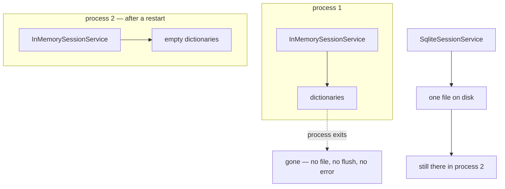

# 4.1 — The tab you did not save

## One-line answer

"In memory" means **in this process**, so every session, artifact and memory entry disappears the
moment the process ends — and a process ends far more often than beginners expect, including on every
deploy.

---

## The story

You have a form open in a browser tab. A long one: a job application, or an insurance renewal.
Thirty-odd fields, and you have filled in most of them over the evening, hunting for document numbers
between fields.

You leave it open and go to sleep.

Overnight the laptop installs an update and restarts. In the morning the browser opens and offers to
restore your tabs, which it does, and the page is there — blank.

Nothing is broken. The laptop is fine, the browser is fine, the website is fine. Every one of them
did exactly what it was designed to do. What you had typed lived in one place: the memory of a
program that is no longer running.

Two details are worth sitting with, because they are the whole part.

**Nothing warned you.** At no point did anything say "this will be lost if the browser closes." The
page looked the same whether the data was safe or not, which is why you left it open instead of
copying the numbers into a note.

**The restart was routine.** Not a crash, not a power cut, not something anybody would call an
incident. A perfectly ordinary automatic update, of the kind that happens most weeks, and it was
enough.

That combination — invisible fragility plus an ordinary event — is why this part is at `production`
level. The failure is not dramatic. It is scheduled.

---

## The idea in plain language

Every service you have used today keeps its data in Python objects inside the running process.
`InMemorySessionService` is three dictionaries ([3.2](../03-the-services/3.2-three-drawers-deep.md)).
`InMemoryArtifactService` is one. `InMemoryMemoryService` is one more.

When the process exits, those objects are freed. There is no file, no flush, no shutdown hook writing
anything anywhere. The conversation did not fail to save; **there was never anything doing saving.**

Now the part that catches people, which is not "processes crash" — everybody knows that. It is how
*routinely* processes end when your program is not a script:

| What ends the process | How often |
| --- | --- |
| you press Ctrl+C | constantly, while developing |
| a deploy replaces the container | every release |
| the platform restarts an idle container | on some hosts, after minutes of no traffic |
| the platform reschedules a pod onto another node | whenever it feels like it |
| an unhandled exception in the wrong place | rarely, and always badly timed |
| the machine runs out of memory | see [growth](../02-the-run/2.3-a-journey-and-a-pass.md) |

Four of those six are **normal operation**. A container platform restarting your process is not a
fault; it is the product working. So "we lose the sessions when it crashes" understates it. You lose
them on Tuesday afternoon when somebody merges a pull request.

There is a second loss that is easier to miss, because it looks like a smaller version of the same
thing. Two processes of the same program **do not share memory**. That is
[4.2](4.2-two-counters-two-notebooks.md), and it is a different failure with a different shape.

The honest framing, and the one worth taking away rather than a rule:

> **`InMemorySessionService` is not a bad store. It is not a store.**

It is the null implementation of the interface — the thing that satisfies the methods so you can
develop without a database, and Day 23's tests will be genuinely better for it. What it must never be
is the thing behind a service somebody is talking to.

And it is worth saying which part of Sutra is affected today: **none of it**, because Sutra is a
script you run and stop. That is exactly why this part exists now rather than on Day 86 — the day the
loss starts mattering is the day it is most expensive to discover.

---

## Why Sutra needs it

**Day 86** is the deployment day, where Sutra runs in a container. That is the day this stops being
theory, and the plan already knows it: Phase 13's gate is "runs in local Kubernetes", where a pod is
restarted as a matter of course.

**Day 60 onwards** is durability — kill it mid-run, watch it resume. Resumption reads the session from
a store. With an in-memory store there is nothing to read, so the entire phase is predicated on
having made this swap.

**Day 73** is the nightly ambient job: re-index, run the evalset, post a digest. A nightly job by
definition survives a night, which an in-memory store does not.

**Day 92**'s security review has a pleasing inversion here. In-memory storage is the **best** possible
answer to "where is conversation data persisted?" — nowhere — and the worst possible answer to
"can you show me what the agent told this customer last week?"

---

## The mechanism

Two processes, one after the other, and nothing in between:

```python
# lab/forgetful.py - write a session, then look for it from a new process.
import asyncio
import sys

from google.adk.events import Event
from google.adk.sessions import InMemorySessionService
from google.genai import types

SESSION_ID = "ticket-4521"


async def write() -> None:
    service = InMemorySessionService()
    session = await service.create_session(app_name="sutra", user_id="local", session_id=SESSION_ID)
    await service.append_event(
        session,
        Event(
            author="user",
            invocation_id="run-1",
            content=types.Content(role="user", parts=[types.Part(text="ticket 4521 logs me out")]),
        ),
    )
    stored = await service.get_session(app_name="sutra", user_id="local", session_id=SESSION_ID)
    print("wrote  :", len(stored.events), "events into", SESSION_ID)


async def read() -> None:
    service = InMemorySessionService()
    found = await service.get_session(app_name="sutra", user_id="local", session_id=SESSION_ID)
    print("found  :", type(found).__name__)


asyncio.run(write() if sys.argv[1:] == ["write"] else read())
```

**Line by line:**

- `SESSION_ID = "ticket-4521"` — a **chosen** id from
  [1.4](../01-the-session/1.4-minted-or-chosen.md), because the second process has to name the same
  session and cannot be told a UUID. This is the mapping case, being useful for the first time.
- Two functions and one `sys.argv` check — one file, run twice, because the point is that the two
  runs are separate **processes**. Two functions in one run would share memory and prove nothing.
- `InMemorySessionService()` built freshly in **both** — which is not a trick. There is no other
  option: there is nothing to reconnect to, no path, no handle. That absence is the finding.
- `get_session` after the append in `write()` — proving the session really is there before the
  process ends, so the second run's `None` cannot be blamed on the write.
- `type(found).__name__` — the same idiom as
  [1.2](../01-the-session/1.2-three-parts-to-one-key.md), for the same reason.
- No error handling anywhere, because nothing errors. That is the entire lesson and it needs no
  `try`.

Run it twice:

```bash
uv run python days/day-08-sessions-and-services/lab/forgetful.py write
uv run python days/day-08-sessions-and-services/lab/forgetful.py
```

**Line by line:**

- The first command writes the session and exits. The process ends normally, with no error, having
  done everything correctly.
- The second command is the same program, the same code, the same session id, and a new process.
- Zero requests. No key, no network, and the demonstration is complete.

```text
wrote  : 1 events into ticket-4521
found  : NoneType
```

Then, for contrast, the same two commands against a store that is a file:

```python
# lab/forgetful_sqlite.py - the same script, one import different.
import asyncio
import sys

from google.adk.events import Event
from google.adk.sessions.sqlite_session_service import SqliteSessionService
from google.genai import types

DB = "days/day-08-sessions-and-services/lab/forgetful.db"
SESSION_ID = "ticket-4521"


async def write() -> None:
    service = SqliteSessionService(DB)
    session = await service.create_session(app_name="sutra", user_id="local", session_id=SESSION_ID)
    await service.append_event(
        session,
        Event(
            author="user",
            invocation_id="run-1",
            content=types.Content(role="user", parts=[types.Part(text="ticket 4521 logs me out")]),
        ),
    )
    print("wrote  : 1 events into", SESSION_ID)


async def read() -> None:
    service = SqliteSessionService(DB)
    found = await service.get_session(app_name="sutra", user_id="local", session_id=SESSION_ID)
    print("found  :", type(found).__name__, "with", len(found.events) if found else 0, "events")


asyncio.run(write() if sys.argv[1:] == ["write"] else read())
```

**Line by line:**

- The **only** difference from the previous script is the import and one constructor argument. That
  is [3.1](../03-the-services/3.1-the-tap-and-the-pipe.md)'s promise, cashed: the five methods are
  identical, so the rest of the file did not change.
- `SqliteSessionService(DB)` takes a **positional** path, unlike almost everything else in ADK. Read
  the signature, do not assume.
- `DB` pointing into `lab/` — deliberately, so the file it creates is in the scratchpad and not in
  the repository root. `.gitignore` covers `lab/` output; a stray `.db` beside `pyproject.toml` is a
  file you will commit by accident.
- `len(found.events) if found else 0` — a guard, because this function has to survive being run
  before the write. The previous script did not need one, which tells you something: **the version
  that persists is the version that has to handle more cases.**

```text
wrote  : 1 events into ticket-4521
found  : Session with 1 events
```

A `Session` rather than a `NoneType`, from a process that did not exist when the event was written.
Same five methods, same calling code, one import different — and the conversation survived a
restart. That is [3.1](../03-the-services/3.1-the-tap-and-the-pipe.md)'s tap, and the water is coming
from somewhere else now.

One event rather than the two you might expect from
[2.2](../02-the-run/2.2-the-complaint-book.md): there is no runner in this script, so nobody appended
a user message on your behalf. The off-by-one belongs to the runner, not to the store.



---

## When it breaks

**💥 The deploy that logged everybody out.**

There is no error text, and that is the finding. You ship a change on Tuesday afternoon; the platform
starts a new container and stops the old one; every conversation in progress becomes a stranger
mid-sentence. Support gets a handful of "the bot forgot everything" reports that afternoon and none
the next day, so it gets written off as a blip. Then you deploy again on Thursday.

**💥 The idle scale-to-zero.**

Worse than the deploy, because it is invisible even in your release notes. Several hosting platforms
stop a container that has had no traffic for a few minutes and start a fresh one on the next request.
A user who goes to make tea comes back to an agent that has never met them. Nothing in your logs
marks the moment, because from the process's point of view there was no moment — it had only just
started.

**💥 The demo that worked and the deployment that did not.**

The most common shape. Everything is correct on a laptop, where the process runs for hours and
handles one user. Nothing about the code is wrong. The environment changed underneath an assumption
nobody wrote down, which is why writing it down — *the store is in-process; sessions do not survive a
restart* — belongs in the module today's build brief creates, as a comment, dated.

---

## In production

**What a professional writes instead of the teaching version** is a store chosen deliberately for the
environment: in-memory for tests, a file for a single-process local run, a database for anything
deployed. The mechanism is [3.1](../03-the-services/3.1-the-tap-and-the-pipe.md)'s factory; the
discipline is that the choice is made in **one** place and is visible in the startup log, so "what
store is this running against" is never a question during an incident.

**What degrades at scale** is not the store — it is the recovery. Losing sessions is bad; losing them
with no record that they existed is worse, because you cannot tell an affected user what happened or
even how many there were. Systems that take this seriously write the transcript to a log as well as
to a session store, precisely so that a store failure is recoverable evidence rather than a silence.

**The failure that only shows with real traffic** is the memory growth that precedes the loss. An
in-memory store has no eviction: every session ever created in that process is still there, holding
its full event list. On a laptop the process ends before this matters. On a server it grows until the
platform kills the container for using too much memory — at which point you lose every session at
once, and the immediate cause looks like an out-of-memory error rather than a storage design.

**The review comment a senior engineer leaves:** *"This is `InMemorySessionService` behind an HTTP
handler. Every deploy drops every conversation in flight, and the platform restarts idle containers
anyway, so it'll happen without us shipping anything. Put the store behind the factory and use SQLite
at minimum — and log which one we picked at startup."*

**The interview question:** *"what's wrong with keeping agent sessions in memory?"* The answer that
shows you have deployed one: "It's not a store — it's the null implementation of the interface, and
that's fine for tests and development. The mistake people make is thinking the risk is crashes. It
isn't: the process ends on every deploy, and most container platforms restart idle instances anyway,
so the loss is scheduled rather than exceptional. And nothing warns you — there's no flush, no
shutdown hook, no error — so the symptom is a handful of 'the bot forgot me' reports on the afternoon
you released, which get written off. The other half is that it doesn't grow: no eviction, so every
session ever created in that process is still there, which on a server eventually gets the container
killed for memory, and then you lose everything at once and it looks like an OOM rather than a
storage decision."

---

## Check yourself

```bash
uv run python days/day-08-sessions-and-services/lab/forgetful.py write
uv run python days/day-08-sessions-and-services/lab/forgetful.py
uv run python days/day-08-sessions-and-services/lab/forgetful_sqlite.py write
uv run python days/day-08-sessions-and-services/lab/forgetful_sqlite.py
```

**Answer out loud, without scrolling up:**

> Name four ordinary events that end a process, and say how many of them are faults. Then say what
> makes in-memory storage the best possible answer to one security question and the worst possible
> answer to another.

---

**Next:** [4.2 — Two counters, two notebooks](4.2-two-counters-two-notebooks.md)
