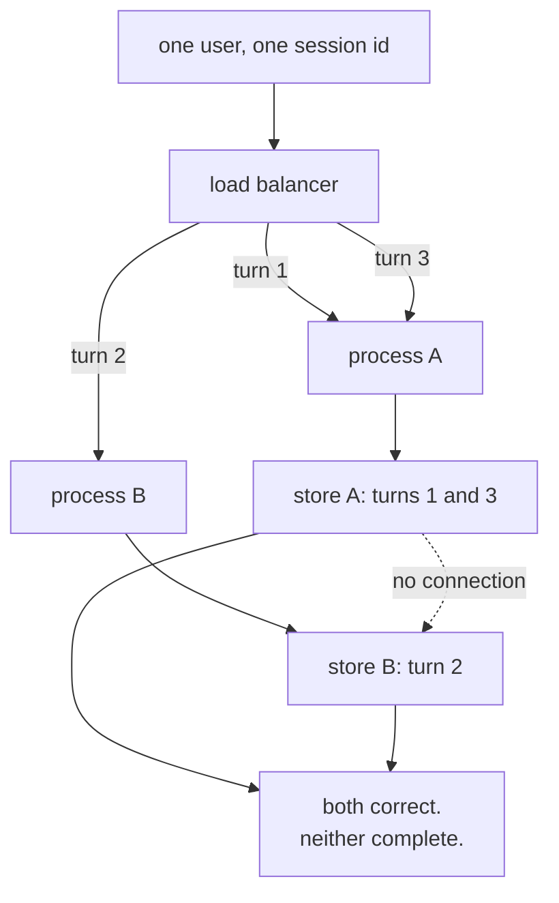

# 4.2 — Two counters, two notebooks

## One-line answer

Two processes of the same program have **two separate in-memory stores**, so a user served by one is
a stranger to the other — and unlike losing a session on restart, this failure is intermittent, which
makes it much harder to see.

---

## The story

A shop gets busy enough to open a second counter. Same shop, same stock, same prices, one more person
serving.

Each counter has a notebook for credit customers. Somebody buys now and pays at the end of the month;
the amount goes in the notebook.

For a while this is fine. Then a customer buys rice on Monday at counter one and oil on Thursday at
counter two, because on Thursday counter one had a queue.

At the end of the month the owner adds up counter one's notebook and sends a bill for the rice. The
customer pays it. The oil is in the other notebook, and nobody looks at that one for this customer,
because as far as counter one's notebook is concerned this person's account is settled.

Now notice why this is worse than losing a notebook altogether.

If a notebook is lost, everybody knows something is wrong. Bills do not go out, somebody asks, the
problem gets a name.

Here, **both notebooks are correct.** Counter one's is a perfect record of what happened at counter
one. Counter two's is a perfect record of what happened at counter two. Every individual entry is
right, every individual bill is right, and the total is wrong in a way that no single document
reveals. You can audit either notebook for an hour and find nothing.

That is what a second process does to an in-memory store, and it is the reason this part exists
separately from [4.1](4.1-the-tab-you-did-not-save.md). Losing everything is loud. Losing half of it,
intermittently, depending on which server answered, is quiet.

---

## The idea in plain language

"In memory" means in **one** process's memory. Start a second copy of the same program and it has its
own `InMemorySessionService`, with its own empty dictionaries.

Nothing connects them. There is no shared file, no socket, no discovery. They are not out of sync;
they are unrelated.

The reason a second process appears at all is that it is how servers are made bigger. One process
handles one thing at a time in one event loop; when that is not enough, you run more copies behind
something that distributes requests. That is **horizontal scaling**, and it is the default way
anything is deployed, including the Kubernetes-on-your-laptop deploy the plan schedules for Day 88.

The failure it produces has a specific shape worth recognising:

- The user's first message goes to process A. A session is created there.
- The second message goes to process B, because the load balancer picked differently.
- Process B looks up the session id, finds nothing, and — depending on
  [1.4](../01-the-session/1.4-minted-or-chosen.md)'s `auto_create_session` — either fails or starts a
  brand new empty conversation.
- The third message goes to A again, and the agent remembers everything except the second message.

**Intermittent, user-specific, and not reproducible on a laptop**, because a laptop runs one process.

There is a workaround people reach for called a **sticky session**: configure the load balancer to
send the same user to the same process every time. It works, and it is worth knowing why it is a
workaround rather than a fix. It makes every process a single point of failure for its own users
(that process restarting is [4.1](4.1-the-tab-you-did-not-save.md) for a subset of people); it makes
scaling down destructive; and it means a deploy, which replaces every process, drops every
conversation at once. You have not solved the problem, you have arranged for it to happen on a
schedule.

The actual fix is the interface. Move the store outside the processes — a database, a Redis, a cloud
service — and the question "which process answered?" stops being a question anybody asks. That is
[3.1](../03-the-services/3.1-the-tap-and-the-pipe.md)'s swap, and it is why the swap is on the plan
for Day 86 rather than being optional.

There is a smaller sibling of this problem **inside** one process, and it is worth naming because it
is the one you can hit today. `InMemorySessionService`'s docstring says it is *"not suitable for
multi-threaded production environments"*, and there is no locking on its dictionaries. Two coroutines
appending to the same session interleave. You will not get a crash — the list append is safe — you
will get a transcript in an order neither run intended.

---

## Why Sutra needs it

**Day 88** deploys Sutra onto a real Kubernetes cluster running on your laptop, using kind or k3d. A
deployment with two replicas is one line of YAML, and it is the line that makes this part concrete.

**Day 85** puts Sutra behind an API server, which is the first time more than one conversation can be
in flight at once even within a single process.

**Day 86** is the swap to a real store, and this part plus [4.1](4.1-the-tab-you-did-not-save.md) are
the two reasons for it. One is loud, one is quiet, and the quiet one is the one that convinces people.

**Phase 9, from Day 60**, is durability. Resuming a run that a different process started is only
possible if the state lives somewhere both can see.

---

## The mechanism

Two stores in one script, standing in for two processes:

```python
# lab/split_brain.py - two stores, one session id, both correct and both wrong.
import asyncio

from google.adk.events import Event
from google.adk.sessions import InMemorySessionService
from google.genai import types

SESSION_ID = "ticket-4521"


def said(author: str, text: str) -> Event:
    return Event(
        author=author,
        invocation_id="run-x",
        content=types.Content(
            role="user" if author == "user" else "model",
            parts=[types.Part(text=text)],
        ),
    )


async def turn(service: InMemorySessionService, question: str, answer: str) -> None:
    """One turn against whichever process the load balancer happened to pick."""
    session = await service.get_session(app_name="sutra", user_id="local", session_id=SESSION_ID)
    if session is None:
        session = await service.create_session(
            app_name="sutra", user_id="local", session_id=SESSION_ID
        )
    await service.append_event(session, said("user", question))
    await service.append_event(session, said("sutra_desk", answer))


async def main() -> None:
    process_a = InMemorySessionService()
    process_b = InMemorySessionService()

    await turn(process_a, "ticket 4521 logs me out", "Looks like a session bug.")
    await turn(process_b, "how long has it been happening?", "I have no record of that ticket.")
    await turn(process_a, "so what should I do?", "Clear the token and try again.")

    for name, service in (("process A", process_a), ("process B", process_b)):
        session = await service.get_session(
            app_name="sutra", user_id="local", session_id=SESSION_ID
        )
        texts = [e.content.parts[0].text for e in session.events]
        print(f"{name}: {len(session.events)} events")
        for text in texts:
            print("   ", text)


asyncio.run(main())
```

**Line by line:**

- `process_a` and `process_b` as two separate `InMemorySessionService()` objects — the honest model of
  two processes. They are as unrelated as two machines, because unrelated is all "separate process"
  means for an in-memory store.
- `turn()` written as get-then-create — deliberately the naive shape, and note this is
  [1.4](../01-the-session/1.4-minted-or-chosen.md)'s check-then-create race, here in its most
  sympathetic form: it is what everybody writes, and in this script it is the thing that hides the
  bug. Process B finds nothing, so it quietly starts a fresh conversation instead of failing.
- The **same `SESSION_ID`** throughout — the client is behaving perfectly. It has one session id and
  it is using it. Nothing on the client side is wrong.
- Three turns alternating A, B, A — the load balancer's choice, and the only variable in the script.
- `"I have no record of that ticket."` as process B's answer — written in because that is genuinely
  what an agent with an empty session would say, and seeing it in the output is more convincing than
  being told.
- The final loop printing **both** stores — because the finding is the comparison. Printing either one
  alone looks like a working conversation.

The output:

```text
process A: 4 events
    ticket 4521 logs me out
    Looks like a session bug.
    so what should I do?
    Clear the token and try again.
process B: 2 events
    how long has it been happening?
    I have no record of that ticket.
```

Read process A on its own and it is a perfectly coherent, correct conversation. Read process B on its
own and it is a short, correct conversation with a customer who asked something out of the blue.

Neither transcript contains any evidence that the other exists. The user experienced one conversation
with one confusing gap in the middle, and there is no single place you can look to see it.



---

## When it breaks

**💥 The agent that forgets one message in three.**

No error anywhere. The user reports that "it keeps losing track", support cannot reproduce it, and the
logs from any single process show a sensible conversation. The tell, once you know to look for it, is
that the *number of processes* and the *proportion of dropped turns* match: with two replicas, roughly
half the turns land in the wrong place.

**💥 The session that exists on one machine.**

```text
SessionNotFoundError: Session not found: ticket-4521
```

The better version of the failure, and you only get it if `auto_create_session` is `False`. It is
better because it is loud — the request fails instead of silently answering from an empty
conversation. This is the argument for leaving that setting off in a service:
[1.4](../01-the-session/1.4-minted-or-chosen.md) called it a real decision, and here is the case where
one answer is clearly safer.

**💥 The interleaved transcript, in one process.**

```text
    ticket 4521 logs me out
    and also the invoice is wrong
    Looks like a session bug.
    I can help with billing.
```

Two runs in one session at the same time, in the same process, appending as they go. Nothing is lost
and nothing errors; the order is simply not the order of any conversation that happened. The model
reads this on the next turn as though it made sense, which is where the strange answers come from.

---

## In production

**What a professional writes instead of the teaching version** is a store outside the process from the
first deployment, not the second. The intermediate positions — sticky sessions, a single replica, "we
will fix it when we scale" — all work and all convert an architectural problem into a scheduled
outage. The one legitimate intermediate is a **single-process deployment with a file-backed store**,
which fixes [4.1](4.1-the-tab-you-did-not-save.md) and postpones this part honestly, and is exactly
what Day 86's container step does.

**What degrades at scale** is the diagnosis rather than the system. At two replicas the pattern is
visible if you look. At twenty, each user's conversation is scattered across twenty stores, every
individual log looks fine, and the aggregate symptom is "the assistant is unreliable" — an adjective,
which is the least actionable kind of bug report. Getting the store out of the process before this
point is much cheaper than proving it afterwards.

**The failure that only shows with real traffic** is the deploy that fixes it and the deploy that
breaks it again. Sticky sessions are configured, everything settles, and six months later somebody
changes the ingress or adds a second region and the stickiness stops applying. Nothing in the
application changed, nothing in the application can detect it, and the bug comes back wearing the
same clothes.

**The review comment a senior engineer leaves:** *"This is fine at one replica and we're deploying two.
Half of every conversation will land in the wrong store, and neither process will error — the
get-then-create in the handler quietly starts a fresh session. Move the store out of the process; if
we genuinely can't this sprint, run one replica with SQLite and put a ticket on it, but don't do
sticky sessions and call it done."*

**The interview question:** *"an agent works fine in staging and loses context intermittently in
production. Where do you look?"* The answer that shows you have been there: "How many replicas
production runs, first. If the session store is in-process, two replicas means roughly half of each
conversation lands in a store the next request won't read, and every individual process's log looks
completely coherent — so there's no single place the bug is visible. Staging is usually one instance,
which is why it doesn't reproduce. The fix is to move the store out of the process rather than
pinning users to instances, because sticky sessions just convert an intermittent bug into an outage
every time you deploy. And I'd turn off any auto-create-session behaviour on the service path, so a
missing session fails loudly instead of quietly answering from an empty one."

---

## Check yourself

```bash
uv run python days/day-08-sessions-and-services/lab/split_brain.py
```

Then change `turn()` so that a missing session raises instead of creating one, and run it again.
Decide which behaviour you would rather have in a service, and write down why.

**Answer out loud, without scrolling up:**

> Say why two processes with in-memory stores is a quieter failure than one process restarting. Then
> say what a sticky session fixes and what it converts the problem into.

---

**Next:** [4.3 — The shop that bought a computer](4.3-the-shop-that-bought-a-computer.md)
