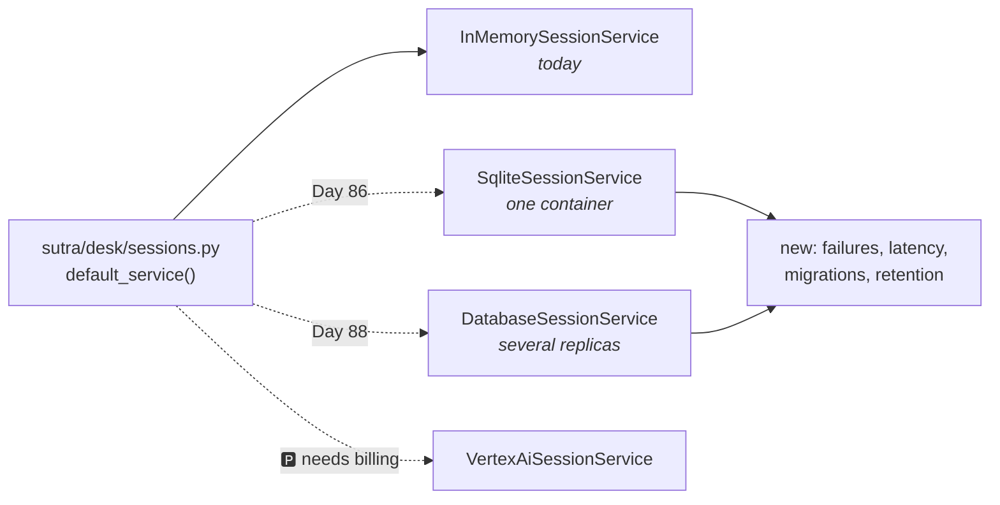

# 4.3 — 🅿️ The shop that bought a computer

## One-line answer

The three persistent session services — a file, a database, a cloud service — all satisfy the same
interface, so the swap is one line; what is **not** one line is everything the interface never
promised, which is locking, latency, migrations and a whole new class of error.

---

## The story

A shop has run on a register for eleven years. Ruled book, pen, a rubber band. It works.

They buy a computer.

The first week is wonderful. Search instead of flipping pages. Two people can look at the accounts at
once. A backup on a pen drive instead of a book that could burn.

The second week has some new problems, and they are not small.

There is a day when the power goes and the shop cannot bill anybody, which the ruled book never did
to them. There is the discovery that the software needs updating, and that updating it means the old
data has to be converted, and that the conversion has a step you must not get wrong. There is the
afternoon when the accountant is entering something at the back while the boy at the counter is
entering something at the front, and one of the entries disappears, and nobody can say which because
both of them are certain they typed it.

And there is the thing nobody says out loud for a month: the computer knows more about the customers
than the book ever did. It has their numbers, their purchase history, every credit they ever took.
That is not new information — the book had it too — but the book was one object in one drawer, and
the computer is on a network.

Nobody in that shop thinks buying the computer was a mistake. It very obviously was not. But "we
moved from a book to a computer" is not a description of an afternoon's work, and everybody who has
done it knows that.

---

## The idea in plain language

🅿️ **This part is parked**: awareness-level, interview-ready, and deliberately not built today. The
day it gets built is **Day 86**, in the deployment phase, where Sutra runs in a container and an
in-process store stops being viable for the reasons
[4.1](4.1-the-tab-you-did-not-save.md) and [4.2](4.2-two-counters-two-notebooks.md) gave.

What is worth knowing now is the shape of the choice, so that Day 86 is a decision rather than a
surprise.

### The three that persist

| Service | Where it lives | What it needs | Good for |
| --- | --- | --- | --- |
| `SqliteSessionService` | one file | nothing — `aiosqlite` ships with ADK | a single process that has to survive a restart |
| `DatabaseSessionService` | PostgreSQL, MySQL or SQLite | the `db` extra (SQLAlchemy) | several processes sharing one store |
| `VertexAiSessionService` | a Google Cloud service | a GCP project, auth and a bucket | managed scale on Google Cloud |

The third one needs a billing account, so **Addendum 02 rules it out of this curriculum**: Sutra's
deploy days become a container running locally and a Kubernetes cluster on your own laptop, with the
cloud path documented rather than executed. It is here for completeness and for the interview
question, not as an option. 🅿️

Sutra's likely path is the first, then the second: SQLite when the container needs to survive a
restart, a database when there is more than one container.

### What the swap actually costs

The five methods are identical. That is real and it is the whole argument for
[3.1](../03-the-services/3.1-the-tap-and-the-pipe.md)'s interface. What changes is everything the
interface does not mention:

**Every call can now fail.** `append_event` against a dictionary cannot time out. Against a database
it can time out, be refused, or find the connection gone. Code written against the in-memory service
has never once handled that, and every call site is a place where it now can.

**There is a new error you have never seen.** `StaleSessionError` — *"raised when a session write
loses an optimistic concurrency race"* — happens when the session you are appending to has been
superseded by a newer stored revision. In memory this is impossible. On a shared store, under two
requests for one conversation, it is the correct and useful thing to happen, and something has to
catch it.

**There are migrations.** ADK's own documentation notes that the session database schema changed in
Python v1.22.0 and requires migration, and `SqliteSessionService` refuses to open an old database
rather than corrupting it — with instructions in the error. A store is a thing that outlives the code
that made it, which is the whole point of it, and it is also why upgrades stop being free.

**Latency arrives.** A dictionary lookup is nanoseconds. A database round trip is milliseconds, and
there are several per run. This is usually fine and it is never zero, and it is the reason
`GetSessionConfig` from [2.3](../02-the-run/2.3-a-journey-and-a-pass.md) exists.

**The data now exists.** In-memory storage was, accidentally, the strongest possible privacy posture:
nothing was written anywhere. A persistent store means conversations are on a disk, in backups, in
whatever the platform snapshots, subject to whatever retention you have — and the correct time to
decide retention is before the store exists, which is now rather than Day 86.

### The rule to carry to Day 86

**Swap early, in development, before you need it.** A codebase that has only ever run against the
in-memory service is a codebase where nothing has ever been slow and nothing has ever failed, and
both of those assumptions are baked into places nobody wrote down. Running the tests against SQLite
once — which costs one line, because of the interface — finds them while they are cheap.

---

## Why Sutra needs it

**Day 86** builds the container and makes this choice for real. Phase 13's gate is *traced end to end
and runs in local Kubernetes*, and neither is meaningful with a store that dies with the pod.

**Day 88** runs Sutra on kind or k3d with more than one replica, which is where
[4.2](4.2-two-counters-two-notebooks.md)'s failure becomes reproducible on your own machine.

**Phase 9, from Day 60**, is durability and human-in-the-loop resumption. A run that pauses for a
human and resumes later — possibly in another process — needs a store both can see. That phase is
built on this swap having happened.

**Day 92**'s security review will ask where conversation data lives, how long it is kept, and who can
read it. The moment those questions have a non-trivial answer is the moment this part stops being
parked.

---

## The mechanism

The swap, and the three things you get for free from it:

```python
# lab/three_stores.py - the same code against three implementations.
import asyncio

from google.adk.events import Event
from google.adk.sessions import BaseSessionService, InMemorySessionService
from google.adk.sessions.sqlite_session_service import SqliteSessionService
from google.genai import types

DB = "days/day-08-sessions-and-services/lab/three_stores.db"


async def exercise(service: BaseSessionService, label: str) -> None:
    """Identical for every implementation - which is the entire point."""
    session = await service.create_session(app_name="sutra", user_id="local")
    await service.append_event(
        session,
        Event(
            author="user",
            invocation_id="run-1",
            content=types.Content(role="user", parts=[types.Part(text="ticket 4521")]),
        ),
    )
    found = await service.get_session(app_name="sutra", user_id="local", session_id=session.id)
    listing = await service.list_sessions(app_name="sutra", user_id="local")
    print(f"{label:<24} events={len(found.events)} sessions={len(listing.sessions)}")


async def main() -> None:
    await exercise(InMemorySessionService(), "InMemorySessionService")
    await exercise(SqliteSessionService(DB), "SqliteSessionService")

    try:
        from google.adk.sessions import DatabaseSessionService  # noqa: F401
    except ImportError as exc:
        print("DatabaseSessionService     not installed:", exc)


asyncio.run(main())
```

**Line by line:**

- `exercise(service: BaseSessionService, ...)` — typed against the **interface**, which is what lets
  one function be run against two different stores. This is
  [3.1](../03-the-services/3.1-the-tap-and-the-pipe.md)'s rule being cashed rather than asserted.
- The body does four things — create, append, get, list — chosen because they are four of the five
  interface methods. Whatever differs between implementations, these four do not.
- `SqliteSessionService(DB)` positional — the odd signature, again.
- `DB` inside `lab/` — gitignored twice over (`*.db` and `days/*/lab/`), and out of the repository
  root where a stray database is a file you commit by accident.
- The `try` around the `DatabaseSessionService` import — because it is lazily imported and raises if
  the `db` extra is absent, which on your machine it is. Catching it prints the real message rather
  than stopping the script, which is more useful than a traceback for something you deliberately did
  not install.
- `# noqa: F401` with the import unused — the plan's rule is that a `noqa` needs a reason, and the
  reason is that the *import itself* is the test here; there is nothing to use.
- `len(listing.sessions)` — included because `list_sessions` is the method whose behaviour differs
  most between implementations, and running it on both is how you find out. Note from
  [3.2](../03-the-services/3.2-three-drawers-deep.md) that the listing blanks the events.

The output, on a machine with no `db` extra and a fresh database:

```text
InMemorySessionService   events=1 sessions=1
SqliteSessionService     events=1 sessions=1
DatabaseSessionService     not installed: The 'sqlalchemy' package is required to use this feature. Please install it by running: pip install google-adk[db]
```

Two implementations, one function, identical numbers. Run it a second time and the SQLite line says
`sessions=2`, because that one remembers — which is the whole of [4.1](4.1-the-tab-you-did-not-save.md)
in one changing digit.

And the error you will meet on the day of an ADK upgrade, from `SqliteSessionService`'s constructor:

```text
RuntimeError: Database sutra.db seems to use an old schema. Please run the migration command to
migrate it to the new schema. Example: `python -m
google.adk.sessions.migration.migrate_from_sqlalchemy_sqlite --source_db_path sutra.db
--dest_db_path sutra.db.new` then backup sutra.db and rename sutra.db.new to sutra.db.
```

It refuses to open rather than opening and misreading, and it hands you the exact command — which is
the behaviour you want and is worth noticing as a model for your own tools.



---

## When it breaks

**💥 The extra you did not install.**

```text
ImportError: The 'sqlalchemy' package is required to use this feature. Please install it by running: pip install google-adk[db]
```

`DatabaseSessionService` is imported lazily so that ADK does not drag SQLAlchemy in for everyone. The
consequence is that this arrives on the day you swap rather than the day you installed, which is a
poor moment for a surprise. Install it in advance if the swap is on your plan — and remember
Principle 7: the version goes in `docs/PACKAGES.md` with the date you looked it up.

**💥 The database from the previous version.**

The `RuntimeError` above. It is a good failure — refusing is right — and it is also the one that will
happen during a deploy, when your rollback plan matters. Migrations are a thing to have rehearsed
rather than a thing to read about while the service is down.

**💥 The race that could not happen before.**

```text
StaleSessionError: ...
```

Two requests for one conversation, both appending, and the second one loses the optimistic
concurrency race. It cannot happen in memory. It will happen on a shared store, and the right
response is usually to re-read and retry rather than to surface it — which is a decision your code
does not currently make anywhere, because until Day 86 there is nothing to decide.

---

## In production

**What a professional writes instead of the teaching version** is a test suite that runs against the
real store, not only the in-memory one. It is slower, so it is usually a separate marked run rather
than the default — the `live`/`slow` markers already in `pyproject.toml` are exactly the mechanism —
and it is the only thing that finds the assumptions the fast tests bake in.

**What degrades at scale** is SQLite specifically, and it is worth knowing where the wall is. It
handles concurrent readers well and serialises writers, so one container with modest traffic is fine
and two containers on a shared volume is not. The failure is not corruption — it is writers waiting,
then timing out, under exactly the load that made you scale up.

**The failure that only shows with real traffic** is the retention question arriving as a request
rather than as a design. Somebody asks for a conversation to be deleted, or an audit asks how long
transcripts are kept, and the honest answer is "forever, because nothing deletes them and the store
is backed up". Both `delete_session` and a retention job are small pieces of work; being asked for
them after the fact is what makes them expensive.

**The review comment a senior engineer leaves:** *"Before we swap, run the test suite against SQLite
once. Everything in here has only ever talked to a dictionary, so nothing has ever been slow and
nothing has ever failed — I want to find out which handlers assume that while it's still cheap. And
put the retention decision in the ADR, not in the ticket."*

**The interview question:** *"you're moving an agent's session store from memory to a database. What
changes?"* The answer that shows you have done it rather than read about it: "The API doesn't — it's
the same five methods behind the same interface, and that's exactly why the swap is a one-line
change. What changes is everything the interface never promised. Every call can now fail or be slow,
so call sites that never had error handling need it. There's a whole new error class around
concurrent writes to one session, which was impossible in memory. The schema can move under you, so
upgrades involve migrations and a rollback plan. And the data now exists — it's on disk, in backups,
in snapshots — so retention and access become real questions rather than trivially answered ones. My
rule is to swap in development well before I need it, because a codebase that's only ever talked to a
dictionary has assumptions about speed and reliability baked into places nobody wrote down."

---

## Check yourself

```bash
uv run python days/day-08-sessions-and-services/lab/three_stores.py
uv run python days/day-08-sessions-and-services/lab/three_stores.py
```

Run it twice and watch one number change and the other not.

**Answer out loud, without scrolling up:**

> Name the three persistent session services and say which one this curriculum will never use, and
> why. Then name three things that change when you swap, none of which appear in the interface.

---

**Next:** [5.1 — 💥 The name called in the waiting room](../05-failure-lab/5.1-the-name-called-in-the-waiting-room.md)
