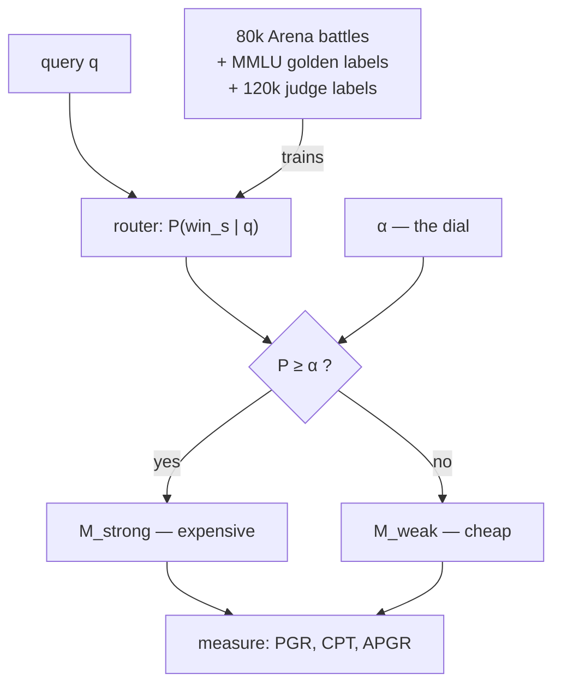

# Paper 01 — RouteLLM: Learning to Route LLMs with Preference Data

> **RouteLLM: Learning to Route LLMs with Preference Data**
> arXiv:2406.18665 · submitted 26 June 2024, revised to v4 on 23 February 2025 ·
> <https://arxiv.org/abs/2406.18665>

## One-line answer

Train a small model to predict, for each question, **whether the strong model would beat the weak
one**, then send the question to the weak model unless that probability clears a threshold — and you
can cut cost by more than half without the answers getting worse.

---

## The story

A garage with two mechanics.

One has been doing this for thirty years. He can hear what is wrong with an engine from the other side
of the yard. There is one of him, everybody wants him, and there is always a queue outside his bay.

The other joined two years ago. Competent, careful, gets through work quickly, and there is never a
queue.

Now watch how the work is actually distributed on a busy morning: **everything goes to the senior
man.** Not by anybody's decision. It happens because each customer, standing at the counter with a
problem they cannot diagnose, asks for the best person — and each of them is being perfectly
reasonable, because they do not know whether their problem is hard.

So the senior mechanic spends the morning changing a bulb, topping up brake fluid and tightening a
mirror, while a car with an actual intermittent electrical fault waits behind them. The junior
mechanic does four jobs and drinks tea.

The owner knows this is wrong and cannot easily fix it, because fixing it requires somebody at the
counter to decide **how hard each job is before it has been diagnosed** — which is a smaller version
of the diagnosis itself, and if it were easy the junior mechanic could do the job anyway.

That was the state of the field in 2024. Everyone had a strong expensive model and a weak cheap one,
everyone knew most questions did not need the strong one, and nobody had a good way to tell which
were which **before** answering. So everything went to the senior mechanic.

---

## The idea in plain language

The paper's move is to stop trying to judge the *question* and to judge the *comparison* instead.

Not "is this question hard?" — which is vague and needs a scale nobody has. Instead: **for this
question, would the strong model's answer be preferred over the weak model's?** That is a yes-or-no
about two specific models, and it turns out to be learnable, because there is a great deal of data
about exactly that.

Some terms, defined before they are used:

- A **strong model** and a **weak model**: two models, one better and more expensive, one cheaper.
  The paper routes between exactly two.
- **Preference data**: records of humans being shown two answers to the same question and saying
  which they preferred. The paper's main source is *"80k battles from the online Chatbot Arena
  platform"*, where people compare anonymous model answers.
- A **router**: a small model that reads only the question — never the answers — and outputs
  `P(win_s | q)`, the probability that the strong model would win for this question.
- **α (alpha)**: a threshold between 0 and 1, and the knob that turns the router into a dial. The
  paper is precise about what it does: *"a higher value of α enforces stricter cost constraints by
  favoring weak models more often, while a lower α biases toward higher-quality (but more expensive)
  strong models."*

The routing rule is one line, and the paper writes it as:

> `R^α(q) = M_weak if P(win_s|q) < α, M_strong if P(win_s|q) ≥ α`

Read it in words: **ask the small router how likely the strong model is to win; if it is not likely
enough, use the cheap model.**

Two consequences make this more interesting than it first looks.

**It is a dial, not a decision.** One trained router gives you a whole curve of behaviours by moving
α. You do not retrain to become cheaper; you turn the knob, and you can turn it per environment or
per time of day.

**The router is much smaller than either model.** It reads the question and predicts a preference.
It never runs the models it is choosing between, which is what makes it cheap enough to be worth
having.

The result claimed in the abstract, in the paper's own words: the approach *"significantly reduces
costs — by over 2 times in certain cases — without compromising the quality of responses."*

And a second finding the abstract calls *"interesting"*, which is the one that matters most in
practice: the routers *"demonstrate significant transfer learning capabilities, maintaining their
performance even when the strong and weak models are changed at test time."* A router trained against
one pair of models keeps working when you swap the pair. Given how often the pair changes — which
[2.4](../parts/02-the-translator/2.4-the-wholesale-market.md) watched happen in fifteen days — that is
the difference between a technique and a research result.

---

## Why Sutra needs it

**[5.1](../parts/05-routing/5.1-which-queue-do-you-join.md)** hand-rolled a router this morning:
`len(question) < 120 and TICKET.search(question)`. That is a win-prediction model with two hand-made
features and a threshold hard-coded to "true". This paper is what the field learned about replacing
those two features with something trained, and about making the threshold a dial.

**Day 70** builds the Quota-Router. Its currency is quota rather than money (Addendum 02 §6), which
changes the objective and not the shape: `P(win_s | q)` against a threshold is still the rule, and α
is still what you turn when the strong lane is running low.

**Day 79 onwards** is evals, and this paper is a small lesson in how to measure a router. Its metrics
— *Performance Gap Recovered* and *Call-Performance Threshold* — are the honest way to say "cheaper
without being worse", and they are more careful than anything you would invent under time pressure.

**[3.3](../parts/03-local/3.3-the-learner-driver.md)** established that a prompt is qualified against
a model. A router makes the model vary per request, which means the prompt has to survive both lanes
— a constraint this paper does not discuss and your system has to.

---

## The mechanism

Four routers are proposed, and they differ only in **how `P(win_s | q)` is computed**. The threshold
rule above is identical for all four.

| Router | How it predicts the win probability |
| --- | --- |
| **Similarity-weighted (SW) ranking** | A Bradley-Terry model over the training battles, weighting each past comparison by the **cosine similarity** between its query and yours |
| **Matrix factorization** | Learns a hidden scoring function `δ(M, q)` for how good model `M`'s answer to query `q` would be |
| **BERT classifier** | `BERT_BASE` with a logistic-regression head on the classification token |
| **Causal LLM classifier** | Llama 3 8B, used as an instruction-following next-token predictor |

The first is the one to understand properly, because it needs no training in the usual sense and it
is what the demo below implements.

**Similarity-weighted ranking, in words.** You have 80,000 past comparisons: each is a question, two
models, and which one a human preferred. A new question arrives. You compute how similar it is to
each past question. Then you run a Bradley-Terry model — the standard way of turning pairwise
comparisons into per-player strengths, the same mathematics behind chess ratings — but **weighted**,
so that comparisons on similar questions count for much more than comparisons on unrelated ones. Out
comes a strength for the strong model and one for the weak model on *this* question, and the win
probability follows.

The insight worth keeping is in the weighting. There is no general answer to *"is the strong model
better?"* — it depends entirely on the question. What there is, is a large body of evidence about
questions like this one, and similarity is how you find it.

**Where the training data comes from**, and this is the part that makes the paper practical rather
than theoretical: 80k human comparisons from Chatbot Arena, with models clustered into ten tiers —
the top two tiers standing in for "strong" and the third for "weak". Nobody had to label anything
new. The data already existed because people had been comparing models for fun.

The paper then adds **data augmentation**, because 80k battles thinly cover any particular subject:

- **Golden-labelled data**: about 1,500 MMLU validation questions where the correct answer is known,
  so a win can be derived rather than voted on.
- **LLM-judge-labelled data**: roughly 120,000 samples from the Nectar dataset judged by GPT-4, at a
  stated cost of **about $700**.

That second line is worth pausing on. Producing the training data for a cost-reduction router cost
seven hundred dollars of the expensive model — which is the honest shape of this kind of work, and is
exactly the sort of number a paper's abstract does not carry.

**How it is measured.** Three metrics, and the second is the one to steal:

- **PGR — Performance Gap Recovered**: `(r(router) − r(weak)) / (r(strong) − r(weak))`. Zero means the
  router is no better than always using the weak model; one means it matched the strong model. It
  normalises away *how far apart the two models are*, which is what makes results comparable across
  different pairs.
- **CPT — Call-Performance Threshold**: *"minimum percentage of calls to the strong model needed to
  reach the desired PGR"*. This is the number that answers "how much of my expensive lane do I
  actually need?", and it is the one a router is bought for.
- **APGR — Average Performance Gap Recovered**: PGR integrated across cost constraints, *"the area
  between the router's performance curve and the weak model's performance curve"* — a single number
  for the whole α curve rather than for one setting.

Evaluated on **MMLU** (14,042 questions), **MT Bench** (160 open-ended questions) and **GSM8K**
(1,000+ maths problems).



---

## The paper in one demo

A project whose entire reason to exist is `R^α(q)`: a win-prediction router, a threshold, and the
measurement of how many strong calls it saved. Two files, no framework, no web layer, standard
library plus one HTTP call.

**Zero-budget** (Addendum 02): both models are on **Groq's free tier**, which
[2.3](../parts/02-the-translator/2.3-the-express-counter.md) established at 30 RPM and 1,000 requests
per day — so the twenty calls this demo makes are affordable in a way they would not be on Gemini's
twenty a day.

**The ablation switch is α itself**, which is unusually clean: the paper's own parameter is the thing
that turns its contribution off. `α = 0` routes everything to the strong model, which is the world
before the paper. Any α above zero is the paper working.

```text
days/day-09-four-free-providers/lab/papers/routellm/
├── router.py   # P(win_s|q) by similarity-weighted preference, and R^alpha
└── run.py      # the loop, the ablation, and the strong-call fraction
```

### `router.py`

```python
# lab/papers/routellm/router.py
# The paper's contribution and nothing else: a win-prediction model over preference
# data, plus the threshold rule R^alpha(q).  arXiv:2406.18665
import math
import re

# Preference data. Each row is (query, strong_won).  The paper uses 80k Chatbot Arena
# battles; this is the same shape with twelve rows, hand-labelled for a support desk.
BATTLES: list[tuple[str, bool]] = [
    ("what is my ticket number", False),
    ("reset my password please", False),
    ("how do i change my email address", False),
    ("is the service down right now", False),
    ("close ticket 4521", False),
    ("what are your support hours", False),
    ("users are logged out intermittently and only on mobile since the last release", True),
    ("intermittent 502s under load but only for tenants on the shared cluster", True),
    (
        "data appears duplicated after a failed migration and we need to know what to roll back",
        True,
    ),
    ("token refresh works locally and fails behind the proxy with no error in the logs", True),
    ("explain why the retry storm made the outage worse and what we should change", True),
    ("compare the two auth designs and recommend one for a multi tenant deployment", True),
]

WORD = re.compile(r"[a-z0-9]+")


def bag(text: str) -> dict[str, int]:
    """Words to counts. The paper embeds; this counts. Same role, no dependency."""
    counts: dict[str, int] = {}
    for word in WORD.findall(text.lower()):
        counts[word] = counts.get(word, 0) + 1
    return counts


def cosine(a: dict[str, int], b: dict[str, int]) -> float:
    """Cosine similarity between two bags of words. 0.0 when they share nothing."""
    shared = set(a) & set(b)
    if not shared:
        return 0.0
    dot = sum(a[word] * b[word] for word in shared)
    norm = math.sqrt(sum(v * v for v in a.values())) * math.sqrt(sum(v * v for v in b.values()))
    return dot / norm if norm else 0.0


def win_probability(query: str) -> float:
    """P(win_s | q): similarity-weighted vote of the preference data.

    Each past battle contributes its label, weighted by how similar its query is to
    this one - the paper's similarity-weighted ranking, reduced to its essence.
    """
    here = bag(query)
    weighted, total = 0.0, 0.0
    for past_query, strong_won in BATTLES:
        weight = cosine(here, bag(past_query))
        weighted += weight * (1.0 if strong_won else 0.0)
        total += weight
    if total == 0.0:
        return 0.5  # nothing similar: no evidence either way
    return weighted / total


def route(query: str, alpha: float) -> str:
    """R^alpha(q) = weak if P(win_s|q) < alpha else strong. The paper's rule, verbatim."""
    return "strong" if win_probability(query) >= alpha else "weak"
```

**Line by line:**

- `BATTLES` as `(query, strong_won)` pairs — the paper's 80k Chatbot Arena battles, in the same shape
  with twelve rows. Twelve is enough to show the mechanism and is honestly too few to be a router,
  which the *When it breaks* section says out loud.
- The six `False` rows are short, closed, lookup-shaped questions and the six `True` rows are long,
  ambiguous, multi-condition ones — chosen to be a **support desk's** distribution rather than a
  general one, because that is the situation the router would actually be deployed in.
- `def bag(text)` returning word counts — where the paper uses embeddings. That is the one honest
  simplification in this demo and it is flagged in the docstring: the *role* is identical (turn a
  query into something comparable), the *quality* is not. Using embeddings would need a model, a
  download and a dependency, none of which is the paper's contribution.
- `WORD = re.compile(r"[a-z0-9]+")` compiled once at module level, lowercasing at the call site —
  so `Ticket` and `ticket` are the same token, which matters when six of twelve rows are about
  tickets.
- `cosine(a, b)` — the standard similarity, and it returns `0.0` on no shared words rather than
  raising. That zero is meaningful: a past battle with nothing in common contributes nothing to the
  vote, which is exactly what "similarity-weighted" means.
- `norm` computed as the product of the two magnitudes, with `if norm else 0.0` — an empty query
  gives a zero magnitude, and dividing by it would end the demo on a `ZeroDivisionError` for an
  input a user can genuinely send.
- `win_probability` returning `weighted / total` — the weighted mean of the labels. This is the
  reduction: Bradley-Terry over weighted comparisons becomes a weighted vote when there are exactly
  two players and each battle names a winner. The paper's version is more capable and the shape is
  this.
- `return 0.5` when nothing is similar — **the honest answer for no evidence**, and it matters: it
  means a completely novel question sits exactly on the fence and α alone decides. A router that
  guessed confidently with no evidence would be worse than one that admits it.
- `def route(query, alpha)` — three lines, and it is the paper's rule copied from the paper:
  `>= alpha` is strong, below is weak. Note the comparison is `>=` rather than `>`, matching
  `R^α(q)` exactly.
- No model call anywhere in this file. **The router never runs the models it chooses between**, which
  is the property that makes it cheap, and keeping it in a separate file makes that impossible to
  forget.

### `run.py`

```python
# lab/papers/routellm/run.py
# The ablation: alpha=0.0 is the world before the paper (everything to the strong model).
#
#     uv run python run.py            # routing only - no model calls, deterministic
#     uv run python run.py --live     # + Groq calls for both arms (20 requests)
import os
import sys
import urllib.error
import urllib.request
import json

from router import route, win_probability

STRONG = "llama-3.3-70b-versatile"
WEAK = "llama-3.1-8b-instant"
ENDPOINT = "https://api.groq.com/openai/v1/chat/completions"

QUERIES = [
    "reset my password",
    "close ticket 4600",
    "what are your support hours today",
    "is anything down",
    "users on mobile are logged out at random since friday and only behind the vpn",
    "duplicate rows appeared after the migration and we need to know what to roll back",
    "intermittent 502 for shared tenants under load, logs show nothing",
    "compare session cookies and refresh tokens for a multi tenant deployment",
    "my email address changed",
    "explain what made the retry storm worse",
]


def answer(model: str, query: str) -> str:
    """One Groq call. Free tier: 30 RPM, 1000 RPD (checked 2026-08-27)."""
    body = json.dumps(
        {
            "model": model,
            "messages": [{"role": "user", "content": query}],
            "max_tokens": 80,
        }
    ).encode()
    request = urllib.request.Request(
        ENDPOINT,
        data=body,
        headers={
            "Authorization": f"Bearer {os.environ['GROQ_API_KEY']}",
            "Content-Type": "application/json",
        },
    )
    try:
        with urllib.request.urlopen(request, timeout=60) as response:
            return json.load(response)["choices"][0]["message"]["content"].strip()
    except urllib.error.HTTPError as exc:
        if exc.code == 429:
            raise SystemExit(
                f"429 from Groq; retry-after={exc.headers.get('retry-after')}"
            ) from exc
        raise


def arm(alpha: float, live: bool) -> None:
    print(f"--- alpha = {alpha}   ({'router OFF - ablation' if alpha == 0.0 else 'router ON'})")
    strong_calls = 0
    for query in QUERIES:
        lane = route(query, alpha)
        strong_calls += lane == "strong"
        print(f"  P={win_probability(query):.2f}  {lane:<6}  {query[:52]}")
        if live:
            print(f"          -> {answer(STRONG if lane == 'strong' else WEAK, query)[:70]}")
    share = 100 * strong_calls / len(QUERIES)
    print(f"  strong-model calls: {strong_calls}/{len(QUERIES)}  ({share:.0f}%)\n")


live = "--live" in sys.argv
for alpha in (0.0, 0.5):
    arm(alpha, live)
```

**Line by line:**

- The module docstring giving **both** commands — the dry one first, because it is deterministic,
  free, and the one that demonstrates the contribution.
- `STRONG` and `WEAK` as Groq's 70B and 8B production models from
  [2.3](../parts/02-the-translator/2.3-the-express-counter.md) — a genuine strong/weak pair on one
  provider, so the comparison is about model size rather than about two companies.
- `urllib.request` rather than the translation library — **subtractive test**: this project is about
  the router, and every dependency that is not the router is one a reader has to look past. Twenty
  lines of standard library keeps the demo about `R^α(q)`.
- `max_tokens: 80` — short answers, because the demo measures **which lane was chosen**, not answer
  quality. Long answers would cost tokens against the per-minute limit and prove nothing extra.
- `os.environ['GROQ_API_KEY']` with square brackets, not `.get` — a missing key should stop the
  program with a `KeyError` naming the variable, not send an unauthenticated request.
- `except urllib.error.HTTPError` checking `exc.code == 429` and printing `retry-after` — the honest
  429 handling Addendum 02 requires, in its smallest correct form: report the wait the provider gave
  and stop. A demo is the wrong place for a retry ladder and the right place to prove the header was
  read.
- `def arm(alpha, live)` — one function, called twice, so the two arms cannot drift apart. This is
  the ablation, and it is the same code path both times with one number changed.
- `alpha == 0.0` labelled `router OFF - ablation` in the output — because a reader looking at the
  numbers should not have to remember which end of the dial is which.
- `strong_calls += lane == "strong"` — a boolean summed as an integer, which is idiomatic and terse;
  the alternative `if` costs two lines and reads no better.
- `print(f"  P={win_probability(query):.2f} ...")` — printing the **probability as well as the
  decision**, because a routing table without the score is unarguable. This is
  [5.1](../parts/05-routing/5.1-which-queue-do-you-join.md)'s *log the reason* rule, applied to a
  learned router.
- `share` reported as a percentage of calls to the strong model — **that is CPT's numerator**, the
  paper's own metric, and the single number the whole demo exists to produce.
- `for alpha in (0.0, 0.5)` at module level — both arms always run, so it is impossible to look at
  one without the other.

### The output

The routing arm is deterministic and needs no key, so here it is, actually run:

```text
--- alpha = 0.0   (router OFF - ablation)
  P=0.00  strong  reset my password
  P=0.00  strong  close ticket 4600
  P=0.22  strong  what are your support hours today
  P=0.00  strong  is anything down
  P=0.88  strong  users on mobile are logged out at random since frida
  P=0.83  strong  duplicate rows appeared after the migration and we n
  P=1.00  strong  intermittent 502 for shared tenants under load, logs
  P=1.00  strong  compare session cookies and refresh tokens for a mul
  P=0.00  strong  my email address changed
  P=0.73  strong  explain what made the retry storm worse
  strong-model calls: 10/10  (100%)

--- alpha = 0.5   (router ON)
  P=0.00  weak    reset my password
  P=0.00  weak    close ticket 4600
  P=0.22  weak    what are your support hours today
  P=0.00  weak    is anything down
  P=0.88  strong  users on mobile are logged out at random since frida
  P=0.83  strong  duplicate rows appeared after the migration and we n
  P=1.00  strong  intermittent 502 for shared tenants under load, logs
  P=1.00  strong  compare session cookies and refresh tokens for a mul
  P=0.00  weak    my email address changed
  P=0.73  strong  explain what made the retry storm worse
  strong-model calls: 5/10  (50%)
```

**Ten strong calls become five.** Both arms answer all ten questions; the second arm uses the
expensive model for half of them, and the five it demoted are the ones the preference data says the
strong model would not have won. That is the paper's claim reproduced at the smallest possible scale
— *"reduces costs by over 2 times"*, here exactly two, on a router with twelve rows of training data
and no embeddings.

Look at the `P` column rather than the decision column. Four of the lookup-shaped questions score
**exactly 0.00**, one scores 0.22, and the multi-condition ones score 0.73 to 1.00. Nothing separated
them by hand — the similarity weighting found the pattern in twelve labelled examples, and α is a
line drawn through it.

The zeros are worth a second look, because they are not "the strong model would definitely lose".
They are *"every past battle this question resembles was won by the weak model"* — which with twelve
rows is a very small amount of evidence stated very confidently. That over-confidence is the demo's
fault rather than the paper's, and it is the first thing 80,000 battles would fix.

Move α and the behaviour moves with it, which is the dial. The whole curve, from the same twelve
rows:

| α | strong calls |
| --- | --- |
| 0.0 | 10/10 — the ablation |
| 0.1 | 6/10 |
| 0.25 | 5/10 |
| 0.5 | 5/10 |
| 0.75 | 4/10 |
| 0.9 | 2/10 |
| above 1.0 | 0/10 |

**One router, a family of policies.** Note the flat stretch between 0.25 and 0.5: no question scores
in that band, so turning the dial there changes nothing. A real router trained on real data has a
smooth curve; twelve rows gives you a staircase, and seeing the staircase is a better lesson than
being told the curve is smooth.

The half that needs a key, and therefore your own run:

```text
TODO(me): run the live arm and paste the answers, from
    export GROQ_API_KEY=...            # already in your .env
    cd days/day-09-four-free-providers/lab/papers/routellm
    uv run python run.py --live
Twenty Groq requests, well inside 1000/day. This document prints no model output it did not produce
(Principle 10).

Then answer the question the routing table cannot: on the five demoted rows, is the 8B answer
actually worse? That is PGR, judged by hand - and if the answers are indistinguishable, the router
saved half your strong calls for nothing lost, which is exactly the paper's claim.
```

---

## When it breaks

The paper is careful, and it is worth naming precisely where its claim stops.

**💥 It routes between exactly two models.** The whole formulation — `P(win_s | q)`, one threshold —
assumes a strong model and a weak model. Sutra has **four** lanes with different quotas, speeds and
privacy properties ([4.2](../parts/04-the-benchmark/4.2-the-mileage-on-the-sticker.md)), and there is
no single α that orders them. Day 70's router is therefore not this paper with more rows; it is a
different problem that borrows this paper's idea.

**💥 The training data is a distribution, and it is not yours.** 80k Chatbot Arena battles are people
comparing models for interest — creative writing, general knowledge, coding puzzles. A support desk's
traffic is not that distribution. The paper's own answer is data augmentation, and both of its
augmentation routes cost something real: golden labels need known-correct answers, and the LLM-judge
route cost **about $700** of the expensive model. **A cost-reduction technique with a four-figure
setup cost is still worth it at scale and is not free**, and the abstract does not carry that number.

**💥 The benchmarks are not a support desk.** MMLU is multiple-choice knowledge, GSM8K is school
maths, MT Bench is 160 open-ended prompts. All three are reasonable and none of them is a customer
writing three sentences about being logged out with a screenshot attached. The transfer-learning
result makes the *router* portable across model pairs; it says nothing about portability across
**task** distributions.

**💥 "Without compromising quality" is a measured claim with a scale.** PGR is a ratio: it says how
much of the *gap between the two models* the router recovered. If your strong and weak models are
close together, a high PGR is cheap and unimpressive. If they are far apart, the same PGR is a strong
result. **A PGR quoted without knowing the two models is not information**, which is a good habit to
carry into any benchmark table — including
[4.2](../parts/04-the-benchmark/4.2-the-mileage-on-the-sticker.md)'s.

**💥 And the demo above is worse than the paper in three specific ways.** Twelve battles instead of
80,000. Word overlap instead of embeddings, so *"logged out"* and *"signed out"* share nothing —
[Day 8, part 3.3](../../day-08-sessions-and-services/parts/03-the-services/3.3-ctrl-f-is-not-understanding.md)'s
limitation, arriving in a router instead of a memory service. And a weighted vote instead of
Bradley-Terry, which is only equivalent because there are exactly two models. Every one of those is
the demo's simplification, not the paper's.

---

## In production

**What survived.** The *shape*, completely. Predict a win probability from the query alone, compare
it to a threshold, and expose the threshold as an operational dial — that is now the default way
model routing is described and built, and you will find it in production systems that have never
cited this paper. The insight that **routing is a prediction problem about a comparison rather than a
judgement about difficulty** is the durable part.

The **transfer** finding survived too, and it is the reason the shape is usable: a router that had to
be retrained every time a provider retired a model would be a research artefact. One that keeps
working when the pair changes is infrastructure.

And **PGR as a metric** survived in spirit: normalising a router's quality against the gap between its
two models, rather than reporting an absolute score, is the only way router results can be compared
at all.

**What did not.** The specific trained routers, mostly. Four methods are proposed; the ones that are
easiest to run are the ones people actually reach for, and a `BERT_BASE` classifier trained on 2024's
Arena battles is not something a team maintains in 2026. The pattern in practice is a small
locally-computed score — heuristics, embeddings, a small classifier — rather than any of the four
artefacts.

The **binary strong/weak framing** did not survive contact with real systems either, for the reason
above: nobody has two models, everybody has a fleet with different prices, speeds, context windows,
quotas and data-residency properties. What replaced it is a policy over a set of lanes, of which
`P(win_s | q)` is one input among several — which is precisely
[5.2](../parts/05-routing/5.2-the-dispatcher-at-the-taxi-stand.md)'s sketch and Day 70's build.

And the **cost framing** has partly moved on. In 2024 the interesting scarce thing was money. By the
time you are building on free tiers, the scarce thing is quota, and it is scarce in two different
windows at once ([2.3](../parts/02-the-translator/2.3-the-express-counter.md)). The paper's α trades
quality against cost on one axis; a quota router trades it against *two* limits with different reset
times, and that is a genuinely harder problem the paper did not have.

**The review comment a senior engineer leaves on a router built from this:** *"What are the two models
this PGR was measured against? A recovered gap doesn't mean anything without them. And where did the
preference data come from — if it's a public leaderboard, our traffic isn't that distribution, so
measure the routing decisions on a week of our own tickets before we trust the α."*

**The interview question:** *"how would you cut model costs without hurting quality?"* The answer that
shows you have read past the headline: "Route per query between a strong and a weak model, using a
small model that predicts whether the strong one would actually win — that's RouteLLM's formulation,
and the useful move is that it turns a vague question, *is this hard*, into a learnable one, *would
the strong model be preferred*. The threshold becomes an operational dial, so one router gives you a
whole cost-quality curve without retraining. Two things I'd be careful about. The reported gains are
normalised against the gap between the two models, so a number without naming the pair isn't
information. And the training data is public preference battles, which is not any particular
product's traffic — the paper's own answer is augmentation, and the LLM-judge route cost them around
seven hundred dollars, which is the sort of setup cost an abstract doesn't carry. The part that
transferred to my own work is the shape rather than the artefact: predict, threshold, expose the
threshold — with the caveat that real systems have a fleet of lanes rather than two, so the
prediction becomes one input to a policy rather than the whole decision."

---

## Check yourself

```bash
cd days/day-09-four-free-providers/lab/papers/routellm && uv run python run.py
```

Then change the `for alpha in (0.0, 0.5)` loop to walk the whole dial and reproduce the table above.
Find the α at which every question goes to the weak lane, and notice that it is greater than 1.0 —
work out why before you look at `route()`.

**Answer out loud, without scrolling up:**

> State the routing rule in one sentence, including what α does. Then say what the paper actually
> claimed and what we do differently now — and name the one number in it that its abstract does not
> mention.

---

**Next:** [back to the hub](../LESSON.md) — §11 has the ledger rows, including this paper's.
