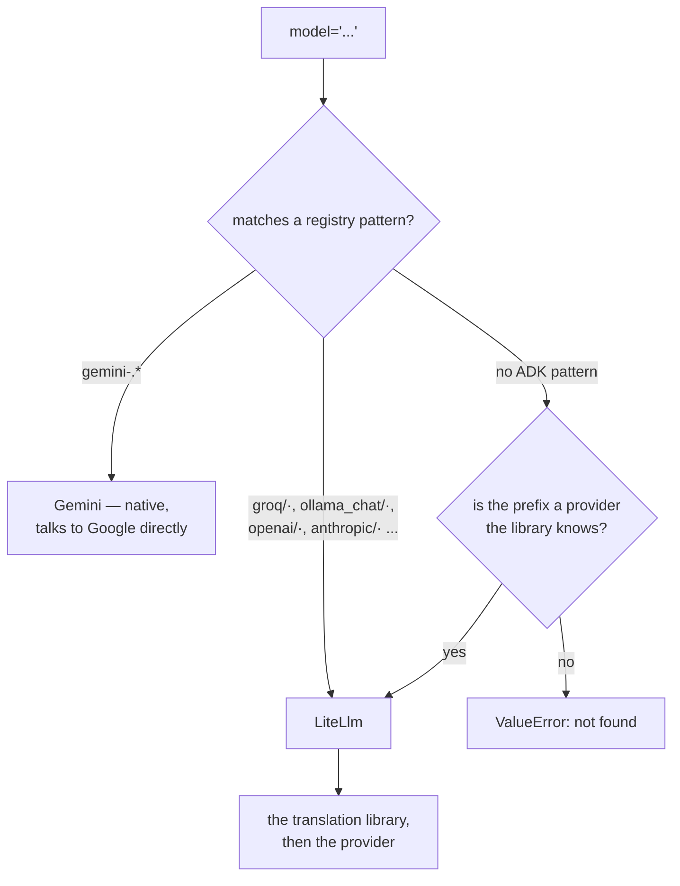

# 1.1 — A name is a lookup

## One-line answer

The string in `model=` is not a name the framework passes along — it is a **key into a table of
patterns**, and which class ends up talking to the network is decided by matching that string against
the table.

---

## The story

There is a hardware shop near most people's homes with drawers all the way up the wall, none of them
labelled in any way you could read.

You go in and say: "half-inch elbow."

The man behind the counter does not look anything up. He turns round, opens the fourth drawer from
the left on the second shelf, takes out a small brass fitting, and puts it on the counter. Eight
seconds.

What just happened is not what it looks like. He did not fetch a "half-inch elbow" — there is no such
object in the drawer, there is a brass fitting. What he did was **translate**. Your words are a key;
his memory is the table; the drawer is the answer. If you had said "half-inch bend" he would have
opened the same drawer, and if you had said "half-inch elbow, plastic" he would have opened a
completely different one, three shelves down.

Say something that is not in his table — a size that shop does not stock — and he does not go
looking. He says "nahi hai", straight away, because the translation failed and there is nothing after
the translation to try.

That is `model="gemini-3.7-flash"`. It looks like a name being passed along. It is a key into a
table, and the whole of today depends on knowing what is in the table.

---

## The idea in plain language

On [Day 5, part 3.1](../../../day-05-first-adk-agent/parts/03-the-model-pin/3.1-the-default-that-moved.md)
you pinned a model explicitly, closing ADK-73, because ADK's default had moved and an implicit default
is a silent bug. You wrote:

> `model="gemini-3.7-flash"`

and it worked, and nothing made you ask what that string *is*.

It is not passed to Google. ADK has a **registry**: a list of regular-expression patterns, each
paired with a class that knows how to talk to one family of providers. When you build an agent, the
string is matched against those patterns, and the first match decides which class handles your calls.

Two things ADK ships that matter today:

| Pattern | Class | Talks to |
| --- | --- | --- |
| `gemini-.*` | `Gemini` | Google's API directly, using `google-genai` |
| `groq/.*`, `ollama_chat/.*`, `openai/.*`, and a dozen more | `LiteLlm` | a translation library, which talks to everybody else |

So `gemini-3.7-flash` resolves to `Gemini`, which is native: ADK speaks Gemini without an adapter,
which is why Days 5 to 8 needed nothing but a key.

And `groq/llama-3.3-70b-versatile` resolves to `LiteLlm`, which is
[2.1](../02-the-translator/2.1-one-charger-many-sockets.md)'s subject: one library that makes a
hundred providers look like one API.

**The `provider/model` shape is the convention**, and it is worth naming because it is the shape you
will type all day. Before the slash is the provider; after it is that provider's own model name. When
the provider itself has slashes in its model names — OpenRouter does, because it aggregates other
people's models — you get two: `openrouter/z-ai/glm-5.2:free` is provider `openrouter`, model
`z-ai/glm-5.2:free`.

Three consequences, and the third is the one that costs an afternoon.

**A string with no provider prefix means Gemini or nothing.** `llama-3.3-70b-versatile` on its own
matches no pattern and fails. The prefix is not decoration.

**The registry is extensible and mostly invisible.** ADK spells out the common providers and defers
the rest to the translation library, so a provider ADK has never heard of can still work — provided
the library knows it. That is why `openrouter/...` is **not** in ADK's own pattern list and still
resolves.

**Nothing is looked up until something needs the model.** Building the agent does not resolve the
string. That is [1.2](1.2-the-spare-tyre-you-never-checked.md), and it is why a typo in a model name
survives every test you have that does not make a call.

---

## Why Sutra needs it

**Today**, immediately: the whole day is swapping one string for another and watching what changes.
Knowing that the string selects a *class* rather than being passed through is the difference between
"it did not work" and "it resolved to the wrong thing".

**Day 70** builds the Quota-Router, which chooses a provider per call based on who has headroom left.
That is a decision about which string to use, made at runtime, and it only makes sense once the string
is understood as a selector.

**Day 91** is the interop survey. Every "how do I use provider X" question in this field reduces to
"what string, and does the registry know it?"

And structurally: Principle 8 says never invent an API. A model string is the most invented-looking
thing in this entire framework — it is a bare string with no type and no autocomplete — and the only
defence is to resolve it and look.

---

## The mechanism

Ask the registry directly. No agent, no model call, no key:

```python
# lab/resolve.py - what class each string actually selects.
from google.adk.models import LLMRegistry

CANDIDATES = [
    "gemini-3.7-flash",
    "gemini-3.5-flash-lite",
    "groq/llama-3.3-70b-versatile",
    "openrouter/z-ai/glm-5.2:free",
    "ollama_chat/llama3.1:8b",
    "llama-3.3-70b-versatile",
]

for name in CANDIDATES:
    try:
        print(f"{name:<32} -> {LLMRegistry.resolve(name).__name__}")
    except Exception as exc:
        print(f"{name:<32} -> {type(exc).__name__}: {str(exc).splitlines()[0]}")
```

**Line by line:**

- `from google.adk.models import LLMRegistry` — the public import. The registry is a class with static
  methods, so nothing is constructed.
- `LLMRegistry.resolve(name)` — the exact call ADK makes internally when it needs a model, returning
  the **class** rather than an instance. Asking it yourself is the cheapest way to answer "what will
  this string do".
- `.__name__` on the result — because a class prints as `<class 'google.adk.models...'>`, which buries
  the one word you want.
- `"llama-3.3-70b-versatile"` last, deliberately with **no provider prefix** — the control. It is a
  real Groq model name, spelled correctly, and it is the wrong kind of string.
- `except Exception` rather than a specific type — because the failures here are not all the same
  class, and this script's job is to report rather than to handle.
- `str(exc).splitlines()[0]` — the first line only. One of these errors is six lines long and
  helpful, and printing all of it six times would bury the table. The full text is in
  [2.2](../02-the-translator/2.2-the-toolkit-you-did-not-need.md).

On a machine with **no** translation library installed — which is yours, today, before setup — that
prints:

```text
gemini-3.7-flash                 -> Gemini
gemini-3.5-flash-lite            -> Gemini
groq/llama-3.3-70b-versatile     -> ValueError: Model groq/llama-3.3-70b-versatile not found.
openrouter/z-ai/glm-5.2:free     -> ValueError: Model openrouter/z-ai/glm-5.2:free not found.
ollama_chat/llama3.1:8b          -> ValueError: Model ollama_chat/llama3.1:8b not found.
llama-3.3-70b-versatile          -> ValueError: Model llama-3.3-70b-versatile not found.
```

Two Gemini strings resolve; the other four do not, and **three of the four are correct strings** that
will resolve perfectly once [2.2](../02-the-translator/2.2-the-toolkit-you-did-not-need.md) installs
one package. The fourth will never resolve, because it has no provider.

Run it again after that install and the middle three change. That before-and-after is worth doing
rather than reading: it is the clearest possible demonstration that the string is a key and the table
is a thing you can change.



The right-hand branch is the one worth remembering: ADK does not have to know your provider. It only
has to fail to recognise it and hand the question to something that might.

---

## When it breaks

**💥 The correct model name with no provider.**

```text
ValueError: Model llama-3.3-70b-versatile not found.

Provider-style models (e.g., "provider/model-name") require the litellm package.
Install it with: pip install google-adk[extensions]
Or: pip install litellm>=1.75.5

Supported providers include: openai, groq, anthropic, and 100+ others.
See https://docs.litellm.ai/docs/providers for a full list.
```

A genuinely good error — it names the shape, the fix and a link. It is also **wrong about this
particular string**, which has no provider prefix at all, so installing the package will not help.
The message is written for the common case and this is the uncommon one. Worth knowing, because
following a helpful error's advice and having nothing change is a demoralising twenty minutes.

**💥 A Gemini model that does not exist.**

```text
gemini-9.9-turbo                 -> Gemini
```

The pattern is `gemini-.*`, so **any** string starting with `gemini-` resolves happily, including one
you invented. Resolution is not validation: the registry has decided which class handles it and has
no opinion about whether Google has ever heard of it. That failure arrives from the network, later,
which is [1.2](1.2-the-spare-tyre-you-never-checked.md).

**💥 The Ollama string that resolves to something unexpected.**

`ollama/gemma3:12b` does **not** resolve to `LiteLlm`. There is a more specific pattern —
`ollama/gemma3.*` — pointing at a dedicated class that exists to work around that model family's
function-calling quirks. Correct behaviour, and surprising the first time, and the reason
[3.2](../03-local/3.2-two-switches-that-look-the-same.md) has a part to itself.

---

## In production

**What a professional writes instead of the teaching version** is a model string that lives in
configuration and is validated at startup rather than at first use. `LLMRegistry.resolve()` in a
health check turns "an unknown model name" from a runtime failure into a process that refuses to
start — which is the same instinct as
[Day 7, part 4.2](../../../day-07-events-and-streaming/parts/04-the-brakes/4.2-the-note-the-machine-refuses.md)'s
strict configuration: fail at the door.

**What degrades at scale** is the number of strings. One agent with one model is a constant. A triage
graph where the classifier, the researcher and the writer each have their own model, per environment,
with a fallback each, is a dozen strings — and every one of them can be individually wrong in a way
nothing catches until that node runs. Teams end up with a small module listing the models by role,
which is one place to look and one place to change on the day a provider retires something.

**The failure that only shows with real traffic** is the model that resolves and is not the one you
meant. A string with a typo in the *provider* half fails loudly; a typo in the *model* half resolves
to the right class and fails at the network with a provider-specific error you have never seen. And a
string that is subtly the wrong model — a smaller variant, an older version — does not fail at all.
It just answers worse, which is attributed to the prompt.

**The review comment a senior engineer leaves:** *"Resolve these model strings at startup instead of
finding out on the first request. And put them in one module keyed by role — right now `gemini-3.7-flash`
appears in four files and we'll miss one when it's deprecated."*

**The interview question:** *"how does a framework decide which provider to call?"* The answer that
shows you have looked: "The model string is a key into a registry of patterns, not a name that gets
passed through. Native providers get their own class; everything else matches a `provider/model`
prefix and goes through a translation layer, and if the framework doesn't recognise the prefix it
hands the question to that layer, which knows a hundred more. Two things follow that people get
caught by. Resolution isn't validation — anything matching `gemini-.*` resolves, including a model
that doesn't exist — and nothing resolves until something actually needs the model, so a typo
survives every test that doesn't make a call."

---

## Check yourself

```bash
uv run python days/day-09-four-free-providers/lab/resolve.py
```

Keep the output. You will run this again after the install in
[2.2](../02-the-translator/2.2-the-toolkit-you-did-not-need.md) and the difference is the point.

**Answer out loud, without scrolling up:**

> Say what the string in `model=` actually is, and what it selects. Then explain why
> `gemini-9.9-turbo` resolves and `llama-3.3-70b-versatile` does not, even though only one of them is
> a real model.

---

**Next:** [1.2 — The spare tyre you never checked](1.2-the-spare-tyre-you-never-checked.md)
