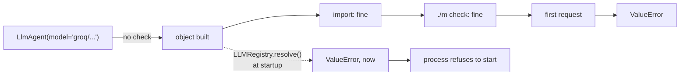

# 1.2 — The spare tyre you never checked

## One-line answer

An agent with an impossible model string **builds without complaint** — the string is not resolved
until something needs the model — so a typo survives import, survives every test that does not make a
call, and arrives at the first real request.

---

## The story

There is a spare tyre under the boot of most cars, held down by a wing nut, with a jack beside it.

You have never looked at it. It came with the car. It has been under there for two years and you have
driven perhaps twenty thousand kilometres with it, and every one of those kilometres you would have
described yourself as prepared for a puncture.

Then one evening on a highway with no lights you get one.

You take everything out of the boot, undo the wing nut, lift the tyre out, and it is soft. Not flat —
soft, in a way that would have taken thirty seconds at any petrol pump on any of those twenty
thousand kilometres.

Nothing failed tonight. The tyre has been soft for most of two years. What failed tonight is the
first moment anything *asked* it to be inflated, and by then you are on a highway rather than at a
petrol pump.

The important detail is not that the tyre was soft. It is that **there was no point in those two
years at which the car would have told you.** The problem existed continuously and was only ever
observable at the worst possible moment, which is a very specific and very common kind of bug.

---

## The idea in plain language

[1.1](1.1-a-name-is-a-lookup.md) said the model string is a key into a registry. This part is about
**when** the lookup happens, and the answer is: not when you think.

`LlmAgent` stores the string. That is all it does with it. The field's declared type allows both a
string and a model object, so a string is simply held, and nothing validates it, because validating
it would mean resolving it, and resolving it is not the constructor's job.

The resolution happens on a property called `canonical_model`, which the runtime reads when it is
about to make a call. That is where the registry is consulted and where a bad string raises.

So the sequence, for a string that cannot resolve:

1. `LlmAgent(model="groq/llama-3.3-70b-versatile")` — **fine.** Object built.
2. `import` of the module holding it — **fine.**
3. Any test that checks the agent's `name`, `description` or `instruction` — **fine.**
4. `./m check` — **fine**, because nothing in it makes a model call.
5. The first real request — `ValueError`.

Four green steps and then a failure, and the four green steps are exactly the ones you would use to
convince yourself the change was safe.

This is the same shape as the pin you added on
[Day 5, part 3.1](../../../day-05-first-adk-agent/parts/03-the-model-pin/3.1-the-default-that-moved.md)
to close ADK-73. That day's lesson was *always pin the model explicitly, because an implicit default
is a silent bug*. Today's is the sibling: **an explicit pin is only as good as the moment it is
checked**, and by default that moment is a request you have already paid for.

The fix is one line and it is not clever:

> `LLMRegistry.resolve(model_string)`

Call it at startup, in a health check, or in a test. It costs nothing, touches no network, and turns
a runtime failure into a process that refuses to start. That is the thirty seconds at the petrol
pump.

There is one wrinkle worth knowing before you rely on it. Resolution answers *"does a class exist
that would handle this string"* and **not** *"does this model exist"*. `gemini-9.9-turbo` resolves
happily, as [1.1](1.1-a-name-is-a-lookup.md) showed. So the check catches a missing provider, a
missing library and a malformed string, and does not catch an invented model. That is still worth
having; it is just worth knowing which half you bought.

---

## Why Sutra needs it

**Today**, immediately: you are about to change Sutra's model string four times. Each change looks
identical from outside — one line, one string — and the difference between a working one and a broken
one only appears at a request that costs quota you cannot spare.

**Day 24** is quota accounting, and a request that fails on a bad model string still counted against
your daily limit at some providers. Failing before the call is not only faster, it is cheaper.

**Day 31** is the quality gate, where `./m check` grows lints — including the `:free`-suffix lint from
[7.1](../07-failure-lab/7.1-the-free-trial-that-charges.md). This part is the argument for a check
that runs without a network: the things worth catching before a call are worth catching in CI.

**Day 70** is the Quota-Router, which will hold several model strings and choose between them at
runtime. A string that is only ever resolved when it is chosen is a string that can be broken for
weeks and only fail on the day the router picks it.

---

## The mechanism

The whole failure, and its fix, in one free script:

```python
# lab/deferred.py - when a bad model string actually fails.
from google.adk.agents import LlmAgent
from google.adk.models import LLMRegistry

BROKEN = "groq/llama-3.3-70b-versatile"  # correct string; the library is not installed yet

print("--- building the agent ---")
agent = LlmAgent(name="probe", model=BROKEN, instruction="You triage tickets.")
print("built. model field is:", repr(agent.model))
print("type of the field    :", type(agent.model).__name__)
print("name / instruction   :", agent.name, "/", agent.instruction[:20] + "...")
print()

print("--- asking for the resolved model ---")
try:
    print(agent.canonical_model)
except Exception as exc:
    print(f"{type(exc).__name__}: {str(exc).splitlines()[0]}")
print()

print("--- the startup check that would have caught it ---")
try:
    LLMRegistry.resolve(BROKEN)
    print("resolves - safe to start")
except Exception as exc:
    print(f"refusing to start: {str(exc).splitlines()[0]}")
```

**Line by line:**

- `BROKEN` is a **correct Groq model string**, not a typo. That is the point: it is unresolvable today
  only because one package is missing, which is the most realistic version of this failure — a
  deployment where a dependency did not make it.
- `LlmAgent(name=..., model=BROKEN, instruction=...)` — no error, and the object is fully usable for
  everything except calling a model.
- `repr(agent.model)` and `type(agent.model).__name__` — printed together, because the finding is that
  it is still a **`str`**. It was not converted, wrapped or checked. It was stored.
- `agent.name` and `agent.instruction` printed — to make the point that the rest of the agent is
  perfectly fine. A test asserting on either of those passes.
- `agent.canonical_model` inside a `try` — the property that resolves. This is the first line in the
  script that can fail, and in a real program it is not a line you wrote; the runtime reads it for
  you, deep inside a call.
- `str(exc).splitlines()[0]` — the first line again, for the reason
  [1.1](1.1-a-name-is-a-lookup.md) gave.
- `LLMRegistry.resolve(BROKEN)` at the bottom — the same check, moved to a place you control. Note it
  is exactly the same failure and exactly the same message; the only thing that changed is **when**.

The output:

```text
--- building the agent ---
built. model field is: 'groq/llama-3.3-70b-versatile'
type of the field    : str
name / instruction   : probe / You triage tickets....

--- asking for the resolved model ---
ValueError: Model groq/llama-3.3-70b-versatile not found.

--- the startup check that would have caught it ---
refusing to start: Model groq/llama-3.3-70b-versatile not found.
```

The second and third blocks report **the same error**. That is the whole part: nothing about the
problem changed, only the moment it was allowed to surface.



And the shape that belongs in Sutra, for the day the model string starts coming from configuration:

```python
# sutra/desk/models.py - resolve at startup, not at the first request.
from google.adk.models import LLMRegistry

DESK_MODEL = "gemini-3.7-flash"


def check(model: str = DESK_MODEL) -> str:
    """Raise now if this string cannot select a model class. Costs nothing."""
    LLMRegistry.resolve(model)
    return model
```

**Line by line:**

- `DESK_MODEL` as a module constant — one home for the string, for the same reason Day 8 gave
  `APP_NAME` one home. Four files each naming the model is four places to miss on the day it is
  deprecated.
- `def check(model: str = DESK_MODEL) -> str` — takes the model as a parameter with a default, so it
  reports on **whatever is actually configured** rather than on the constant. The day the value comes
  from an environment variable, this function keeps telling the truth unedited.
- `LLMRegistry.resolve(model)` with its **result discarded** — this is a check, not a factory. Keeping
  the class would invite somebody to instantiate it here and quietly move model construction out of
  ADK's hands.
- Returning the string rather than `None` — so a caller can write `model=check()` and get the
  validation for free at the point of use. A guard you have to remember to call separately is a guard
  somebody will forget.
- No `try` — the exception is the product. Catching it here to log a warning would rebuild exactly
  the deferred failure this module exists to prevent.

---

## When it breaks

**💥 The deployment that started and could not answer.**

```text
ValueError: Model groq/llama-3.3-70b-versatile not found.

Provider-style models (e.g., "provider/model-name") require the litellm package.
Install it with: pip install google-adk[extensions]
Or: pip install litellm>=1.75.5
```

The container starts, the health check passes, the platform marks it ready, traffic arrives, and
every request fails. Nothing was wrong with the build; a dependency did not make it into the image.
A health check that resolves the model string turns this into a container that never goes ready,
which is a much better Tuesday.

**💥 The model name that resolves and does not exist.**

```text
gemini-9.9-turbo                 -> Gemini
```

Resolution is not validation. `LLMRegistry.resolve` will not save you from an invented Gemini model,
because the pattern is `gemini-.*` and yours matches. The failure comes from Google, at the request,
with a provider-specific message. The only defence for this half is one real call — which costs one
request, and which is exactly what an agent smoke test is for.

**💥 The test suite that proves nothing about the model.**

Not an error. `./m check` is green with a completely broken model string, and it is green because it
correctly makes no network calls. That is the right design for a test suite and it means **green does
not mean callable**. Knowing which of the two you have is the point of adding the resolve check.

---

## In production

**What a professional writes instead of the teaching version** is a readiness check that resolves
every configured model string and refuses to serve if any fails. Not a startup log line — a refusal,
because a log line about a broken model gets read after the incident. This is the same principle as
[Day 7, part 4.2](../../../day-07-events-and-streaming/parts/04-the-brakes/4.2-the-note-the-machine-refuses.md):
fail at the door, loudly, rather than in the middle, quietly.

**What degrades at scale** is the gap between "configured" and "checked". One model string is easy.
A system with a model per agent, per environment, plus fallbacks, has a dozen — and each one is only
exercised when that agent runs in that environment, which for a fallback might be never until the
day it matters. The fallback nobody has ever resolved is the most common version of the soft spare
tyre.

**The failure that only shows with real traffic** is the model that was deprecated while your service
was running. Providers retire models on a schedule; your process holds a string it resolved
successfully at startup, and the string is still resolvable — the class still exists — while the
model behind it no longer answers. A startup check cannot catch this, because nothing about your
process changed. What catches it is reading the provider's deprecation notices, which is a human
process, and it is why `docs/PACKAGES.md` records model strings with dates alongside package
versions.

**The review comment a senior engineer leaves:** *"Nothing checks these model strings until a request
comes in, so a missing dependency gives us a container that goes ready and then fails everything.
Resolve them in the readiness probe. And put the model name in one module — it's in four files and
we'll miss one when Gemini retires it."*

**The interview question:** *"you changed a model name and everything passed, then production broke.
What happened?"* The answer that shows you have shipped one: "The model string isn't validated when
the agent is built — it's stored, and it's resolved when something actually needs to make a call. So
imports pass, unit tests pass and CI passes, because none of them talk to a provider. The fix is to
resolve the string at startup, in the readiness check, so a bad name or a missing provider library
stops the process instead of stopping the requests. What that *doesn't* catch is a model name that's
well-formed and doesn't exist — resolution picks the class, not the model — so I'd want one real
smoke call as well, and the model names recorded with dates so a deprecation is something we read
about rather than discover."

---

## Check yourself

```bash
uv run python days/day-09-four-free-providers/lab/deferred.py
```

Then change `BROKEN` to `"gemini-9.9-turbo"` and run it again. Two of the three blocks change, and
which two is the lesson.

**Answer out loud, without scrolling up:**

> List the four things that stay green with a broken model string, and say why each one is right to
> be green. Then say what `LLMRegistry.resolve` does and does not check.

---

**Next:** [2.1 — One charger, many sockets](../02-the-translator/2.1-one-charger-many-sockets.md)
