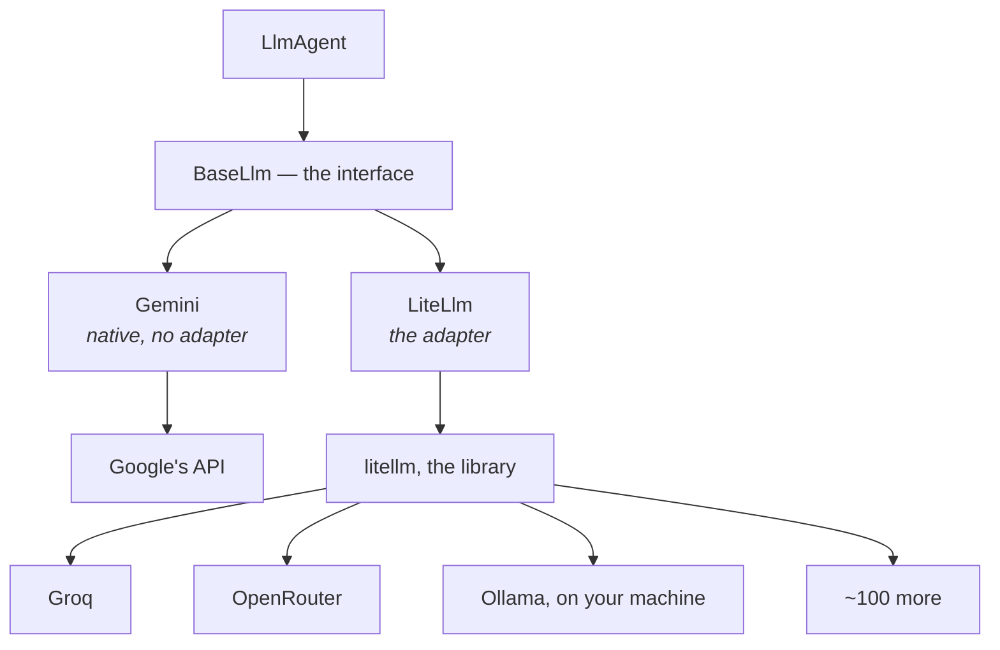

# 2.1 — One charger, many sockets

## One-line answer

LiteLLM is a translation layer: it takes one request shape and speaks it to a hundred different
providers, which is what lets the same ADK agent talk to Groq, OpenRouter or a model on your own
laptop by changing one string.

---

## The story

You pack for a week away and you take one charger and a small white adapter.

The charger has a USB-C cable at one end and a brick at the other. The brick has the pins folded
into it, and there is a slide on the side that changes which pins come out: the two round ones, the
three flat ones, the two flat angled ones.

Your phone does not know about any of this. It has one socket, it gets its five volts, and it has no
opinion about which wall it came from. The brick handles the difference.

Two things about that arrangement are worth noticing, because both of them come back in code.

**It is not magic, it is a shape.** The brick works because every one of those sockets delivers
roughly the same electricity in a differently-shaped hole. If one country used a fundamentally
different kind of power, no adapter would help — you would need a different appliance.

**It is one more thing that can go wrong.** The adapter is a joint. It can be loose, it can be the
cheap kind that runs warm, and the day your phone does not charge you now have three suspects
instead of two. Most of the time it saves you enormously. Occasionally it *is* the problem, and it
takes longer to work that out precisely because you stopped thinking about it.

LiteLLM is that adapter, and both halves are true of it.

---

## The idea in plain language

Different model providers have different HTTP APIs. Different URLs, different JSON shapes, different
names for the same idea, different ways of returning an error. Writing code against four of them
means writing four clients.

**LiteLLM is a Python library that gives you one shape and speaks all of them.** You send a request
in one format; it translates to whatever the provider wants, sends it, translates the reply back, and
hands you the same shape regardless of who answered.

The shape it standardises on is the one OpenAI's API popularised — a list of messages with roles, a
model name, and a response with choices — because that shape became the de facto common language for
this field. Using it does not mean you are calling OpenAI, and this is a genuine and common
confusion: a library speaking that dialect to Groq is not routing anything through OpenAI, any more
than an adapter with round pins sends your electricity through Europe.

ADK's side of this is one class:

> `from google.adk.models.lite_llm import LiteLlm`
>
> `agent = LlmAgent(model=LiteLlm(model="groq/llama-3.3-70b-versatile"), ...)`

`LiteLlm` implements ADK's `BaseLlm` interface — the same interface the native `Gemini` class
implements — so from the runner's point of view nothing has changed. This is
[Day 8, part 3.1](../../../day-08-sessions-and-services/parts/03-the-services/3.1-the-tap-and-the-pipe.md)'s
pattern again, one layer down: an interface, several implementations, and code that does not know
which one it has.

**Two ways to say it**, and they are not identical:

| Form | What it does |
| --- | --- |
| `model="groq/llama-3.3-70b-versatile"` | the registry resolves the prefix and constructs `LiteLlm` for you |
| `model=LiteLlm(model="groq/llama-3.3-70b-versatile")` | you construct it, and can pass extra arguments |

The string form is shorter and is what [1.1](../01-one-model-field/1.1-a-name-is-a-lookup.md) was
about. The object form is what you need the moment you want to configure anything — an API base for a
local server, extra headers, a timeout — and it is the form the ADK documentation uses, so it is the
one to be fluent in.

**Where the keys come from** is the part people expect to be complicated and is not. LiteLLM reads
environment variables, by provider: `GROQ_API_KEY`, `OPENROUTER_API_KEY`, and so on. Your `.env`
already has both, from
[Day 1, part 3.1](../../../day-01-bootstrap-and-map/parts/03-keys-and-env/3.1-the-three-free-doors.md),
and `sutra/config.py`'s `load_env()` already copies them into the environment at import. **You have
been carrying the keys for eight days without using two of them.**

And the honest cost, stated now rather than discovered later:

- **One more dependency between you and the provider.** When something is wrong, "is it me, ADK,
  LiteLLM or the provider?" is a four-way question.
- **It translates the common case well and the edges unevenly.** Streaming, tool calling and
  structured output all exist across providers and do not all mean the same thing. The adapter
  smooths what it can.
- **It is a large package.** [2.2](2.2-the-toolkit-you-did-not-need.md) is about that.

---

## Why Sutra needs it

**Addendum 02 is the reason this class exists in this curriculum at all.** Sutra runs on free tiers,
and there is no single free provider with enough quota to build a multi-agent system on. Three of the
four lanes — Groq, OpenRouter and Ollama — reach ADK through this one class.

**Day 70** builds the Quota-Router, routing each call to whichever provider has headroom. That is
only possible because switching provider is a string rather than a client rewrite.

**Day 16** brings built-in tools with a free-allowance question attached, and part of the answer is
being able to move work to a provider that has quota left.

**Day 91** is the interop survey, where the same adapter idea appears at three different levels —
LiteLLM for models, MCP for data, A2A for peers. Recognising the pattern is most of that day.

---

## The mechanism

The class, and the two ways to reach it. This part costs **nothing** — building a model object makes
no network call:

```python
# lab/two_forms.py - the string form and the object form, side by side.
from google.adk.agents import LlmAgent
from google.adk.models import LLMRegistry
from google.adk.models.lite_llm import LiteLlm

STRING_FORM = LlmAgent(
    name="via_string",
    model="groq/llama-3.3-70b-versatile",
    instruction="You triage tickets.",
)
OBJECT_FORM = LlmAgent(
    name="via_object",
    model=LiteLlm(model="groq/llama-3.3-70b-versatile"),
    instruction="You triage tickets.",
)

for agent in (STRING_FORM, OBJECT_FORM):
    print(
        f"{agent.name:<12} field={type(agent.model).__name__:<8} resolved={type(agent.canonical_model).__name__}"
    )

print()
print("what the registry maps the prefix to:", LLMRegistry.resolve("groq/x").__name__)
print("the same class the object form built:", LiteLlm.__name__)
print("and both implement           :", LiteLlm.__mro__[1].__name__)
```

**Line by line:**

- `from google.adk.models.lite_llm import LiteLlm` — the **full module path**, and it is not
  re-exported from `google.adk.models` in a way you can rely on, so this is the import the ADK
  documentation gives and the one to use. Verified against `adk.dev/agents/models/litellm/` on
  2026-08-26.
- Two agents differing in **one argument** — a string against a `LiteLlm` object — so the comparison
  in the loop has exactly one variable.
- `type(agent.model).__name__` — the field, which is `str` for one and `LiteLlm` for the other.
- `type(agent.canonical_model).__name__` — the resolved model, which is `LiteLlm` for **both**. That
  is the finding: the string form is a shorthand that ends in the same place, and
  [1.2](../01-one-model-field/1.2-the-spare-tyre-you-never-checked.md) is why the two lines differ in
  *when* they get there.
- `LLMRegistry.resolve("groq/x")` with a nonsense model name after the slash — deliberate, because
  the registry matches on the **prefix**. Anything after `groq/` resolves the same way, which is both
  convenient and the reason a typo in the model half is invisible.
- `LiteLlm.__mro__[1].__name__` — the method resolution order, whose second entry is the parent class.
  Printing it says, in one line, that `LiteLlm` is a `BaseLlm` like `Gemini` is — the interface claim,
  checked rather than asserted.

With LiteLLM installed, that prints:

```text
via_string   field=str      resolved=LiteLlm
via_object   field=LiteLlm  resolved=LiteLlm

what the registry maps the prefix to: LiteLlm
the same class the object form built: LiteLlm
and both implement           : BaseLlm
```

Where the layers sit:



The left branch is why Days 5 to 8 needed no adapter, and the right branch is the rest of today.

---

## When it breaks

**💥 The library that is not there.**

```text
ImportError: LiteLLM support requires: pip install google-adk[extensions]
```

Importing `LiteLlm` without the library installed fails at **import**, which is the friendly version
— you find out at the top of the file rather than at a request. Note the message recommends the fat
extra, and [2.2](2.2-the-toolkit-you-did-not-need.md) is about why you will not take that advice.

**💥 The provider key that is not set.**

LiteLLM reads keys from the environment by provider. With `GROQ_API_KEY` missing you do not get a
clear "no key" from ADK — you get whatever the library raises, which is provider-specific and
arrives at the call. `sutra/config.py`'s `require()` from
[Day 1, part 3.3](../../../day-01-bootstrap-and-map/parts/03-keys-and-env/3.3-loading-keys-failing-loudly.md)
exists precisely to turn that into a named failure at startup, and today is the first day you have a
second and third key to point it at.

**💥 Blaming the adapter first.**

Not an error, a habit. When a call through `LiteLlm` fails, the instinct is to suspect the layer you
added most recently. It is usually the provider — a rate limit, a retired model, a wrong key — and
the way to tell is to make the same call without ADK in the way. The library has a debug switch for
exactly this, which prints the actual request as a `curl` command:

```python
import litellm

litellm._turn_on_debug()
```

**Line by line:**

- `import litellm` — the underlying library, not ADK's wrapper. You are dropping one layer down on
  purpose.
- `_turn_on_debug()` — a **private** name, and this is documented on `adk.dev/agents/models/ollama/`
  as the way to see what is being sent. It goes in a lab script and never under `sutra/`, for the
  same reason
  [Day 6, part 3.1](../../../day-06-instructions-and-personas/parts/03-the-instruction-fields/3.1-where-your-instruction-lands.md)
  gave: a private name can be renamed in a patch release.
- What it prints is a runnable `curl`, which is the fastest possible way to answer "is it me or
  them": run the `curl`, and if it fails too, it was never your code.

---

## In production

**What a professional writes instead of the teaching version** is the object form everywhere, even
where the string form would do. Not for style: because the object form is where every later
configuration goes — an API base, a timeout, extra headers — and a codebase that has to convert from
strings to objects later will convert some of them and miss others. Pick the form that has room to
grow.

**What degrades at scale** is the four-way question. With a native client, a failure is you or the
provider. With an adapter it is you, the framework, the adapter or the provider, and the adapter's
error messages are the ones least likely to be about your problem. Teams that use one heavily learn
to reproduce failures one layer down — the `curl` above — as a first move rather than a last resort.

**The failure that only shows with real traffic** is uneven feature support. Every provider does
streaming, and they do not all mark the end of a stream the same way. Every provider does tool
calling, and they do not all return arguments in the same shape or handle a tool that returns nothing
the same way. The adapter smooths the common path, so your development and your tests look identical
across providers — and the differences surface on the unusual inputs that only real users produce.
This is the main reason
[4.1](../04-the-benchmark/4.1-two-routes-to-work.md) insists that a provider comparison be run on
your own prompts rather than trusted from a table.

**The review comment a senior engineer leaves:** *"Use `LiteLlm(model=...)` rather than the bare
string — we're going to need `api_base` for the local one and a timeout for the shared lane, and
converting half of these later is how one gets missed. And put the provider key check next to the
Gemini one so a missing `GROQ_API_KEY` fails at startup rather than at the first routed call."*

**The interview question:** *"how do you support several model providers without writing a client for
each?"* The answer that shows you have done it: "An adapter layer that standardises on one request
shape — in practice the OpenAI-style message format, because that became the common dialect — and
translates to each provider. The framework treats it as one more implementation of its model
interface, so switching provider is a string rather than a rewrite. What I'd be honest about is the
cost: you've added a layer, so a failure is now a four-way question, and feature support across
providers is even on the common path and uneven at the edges — streaming termination, tool-call
argument shapes, structured output. So I don't trust a comparison table; I run my own prompts through
each provider and measure, because the differences that matter are the ones in my traffic."

---

## Check yourself

```bash
uv run python days/day-09-four-free-providers/lab/two_forms.py
```

Run it before the install in [2.2](2.2-the-toolkit-you-did-not-need.md) and read the `ImportError`,
then again afterwards.

**Answer out loud, without scrolling up:**

> Say what LiteLLM translates and what it does not — including the thing an adapter fundamentally
> cannot fix. Then give the two ways to point an ADK agent at Groq, and one reason to prefer the
> longer one.

---

**Next:** [2.2 — The toolkit you did not need](2.2-the-toolkit-you-did-not-need.md)
