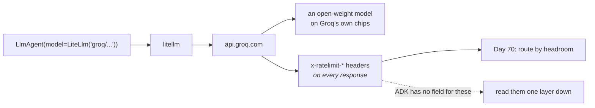

# 2.3 — The express counter

## One-line answer

Groq is not a model — it is a company running **other people's open-weight models on custom chips**,
very fast, on a free tier metered in requests per minute and per day, and it is the only one of your
four lanes that tells you exactly how much you have left on every single response.

---

## The story

A big shop on a Sunday. Two queues.

The long one goes to a normal counter, where somebody in front of you is buying a month's groceries
and paying partly in cash and partly by card and asking about a refund.

The short one has a board over it: **10 items or fewer.** Nobody in that queue has a trolley. It
moves in a way that does not look like a queue at all — you join it with four things and you are
outside in two minutes.

It is not faster because the person at that counter works harder. It is faster because of the
restriction. Ten items means every transaction is small and roughly the same size, so nothing ever
takes four minutes and nothing behind you ever waits on something unusual.

And it is genuinely useless for the month's groceries. Not slower — **not allowed**. The board is not
advice.

Now the part people miss about that counter. Above the till there is a small screen showing your
running total as things are scanned. You can see, at any moment, exactly where you stand. At the
normal counter you find out at the end.

Groq is that counter, including the screen.

---

## The idea in plain language

**First, the name.** Groq is not Grok. Grok is a model from a different company. Groq is an inference
company: they do not train models, they run **open-weight** models — Llama, Qwen, GPT-OSS and others —
on hardware they designed for the job. Same models other people run, considerably faster.

Which means the thing you are choosing when you choose Groq is **not a model family**. It is a place
to run one. That is a genuinely different kind of decision from choosing Gemini, and it is why the
comparison in [section 4](../04-the-benchmark/4.1-two-routes-to-work.md) has to be careful about what
it is comparing.

**Second, the string.** `groq/` then the model name Groq uses:

> `LiteLlm(model="groq/llama-3.3-70b-versatile")`

`groq/` is in ADK's own registry patterns, so the bare-string form resolves too, and the key comes
from `GROQ_API_KEY` in your environment — which
[Day 1, part 3.1](../../../day-01-bootstrap-and-map/parts/03-keys-and-env/3.1-the-three-free-doors.md)
put in `.env` eight days ago and which you have not used until today.

One oddity worth seeing before it confuses you: some of Groq's model names contain a slash of their
own. `openai/gpt-oss-20b` is an **open-weight** model whose name happens to start with `openai/`,
which through the adapter becomes `groq/openai/gpt-oss-20b`. Two slashes, one provider, and nothing
is being routed to OpenAI. Addendum 02's rule is about paid services, and this is not one.

**Third, what is on the free tier.** Verified on `console.groq.com/docs/models` on **2026-08-26**,
the production language models were:

| Model | Rough speed, from Groq's own page |
| --- | --- |
| `llama-3.1-8b-instant` | 560 tokens/sec |
| `llama-3.3-70b-versatile` | 280 tokens/sec |
| `openai/gpt-oss-20b` | 1000 tokens/sec |
| `openai/gpt-oss-120b` | 500 tokens/sec |

There are also **preview** models, and the docs are blunt about them: *"Preview models are intended
for evaluation purposes only and should not be used in production environments as they may be
discontinued at short notice."* Which is Principle 14's problem in someone else's words — pin one and
your system breaks on a schedule you do not control. Use the production list.

**Fourth, the limits.** From `console.groq.com/docs/rate-limits` on the same date, the free plan's
row for *other open models* — which is where the Llama and GPT-OSS models sit:

> **30 requests per minute · 1,000 requests per day · 8,000 tokens per minute**

Compare that with your Gemini lane, which Day 2 established at **20 requests per day** by reading a
live 429. Groq's daily allowance is **fifty times** Gemini's, and its per-minute allowance is real
rather than theoretical. That single fact reshapes how this curriculum can be run, and it is why
Addendum 02 calls Groq the speed lane.

The catch is in the third number. Eight thousand tokens **per minute** is not much: one long ticket
plus a long answer is a couple of thousand, so a handful of substantial calls in one minute will hit
the token limit long before the request limit. **Groq's constraint is size, not count** — which is
exactly the ten-items board.

**Fifth, and this is the part worth taking to every other provider you ever use.** Groq returns
rate-limit information in HTTP headers on every response:

| Header | What it means |
| --- | --- |
| `x-ratelimit-limit-requests` | your requests-per-**day** allowance |
| `x-ratelimit-limit-tokens` | your tokens-per-**minute** allowance |
| `x-ratelimit-remaining-requests` | how many requests are left today |
| `x-ratelimit-remaining-tokens` | how many tokens are left this minute |
| `x-ratelimit-reset-requests` / `-tokens` | when each window resets |
| `retry-after` | seconds to wait — **only on a 429** |

Read the first two rows again, because they are a trap in their own right: `limit-requests` is a
**daily** number and `limit-tokens` is a **per-minute** one, in headers that look symmetrical. Groq's
documentation says so explicitly, using the word *"always"*.

That is a running total on the screen above the till. You do not have to hit the limit to find out
where you stand, which is the opposite of Day 2's experience with Gemini, where the quota had to be
discovered by being refused.

---

## Why Sutra needs it

**Day 70** builds the Quota-Router, which routes each call to whichever provider has headroom. Those
headers are the input. A provider that reports its remaining quota can be routed *proactively*; one
that does not can only be routed *reactively*, after a failure — and that difference is most of the
router's design.

**Day 72** is honest backoff, closing SEC-15. `retry-after` is the number you respect, and Groq is
where you can see one.

**Day 79 onwards** is evals, which need many calls. A thousand requests a day makes an evalset
runnable in a way twenty does not.

**Day 53 onwards** is multi-agent, where a classifier runs on every ticket and does not need a large
model. A fast small model on a generous free tier is exactly the right lane for that node, and
choosing it is a real engineering decision rather than a preference.

---

## The mechanism

The same agent, one line different, plus the headers. **This part costs one request.**

```python
# lab/groq_lane.py - the same Sutra agent, pointed at Groq. One request.
import asyncio
import sys

from google.adk.agents import LlmAgent
from google.adk.models.lite_llm import LiteLlm
from google.adk.runners import Runner
from google.adk.sessions import InMemorySessionService
from google.genai import types

from sutra.config import load_env, require, require_free_tier
from sutra.desk.agent import INSTRUCTION
from sutra.desk.events import describe

MODEL = "groq/llama-3.3-70b-versatile"  # production list, checked 2026-08-26
QUESTION = "Ticket 4521: users are logged out after a few minutes. Two sentences."


async def main() -> None:
    load_env()
    require_free_tier()
    require("GROQ_API_KEY")

    agent = LlmAgent(
        name="sutra_desk_groq",
        model=LiteLlm(model=MODEL),
        description="Triages support tickets. Groq lane.",
        instruction=INSTRUCTION,
    )
    service = InMemorySessionService()
    session = await service.create_session(app_name="sutra", user_id="local")
    runner = Runner(agent=agent, app_name="sutra", session_service=service)

    async for event in runner.run_async(
        user_id="local",
        session_id=session.id,
        new_message=types.Content(role="user", parts=[types.Part(text=QUESTION)]),
    ):
        print(describe(event), file=sys.stderr)
        if event.usage_metadata:
            print("usage:", event.usage_metadata, file=sys.stderr)
        if event.is_final_response() and event.content and event.content.parts:
            print("".join(p.text or "" for p in event.content.parts))


asyncio.run(main())
```

**Line by line:**

- `MODEL` with a dated comment naming where the list came from — Principle 7 applied to a model
  string. Addendum 02 is explicit that free rosters move, and a bare string with no date is a claim
  nobody can check.
- `require("GROQ_API_KEY")` from
  [Day 1, part 3.3](../../../day-01-bootstrap-and-map/parts/03-keys-and-env/3.3-loading-keys-failing-loudly.md)
  — **before** the agent is built. LiteLLM's own failure for a missing key arrives at the call and is
  provider-specific; this turns it into a named error at the top, which is
  [1.2](../01-one-model-field/1.2-the-spare-tyre-you-never-checked.md)'s rule applied to a key rather
  than a model.
- `require_free_tier()` still called, even though nothing here touches Gemini — because it guards the
  process, not one provider, and dropping it "since this call is Groq" is how a guard rots.
- `from sutra.desk.agent import INSTRUCTION` — **the same handbook** from Day 6, unchanged. That is
  the whole experimental design: if the instruction differed between lanes, nothing you observe would
  be about the provider.
- `LiteLlm(model=MODEL)` — the object form from
  [2.1](2.1-one-charger-many-sockets.md), because [3.1](../03-local/3.1-cooking-at-home.md) will need
  `api_base` on the same shape and converting later is how one gets missed.
- A **new** `LlmAgent` rather than editing `sutra/desk/agent.py` — Sutra's own agent stays pinned to
  Gemini. This is a lab experiment, and the product's model is a decision for Day 70, not a thing to
  change while comparing.
- `print(..., file=sys.stderr)` for the trace and plain `print` for the answer — the same split as
  [Day 7, part 2.2](../../../day-07-events-and-streaming/parts/02-the-stream/2.2-the-partial-flag.md),
  so the answer stays pipeable.
- `event.usage_metadata` — one of the thirty-four event fields from
  [Day 7, part 1.2](../../../day-07-events-and-streaming/parts/01-the-event-object/1.2-the-fields-that-were-renamed.md),
  and this is the first day it has anything in it worth reading. Printed only when present, because
  it is `None` on most events.

```text
TODO(me): run it and paste your own output, from
    uv run python days/day-09-four-free-providers/lab/groq_lane.py
This document deliberately prints no transcript it did not produce (Principle 10). What you are
looking for: an answer in Sutra's voice from a model Google did not make, and a usage line whose
token counts are in the same shape as Gemini's.
```

And the headers, which ADK does not surface, so you go one layer down. **This also costs one
request** — do it once, keep the output, and refer back to it on Day 70:

```python
# lab/groq_headers.py - what Groq tells you about your own quota. One request.
import litellm

from sutra.config import load_env, require

load_env()
require("GROQ_API_KEY")

response = litellm.completion(
    model="groq/llama-3.1-8b-instant",
    messages=[{"role": "user", "content": "Reply with the single word: ok"}],
    max_tokens=5,
)

headers = response._hidden_params.get("additional_headers", {})
for name in sorted(headers):
    if "ratelimit" in name or "retry-after" in name:
        print(f"{name:<44} {headers[name]}")
```

**Line by line:**

- `import litellm` directly, with no ADK — deliberately dropping a layer, because ADK's `Event` has no
  field for provider response headers and inventing one would be worse than looking underneath.
- `litellm.completion(...)` — the library's own entry point, in the OpenAI-shaped format from
  [2.1](2.1-one-charger-many-sockets.md). Seeing that shape once is worth the detour.
- `llama-3.1-8b-instant`, the **smallest** production model, and `max_tokens=5` — this call exists to
  read headers, not to produce an answer, so it should be the cheapest possible call against the
  token-per-minute limit.
- `response._hidden_params` — a **private** attribute, and it goes in the lab and never under
  `sutra/`, for the reason
  [Day 6, part 3.1](../../../day-06-instructions-and-personas/parts/03-the-instruction-fields/3.1-where-your-instruction-lands.md)
  gave: a leading underscore is a name that can change in a patch release.
- The filter matching **substrings** rather than exact names, and this is not laziness. The library
  passes six specific rate-limit headers through **unprefixed** — they are on a list of
  OpenAI-compatible headers it recognises — and prefixes everything else it did not recognise with
  `llm_provider-`. So `x-ratelimit-remaining-tokens` arrives under that exact name and `retry-after`
  arrives as `llm_provider-retry-after`. Two naming conventions in one dictionary, decided by a list
  inside the library, which is exactly the kind of thing you find by printing rather than by
  assuming.
- `retry-after` will be **absent** on a successful call under either name, which is itself worth
  seeing: the header only exists on a 429.

```text
TODO(me): run it once and paste the headers, from
    uv run python days/day-09-four-free-providers/lab/groq_headers.py
Then work out, from `x-ratelimit-remaining-requests` and `x-ratelimit-remaining-tokens`, which of the
two limits you would hit first with Sutra's actual ticket sizes. Write the answer down; Day 70 needs
it.
```



---

## When it breaks

**💥 The key that is not set.**

Without the `require()` guard, a missing `GROQ_API_KEY` surfaces from the library at the call, in a
provider-specific shape you have not seen before, several frames deep. With the guard:

```text
sutra.config.ConfigError: GROQ_API_KEY is not set. Add it to .env (see .env.example).
```

One line, at the top, naming the file to edit. That guard was written on Day 1 for a key you were not
using; today is the day it pays.

**💥 The tokens-per-minute limit, which arrives before you expect it.**

```text
litellm.RateLimitError: RateLimitError: GroqException - Rate limit reached ...
```

Thirty requests a minute sounds generous and eight thousand tokens a minute is the real ceiling. A
handful of calls carrying a long ticket will hit it. The fix is not to retry harder — it is to notice
which of the two limits you hit, which is what the headers are for, and Day 72 is where the backoff
gets built honestly.

**💥 The preview model that disappeared.**

No error you can prevent. A model on the preview list can be discontinued at short notice, by design,
and your pinned string then names something that no longer exists. This is exactly Principle 14 —
reality changed — and the reason a preview model must never be pinned in `sutra/`. Use one in the lab
if you like; do not build on it.

---

## In production

**What a professional writes instead of the teaching version** is a provider choice made per node
rather than per system. Sutra's classifier — one ticket in, one label out, thousands of times — wants
the fast small model on the generous tier. Its writer, which produces the customer-facing reply,
wants the best model available. Same framework, two strings, and the reasoning behind each written
down next to it.

**What degrades at scale** is the shared ceiling. Groq's free limits are per **organisation**, not per
key, so two people on one account share thirty requests a minute — and Addendum 02 is explicit that
creating extra accounts to dodge that is off the table, because it violates provider terms and barely
works anyway. The legitimate version of the same idea is routing across *different* providers, which
is Day 70.

**The failure that only shows with real traffic** is the token limit under bursty load. Average usage
sits comfortably under eight thousand tokens a minute; a burst of five tickets arriving together,
each with a pasted log file, does not. The average is fine, the p99 is refused, and it is refused for
whichever unlucky user was fifth. Rate-limit headers make this visible before it happens, which is
the strongest practical argument for reading them.

**The review comment a senior engineer leaves:** *"The classifier doesn't need a 70B model — put it on
the 8B one and note why. And we're ignoring the rate-limit headers on every response; log the
remaining counts, because right now the first sign we're near the limit is a 429 in front of a
customer."*

**The interview question:** *"how would you build on a free tier?"* The answer that shows you have
actually done it: "By treating quota as the currency and reading what the provider tells you. One
provider I used returns rate-limit headers on every response — remaining requests for the day,
remaining tokens for the minute, and the reset times — so you can route or throttle before you're
refused rather than after. The detail that catches people is that the two limits are on different
windows: requests per day, tokens per minute, in headers that look symmetrical. So the ceiling you
actually hit depends on the size of your prompts, not the number of them, and if you only count
requests you'll be surprised. And I'd separate the model choice per node — a classifier doesn't need
the big model, and putting it on the fast small one on the generous tier is free capacity."

---

## Check yourself

```bash
uv run python days/day-09-four-free-providers/lab/groq_lane.py
uv run python days/day-09-four-free-providers/lab/groq_headers.py
```

**Answer out loud, without scrolling up:**

> Say what Groq actually sells, and why that makes "Groq versus Gemini" a slightly wrong comparison.
> Then say which of Groq's two free limits you will hit first with Sutra's tickets, and how you would
> know before being refused.

---

**Next:** [2.4 — The wholesale market](2.4-the-wholesale-market.md)
