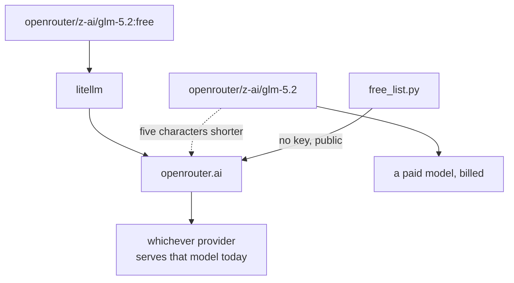

# 2.4 — The wholesale market

## One-line answer

OpenRouter is an aggregator — one key, one API, hundreds of models from dozens of vendors — and the
ones that cost nothing are marked by a **`:free` suffix on the model id**, a roster that changes
often enough that a name from two weeks ago is already gone.

---

## The story

There is a wholesale market on the edge of most cities. Not a shop — a street of them, three
kilometres of small units, all selling more or less everything.

You go for two reasons. One is that it is cheap. The other, which matters more, is that **everything
is there.** A shop near your house stocks what the neighbourhood buys. The market has the thing
nobody near you sells.

But you have to know how to shop there, and there are two rules everybody learns the hard way.

**Prices are on the item, not on the market.** Two stalls, thirty feet apart, different prices for
the same thing, and the difference is not always small. Nobody is cheating you; the market is a place
rather than a price list.

**The stall you went for may not be there.** Somebody had a unit for years, and this month it is a
mobile-repair shop. Nothing announced it. The market's catalogue is the market's actual state on the
day you visit, and last month's directions are a guess.

Both rules are exactly true of OpenRouter, and the second one has a dated proof in this curriculum's
own documents.

---

## The idea in plain language

**OpenRouter is a router**, in the ordinary sense: you send a request naming a model, and it forwards
it to whichever provider actually serves that model. One key, one API shape, hundreds of models from
dozens of vendors.

That makes it a genuinely different kind of lane from the other three:

| Lane | What it is |
| --- | --- |
| Gemini | one vendor's models, spoken natively |
| Groq | one company's hardware running open-weight models |
| **OpenRouter** | **an aggregator in front of many vendors** |
| Ollama | your own machine ([3.1](../03-local/3.1-cooking-at-home.md)) |

Addendum 02 calls it the **breadth lane**, and breadth is exactly what it is for: trying a model
family the other lanes do not have, without signing up anywhere new.

**The string** is `openrouter/` and then OpenRouter's own model id, which itself contains a vendor
and a slash:

> `LiteLlm(model="openrouter/z-ai/glm-5.2:free")`

Two slashes. Provider `openrouter`; model `z-ai/glm-5.2:free`. Note that `openrouter` is **not** in
ADK's own registry pattern list — [1.1](../01-one-model-field/1.1-a-name-is-a-lookup.md)'s fallback
is what resolves it, because the translation library knows the provider even though ADK does not
spell it out.

The key comes from `OPENROUTER_API_KEY`. There are three more environment variables the library
reads — `OPENROUTER_API_BASE`, which defaults to `https://openrouter.ai/api/v1`, and `OR_SITE_URL`
and `OR_APP_NAME`, which are optional attribution fields (verified on
`docs.litellm.ai/docs/providers/openrouter`, 2026-08-26). You need only the first.

### The suffix that is the whole point

**`:free` is part of the model id, and it is what makes the model free.**

`z-ai/glm-5.2:free` costs nothing. `z-ai/glm-5.2` — the same model, one suffix shorter — is a paid
model that bills your OpenRouter account. There is no warning, no confirmation and no difference in
the code except five characters.

That is why `CLAUDE.md` carries this rule:

> *`openrouter/` model strings must end in `:free` — the missing suffix bills a paid model. Linted
> from Day 31.*

And it is why [7.1](../07-failure-lab/7.1-the-free-trial-that-charges.md) is today's failure lab.

### The limits

Verified on `openrouter.ai/docs/api-reference/limits` on **2026-08-27**:

- **20 requests per minute**, on free models, regardless of anything else.
- **50 requests per day** for an account that has never purchased credits.
- 1,000 per day for an account that has bought at least $10 of credits, ever.

The second number is Sutra's, and the third is not: buying credits is a payment, and Addendum 02
rules payments out. **Fifty requests a day is a real ceiling** — more than Gemini's twenty, far less
than Groq's thousand — which places this lane precisely: for trying a model, not for running a
workload.

One further detail, and it is the sharpest contrast in today's whole comparison. OpenRouter's docs
say: *"Successful inference responses do not include `X-RateLimit-*` headers."* They appear only on a
429.

Put that next to [2.3](2.3-the-express-counter.md), where Groq reports your remaining quota on
**every** response. Groq lets you steer before you are refused; OpenRouter tells you after. Same
problem, two philosophies, and Day 70's router will have to handle both — proactively for one lane,
reactively for the other.

### The roster moves, and here is the proof

`02_ADDENDUM_ZERO_BUDGET_MODELS.md` was written on **2026-08-12** and lists, as free workhorses:

> `deepseek/deepseek-r1:free`, Llama 4 Scout `:free`, Qwen3 Coder `:free`, Gemma 3 `:free`, and ~25
> more

Fifteen days later, on **2026-08-27**, the live catalogue holds **416 models, of which 17 end in
`:free`**, and `deepseek/deepseek-r1:free` is **not among them**. The count went from "around 25 free
models" to 17, and the specific model the addendum named first is gone.

The list on that date:

```text
cohere/north-mini-code:free
dots-studio/dots-3-note-preview:free
google/gemma-4-26b-a4b-it:free
google/gemma-4-31b-it:free
liquid/lfm-2.5-2.6b:free
minimax/minimax-m2.7:free
minimax/minimax-m3:free
nvidia/nemotron-3-nano-omni-30b-a3b-reasoning:free
nvidia/nemotron-3-super-120b-a12b:free
nvidia/nemotron-3.5-content-safety:free
nvidia/nemotron-3.5-lightning:free
nvidia/nemotron-3-ultra-550b-a55b:free
poolside/laguna-s-2.1:free
poolside/laguna-xs-2.1:free
thinkingmachines/inkling-small:free
thinkingmachines/inkling:free
z-ai/glm-5.2:free
```

**Do not copy that list.** It is evidence that the list changes, and by the time you read it, it has.
The next section is how to get today's.

This is Principle 7 with the volume turned up. A package version at least fails loudly on the next
`uv sync`. A model name that lost its free tier does not fail — it **bills**, or it 404s at a
request. Addendum 02's rule exists for exactly this: *before pinning any model string, look up the
provider's current free list and record model + date.*

---

## Why Sutra needs it

**Day 31** adds the `:free`-suffix lint to `./m check`. The lint is trivial; the reason for it is this
part.

**Day 70** builds the Quota-Router across all four lanes, and OpenRouter is the one that cannot be
steered proactively — a fact that changes the router's design rather than being a footnote in it.

**Day 79 onwards** is evals. A second, differently-trained model is genuinely useful as a check on
the first, and OpenRouter is where you get one without a new account. Fifty requests a day is enough
for a spot check and not for a suite.

**Phase 14** takes the repository public. A committed model string without `:free` is a bill somebody
else could run up.

---

## The mechanism

**Always list before you pin.** This costs nothing — the catalogue endpoint needs no key:

```python
# lab/free_list.py - today's free roster, from the source. No key, no cost.
import json
import urllib.request

URL = "https://openrouter.ai/api/v1/models"

with urllib.request.urlopen(URL, timeout=30) as response:
    catalogue = json.load(response)

everything = catalogue["data"]
free = sorted(m["id"] for m in everything if m["id"].endswith(":free"))

print(f"models listed : {len(everything)}")
print(f"ending in :free: {len(free)}")
for model_id in free:
    print("  openrouter/" + model_id)
```

**Line by line:**

- `urllib.request` from the standard library rather than a HTTP package — the plan's *prefer the
  stdlib* rule, and it means this script works before any install and in any environment.
- No API key anywhere — the catalogue is public. Worth noticing: you can check what is free **before**
  you have an account, which makes this a thing you can put in CI.
- `timeout=30` — because `urlopen` with no timeout can hang forever, which in a lab script is
  annoying and in a scheduled job is a stuck worker.
- `m["id"].endswith(":free")` — the exact test the Day 31 lint will use, on the other side. Here it
  finds what is free; there it will find what is not.
- `sorted(...)` — because the catalogue's order is not alphabetical and you are going to read this
  with your eyes.
- `print("  openrouter/" + model_id)` — printing the **full ADK string**, prefix included, so the line
  can be copied straight into your code. A tool that prints something you then have to transform is a
  tool with one step missing.

The output on 2026-08-27 is the list above. The output on the day you run it is the one you use.

Then the lane itself. **This costs one request:**

```python
# lab/openrouter_lane.py - the breadth lane. One request. The suffix is not optional.
import asyncio
import sys

from google.adk.agents import LlmAgent
from google.adk.models.lite_llm import LiteLlm
from google.adk.runners import Runner
from google.adk.sessions import InMemorySessionService
from google.genai import types

from sutra.config import load_env, require, require_free_tier
from sutra.desk.agent import INSTRUCTION

MODEL = "openrouter/z-ai/glm-5.2:free"  # from lab/free_list.py on 2026-08-27
QUESTION = "Ticket 4521: users are logged out after a few minutes. Two sentences."


def guard(model: str) -> str:
    """Refuse an openrouter/ string that would bill. This is the Day 31 lint, early."""
    if model.startswith("openrouter/") and not model.endswith(":free"):
        raise ValueError(f"{model!r} has no ':free' suffix - that is a paid model")
    return model


async def main() -> None:
    load_env()
    require_free_tier()
    require("OPENROUTER_API_KEY")

    agent = LlmAgent(
        name="sutra_desk_openrouter",
        model=LiteLlm(model=guard(MODEL)),
        description="Triages support tickets. OpenRouter lane.",
        instruction=INSTRUCTION,
    )
    service = InMemorySessionService()
    session = await service.create_session(app_name="sutra", user_id="local")
    runner = Runner(agent=agent, app_name="sutra", session_service=service)

    async for event in runner.run_async(
        user_id="local",
        session_id=session.id,
        new_message=types.Content(role="user", parts=[types.Part(text=QUESTION)]),
    ):
        if event.usage_metadata:
            print("usage:", event.usage_metadata, file=sys.stderr)
        if event.is_final_response() and event.content and event.content.parts:
            print("".join(p.text or "" for p in event.content.parts))


asyncio.run(main())
```

**Line by line:**

- `MODEL` with a comment naming **the script and the date** it came from, not a page. The provenance
  of a model string is part of the string.
- `def guard(model)` — the Day 31 lint, written today as a function, because a rule you meet
  twenty-two days before it is enforced is a rule you will have broken by then. Three lines.
- `model.startswith("openrouter/")` before the suffix check — because the rule is provider-specific.
  A Groq or Gemini string has no `:free` suffix and must not be rejected for lacking one.
- `raise ValueError` rather than a warning — a warning about a billable model is a warning you find
  in the log after the bill. Principle 15 is not advisory.
- `guard(MODEL)` **inline** at the point of use rather than called separately at the top, so the
  string cannot reach `LiteLlm` without passing through it. A guard you have to remember to call is a
  guard you will forget.
- `require("OPENROUTER_API_KEY")` — the third key from Day 1, used for the first time.
- The same `INSTRUCTION` again, for the same reason as
  [2.3](2.3-the-express-counter.md): the only difference between lanes is the model string.
- No `describe(event)` trace here, unlike the Groq lane — deliberately, because you have seen it, and
  this script's job is to be the shortest possible thing that spends a request.

```text
TODO(me): run both, and paste your own output, from
    uv run python days/day-09-four-free-providers/lab/free_list.py
    uv run python days/day-09-four-free-providers/lab/openrouter_lane.py
This document deliberately prints no transcript it did not produce (Principle 10). Two things worth
writing down: how many models were free on **your** day, and whether the one this file pins still
exists. If it does not, that is not a broken document - it is the lesson.
```



---

## When it breaks

**💥 The model that is no longer free.**

There is no single error text, because it depends on how the model left the free list. If it was
removed entirely you get a 404-shaped failure from the router. If it lost only the `:free` variant,
the id you pinned stops existing and the paid id remains — so a "helpful" correction that drops the
suffix is one keystroke away and is a bill. **When a `:free` model disappears, the fix is to pick a
different free model, never to shorten the string.**

**💥 The daily limit, which is fifty.**

```text
litellm.RateLimitError: RateLimitError: OpenrouterException - ... 429 ...
```

Fifty a day arrives quickly during a benchmark. And unlike Groq, nothing warned you: the rate-limit
headers only exist on the 429 itself, so the first information you get about your remaining quota is
the message telling you it is gone.

**💥 The suffix that was never there.**

Not an error at all, which is the point. `openrouter/z-ai/glm-5.2` works perfectly. It answers, it
answers well, and it charges an account you set up on Day 1 for free access. The only thing standing
between you and that is a lint and a habit — which is why both start today rather than on Day 31.

---

## In production

**What a professional writes instead of the teaching version** is a model list that is **checked
rather than trusted**. `free_list.py` in CI, comparing the pinned strings against the live catalogue,
turns "our free model quietly stopped being free" from an invoice into a failing build. It is a
twenty-line job and it is the single highest-value thing in this part.

**What degrades at scale** is the assumption that a model id means one thing. An aggregator routes to
whichever provider serves that model, and providers differ in quantisation, context window, speed and
occasionally in behaviour. The same id on two days can be served by two different backends. For
Sutra this is fine; for anything where reproducibility matters, an aggregator is the wrong layer, and
that is a real reason to prefer a direct provider even when the aggregator is cheaper.

**The failure that only shows with real traffic** is the free model that is free and unavailable.
Free tiers on an aggregator are frequently the most contended capacity in the system, so a `:free`
model can be up, correct, listed — and returning errors under load because everyone is on it. The
symptom is intermittent failure that does not correlate with anything you did, and the answer is a
fallback lane, which is Day 70.

**The review comment a senior engineer leaves:** *"Pin these against the live catalogue in CI. And put
the `:free` check in the shared config rather than in one script — right now three files build model
strings and only one of them refuses to bill us."*

**The interview question:** *"how do you keep a system on free tiers from quietly costing money?"*
The answer that shows you have been near a real invoice: "Make the free-ness checkable and check it in
CI. The aggregator I used marks free models with a suffix on the model id, so the same model without
the suffix is the paid one — five characters, no warning, no confirmation. So there's a lint that any
string for that provider must carry the suffix, and a job that pulls the live catalogue and fails the
build if a pinned model is no longer on the free list. That second one matters more than it sounds:
in two weeks the free roster on that provider went from about twenty-five models to seventeen, and
the specific model our own documentation named first had gone. A package version at least fails
loudly when it disappears — a model name that stopped being free just bills you."

---

## Check yourself

```bash
uv run python days/day-09-four-free-providers/lab/free_list.py
uv run python days/day-09-four-free-providers/lab/openrouter_lane.py
```

Compare your free list with the one printed above, and count how many of the seventeen are still
there.

**Answer out loud, without scrolling up:**

> Say what makes an OpenRouter model free, and what happens if you get it wrong. Then say how
> OpenRouter and Groq differ in *when* they tell you about your remaining quota, and why that changes
> what a router can do.

---

**Next:** [3.1 — Cooking at home](../03-local/3.1-cooking-at-home.md)
