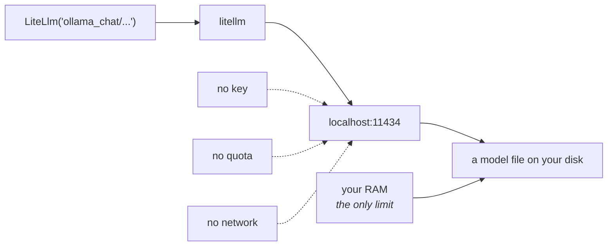

# 3.1 — Cooking at home

## One-line answer

Ollama runs a model on your own machine: no key, no quota, no network, nothing leaving the room — and
in exchange the model is smaller, the speed is whatever your hardware gives you, and the failures are
now yours to fix.

---

## The story

It is nine at night and you are hungry.

Ordering is easy. Somebody else has the ingredients, the pans, the practice and the heat, and in
half an hour there is food at the door that is better than most of what you could make. You paid for
all of that, and it was worth it, and you did not have to think.

Cooking is different in ways that are not only about effort.

You know exactly what went in. Nobody else knows you ate at nine. There is no minimum order, no
delivery charge and no surge on a rainy evening — you can make one egg at midnight and it costs what
one egg costs. If the shops are shut, you can still cook whatever is in the house.

And it is worse. It is genuinely worse most of the time. Your dal is not the restaurant's dal. It
takes longer than you think. And when it does not work, there is nobody to complain to — the pan, the
heat and the recipe are all yours.

Nobody sensible does only one of these. What people do is know which one tonight is: cooking when it
is late, or cheap, or private, or the shops are shut; ordering when the food itself is the point.

That is the local lane. It is not the cheap version of the cloud lane. It is a different trade, and
the trade is the subject.

---

## The idea in plain language

**Ollama** is a program that runs on your machine, downloads open-weight models, and serves them over
a local HTTP API — by default on `http://localhost:11434`. Nothing about that address goes anywhere;
`localhost` is your own computer talking to itself.

Which gives the lane its properties, and it is worth being precise rather than enthusiastic about
each one:

**No key.** There is nothing to authenticate to. Every other lane today needed a key from `.env`;
this one needs a running program.

**No quota.** Not "a generous quota" — none. There is no counter, no 429, no daily reset. What limits
you is how fast your own machine can do the work, which is a completely different kind of limit: it
never refuses you, it just takes longer.

**No network.** The request does not leave the machine. Addendum 02 makes a point that matters for
this project specifically: free tiers may use your prompts to improve their models, and Sutra's data
is synthetic precisely so that never matters. But **the day it is not synthetic, this is the only
lane you can use** — which is why the plan calls it the privacy lane rather than the offline one.

**Smaller models.** This is the honest cost. What runs on a laptop is a few billion parameters, and
what runs in a data centre is not. Addendum 02's rule of thumb: around 8 GB of RAM comfortably runs a
7–8B model, which is enough for Sutra's purposes and is not the same thing as being as good.

**Your problem now.** Nobody is on call for your laptop. A model that will not load, a machine that
runs hot, a download that failed halfway — all yours.

### Getting it running

Three commands, in order, and the second is the one that takes a while:

```bash
# 1 - is it installed and running?
ollama --version
curl -s http://localhost:11434/api/tags

# 2 - pull a model with tool support. Check the size before you start.
ollama list
ollama show <model>

# 3 - tell the translation library where to find it
export OLLAMA_API_BASE="http://localhost:11434"
```

**Line by line:**

- `ollama --version` — the first question is always *is it there*, and it is worth answering before
  anything else fails in a more confusing way. If this prints nothing, install Ollama from
  `ollama.com` and come back; this document does not pin an installer version because it is a
  desktop application rather than a project dependency.
- `curl -s http://localhost:11434/api/tags` — the second question, *is it running*. Installed and
  running are different states, and a connection refused here is the cause of most "ADK cannot reach
  Ollama" confusion. It returns JSON listing your local models.
- `ollama list` — what you already have. Models are gigabytes; check before downloading another.
- `ollama show <model>` — the important one. `adk.dev/agents/models/ollama/` says to look for
  **tools** under the model's Capabilities: *"If your agent is relying on tools, make sure that you
  select a model with tool support."* Sutra grows a tool on Day 10, so a model without it is a lane
  that stops working next week. The searchable list is at `ollama.com/search?c=tools`.
- `export OLLAMA_API_BASE="http://localhost:11434"` — the environment variable the library reads. You
  **can** pass `api_base` to the model object for generation, and the ADK page is explicit that as of
  a given library version it *"relies on the environment variable for other API calls"* — so set the
  variable, and treat the parameter as an addition rather than a replacement.

**This document deliberately does not name a model.** Which one you pull depends on your RAM, your
disk and what has tool support this month, and Principle 7 says a number you have not looked up is a
number you do not have. Run `ollama list` and `ollama show`, pick one, and write the name and the
date in your own notes.

### Pointing ADK at it

The string is `ollama_chat/` and then the model's Ollama name:

> `LiteLlm(model="ollama_chat/<your model>")`

`ollama_chat`, not `ollama`, and that distinction is important enough to have
[3.2](3.2-two-switches-that-look-the-same.md) to itself.

---

## Why Sutra needs it

**Addendum 02 names this lane the zero-dependency baseline.** Every other lane can be taken away from
you: a free tier can shrink, a key can be revoked, a roster can change — and
[2.4](../02-the-translator/2.4-the-wholesale-market.md) showed one doing exactly that in fifteen days.
This lane cannot, because it is on your disk.

**Day 16** adds code execution with a sandboxing story, and **Day 71** does computer use. Both are
days where "runs entirely on my machine, touching nothing" is worth having available.

**Day 70**'s Quota-Router has this as its floor: *everything → Ollama when all clouds are exhausted*.
A router with no floor is a router that returns an error at midnight.

**Days 12 and 13** — structured output, callbacks — are the days where a small model's behaviour
starts to differ from a large one's in ways you can measure, which is
[3.3](3.3-the-learner-driver.md)'s subject.

**Day 92**'s security review will ask what data leaves the machine. Today's honest answer is that
three lanes send synthetic ticket text to third parties and one does not.

---

## The mechanism

The same agent again, one string different, plus the two things this lane needs that the others do
not. **Zero requests** — there is no quota to spend:

```python
# lab/local_lane.py - Sutra on a model running on this machine. No key, no quota.
import asyncio
import os
import sys
import urllib.error
import urllib.request

from google.adk.agents import LlmAgent
from google.adk.models.lite_llm import LiteLlm
from google.adk.runners import Runner
from google.adk.sessions import InMemorySessionService
from google.genai import types

from sutra.desk.agent import INSTRUCTION

BASE = os.environ.get("OLLAMA_API_BASE", "http://localhost:11434")
MODEL = "ollama_chat/TODO-your-model"  # TODO(me): the name from `ollama list`
QUESTION = "Ticket 4521: users are logged out after a few minutes. Two sentences."


def reachable(base: str) -> bool:
    """Is Ollama actually running? Answer before ADK gives a stranger error."""
    try:
        with urllib.request.urlopen(f"{base}/api/tags", timeout=3):
            return True
    except (urllib.error.URLError, OSError):
        return False


async def main() -> None:
    if not reachable(BASE):
        print(f"nothing answering at {BASE} - start Ollama first", file=sys.stderr)
        raise SystemExit(1)

    os.environ.setdefault("OLLAMA_API_BASE", BASE)

    agent = LlmAgent(
        name="sutra_desk_local",
        model=LiteLlm(model=MODEL, api_base=BASE),
        description="Triages support tickets. Local lane.",
        instruction=INSTRUCTION,
    )
    service = InMemorySessionService()
    session = await service.create_session(app_name="sutra", user_id="local")
    runner = Runner(agent=agent, app_name="sutra", session_service=service)

    async for event in runner.run_async(
        user_id="local",
        session_id=session.id,
        new_message=types.Content(role="user", parts=[types.Part(text=QUESTION)]),
    ):
        if event.is_final_response() and event.content and event.content.parts:
            print("".join(p.text or "" for p in event.content.parts))


asyncio.run(main())
```

**Line by line:**

- No `load_env()`, no `require(...)` — **there is no key**. The absence of those two lines is the
  most visible difference between this lane and the other three, and it is worth letting it be
  visible rather than adding them for symmetry.
- `os.environ.get("OLLAMA_API_BASE", "http://localhost:11434")` — read from the environment with the
  documented default as a fallback, so somebody running Ollama on another port or another machine on
  the network changes one variable rather than this file.
- `MODEL` left as a literal `TODO(me)` — deliberately, and it will fail loudly if you run it
  unedited. This document will not invent a model name for your machine (Principle 7), and a
  placeholder that crashes is better than one that silently picks something.
- `def reachable(base)` — a three-second check before anything else. Without it, a stopped Ollama
  surfaces as a connection error from inside the library, several frames deep, at the call. This is
  [1.2](../01-one-model-field/1.2-the-spare-tyre-you-never-checked.md)'s *fail at the door* rule
  applied to a service instead of a string.
- `except (urllib.error.URLError, OSError)` — two types, because a refused connection and a DNS
  failure raise differently and both mean "not there". Not a bare `except`, which would also swallow
  a mistake in the URL you built.
- `os.environ.setdefault("OLLAMA_API_BASE", BASE)` — `setdefault`, so an existing value wins, exactly
  as `sutra/config.py`'s `load_env()` does. The library needs the variable even though you also pass
  `api_base`, because the ADK page says it uses the variable for calls other than generation.
- `LiteLlm(model=MODEL, api_base=BASE)` — **both**. Belt and braces, and the reason
  [2.1](../02-the-translator/2.1-one-charger-many-sockets.md) told you to use the object form: this is
  the first lane that needs a second argument, and a codebase full of bare strings would need
  converting here.
- The same `INSTRUCTION` yet again — the fourth lane, one experimental design.

```text
TODO(me): choose your model, run it, and paste your own output, from
    ollama list
    ollama show <model>          # confirm `tools` is in the capabilities
    uv run python days/day-09-four-free-providers/lab/local_lane.py
This document deliberately prints no transcript it did not produce (Principle 10). Two things to
write down: the model and its size, and roughly how long the answer took compared with the Groq lane.
The second number is the honest cost of this lane, and section 4 wants it.
```

**If you cannot run this lane** — not enough disk, not enough RAM, a machine you do not administer —
say so in your notes and leave the row in [4.2](../04-the-benchmark/4.2-the-mileage-on-the-sticker.md)'s
table marked *not run*, with the reason. That is Principle 10 and it is a better table than one with
a guessed number in it. The rest of the day works without this lane; Day 70's router will simply have
one fewer option, which is a thing to know rather than a thing to hide.



---

## When it breaks

**💥 Ollama is not running.**

```text
nothing answering at http://localhost:11434 - start Ollama first
```

That is the guard talking. Without it you get a connection error raised from inside the library,
wrapped by ADK, several frames deep, and the word "Ollama" may not appear in it at all. Three lines of
`urllib` turn a confusing traceback into a sentence naming the program to start.

**💥 The model that is not pulled.**

Ollama returns an error naming the model rather than silently pulling it, which is right — a
multi-gigabyte download should not start because of a typo. The fix is `ollama pull <model>`, and the
thing to check first is `ollama list`, because the name Ollama uses includes a tag and the tag is
easy to get wrong.

**💥 The model with no tool support.**

Nothing fails today, because Sutra has no tools until Day 10. Then it fails in the worst available
way: the model either ignores the tools entirely, or — for models whose template pushes them toward
calling functions — loops. `adk.dev/agents/models/ollama/` warns that some default templates
*"inherently suggest that the model shall call a function all the time"*, which *"may result in an
infinite loop"*. Check `ollama show` for **tools** now, not on Day 10, and note that
[Day 7, part 4.1](../../../day-07-events-and-streaming/parts/04-the-brakes/4.1-the-meter-that-cuts-off.md)'s
`max_llm_calls` is the brake that contains that loop — a free lane with no quota is also a lane with
nothing external to stop it.

---

## In production

**What a professional writes instead of the teaching version** is a local lane that is *configured*
rather than assumed: base URL from the environment, a readiness check at startup, and an explicit
decision about what happens when it is absent. A service that silently falls back to a local model
that is not there is worse than one that refuses to start.

**What degrades at scale** is concurrency, and it degrades in a way people find surprising because it
is not a rate limit. Ollama serves from your machine's memory; two requests at once compete for it,
and a model large enough to be useful may not fit twice. So the local lane does not refuse you under
load — it queues, and latency grows, and the thing that fails is a timeout somewhere upstream. A
limit that manifests as slowness rather than as an error is harder to alert on than a 429.

**The failure that only shows with real traffic** is drift between machines. "It works on my laptop"
is a joke about environments; here it is literal, because the model is part of the environment.
Different Ollama versions, different quantisations of the same model name, different amounts of
memory — all produce different behaviour under one string. A model id from a hosted provider is at
least the same model for everybody. A local one is a promise about a file on one disk.

**The review comment a senior engineer leaves:** *"If the local lane is a real fallback, it needs a
readiness check and a timeout — right now a stopped Ollama gives us a hang and then a stranger error.
And pin the model tag; `latest` on a local model is the same problem as a floating alias on a hosted
one."*

**The interview question:** *"when would you run a model locally instead of calling an API?"* The
answer that shows judgement rather than ideology: "Three cases. When the data can't leave — that's
the strongest one, and it's not about cost. When you need a floor that can't be taken away: a free
tier can shrink or a model can be retired, and a file on your disk can't. And when the workload is
small and constant enough that latency doesn't matter — a classifier on a queue, say. What I'd be
honest about is the cost: the models that fit on a machine are smaller, so quality drops, and the
limit isn't a rate limit, it's memory — so under load it doesn't refuse you, it just gets slower,
which is harder to alert on than a 429. And the same model name on two machines isn't necessarily the
same model, which a hosted id at least guarantees."

---

## Check yourself

```bash
ollama list
curl -s http://localhost:11434/api/tags
uv run python days/day-09-four-free-providers/lab/local_lane.py
```

**Answer out loud, without scrolling up:**

> Name the four things this lane does not need, and the two things it costs you. Then say why the
> limit on a local model is harder to alert on than a rate limit.

---

**Next:** [3.2 — Two switches that look the same](3.2-two-switches-that-look-the-same.md)
