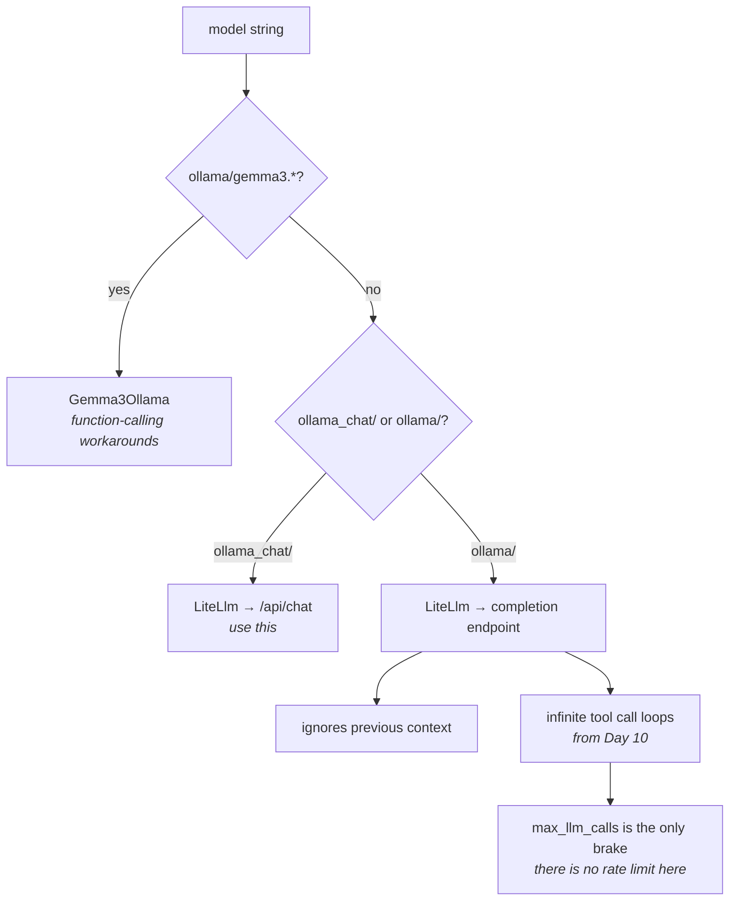

# 3.2 — Two switches that look the same

## One-line answer

`ollama_chat/` and `ollama/` are two different prefixes with two different behaviours — ADK's own
documentation says the second causes *"infinite tool call loops and ignoring previous context"* — and
a third case, `ollama/gemma3*`, resolves to a class you did not ask for.

---

## The story

There is a bank of four switches by the kitchen door. Identical white switches on one plate.

Two of them are the tube lights. One is the exhaust fan. And one is the geyser in the bathroom, which
somebody put there years ago for reasons nobody remembers.

Everyone in the house knows this and nobody has labelled it.

So when a guest comes and wants the fan, they press the one next to the light — reasonably, because
it is next to the light — and the geyser goes on. Nothing happens that anybody notices. There is no
noise from the kitchen, no bulb, no draught. Two hours later somebody wonders why the electricity
bill has been high this month, or why the water is scalding, and nobody connects it to the guest who
wanted a fan.

**The failure is not that they pressed the wrong switch.** It is that the wrong switch did something
real, elsewhere, silently — so nothing brought them back to the moment of the mistake.

A label would fix it. Nobody makes one, because everybody who lives there already knows.

`ollama` and `ollama_chat` are that plate.

---

## The idea in plain language

There are two ways to name an Ollama model through the translation library, and they use different
API endpoints on the Ollama server:

| Prefix | Behaviour |
| --- | --- |
| `ollama_chat/` | the chat endpoint — messages with roles, the way every other provider works |
| `ollama/` | the older completion-style endpoint |

`adk.dev/agents/models/ollama/` does not hedge about which to use (checked 2026-08-26):

> *"Using `ollama` can result in unexpected behaviors such as infinite tool call loops and ignoring
> previous context."*

Read those two symptoms carefully, because both are the geyser rather than the fan.

**Ignoring previous context.** The conversation stops working. Everything you built on Day 8 — the
session, the event list, the transcript re-sent every turn — still happens, correctly, and the model
answers as though only the last message existed. There is no error. It looks like a memory bug, and
you will go and look at your session code, which is fine.

**Infinite tool call loops.** From Day 10, when Sutra has a tool. The model asks for the tool, gets
the result, and asks again. And again. On a hosted provider this ends at a rate limit. On the local
lane there is no rate limit — [3.1](3.1-cooking-at-home.md) called that a feature — so the only thing
that stops it is
[Day 7, part 4.1](../../../day-07-events-and-streaming/parts/04-the-brakes/4.1-the-meter-that-cuts-off.md)'s
`max_llm_calls`, five hundred calls later. **A free lane with no quota is a lane where a loop costs
you time instead of money, which is why the brake matters more here rather than less.**

### And there is a third case

[1.1](../01-one-model-field/1.1-a-name-is-a-lookup.md) said the registry is a list of patterns matched
in order. One of them is more specific than `ollama/.*`:

> `ollama/gemma3.*` → `Gemma3Ollama`

`Gemma3Ollama` is a real class in ADK, and its docstring says why it exists: Gemma 3 needs
function-calling workarounds, so ADK ships a subclass that applies them. It also says that Gemma 4
and later do **not** need it and should use plain `LiteLlm`.

So three strings that look like variations of one thing resolve three ways:

```text
ollama_chat/llama3.1:8b          -> LiteLlm
ollama/gemma3:12b                -> Gemma3Ollama
ollama/llama3.1:8b               -> LiteLlm      (and behaves as the docs warn)
```

None of that is wrong. It is a framework being careful about a model family that needed care. It is
also completely invisible from the string, which is why this is a part rather than a footnote.

**The rule, and it is short:** use `ollama_chat/` unless you have a specific reason, and if you use a
Gemma 3 model, know that you are getting a different class.

---

## Why Sutra needs it

**Day 10** puts a `FunctionTool` on Sutra. That is the day the tool-loop half of this warning stops
being hypothetical, and it is the day a prefix chosen carelessly today becomes an afternoon.

**Day 17** is the state deep dive, and "the agent is ignoring earlier turns" is a symptom that points
straight at session code. Knowing that a model prefix can produce the same symptom is what stops you
debugging the wrong layer.

**Day 70**'s router selects a lane per call, which means it constructs model strings programmatically.
A string built by concatenation is a string nobody reads, and this is exactly the kind of mistake that
survives review in that form.

---

## The mechanism

The three cases, resolved, with no Ollama running and no model downloaded — because the registry does
not need either:

```python
# lab/ollama_prefixes.py - three strings, three answers. No Ollama needed.
from google.adk.models import LLMRegistry

CASES = [
    ("ollama_chat/llama3.1:8b", "the one to use"),
    ("ollama/llama3.1:8b", "older endpoint - loops and forgets, per adk.dev"),
    ("ollama/gemma3:12b", "a more specific pattern wins"),
    ("ollama/gemma4:latest", "Gemma 4 does not need the workaround class"),
]

for name, note in CASES:
    try:
        resolved = LLMRegistry.resolve(name).__name__
    except Exception as exc:
        resolved = f"{type(exc).__name__}"
    print(f"{name:<28} -> {resolved:<14} {note}")
```

**Line by line:**

- No Ollama, no model, no network — the registry is a table lookup, so all four rows resolve on a
  machine that has never run a local model. That makes this the cheapest possible way to learn the
  distinction, and it is worth doing **before** you download several gigabytes.
- The `note` column carried alongside each case — because the output of this script is otherwise four
  class names and no reason, and the reason is the content.
- `"ollama/llama3.1:8b"` second, immediately after the correct one, so the two lines that differ by
  five characters are adjacent on screen.
- `"ollama/gemma3:12b"` third — the specificity case. Note it resolves to a **different class** while
  looking like a variation on the line above it.
- `"ollama/gemma4:latest"` fourth — the control for the third. `gemma4` does not match `gemma3.*`, so
  it falls through to the general pattern, which is exactly what the class's own docstring says
  should happen.
- `except Exception` returning just the type name — with the library absent, all four of these fail,
  and the failure is uniform and uninteresting. Run it after the install from
  [2.2](../02-the-translator/2.2-the-toolkit-you-did-not-need.md).

The output, with the library installed:

```text
ollama_chat/llama3.1:8b      -> LiteLlm        the one to use
ollama/llama3.1:8b           -> LiteLlm        older endpoint - loops and forgets, per adk.dev
ollama/gemma3:12b            -> Gemma3Ollama   a more specific pattern wins
ollama/gemma4:latest         -> LiteLlm        Gemma 4 does not need the workaround class
```

Rows one and two resolve to the **same class** and behave differently, because the difference is in
the endpoint the library calls rather than in the class ADK picks. Rows two and three look almost
identical and resolve to **different classes**. Neither of those is guessable from the string, and
both are one `resolve()` call away.



### Seeing what is actually sent

When two prefixes behave differently and neither errors, the way to tell them apart is to look at the
request. The library has a switch for that, documented on the same ADK page:

```python
# lab/ollama_debug.py - print the actual HTTP request. Lab only: private name.
import litellm

litellm._turn_on_debug()
```

**Line by line:**

- `litellm._turn_on_debug()` — a **private** name, used here because `adk.dev/agents/models/ollama/`
  documents it as the way to see requests. It goes in the lab and never under `sutra/`, exactly as
  [Day 6, part 3.1](../../../day-06-instructions-and-personas/parts/03-the-instruction-fields/3.1-where-your-instruction-lands.md)
  ruled for private ADK names.
- What it prints is a runnable `curl`. Run the same question through `ollama_chat/` and `ollama/` with
  this on, and put the two `curl` commands side by side: **different URLs, different bodies**. That
  is the difference, seen rather than believed, and it takes one minute.
- Add it at the top of `lab/local_lane.py` from [3.1](3.1-cooking-at-home.md) rather than writing a
  new script — the two-line file above is the whole change.

---

## When it breaks

**💥 The agent that forgot the conversation.**

No error text, because nothing failed. Turn two answers as though turn one had not happened, and
every layer you would suspect — the session, the event list, the runner — is working perfectly. The
tell, once you know it, is that the *transcript is correct*: check the session with Day 8's tools,
find the earlier turns present and in order, and you have eliminated everything except what the model
was sent. Then look at the prefix.

**💥 The loop that does not stop.**

```text
LlmCallsLimitExceededError: Max number of llm calls limit of `500` exceeded
```

From Day 10, with `ollama/` and a tool. Five hundred calls on a local model is not a bill — it is
your laptop at full load for a while and a very confused transcript. Note that this is the same error
as a runaway loop on any other lane, and the diagnosis is different: on a hosted lane you would
suspect the prompt or the tool, and here the first thing to check is five characters in a model
string.

**💥 The class you did not ask for.**

Not a failure — a surprise. Ask for `ollama/gemma3:12b` and you get `Gemma3Ollama`, which applies
function-calling workarounds you did not request and probably want. Ask for `ollama/gemma4:latest`
and you get plain `LiteLlm`. Same-looking strings, different machinery, and the only way to know is
to resolve them.

---

## In production

**What a professional writes instead of the teaching version** is a constant, not a concatenation.
`OLLAMA_PREFIX = "ollama_chat/"` in one module, with the ADK warning quoted next to it in a comment,
so a future model string is built from something that carries its own reason. The specific failure
this prevents is somebody constructing `f"ollama/{model}"` in a router because it reads more
naturally.

**What degrades at scale** is nothing about this prefix — it is a correctness question rather than a
capacity one. What *does* degrade is the debugging. In a single-agent script, "the agent forgot the
conversation" has one candidate. In a graph of nodes where one node happens to be on the local lane,
the same symptom has a dozen, and the one that turns out to be a five-character prefix is the last
one anybody checks.

**The failure that only shows with real traffic** is the tool loop under an unusual input. A model on
the wrong endpoint may handle simple tool use adequately and loop only when the tool returns
something empty or ambiguous — which is exactly what a knowledge-base search does when it finds
nothing. So the lane looks fine in testing, where your test tickets match, and loops on the real ones
that do not.

**The review comment a senior engineer leaves:** *"This builds the model string with an f-string and
uses `ollama/`. The docs say that endpoint drops context and can loop on tool calls — use
`ollama_chat/`, put the prefix in a constant with the warning next to it, and check what
`LLMRegistry.resolve` gives you for the Gemma models, because those go to a different class."*

**The interview question:** *"tell me about a bug where the framework was behaving correctly."* This
is a good one: "Two model-string prefixes for the same local server — one used the chat endpoint and
one the older completion endpoint — and only the first preserves conversation history. Nothing errors:
the session is correct, the transcript is correct, the framework re-sends everything it should, and
the model answers as if only the last message existed. So the symptom is 'it forgot', which points
you at session storage, and the cause is five characters in a model name. What I took from it is to
resolve model strings and print the actual outgoing request when behaviour is wrong but nothing has
failed — and to keep prefixes in constants, because the version of that bug that survives review is
an f-string in a router."

---

## Check yourself

```bash
uv run python days/day-09-four-free-providers/lab/ollama_prefixes.py
```

Then add `litellm._turn_on_debug()` to `lab/local_lane.py`, run it once with each prefix, and put the
two printed `curl` commands next to each other.

**Answer out loud, without scrolling up:**

> Give the two symptoms ADK's documentation attributes to the `ollama/` prefix, and say which layer
> each one sends you to debug by mistake. Then say what `ollama/gemma3:12b` resolves to, and why.

---

**Next:** [3.3 — The learner driver](3.3-the-learner-driver.md)
