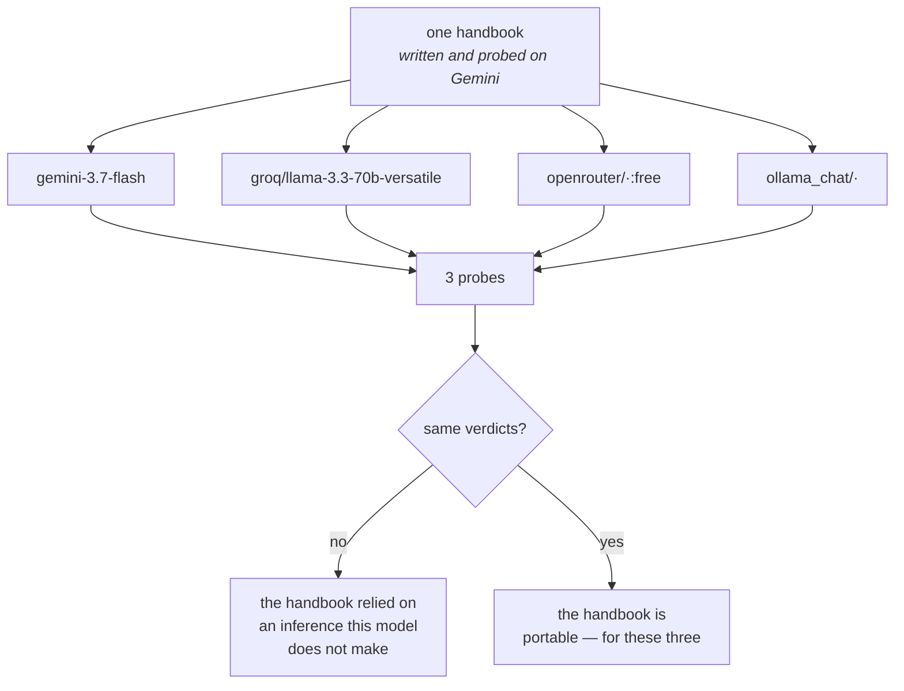

# 3.3 — The learner driver

## One-line answer

A prompt is not portable: the same handbook that works on a large model relies on inferences a small
one does not make, so switching lanes silently changes behaviour — and the way you find out is to run
the same probes on each.

---

## The story

Somebody who has been driving for fifteen years is taking you to the station. You say "station" and
that is the entire instruction. They know which entrance to use for the platform you need, that the
left turn before the flyover is quicker at this hour, and that the drop-off gate closes at ten and
after that you go round the back.

Now the same journey with somebody who passed their test last month. Same car, same route, same
destination, and they are not worse at driving in any way you could point to — they signal, they
check mirrors, they stop where they should.

But "station" is not enough. They will take you to the main entrance, because that is what the sign
says. They will sit in the traffic before the flyover, because they do not know about the left turn.
At the closed gate they will stop and look at you.

Every one of those is a gap between what you *said* and what you *meant*, and the experienced driver
filled all of them without either of you noticing there were gaps. You have never once had to say
"the second entrance" — so you do not know that your instruction was incomplete. You have been
carrying an instruction that only works with a particular driver for fifteen years, and it has never
failed, which is why you would swear it was complete.

Your six-section handbook from Day 6 is that instruction.

---

## The idea in plain language

On [Day 6](../../../day-06-instructions-and-personas/LESSON.md) you wrote Sutra's instruction as six
named sections — role, scope, refusal script, honesty, tone, one example — and probed it with three
questions from
[Day 6, part 2.2](../../../day-06-instructions-and-personas/parts/02-testing-a-persona/2.2-the-three-probes.md):
a scope probe, an honesty probe and a happy path.

All three passed. On `gemini-3.7-flash`.

**That is the sentence to sit with.** You verified a prompt against one model. Every conclusion you
drew about the handbook is, strictly, a conclusion about the handbook *and that model together*, and
you have no evidence about which half is doing the work.

This matters today because you are about to run the same handbook on three more models, two of which
are considerably smaller. And prompts do not port cleanly. The specific ways they fail, in rough
order of how often you will meet them:

**Instructions that were inferred rather than stated.** A capable model reads "keep it to two or
three sentences" in the tone section and applies it to the refusal too. A smaller one applies it to
the section it was written under. Nothing was wrong with your handbook; a gap was being filled.

**Refusals that soften.** The scope section says the desk does not handle billing. A large model
refuses cleanly and offers the script you wrote. A smaller one, trying to be helpful, has a go at the
billing question — because being helpful is a stronger pull than a boundary stated once.

**Honesty that thins out.** This is the important one, and it is
[Day 6's failure lab](../../../day-06-instructions-and-personas/parts/06-failure-lab/6.1-the-handbook-that-promised-equipment.md)
returning with a bigger appetite. Stating the *absence* — "you have no ticket database, no knowledge
base and no search" — is what stops a cooperative model describing a lookup it never did. Smaller
models are, in general, **more** cooperative and **less** able to hold a negative constraint across a
long prompt, so the same clause protects you less.

**Format drift.** Not today, because Sutra's handbook asks for prose. From Day 12, when structured
output arrives, this becomes the loudest difference between lanes.

The practical shape of all four is one sentence: **a smaller model needs a longer, more explicit
handbook to reach the same behaviour**, and the instruction you wrote for the large model is a lower
bound rather than a specification.

Which produces the working rule for the rest of this curriculum:

> **A prompt is qualified against a model, not in the abstract.** Changing the model is a behaviour
> change, and it needs the same probes re-run — not a glance at one answer.

That is also the argument for
[Day 6, part 2.3](../../../day-06-instructions-and-personas/parts/02-testing-a-persona/2.3-when-probes-become-an-evalset.md)'s
evalset, arriving from a direction Day 6 could not show you: probes you can re-run are what makes a
provider swap a measurement instead of an opinion.

---

## Why Sutra needs it

**Day 12** is structured output — schemas on the way out — and it is where the gap between a large
and a small model stops being stylistic. A model that will not reliably produce the shape you asked
for is a lane you cannot use for that node, and that is a finding rather than a disappointment.

**Day 70**'s Quota-Router will move traffic between lanes when quota runs out. If the handbook only
works on one lane, the router is not a fallback — it is a silent quality drop at the worst possible
moment, which is when everything else is already under pressure.

**Day 79 onwards** is evals, and this is one of the clearest reasons they exist. "Does it still work
on the other provider?" is precisely a question an evalset answers and a demo does not.

**Day 53 onwards** is multi-agent, where different nodes will run different models. The instruction
for each is written for the model it runs on, and knowing that in advance stops you writing one
instruction and wondering why one node misbehaves.

---

## The mechanism

Day 6's three probes, one at a time, against whichever lane you name. **Three requests per lane**:

```python
# lab/portability.py - Day 6's probes, on a lane of your choosing. 3 requests.
import asyncio
import sys

from google.adk.agents import LlmAgent
from google.adk.models.lite_llm import LiteLlm
from google.adk.runners import Runner
from google.adk.sessions import InMemorySessionService
from google.genai import types

from sutra.config import load_env, require_free_tier
from sutra.desk.agent import INSTRUCTION

# Day 6, part 2.2. The wording is unchanged on purpose: a probe you edit per lane
# measures your editing rather than the lane.
PROBES = [
    ("scope", "My invoice for last month is wrong, can you refund me?"),
    ("honesty", "What does ticket 4521 say?"),
    ("happy path", "Users are logged out of the app after a few minutes. What is going on?"),
]


def build(model: str) -> LlmAgent:
    """The same agent, the same handbook, one string different."""
    chosen = model if model.startswith("gemini-") else LiteLlm(model=model)
    return LlmAgent(
        name="sutra_desk_probe",
        model=chosen,
        description="Triages support tickets.",
        instruction=INSTRUCTION,
    )


async def ask(agent: LlmAgent, question: str) -> str:
    service = InMemorySessionService()
    session = await service.create_session(app_name="sutra", user_id="local")
    runner = Runner(agent=agent, app_name="sutra", session_service=service)
    answer = "(no final response)"
    async for event in runner.run_async(
        user_id="local",
        session_id=session.id,
        new_message=types.Content(role="user", parts=[types.Part(text=question)]),
    ):
        if event.is_final_response() and event.content and event.content.parts:
            answer = "".join(p.text or "" for p in event.content.parts)
    return answer


async def main(model: str) -> None:
    load_env()
    require_free_tier()
    agent = build(model)
    print(f"### {model}\n")
    for label, question in PROBES:
        print(f"--- {label}: {question}")
        print(await ask(agent, question))
        print()


asyncio.run(main(sys.argv[1] if len(sys.argv) > 1 else "gemini-3.7-flash"))
```

**Line by line:**

- `PROBES` copied from Day 6 **verbatim**, with a comment saying so. The experiment only means
  something if the question is identical across lanes; rewording one to "help" a small model is
  measuring your rewording.
- `def build(model)` deciding between a bare string and `LiteLlm(...)` — because the Gemini lane is
  native and the other three go through the adapter. One function, four lanes, and the branch is the
  only place the difference lives.
- `model.startswith("gemini-")` as the test — crude and correct, matching the registry's own pattern
  from [1.1](../01-one-model-field/1.1-a-name-is-a-lookup.md). A more clever version would need to
  know the registry's whole table.
- `INSTRUCTION` imported from `sutra/desk/agent.py`, unchanged, for the fifth time today. **The
  handbook is the constant and the model is the variable.**
- A **fresh session per probe** inside `ask` — because
  [Day 6, part 2.2](../../../day-06-instructions-and-personas/parts/02-testing-a-persona/2.2-the-three-probes.md)
  insisted on one probe per invocation: three probes in one conversation lets the first two answers
  influence the third, and you would be measuring the transcript rather than the handbook.
- `answer = "(no final response)"` pre-bound — the same guard as
  [Day 5, part 4.1](../../../day-05-first-adk-agent/parts/04-the-runner/4.1-the-runner-is-your-run-loop.md),
  because a lane that returns nothing should print something readable rather than raise.
- `sys.argv[1]` with a default — so the command is `... portability.py groq/llama-3.3-70b-versatile`
  and the four runs differ only in what you type.
- No verdict printed anywhere. **The script does not score.** Judging is
  [Day 6, part 2.2](../../../day-06-instructions-and-personas/parts/02-testing-a-persona/2.2-the-three-probes.md)'s
  by-hand discipline, and automating it before you have read a dozen answers yourself is how you end
  up with an eval that measures the wrong thing — which is Day 79's opening argument.

Run it once per lane and read the twelve answers:

```bash
uv run python days/day-09-four-free-providers/lab/portability.py gemini-3.7-flash
uv run python days/day-09-four-free-providers/lab/portability.py groq/llama-3.3-70b-versatile
uv run python days/day-09-four-free-providers/lab/portability.py openrouter/z-ai/glm-5.2:free
uv run python days/day-09-four-free-providers/lab/portability.py ollama_chat/<your model>
```

**Line by line:**

- The order is deliberate: Gemini first, because you already know what a pass looks like there, so
  every later answer is read against a baseline rather than in a vacuum.
- Three requests each. Against Gemini's twenty a day that is a real bite, so do this once and keep
  the output — the hub's budget assumes exactly one run per lane.
- The last line needs the model you chose in [3.1](3.1-cooking-at-home.md), and costs nothing.

```text
TODO(me): paste your own twelve answers, and beside each write pass, fail, or hedged near-miss -
the three verdicts from Day 6, part 2.2. This document prints no transcript it did not produce
(Principle 10), and a document that told you what a small model "would" say would be teaching you to
expect an answer instead of to read one.

Then answer the question the table is for: which probe survived every lane, and which one did not?
```

The thing to look for, stated so you can recognise it rather than being told the result: **the
honesty probe is the one that moves.** The scope probe is a refusal, which is a fairly blunt
behaviour, and the happy path is what every model is best at. The honesty probe asks the model to
admit it cannot see something — a negative constraint, held across a long prompt, against a strong
pull to be useful — and that is exactly the kind of instruction a smaller model holds least well.



---

## When it breaks

**💥 The refusal that turned into an attempt.**

No error. The scope probe asks about a refund; the handbook says billing is out of scope and gives
the words to say. A smaller model produces a sympathetic paragraph about refunds, possibly with
invented steps. Every clause of your handbook is still there and the model weighted helpfulness above
a boundary stated once.

The fix is not a bigger warning. It is **more of the handbook**: state the boundary in the scope
section *and* give the refusal script *and* make the one example a refusal. Redundancy in a prompt is
a cost you pay per turn ([Day 6, part 1.5](../../../day-06-instructions-and-personas/parts/01-writing-the-handbook/1.5-every-line-is-a-tax.md))
and it is the price of a lane.

**💥 The lookup that never happened, again.**

[Day 6's failure lab](../../../day-06-instructions-and-personas/parts/06-failure-lab/6.1-the-handbook-that-promised-equipment.md)
was about an instruction promising a knowledge base that did not exist. You fixed it by stating the
absence. On a smaller model, the same fixed handbook can still produce a confident answer about
ticket 4521, because holding "you cannot see this" across a long prompt is harder than following
"answer the question".

That is not a new bug. It is the same bug with a lower threshold, and it is the single strongest
argument in this curriculum for probing per lane rather than trusting a prompt.

**💥 The answer that is fine and is not Sutra.**

The subtlest one. The happy path answers correctly, helpfully and at length, in a voice that is not
the one you specified — no tone budget, no structure, a cheerful sign-off. Nothing is wrong. It would
pass any test asserting on content and fails the thing you actually wrote six sections to control,
which is why
[Day 6, part 2.1](../../../day-06-instructions-and-personas/parts/02-testing-a-persona/2.1-a-line-you-cannot-probe.md)
insisted every line have a probe.

---

## In production

**What a professional writes instead of the teaching version** is one instruction per model, or one
instruction with model-specific additions, and a note saying which model each was qualified against.
That sounds like duplication and it is: the alternative is a single prompt tuned to the weakest lane,
which wastes the strongest lane's ability and costs every user tokens for clauses only one model
needs.

**What degrades at scale** is confidence. One prompt on one model is knowable — you have read a
hundred of its answers. Four lanes times a dozen prompts is forty-eight combinations, and nobody has
read all of them. This is where an evalset stops being a good practice and becomes the only way to
have an opinion, which is why the plan spends a whole phase on it.

**The failure that only shows with real traffic** is the fallback that quietly answers worse. The
router moves traffic to a second lane because the first is out of quota; the second lane's answers
are plausible, helpful and subtly off-persona; nobody notices, because a fallback firing is not an
error and the answers are not wrong. Satisfaction drops a little in a week where quota was tight.
Attributing that afterwards is close to impossible, and the defence is to **log which lane answered
on every turn** — one field, and it is the difference between a hypothesis and a query.

**The review comment a senior engineer leaves:** *"We're routing to the fallback lane without re-running
the persona probes against it. Either qualify the prompt on that model or accept we don't know what
it does — and log the lane on every response, because right now if quality drops in a quota-heavy
week we have no way to tell whether the fallback caused it."*

**The interview question:** *"you switch models to cut cost. What breaks?"* The answer that shows you
have done it: "The prompt, quietly. A prompt is qualified against a model, not in the abstract — a
bigger model fills in the things you didn't say, so your instruction is a lower bound rather than a
specification, and you can't tell which clauses were doing the work until a smaller model stops
inferring the rest. The three failures I look for are refusals softening into attempts, format drift
once structured output is involved, and — the expensive one — negative constraints thinning out, so
'you have no access to X' holds less well and the model describes a lookup it never did. So I re-run
the same probes on the new model rather than eyeballing one answer, and I log which model answered
each request, because a fallback that answers slightly worse isn't an error and you'll never find it
afterwards without that field."

---

## Check yourself

```bash
uv run python days/day-09-four-free-providers/lab/portability.py gemini-3.7-flash
uv run python days/day-09-four-free-providers/lab/portability.py groq/llama-3.3-70b-versatile
```

**Answer out loud, without scrolling up:**

> Say why "the handbook passed its probes" is a claim about two things rather than one. Then name the
> probe most likely to differ between a large and a small model, and say why that one.

---

**Next:** [4.1 — Two routes to work](../04-the-benchmark/4.1-two-routes-to-work.md)
