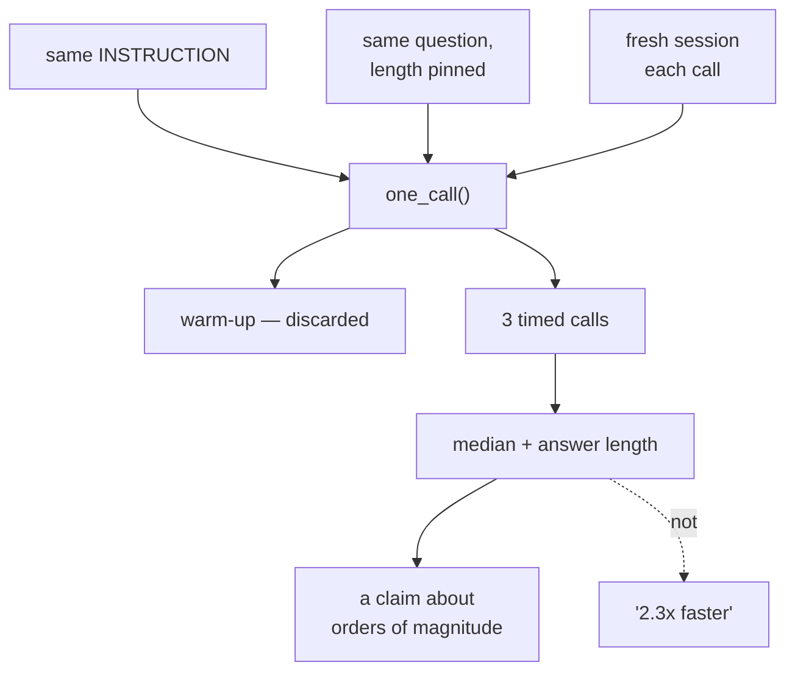

# 4.1 — Two routes to work

## One-line answer

One call per provider is not a measurement — it is an anecdote — so before you build a comparison
table you decide what you are actually able to claim from the number of calls a free tier will let
you make.

---

## The story

Two ways to get to work. The main road, or the smaller road through the colony.

On Tuesday you take the main road. Forty minutes. On Wednesday you take the colony road and it takes
twenty-eight. You tell people the colony road is faster.

Then somebody who takes it every day says: "Wednesday? Of course. There's no market on Wednesday."

And now you look at your two numbers again, and they are not comparing the two roads. They are
comparing Tuesday-with-a-market against Wednesday-without-one, on a route you were paying attention
to because it was new, in a week when you happened to leave ten minutes earlier on one of the days.

There is nothing wrong with your timing. You looked at the clock twice and both readings were
correct. What is wrong is the **claim** you built on them, and the gap between those two things —
correct readings, wrong claim — is the whole subject of this part.

The person who takes it every day is not smarter. They have more samples, and they know which days
are different.

---

## The idea in plain language

You are about to build a comparison table for four providers, and you have very little quota to build
it with. So the interesting question is not *how do I measure* but **what am I entitled to say
afterwards.**

### What varies, that has nothing to do with the provider

- **Where you are.** A round trip to a data centre is what it is, and it differs by tens or hundreds
  of milliseconds between providers for reasons that are about geography rather than about models.
- **What time it is.** A free tier is shared capacity. It is slower when everyone is awake.
- **The prompt.** A longer prompt takes longer to read, and prompts are not the same length across
  runs unless you make them so.
- **The answer.** Generation time scales with the number of tokens produced. A model that answers in
  five sentences will look "slower" than one that answers in two, and that is a difference in
  verbosity rather than in speed.
- **The first call.** Connections get established, caches get warm, and on the local lane the model
  has to be loaded into memory. The first call is always the slowest and is never representative.

### Which of those you can control, cheaply

**The prompt** — one constant, used everywhere. Done already: every lane script today imports the
same `INSTRUCTION` and asks the same question.

**The answer length** — partly, by asking for a specific length in the question, and it is worth
doing because otherwise you are measuring verbosity.

**The first call** — by discarding it, which costs one request per lane and is the best-value request
in the whole exercise.

**When you run** — by running all four lanes in one sitting rather than across an evening.

### Which you cannot, on a free tier

**Sample size.** Gemini gives you twenty requests a day. After a warm-up and two or three timed
calls, that lane is most of the way through its allowance, and three samples do not give you a
distribution. You cannot honestly say "the median is X" from three numbers, and no amount of
arithmetic fixes it.

So the honest output of today's benchmark is **not** "provider A is 2.3× faster than provider B". It
is a table of orders of magnitude with the sample size written next to it, and that is genuinely
useful: the difference between a lane that answers in about a second and one that answers in about
ten is a decision you can make on three samples. The difference between 1.1 and 1.4 seconds is not.

### The two numbers, again

[Day 7, part 2.1](../../../day-07-events-and-streaming/parts/02-the-stream/2.1-the-number-read-out-loud.md)
separated **time to first token** from **total time**, and this is where that pays. For a support desk
with a person waiting, time to first token is the number that describes the experience. For Day 73's
nightly batch job, total time is the only one that matters.

Today's table measures total time, because it is the number you can get without streaming and because
it is the one that bounds the batch case. Note it as such rather than calling it "latency", which is
the ambiguity Day 7 warned about.

### And the number that is not a number

**Quality is not measurable here.** You have three probes per lane from
[3.3](../03-local/3.3-the-learner-driver.md) and a verdict you wrote by hand. That is evidence, and it
is not a score, and calling it one would be the confident-bullshit failure this project's rules name
explicitly. The quality column in [4.2](4.2-the-mileage-on-the-sticker.md)'s table is a sentence, not
a number, and it says how many probes it is based on.

---

## Why Sutra needs it

**Day 70**'s Quota-Router routes by headroom and by suitability. "Suitability" is whatever this
benchmark tells you, so a benchmark that overstates its confidence produces a router that makes
confident wrong choices.

**Day 62 onwards** is evals, where measuring the right thing is the entire subject. Getting the
discipline wrong on a four-row table is much cheaper than getting it wrong on an evalset.

**Day 24** is quota accounting. The benchmark itself has a cost, and planning it before running it is
the first time in this curriculum that measurement has to be budgeted.

**Day 84** is observability, where the same distinction — first token against total, one sample
against a distribution — becomes a dashboard somebody makes decisions from.

---

## The mechanism

A timing harness that is honest about what it is doing. **One warm-up plus three timed calls per
lane**, and the script says so:

```python
# lab/bench.py - time one lane, honestly. 1 warm-up + 3 timed requests.
import asyncio
import statistics
import sys
import time

from google.adk.agents import LlmAgent
from google.adk.models.lite_llm import LiteLlm
from google.adk.runners import Runner
from google.adk.sessions import InMemorySessionService
from google.genai import types

from sutra.config import load_env, require_free_tier
from sutra.desk.agent import INSTRUCTION

QUESTION = (
    "Ticket 4521: users are logged out of the app after a few minutes. "
    "Answer in exactly two sentences."
)
TIMED = 3


def build(model: str) -> LlmAgent:
    chosen = model if model.startswith("gemini-") else LiteLlm(model=model)
    return LlmAgent(name="bench", model=chosen, instruction=INSTRUCTION)


async def one_call(agent: LlmAgent) -> tuple[float, int]:
    """One question in a fresh session. Returns (seconds, characters of answer)."""
    service = InMemorySessionService()
    session = await service.create_session(app_name="sutra", user_id="local")
    runner = Runner(agent=agent, app_name="sutra", session_service=service)

    started = time.perf_counter()
    answer = ""
    async for event in runner.run_async(
        user_id="local",
        session_id=session.id,
        new_message=types.Content(role="user", parts=[types.Part(text=QUESTION)]),
    ):
        if event.is_final_response() and event.content and event.content.parts:
            answer = "".join(p.text or "" for p in event.content.parts)
    return time.perf_counter() - started, len(answer)


async def main(model: str) -> None:
    load_env()
    require_free_tier()
    agent = build(model)

    warm, _ = await one_call(agent)
    print(f"{model}")
    print(f"  warm-up (discarded) : {warm:.2f}s")

    times, lengths = [], []
    for index in range(TIMED):
        seconds, chars = await one_call(agent)
        times.append(seconds)
        lengths.append(chars)
        print(f"  call {index + 1}             : {seconds:.2f}s, {chars} chars")

    print(f"  median of {TIMED}         : {statistics.median(times):.2f}s")
    print(f"  median answer length: {statistics.median(lengths):.0f} chars")
    print(f"  requests spent      : {TIMED + 1}")


asyncio.run(main(sys.argv[1] if len(sys.argv) > 1 else "gemini-3.7-flash"))
```

**Line by line:**

- `QUESTION` ending `"Answer in exactly two sentences."` — pinning the **output** length as well as
  the input. Without it you measure verbosity: a chatty model looks slow and is not.
- `TIMED = 3` as a named constant rather than a literal — because the number of samples is a claim,
  and a claim should have a name you can point at.
- `def one_call(...) -> tuple[float, int]` returning **both** the time and the answer length — so the
  output can show whether a fast lane was fast or merely brief. A timing harness that does not record
  what it timed is a harness that will mislead you.
- A **fresh session per call**, for the same reason
  [3.3](../03-local/3.3-the-learner-driver.md) used one per probe: a growing transcript means every
  later call carries more input, so you would be measuring
  [Day 8, part 2.3](../../../day-08-sessions-and-services/parts/02-the-run/2.3-a-journey-and-a-pass.md)'s
  quadratic rather than the provider.
- `time.perf_counter()` rather than `time.time()` — a monotonic clock for measuring durations, the
  same choice as
  [Day 7, part 2.1](../../../day-07-events-and-streaming/parts/02-the-stream/2.1-the-number-read-out-loud.md).
- The **warm-up call, discarded and printed anyway** — printed because seeing how much slower it was
  is half the reason it exists. On the local lane it will be dramatically slower, because the model is
  being loaded into memory.
- `statistics.median` rather than `mean` — the standard library again, and the median because with
  three samples one bad network moment ruins a mean and leaves a median alone. Three is still too few
  to be a distribution; the median is simply less wrong.
- `print(f"  requests spent      : {TIMED + 1}")` — the harness reporting its own cost. On a twenty-a-
  day tier that number belongs in the output, not in your head.
- The time is measured around the **whole run**, not around the model call, so it includes ADK's
  overhead. That is the honest thing to measure, because it is what a user experiences — and it is
  worth stating, because somebody will otherwise compare your number with a provider's published one
  and find a discrepancy.

```text
TODO(me): run it once per lane and paste your own numbers, from
    uv run python days/day-09-four-free-providers/lab/bench.py gemini-3.7-flash
    uv run python days/day-09-four-free-providers/lab/bench.py groq/llama-3.3-70b-versatile
    uv run python days/day-09-four-free-providers/lab/bench.py openrouter/z-ai/glm-5.2:free
    uv run python days/day-09-four-free-providers/lab/bench.py ollama_chat/<your model>
This document deliberately prints no timings it did not produce (Principle 10), and invented
benchmark numbers are the single most quotable kind of lie in this field. Four requests per lane;
sixteen in total; four of them against Gemini's twenty-a-day.

Write down, next to the numbers: the time of day, and whether anything else on your machine was busy.
```



---

## When it breaks

**💥 The warm-up you forgot to discard.**

```text
  call 1             : 11.84s, 214 chars
  call 2             : 1.31s, 208 chars
  call 3             : 1.27s, 211 chars
```

That shape — one number several times the others — is a cold start, not a slow provider. On the local
lane it is the model loading; on a hosted one it is a connection being established. Including it in a
mean would roughly quadruple the reported time. This is why the harness spends a request on a warm-up
before it counts anything.

**💥 The fast lane that was just terse.**

```text
  median of 3         : 0.61s
  median answer length: 74 chars
```

Seventy-four characters is not two sentences. That lane did not answer faster, it answered less, and
without the length column you would have written a table saying it was four times quicker. The pinned
output length in the question reduces this and does not eliminate it — which is exactly why the
column is there.

**💥 The comparison across an evening.**

Not an error. You run Gemini at six, get distracted, and run Groq at ten. Free-tier capacity is
shared and load varies, so you have measured two different evenings. Nothing in the numbers says so.
The note you write next to them — *time of day, machine busy or not* — is the only record that exists.

---

## In production

**What a professional writes instead of the teaching version** is a measurement that records its own
conditions. Timestamp, prompt hash, answer length, sample count, and the model string, in one line
per call. A number without its conditions is not reproducible and therefore not evidence, and the
cost of recording them is one dictionary.

**What degrades at scale** is the median. It is a fine summary of three calls made on purpose and a
poor summary of a day of real traffic, where the shape is long-tailed: most calls fast, a few very
slow, and the slow ones are what users complain about. Production measurement is percentiles — p50,
p95, p99 — and the gap between p50 and p99 is usually a bigger deal than the gap between two
providers' p50s. Day 84 is where that arrives properly.

**The failure that only shows with real traffic** is the benchmark that was true and became false.
Providers change: hardware, quantisation, routing, capacity. A table produced today with a date on it
is a historical record; the same table quoted in six months without the date is a false claim. Every
row in [4.2](4.2-the-mileage-on-the-sticker.md)'s table carries the date it was measured for this
reason, and re-measuring at the phase gates is part of the freshness check the plan already requires.

**The review comment a senior engineer leaves:** *"Three calls isn't a median, it's three calls — say
so in the table and give the sample size next to every number. And you're comparing total time across
providers whose answers are different lengths; put the character count in, or normalise, or we're
ranking verbosity."*

**The interview question:** *"how would you compare two model providers?"* The answer that shows
discipline rather than enthusiasm: "Hold everything constant that I can — same prompt, same pinned
output length, fresh context each call, all runs in one sitting — and discard the first call, because
a cold start can be an order of magnitude out. Then be honest about what the sample supports: on a
free tier you get a handful of calls, which is enough to distinguish 'about a second' from 'about ten
seconds' and not enough to claim one is 20% faster. I'd report total time with the sample size next
to it, record the answer length so I'm not accidentally ranking verbosity, and keep quality as a
written verdict on a fixed set of probes rather than a score — because a made-up number is worse than
an honest sentence, and benchmark numbers are the most quoted and least checked thing in this field."

---

## Check yourself

```bash
uv run python days/day-09-four-free-providers/lab/bench.py gemini-3.7-flash
```

**Answer out loud, without scrolling up:**

> Name three things that vary between two timed calls and have nothing to do with the provider. Then
> say what claim three samples entitles you to make, and what claim they do not.

---

**Next:** [4.2 — The mileage on the sticker](4.2-the-mileage-on-the-sticker.md)
