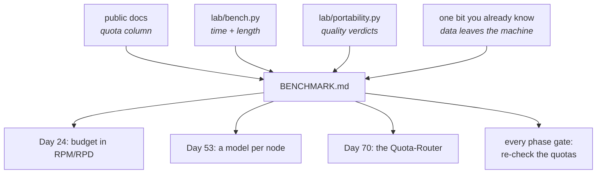

# 4.2 — The mileage on the sticker

## One-line answer

The deliverable of this day is a four-row table that says what each lane costs, what it gives you and
how confident you are — with the date on it, because every number in it has a shelf life.

---

## The story

The sticker on a new scooter says it does sixty kilometres to the litre.

It does not. It does about forty-two, and that is not because anybody lied. The sixty came from a
standardised test: a specific speed, a specific load, a warmed engine, no traffic lights, no pillion,
no grocery bags, a rider of a defined weight. Every one of those conditions is stated somewhere in
small print, and the number is perfectly reproducible if you reproduce them.

What the sticker cannot say is what *you* will get, because that depends on your road, your traffic,
your right hand and the two people you carry on Sundays.

So the number is not useless and it is not the truth either. It is a **comparable** figure. Two
scooters tested the same way can be compared, and neither figure predicts your Tuesday.

The mistake is not believing the sticker. It is forgetting that a comparable number and a predictive
number are different things, and quoting the first as the second.

Your benchmark table is a sticker. Build it that way on purpose: comparable, conditions written down,
and honest about which column is a measurement and which is an opinion.

---

## The idea in plain language

The table has six columns, and each one exists because leaving it out would let you mislead yourself.

**Lane.** The model string, in full, exactly as it goes into code. Not "Groq" — the string, so it can
be copied and so a reader knows which model.

**Quota.** The limits, with the unit and the window spelled out, and the date they were checked.
This is the column that decides most real routing decisions, and it is the one most likely to be out
of date.

**Total time.** From [4.1](4.1-two-routes-to-work.md): median of three timed calls after a discarded
warm-up, with the sample size written in the cell. Not "latency".

**Answer length.** So a fast lane that was terse cannot masquerade as a fast lane.

**Quality.** A **sentence**, not a score, based on the three probes from
[3.3](../03-local/3.3-the-learner-driver.md), naming which probe was weakest. Three probes is not a
quality measurement and pretending otherwise is exactly the confident-bullshit failure this project's
rules name.

**Data leaves the machine.** Yes or no. It is one bit and it is the column that will decide the whole
argument the first time somebody asks about real customer data.

### What the table is for

Three decisions, and it is worth knowing which is which before you build it:

1. **Which lane runs which node** (Day 53 onwards). A classifier wants the cheapest fast lane; a
   customer-facing writer wants the best quality.
2. **Which lane is the fallback when quota runs out** (Day 70).
3. **Which lane is impossible** for a given kind of data (Phase 10, and any real deployment).

None of those needs a number accurate to 20%. All of them need the quota column to be right.

### What goes in it today, and what cannot

Two of the six columns can be filled in from public documentation, checked live. Four of them require
you to run something, and this document will not invent them.

Here is the table with everything that could be verified on **2026-08-27**, and explicit `TODO(me)`
in every cell that needs your own machine and your own quota:

| Lane | Quota (checked 2026-08-27) | Total time | Answer length | Quality (3 probes) | Data leaves machine |
| --- | --- | --- | --- | --- | --- |
| `gemini-3.7-flash` | **20 requests/day** observed on a live 429 (Day 2, `docs/PACKAGES.md` 2026-08-25). Google publishes no free-tier table; limits are shown in AI Studio only | `TODO(me)` | `TODO(me)` | the baseline the handbook was written against (Day 6) | yes |
| `groq/llama-3.3-70b-versatile` | **30 RPM · 1,000 RPD · 8,000 TPM** (free plan, "other open models"; `console.groq.com/docs/rate-limits`) | `TODO(me)` | `TODO(me)` | `TODO(me)` | yes |
| `openrouter/<model>:free` | **20 RPM · 50 RPD** with no credits ever purchased; 1,000 RPD needs a $10 purchase, which Addendum 02 rules out (`openrouter.ai/docs/api-reference/limits`) | `TODO(me)` | `TODO(me)` | `TODO(me)` | yes |
| `ollama_chat/<your model>` | **none** — bounded by your RAM and disk, not by a counter | `TODO(me)` | `TODO(me)` | `TODO(me)` | **no** |

Read the quota column on its own, because it already changes how you would build things:

**Groq's daily allowance is fifty times Gemini's.** Anything that runs per ticket — a classifier, a
router, a summariser — belongs on the lane with a thousand requests a day, not on the one with twenty.

**OpenRouter's fifty a day is a trying-out budget**, not a workload budget. That places it: use it to
find out whether a different model family answers better, not to serve anybody.

**Gemini's number is the only one nobody publishes.** It came from being refused, which Day 2 recorded
as a dated observation and an ADR. That is worth noticing as a pattern: a provider that documents its
limits is a provider you can plan around, and one that does not is a provider you discover.

**The local lane's cell says "none" rather than a large number**, because it is a different kind of
limit. Nothing refuses you; it gets slower. [4.3](4.3-three-shops-three-closing-times.md) is about
what each lane does when it does refuse.

---

## Why Sutra needs it

**Day 70** builds the Quota-Router, and this table is its specification. A router is a set of rules
about which lane to use when, and every rule in it is a row here.

**Day 24** denominates Sutra's budget in RPM and RPD per provider, exactly as Addendum 02 requires.
The quota column is that budget's input.

**Day 53 onwards** is multi-agent, where each node gets a model. Choosing without this table is
choosing by habit.

**Every phase gate** includes the freshness check, and one of its items is *all three providers' free
limits re-checked*. This table is what gets re-checked, which is why it lives in the repository rather
than in your head.

---

## The mechanism

The table is a file, and it goes in the lab with the date in it:

```bash
# the table is a deliverable, not a note
touch days/day-09-four-free-providers/lab/BENCHMARK.md
```

**Line by line:**

- A **file**, not a comment in a script, because it is read by a person at a phase gate and edited
  every few weeks.
- In `lab/`, not `docs/`, because it is your own measurement of your own machine on one evening. It
  becomes a `docs/` artefact on Day 70, when it stops being an observation and starts being a
  specification.
- `BENCHMARK.md` in capitals, matching the other read-me-first files in this repository.

And the harness that fills two of its columns, from [4.1](4.1-two-routes-to-work.md), run once per
lane. Then the thing that makes the table honest — a header that states the conditions:

```text
# Sutra provider benchmark

Measured: 2026-08-27, around 21:00 IST, on <your machine>, nothing else heavy running.
Method:   lab/bench.py - 1 discarded warm-up + 3 timed calls, same INSTRUCTION, same question,
          output length pinned to two sentences, fresh session per call.
Sample:   n=3 per lane. Enough to tell "about a second" from "about ten". Not enough for a
          percentage.
Quality:  lab/portability.py - the 3 probes from Day 6 part 2.2, judged by hand, verdicts recorded
          as pass / fail / hedged near-miss.
```

**Line by line:**

- `Measured:` with a **date, a rough time and the machine** — because
  [4.1](4.1-two-routes-to-work.md) established that all three change the numbers. A number without its
  conditions is not evidence.
- `Method:` naming the script — so the measurement can be repeated exactly, by you in six weeks or by
  a stranger. "I timed it" is not a method.
- `Sample:` stating **what the sample supports**, in words, before anybody reads a number. This is the
  single most useful line in the file and it is the one people leave out.
- `Quality:` naming the probes and the verdict vocabulary — three named outcomes, from Day 6, one of
  which is *hedged near-miss*, which exists precisely so that "not quite" does not get rounded up to
  a pass.
- Nothing here is a number you have not measured. The header is written **before** the table, which is
  the order that keeps you honest: decide what you are able to claim, then go and measure.



---

## When it breaks

**💥 The table with no date.**

Not an error — a future lie. Every number in it has a shelf life:
[2.4](../02-the-translator/2.4-the-wholesale-market.md) watched a free roster lose the model this
project's own addendum named first, in fifteen days. A dated table is a historical record. An undated
one is a claim about now, made by somebody who is no longer paying attention.

**💥 The quality column that became a number.**

```text
| groq/llama-3.3-70b-versatile | ... | 7/10 |
```

Where did the seven come from? Three probes and a feeling. Once a number is in a table it gets
averaged, compared and quoted, and nobody who quotes it will know it was three probes. A sentence
cannot be averaged, which is exactly why the column is a sentence.

**💥 The row you could not measure, left blank.**

A blank cell reads as "no problem here". If you could not run the local lane —
[3.1](../03-local/3.1-cooking-at-home.md) said this is a real possibility — the cell says **`not run:
<reason>`**, not nothing. Principle 10 is about agents fabricating results and it applies to the
person writing the table just as much.

---

## In production

**What a professional writes instead of the teaching version** is a benchmark that is re-run rather
than remembered. The script is checked in, the conditions are in the header, and re-running it is one
command — so at a phase gate it is a five-minute job rather than an afternoon of re-deciding how to
measure. Teams that write the numbers and not the harness re-measure once and then quote a stale
table for a year.

**What degrades at scale** is the single-number-per-lane shape. A real system does not have one
workload: the classifier's prompt is short and its answer is a word, the writer's prompt is long and
its answer is a paragraph, and the two behave completely differently on the same provider. One row
per lane is right for today, when there is one workload, and becomes misleading the moment there are
three. The production version of this table has a row per **(lane, workload)** pair.

**The failure that only shows with real traffic** is that the benchmark was run on a quiet evening.
Free-tier capacity is shared, so the numbers you measured are the good case, and the ones your users
get at peak are worse — sometimes by a lot, and never by a documented amount. The honest response is
not to measure harder; it is to treat the table as a ranking rather than a prediction, and to get
real numbers from real traffic once there is any, which is Day 84.

**The review comment a senior engineer leaves:** *"Put the sample size in the cells, not just the
header — someone will screenshot one row. And the quality column is a number; make it a sentence
naming which probe was weakest, because right now this table says the cheap lane scores 7 and nobody
will ever ask what that meant."*

**The interview question:** *"how do you choose a model provider?"* The answer that shows you have
done it rather than read a comparison: "I make a small table and I'm careful about which columns are
measurements and which are opinions. Quota with the unit and window and the date it was checked —
that's the column that actually decides things, and on the project I did this for the daily
allowances differed by a factor of fifty between two free tiers, which settles where a per-ticket
classifier runs before any quality discussion. Total time as a median of a few calls after a
discarded warm-up, with the sample size in the cell so nobody quotes it as a percentage. Answer length
next to it, or you're ranking verbosity. Quality as a written verdict on a fixed set of probes, never
a score. And one column for whether data leaves the machine, because that one is a yes-or-no that
ends arguments. Then I date the whole thing, because free tiers move — I watched a provider's free
roster lose the model our own documentation named first inside two weeks."

---

## Check yourself

```bash
cat days/day-09-four-free-providers/lab/BENCHMARK.md
```

Read your own table out loud as though somebody had asked "which one should we use?" — and notice
which cell you reach for first.

**Answer out loud, without scrolling up:**

> Name the six columns and say which two you could fill in without spending a request. Then say why
> the quality column is a sentence, and what happens the first time it is a number.

---

**Next:** [4.3 — Three shops, three closing times](4.3-three-shops-three-closing-times.md)
