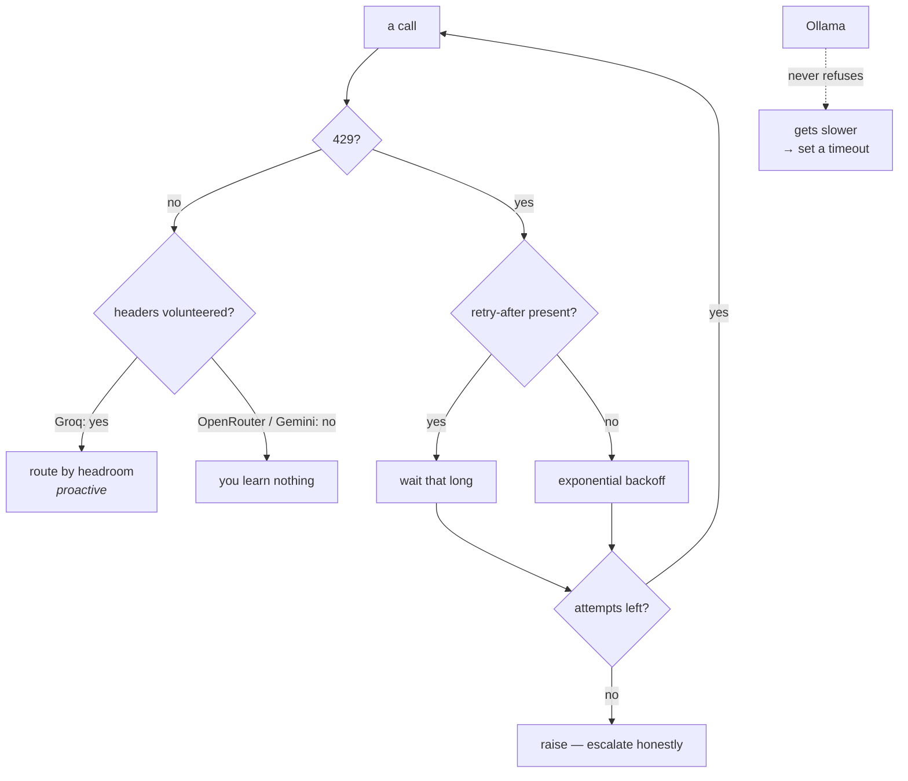

# 4.3 — Three shops, three closing times

## One-line answer

Each lane refuses you differently — one tells you your remaining quota on every response, one tells
you only when it says no, one gives a retry hint that is not a window, and one never refuses at all —
so "handle the 429" is four different jobs wearing one name.

---

## The story

Three shops on the same street, and all three shut for a while in the afternoon.

The first has a printed card in the window: **Closed 1:30 – 4:00**. You can plan around it from the
other end of the street. You never once turn up at the wrong time after the first day.

The second has nothing in the window. You walk up, the shutter is half down, and the man says "aa
jao, char baje." Now you know — but only because you walked there.

The third has nothing, and when you turn up the shutter is down and there is nobody to ask. You come
back in an hour. Still down. You come back an hour later and it is open, and you never do find out
what the rule was.

Three shops, the same underlying thing, three completely different amounts of information — and the
difference is not in the shops' opening hours. It is in **what they tell you and when**.

Nobody sensible treats all three the same way. For the first you plan. For the second you accept one
wasted trip. For the third you learn its habits over weeks, and you keep the first shop's number in
your pocket for the days it matters.

Your four lanes are those shops, plus one that never closes and just gets slower.

---

## The idea in plain language

[Day 2, part 1.5](../../../day-02-llm-mechanics/parts/01-first-contact/1.5-the-only-door-429.md) met
HTTP **429** — *too many requests* — and established the rule that matters:
`retry-after` is a number you respect, and a retry loop that ignores it burns a daily quota fighting
a per-minute one.

Today the same status code arrives from four places that behave differently. Here is what each one
tells you, verified on the dates given:

| Lane | Before you are refused | When you are refused |
| --- | --- | --- |
| **Gemini** | nothing published; limits visible only in AI Studio | a 429 with a retry hint. Day 2 observed `Please retry in ~53s` — **and twenty-eight requests obeying it, over a quarter of an hour, were all still refused**, because the exhausted limit was the *daily* one (`docs/PACKAGES.md` 2026-08-25, ADR-0007) |
| **Groq** | `x-ratelimit-remaining-requests` and `-tokens` on **every** response | a 429 with `retry-after` in seconds (`console.groq.com/docs/rate-limits`, 2026-08-26) |
| **OpenRouter** | nothing — *"successful inference responses do not include `X-RateLimit-*` headers"* | a 429 with `X-RateLimit-Limit`, `-Remaining`, `-Reset`, and `Retry-After` if every upstream provider gave a retry hint (`openrouter.ai/docs/api-reference/limits`, 2026-08-27) |
| **Ollama** | nothing to report — there is no limit | **it does not refuse.** It queues, and gets slower |

Four rows, and each one is a different engineering problem.

### The four problems

**Groq is the planning case.** You know your remaining allowance continuously, so you can stop
*before* being refused, shed load, or move traffic. This is the only lane where a router can act
proactively, and that is a genuinely different capability from retrying well.

**OpenRouter is the one-wasted-trip case.** You cannot know until you are told, so the only strategy
is to fail well: catch it, respect `Retry-After` if it is there, and move on. Anything cleverer is
guessing.

**Gemini is the trap**, and Day 2 already paid for the lesson. The hint said fifty-three seconds. It
was not a window; it was a suggestion, and the thing that had run out reset at midnight. So the
retry loop that obeyed it correctly, twenty-eight times, was not being patient — it was spending a
daily quota on the discovery that a daily quota had run out.

The rule that survives from that: **respect `retry-after`, and cap the number of attempts.** If a
handful of correctly-spaced retries all fail, the thing that ran out is not on the timescale you are
retrying at, and continuing is not persistence, it is waste. That is the shape of Day 72's ladder,
and it is Principle 10 too — an agent that keeps retrying instead of escalating is one that never
reports a failure.

**Ollama is the one people miss.** No refusal at all sounds strictly better and is not. A lane that
refuses gives you a signal you can act on; a lane that gets slower gives you a timeout somewhere
upstream, minutes later, in a component that has no idea why. **A limit that arrives as latency is
harder to handle than one that arrives as an error**, because there is no moment at which anything
says what happened.

### What "handle the 429" actually means

Four jobs, not one:

1. **Read the headroom where it is offered** (Groq) and route or throttle before refusal.
2. **Catch the refusal and respect the hint** where headroom is not offered (OpenRouter, Gemini).
3. **Cap the attempts**, because a hint about the wrong window will let you retry forever (Gemini).
4. **Set a timeout** where refusal never comes (Ollama), so slowness becomes an error you can see.

Only the second of those is what people usually mean by "handle the 429", and it is the one that
would have helped least on Day 2.

---

## Why Sutra needs it

**Day 72** closes SEC-15 — honest backoff under 429 — and it is the day this becomes code. Arriving
with four measured behaviours rather than one assumed one is the difference between a retry helper
and a retry helper that works.

**Day 70**'s Quota-Router: rows one and two of the table above decide whether a lane can be routed
*to* proactively or only *away from* reactively. That distinction is the router's core design, and it
comes straight from which provider publishes headers.

**Day 24** is quota accounting, and the numbers it counts are the ones in these headers.

**Day 13** adds callbacks around every model call, which is where the counting and the catching will
eventually live rather than in each call site.

---

## The mechanism

You cannot honestly demonstrate a 429 without provoking one, and provoking one on Gemini costs you a
whole day's quota. So the mechanism here is a **reader**, not a provoker: a helper that reports what
a lane tells you, and behaves correctly when a refusal does arrive.

```python
# lab/refusals.py - what each lane says, and the smallest honest response. 1 request per lane.
import sys
import time

import litellm

from sutra.config import load_env

MAX_ATTEMPTS = 3
CAP_SECONDS = 60


def headroom(response) -> dict:
    """Whatever the provider volunteered about your remaining quota. Often nothing."""
    headers = response._hidden_params.get("additional_headers", {}) or {}
    return {k: v for k, v in headers.items() if "ratelimit" in k or "retry-after" in k}


def ask(model: str, prompt: str) -> str:
    """One call, with a capped backoff that respects retry-after and then gives up."""
    for attempt in range(1, MAX_ATTEMPTS + 1):
        try:
            response = litellm.completion(
                model=model,
                messages=[{"role": "user", "content": prompt}],
                max_tokens=32,
            )
            reported = headroom(response)
            print(f"  headroom reported: {reported or 'nothing'}", file=sys.stderr)
            return response.choices[0].message.content
        except litellm.RateLimitError as exc:
            wait = min(float(getattr(exc, "retry_after", 0) or 2**attempt), CAP_SECONDS)
            print(f"  429 on attempt {attempt}; waiting {wait:.0f}s", file=sys.stderr)
            if attempt == MAX_ATTEMPTS:
                raise
            time.sleep(wait)
    raise RuntimeError("unreachable")


load_env()
model = sys.argv[1] if len(sys.argv) > 1 else "groq/llama-3.1-8b-instant"
print(f"### {model}", file=sys.stderr)
print(ask(model, "Reply with the single word: ok"))
```

**Line by line:**

- `import litellm` with no ADK — deliberately one layer down again, because ADK's `Event` has no field
  for provider headers and the exception types you need to catch belong to the library.
- `MAX_ATTEMPTS = 3` — **the cap is the point of this script**, and it is a named constant so it can
  be argued about. Day 2's twenty-eight obedient retries are what this number exists to prevent.
- `CAP_SECONDS = 60` — an upper bound on a single wait, because a provider is allowed to tell you to
  wait an hour and your process is not allowed to.
- `def headroom(response)` — the same private-attribute read as
  [2.3](../02-the-translator/2.3-the-express-counter.md), filtered the same way. It returns a
  dictionary rather than printing, so the caller decides what to do with nothing.
- `or {}` after the `.get(...)` — because the key can be present and `None`, and `None.items()` is the
  kind of failure that only happens on the provider you tested least.
- `for attempt in range(1, MAX_ATTEMPTS + 1)` — counting from one, because the number appears in a
  message a human reads.
- `except litellm.RateLimitError` — the specific exception, not `Exception`. A timeout, a bad key and
  a retired model are all different problems and none of them is helped by waiting.
- `getattr(exc, "retry_after", 0) or 2**attempt` — **the provider's hint first, exponential backoff
  as the fallback.** The `getattr` is defensive because not every provider populates it; the `or`
  handles it being present and zero. This is the honest-backoff shape Addendum 02 requires: respect
  the hint, back off when there is none.
- `min(..., CAP_SECONDS)` — the cap applied to whichever number won.
- `if attempt == MAX_ATTEMPTS: raise` — **re-raising rather than returning a message.** This is
  Principle 10 in one line: when the retries are exhausted the caller finds out, rather than receiving
  a polite string that looks like an answer. It is also trap #4 from the plan's §5.1 — do not swallow
  exceptions — which Day 21 gives a whole day to.
- The `raise RuntimeError("unreachable")` at the end — because the loop either returns or raises, and
  a function whose end is genuinely unreachable should say so rather than falling off into an implicit
  `None`.
- Everything diagnostic on **stderr**, the answer on stdout, the same split as
  [Day 7, part 2.2](../../../day-07-events-and-streaming/parts/02-the-stream/2.2-the-partial-flag.md).

```text
TODO(me): run it against each lane that has a key and paste your own output, from
    uv run python days/day-09-four-free-providers/lab/refusals.py groq/llama-3.1-8b-instant
    uv run python days/day-09-four-free-providers/lab/refusals.py openrouter/<a :free model>
One request each. What you are looking for is the `headroom reported:` line - which lane volunteers
numbers on a successful call and which says `nothing`. That single difference is what decides,
on Day 70, whether a lane can be routed to proactively.

Do NOT provoke a 429 on Gemini to see the message. Day 2 already paid for that observation and wrote
it down; spending twenty requests to reproduce a known result is exactly the waste this part is about.
```



---

## When it breaks

**💥 The retry loop that obeyed a hint about the wrong window.**

```text
  429 on attempt 1; waiting 53s
  429 on attempt 2; waiting 53s
  429 on attempt 3; waiting 53s
```

Day 2's finding, in three lines. The hint is correct and the limit that ran out is not the one you are
waiting for. Without `MAX_ATTEMPTS` this loop is patient until midnight. **A hint is about a wait, not
about which limit you hit** — and no provider tells you which.

**💥 The 429 that was swallowed.**

```python
except litellm.RateLimitError:
    return "Sorry, I'm a bit busy right now - please try again."
```

No error, a plausible sentence, and a system in which nothing ever reports being rate-limited. The
log is clean, the trace is green, the eval scores it as a response, and your quota dashboard says
you are fine. This is
[Day 7, part 3.3](../../../day-07-events-and-streaming/parts/03-the-yield-contract/3.3-your-own-emitter.md)'s
swallowed error with a bill attached, and it is why the helper above re-raises.

**💥 The lane that never refused and hung instead.**

Nothing in the output at all. The local lane is loading a model, or serving two requests at once with
enough memory for one, and your call is simply not finishing. No status code, no header, no
exception — until something upstream times out with a message about a socket. If the local lane is a
real fallback, the timeout is not optional, and it is the only thing that will ever turn this into a
signal.

---

## In production

**What a professional writes instead of the teaching version** is one retry policy, in one place —
Day 13's callbacks are where it belongs — with per-provider knowledge in a table rather than in each
call site. The policy is boring: respect the hint, cap the wait, cap the attempts, re-raise. The
per-provider part is which lanes report headroom, because that is the only thing that differs and it
is the only thing worth a lookup.

**What degrades at scale** is the retry itself. One client retrying politely is fine. Five hundred
clients hitting a limit at the same moment and all retrying after exactly the interval the provider
suggested is a synchronised wave that arrives together and is refused together. The standard fix is
**jitter** — randomise the wait a little so the herd spreads out — and it is the one line missing from
the helper above, left out deliberately so Day 72 can add it for a reason rather than as a ritual.

**The failure that only shows with real traffic** is quota exhaustion that is not evenly distributed.
Your daily allowance runs out at four in the afternoon, so every user before four had a working
service and everybody after did not. Averages hide it completely: the day's success rate looks
acceptable and half your users saw a broken product. Watching the *remaining* counter — which only
one of your four lanes offers — is what turns that into something you see coming.

**The review comment a senior engineer leaves:** *"This retries forever on the provider's hint. Cap the
attempts — the hint tells you how long to wait, not which limit you hit, and if it's the daily one
you'll retry until midnight. Add jitter, re-raise when the attempts run out, and log the remaining-
quota headers on the lane that gives them, because right now the first thing we know about exhaustion
is a customer."*

**The interview question:** *"how do you handle rate limits across several providers?"* The answer
that shows you have run into it: "First by noticing they don't behave the same. One of the providers
I used returned remaining-requests and remaining-tokens headers on every successful response, so you
can throttle or route before you're refused. Another only sends rate-limit headers on the 429 itself,
so the best you can do is fail well. A third publishes nothing at all, and its retry hint turned out
to be a backoff suggestion rather than a window — we retried obediently twenty-eight times over
fifteen minutes and every one was refused, because what had run out was the daily limit. So the
policy is: respect the hint, cap the wait, cap the attempts, add jitter, and re-raise instead of
returning an apology — because a swallowed 429 gives you a clean log and a broken product. And the
local lane doesn't refuse at all, it just gets slower, which needs a timeout or you get a hang with
no signal anywhere."

---

## Check yourself

```bash
uv run python days/day-09-four-free-providers/lab/refusals.py groq/llama-3.1-8b-instant
```

**Answer out loud, without scrolling up:**

> Name the four different jobs hiding behind "handle the 429", and say which lane makes each one
> necessary. Then explain why obeying a `retry-after` hint twenty-eight times was still the wrong
> thing to do.

---

**Next:** [5.1 — Which queue do you join?](../05-routing/5.1-which-queue-do-you-join.md)
