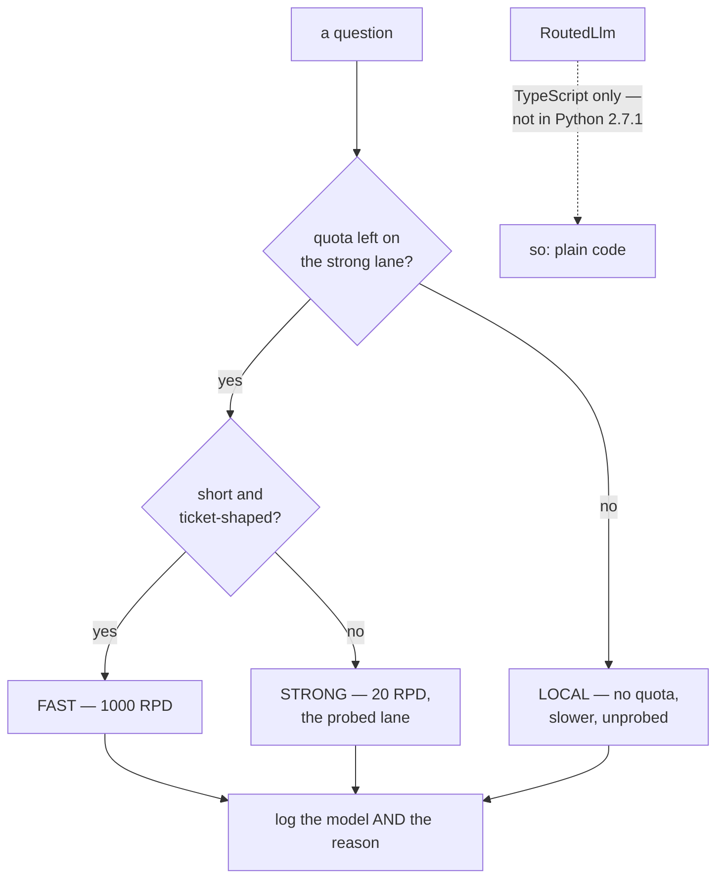

# 5.1 — Which queue do you join?

## One-line answer

**Routing is choosing a model per request**, and in ADK's Python runtime today there is no object
that does it for you — the documented `RoutedLlm` is TypeScript-only — so routing is a decision you
make in your own code, which is exactly what Day 70 will build.

---

## The story

The ticket hall has four counters open and you have thirty seconds to pick one.

You look at the queues. The first is long. The second is short — but the man at the front has three
forms and a bag of documents. The third is medium and moving. The fourth has two people and a sign
you cannot read from here.

You pick the third, and you were right, and you could not have explained why in a way that would
survive a follow-up question. You used the length of the queue, how fast it had moved in the last few
seconds, what the people in it were holding, and a general sense that the counter at the end is
always slow.

Now notice two things.

**You routed with incomplete information and it was still much better than not routing.** You did not
know how long each transaction would take. Joining the first queue you saw would have been worse.

**The information you used was not evenly available.** Queue length you could see. Speed you had to
watch for a moment. What the person at the front was doing you could only guess. And the sign at the
fourth counter — which might have said *closed after this customer* — you simply could not read.

That is routing, and the second observation is the one people skip. A router is only as good as what
each lane tells it, and [4.3](../04-the-benchmark/4.3-three-shops-three-closing-times.md) established
that your four lanes tell you wildly different amounts.

---

## The idea in plain language

**Routing** means choosing which model handles a request, per request, rather than once at build
time.

There are three reasons to do it, and it is worth keeping them separate because they lead to
different designs:

1. **Cost or quota.** Send the easy questions to the cheap lane and keep the expensive one for the
   hard ones. In a paid system that is money; here it is quota, which is the currency Addendum 02
   names.
2. **Capability.** Some nodes need a big model and some need a fast one. A classifier and a writer
   are different jobs.
3. **Availability.** The lane you wanted is out of quota or down, so use another. This is a
   *fallback*, and it is a different thing from the first two even though it looks similar.

Now, what ADK gives you for this — and this is a **Principle 8 finding**, so read it carefully.

`adk.dev/agents/models/routing/` documents a class called `RoutedLlm`: you give it several models and
a routing function, it picks one per request, and it re-invokes the function with error context if
the chosen model fails before producing output. It is a good design.

**It does not exist in `google-adk` 2.7.1 for Python.** The page's examples are TypeScript, and
searching the installed package for the name returns nothing.

That is not a bug and it is not a criticism. ADK is one framework with several language runtimes, and
they do not gain every feature at the same moment. What it *is*, is exactly the situation Principle 8
exists for: **a documentation page describing an API your runtime does not have.** If you had read
the page, written the Python from it and wondered why nothing imported, you would have lost an hour
to a page that was telling the truth about a different runtime.

So what routing looks like in Python today is plain code — because a model is chosen when the agent
is constructed, and constructing an agent is cheap:

> pick a model string → build the agent → run it

That is genuinely all of it, and it is enough for reasons one and two above. The **fallback** case —
reason three — needs a bit more, because it involves catching a failure and trying again with a
different lane, and doing that well is [5.2](5.2-the-dispatcher-at-the-taxi-stand.md)'s sketch and Day
70's build.

One thing worth being clear about before the code: **routing is a decision, and a decision has to be
written down.** A router whose rules live only in an `if` chain is a router nobody can review. The
table from [4.2](../04-the-benchmark/4.2-the-mileage-on-the-sticker.md) is the reviewable form; the
code should read like it.

---

## Why Sutra needs it

**Day 70** builds the Quota-Router, which Addendum 02 §6 specifies as tracking requests-remaining per
provider per window and routing each call to whoever has headroom. Today's four lanes and today's
benchmark table are its inputs.

**Day 53 onwards** is multi-agent, where reason two arrives: the classifier, the researcher and the
writer are separate nodes with separate needs, and giving them one model because that is simpler is a
decision worth making on purpose.

**Day 16** brings built-in tools with free-allowance limits attached, which is another reason to have
somewhere else to send work.

**Day 79 onwards** is evals, which are the only way to find out whether a routing rule made things
worse. A router without an evalset is a system where quality changes silently, which
[3.3](../03-local/3.3-the-learner-driver.md) already showed is the most expensive kind of change.

---

## The paper behind it

> **RouteLLM: Learning to Route LLMs with Preference Data**
> arXiv:2406.18665 · 2024 · <https://arxiv.org/abs/2406.18665>

Its claim in one sentence: a **router trained on human preference data** can send most queries to a
much cheaper model and only the hard ones to the strong model, keeping most of the strong model's
answer quality while making a large fraction of the calls cheaply.

Read it after the parts, in [`papers/01-routellm.md`](../../papers/01-routellm.md) — that is
Principle 4 at the scale of a day: build the routing by hand first, then find out what the field
learned about doing it well.

---

## The mechanism

Routing as it exists in Python: a function that returns a model string, and an agent built from it.
**Zero requests** — this part chooses, it does not call:

```python
# lab/route.py - routing, in the only form Python ADK has today.
import re

from google.adk.agents import LlmAgent
from google.adk.models.lite_llm import LiteLlm

from sutra.desk.agent import INSTRUCTION

# The lanes, from lab/BENCHMARK.md (4.2). Quotas checked 2026-08-27.
FAST = "groq/llama-3.1-8b-instant"  # 30 RPM / 1000 RPD
STRONG = "gemini-3.7-flash"  # 20 RPD - spend it deliberately
LOCAL = "ollama_chat/TODO-your-model"  # no quota; slower

TICKET = re.compile(r"\b\d{4}\b")


def choose(question: str, *, gemini_left: int) -> tuple[str, str]:
    """Pick a lane, and say why. The reason is half the point."""
    if gemini_left <= 0:
        return LOCAL, "Gemini quota exhausted; falling back to the local lane"
    if len(question) < 120 and TICKET.search(question):
        return FAST, "short, has a ticket number - classification-shaped"
    return STRONG, "long or unstructured - the lane the handbook was qualified on"


def build(model: str) -> LlmAgent:
    chosen = model if model.startswith("gemini-") else LiteLlm(model=model)
    return LlmAgent(name="sutra_desk", model=chosen, instruction=INSTRUCTION)


QUESTIONS = [
    "ticket 4521 - logged out after a few minutes",
    "Users across three teams are reporting that the app signs them out unpredictably, "
    "sometimes after a minute and sometimes after an hour, and it started on Monday.",
]

for question in QUESTIONS:
    for remaining in (20, 0):
        model, why = choose(question, gemini_left=remaining)
        print(f"gemini_left={remaining:<3} -> {model}")
        print(f"    because: {why}")
        print(f"    agent   : {build(model).name} on {type(build(model).model).__name__}")
    print()
```

**Line by line:**

- The three lane constants with **their quotas in the comments**, sourced from the benchmark file. A
  router whose lanes are bare strings is a router where nobody can check the reasoning.
- `def choose(...) -> tuple[str, str]` returning **the model and the reason** — the single most
  important design choice in this file. A router that returns only a model is one whose decisions
  cannot be logged, and a routing decision you cannot log is one you cannot debug or defend.
- `gemini_left` as a **keyword-only parameter** rather than a global or a lookup inside the function —
  so the function is pure, testable with no network, and honest about what it depends on. Day 70's
  version gets this number from the headers in
  [4.3](../04-the-benchmark/4.3-three-shops-three-closing-times.md); today you pass it in.
- The **availability check first** — quota exhaustion overrides every other rule, because a better
  model you cannot call is not a better model. Ordering rules by which one can veto is how a rule
  chain stays readable.
- `len(question) < 120 and TICKET.search(question)` — a deliberately crude heuristic, and it is
  crude on purpose: this is the hand-rolled version, and the paper in
  [`papers/01-routellm.md`](../../papers/01-routellm.md) is about what replaces it. Principle 4 —
  build it by hand, then read the proposal.
- The `return STRONG` fallthrough with a reason naming
  [3.3](../03-local/3.3-the-learner-driver.md) — *"the lane the handbook was qualified on"*. That is
  not decoration: it records that the default is not a preference, it is the only lane whose
  behaviour has been probed.
- `build(model)` separating **choosing** from **constructing** — two functions, so the choice can be
  unit-tested without building anything and the construction can be reused by every lane.
- The loop over `(20, 0)` — the same question routed twice, with quota and without, so the fallback
  rule is visible rather than described.
- Calling `build(model)` twice in the print — a small wastefulness kept for readability in a lab
  script, and precisely the sort of thing to fix in product code. Building an agent is cheap; saying
  so is better than pretending you did not notice.

The output:

```text
gemini_left=20  -> groq/llama-3.1-8b-instant
    because: short, has a ticket number - classification-shaped
    agent   : sutra_desk on LiteLlm
gemini_left=0   -> ollama_chat/TODO-your-model
    because: Gemini quota exhausted; falling back to the local lane
    agent   : sutra_desk on LiteLlm

gemini_left=20  -> gemini-3.7-flash
    because: long or unstructured - the lane the handbook was qualified on
    agent   : sutra_desk on str
gemini_left=0   -> ollama_chat/TODO-your-model
    because: Gemini quota exhausted; falling back to the local lane
    agent   : sutra_desk on LiteLlm
```

**One row says `str`.** Look at it before reading on and work out why, because it is not a bug in the
script — it is [1.2](../01-one-model-field/1.2-the-spare-tyre-you-never-checked.md) arriving in a
place you were not looking for it.

`build()` wraps every lane except Gemini in a `LiteLlm` object and passes the Gemini string through
untouched, because that lane is native. So on three rows the `model` field holds a `LiteLlm` and on
one it holds a plain `str` — **which is not resolved into a `Gemini` object until something asks for
`canonical_model`.** The field is a string; the class comes later. Printing `type(agent.model)`
therefore shows you the *field*, not the model, and the two are the same thing on three lanes and not
on the fourth.

The lesson is small and repeats all day: **routing changes the shape of what you are holding, not
just its value.** Any code downstream of a router that inspects the model object has to survive both
shapes.

There is also a small wastefulness in that line — `build(model)` is called twice, making two agents to
print one class name. Building an agent is cheap, so it is harmless here and would be sloppy in
product code. Noticing it is worth more than the ten seconds fixing it costs.



---

## When it breaks

**💥 The class that is not there.**

```text
ImportError: cannot import name 'RoutedLlm' from 'google.adk.models'
```

Written from the documentation page, in Python, against 2.7.1. The page is correct and it is
documenting the TypeScript runtime. **Check the installed package before you write code from a page**
— one line, `LLMRegistry` and `dir()`, and it is the same discipline as
[Day 7, part 1.2](../../../day-07-events-and-streaming/parts/01-the-event-object/1.2-the-fields-that-were-renamed.md)'s
rule about fields.

**💥 The router that logged the model and not the reason.**

Not an error. Six months later, a question — *why did this ticket go to the cheap lane?* — has no
answer, because the log says `model=groq/...` and the rule that produced it has been edited twice
since. The reason string costs one field and is the difference between an audit and a shrug.

**💥 The fallback nobody probed.**

The local lane is chosen when quota runs out, and
[3.3](../03-local/3.3-the-learner-driver.md) established that a prompt is qualified against a model
rather than in the abstract. So the fallback path is the one path whose behaviour you have not
verified, and it fires exactly when everything else is already under pressure. That is a bad
combination, and the fix is to run the probes on the fallback lane too — which is a decision about
quota, not about code.

---

## In production

**What a professional writes instead of the teaching version** is a routing function that is pure,
returns a decision object rather than a string, and is unit-tested with no network. Pure because
routing rules are the easiest thing in an agent system to test and the most commonly untested; a
decision object because you want the model, the reason and the rule's name; unit-tested because a
routing bug is invisible — nothing errors, the answers just come from somewhere else.

**What degrades at scale** is the rule chain. Three rules read like a policy; fifteen read like
sediment, each added for one incident, none removed, and the interaction between rules four and
eleven is something nobody has held in their head. The teams that stay ahead of this keep the rules
in a table with the reason for each, review them like configuration rather than code, and delete the
ones whose incident nobody remembers.

**The failure that only shows with real traffic** is the routing rule that is subtly wrong on real
inputs. `len(question) < 120` sorts your test tickets neatly, and real users write two words or paste
a log file, so almost everything lands on one side. The distribution of your routing decisions is a
metric worth having on day one — if 98% of requests take one branch, you have a constant with extra
steps, and you cannot see that from any individual request.

**The review comment a senior engineer leaves:** *"Return the reason as well as the model and log both.
And this is routing on length — check the actual split on a week of real tickets before we rely on
it, because I'd bet it sends everything one way. Also: we've never run the persona probes on the
fallback lane, which is the one that fires when we're already having a bad day."*

**The interview question:** *"how would you route between models?"* The answer that shows you have
built one: "Start with the decision, not the mechanism: routing is choosing a model per request, and
there are three separate reasons — cost or quota, capability per node, and availability, which is
really a fallback and behaves differently. Then be honest about what each provider tells you: one of
mine reported remaining quota on every response, so it could be routed to proactively, and the others
only told me when they refused, so those could only be routed away from reactively. The
implementation is a pure function that returns a model **and a reason**, unit-tested without a
network, and both logged — because a routing bug doesn't error, the answers just come from somewhere
else, and without the reason you can't reconstruct why. The thing I'd check before trusting any rule
is the distribution of decisions on real traffic, because heuristics that look balanced on test data
usually send 98% of real requests one way."

---

## Check yourself

```bash
uv run python days/day-09-four-free-providers/lab/route.py
uv run python -c "from google.adk import models; print([n for n in dir(models) if 'Rout' in n])"
```

The second command is the Principle 8 check: an empty list is the finding.

**Answer out loud, without scrolling up:**

> Give the three reasons to route and say which one is really a fallback. Then say what `RoutedLlm`
> is, why you cannot use it, and what you would have lost by trusting the documentation page.

---

**Next:** [5.2 — The dispatcher at the taxi stand](5.2-the-dispatcher-at-the-taxi-stand.md)
