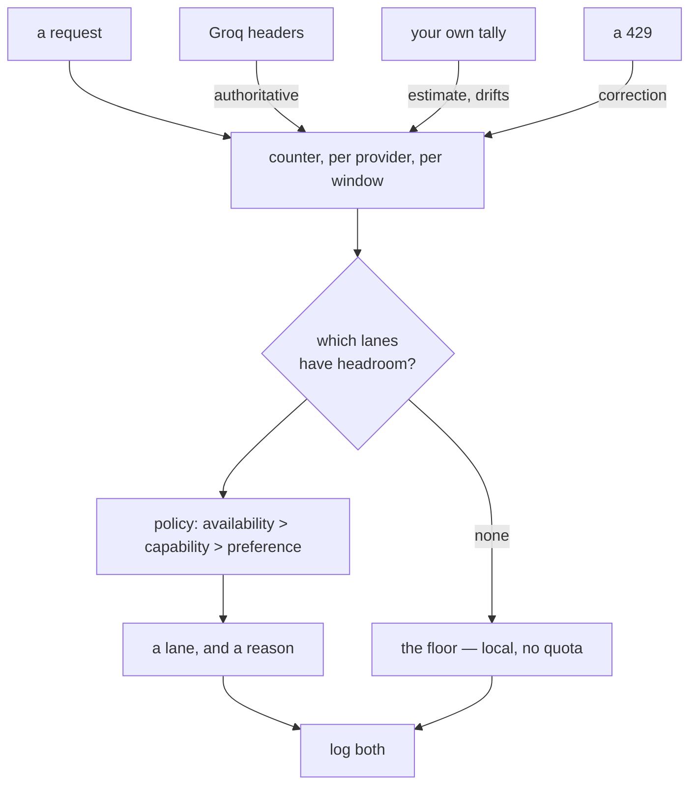

# 5.2 — 🅿️ The dispatcher at the taxi stand

## One-line answer

The Quota-Router that Day 70 builds needs four things — a per-provider counter, a policy, a floor and
a log — and three of the four are already in your hands today; this part is the sketch, deliberately
not the build.

---

## The story

A taxi stand outside a station, and one man with a register who decides who takes the next fare.

He is not choosing at random and he is not simply going in order. He knows things. That driver has
been waiting an hour and is owed one. That one's CNG is nearly out and the pump is the wrong side of
town, so a long fare would strand him. That one has an air-conditioner that works, which matters for
the couple with the baby. And there is one car at the back that nobody wants but which is there, and
on a wet evening when everything else has gone, it goes.

Take one thing away from him — say he can no longer see the fuel gauges — and he does not stop
dispatching. He gets worse at it in a specific way: he sends someone out who cannot finish the trip,
and finds out when they call.

That is the difference between the four lanes in
[4.3](../04-the-benchmark/4.3-three-shops-three-closing-times.md). For one of them he can see the
gauge. For two of them he finds out when the driver calls. And the car at the back that nobody wants
is the local lane, which is always there and is never anybody's first choice.

---

## The idea in plain language

🅿️ **This part is parked**: awareness-level, interview-ready, deliberately not built today. It gets
built on **Day 70**, in the safety and security phase, where Addendum 02 §6 specifies it:

> *The Quota-Router plugin (Day 70, replaces the dollar-budget plugin's currency): tracks
> requests-remaining per provider per window; routes each call to whoever has headroom. Classifier →
> Groq (30 RPM lane); deep reasoning → Gemini Flash; overnight evals → Flash-Lite; everything →
> Ollama when all clouds are exhausted.*

What is worth having now is the **shape**, so that Day 70 is an implementation rather than a design
exercise, and so that today's benchmark table is built with its consumer in mind.

### The four things it needs

**1. A counter, per provider, per window.** Not one number — two, because
[2.3](../02-the-translator/2.3-the-express-counter.md) established that providers meter on different
windows: requests per day *and* tokens per minute, and you can exhaust either. And it has to be per
provider, because a shared counter would let a cheap lane's usage lock out an expensive one.

Where the numbers come from differs by lane, and that is the whole reason
[4.3](../04-the-benchmark/4.3-three-shops-three-closing-times.md) exists:

| Lane | Source of the count |
| --- | --- |
| Groq | its headers, on every response — **authoritative and free** |
| OpenRouter | your own tally, corrected by a 429 |
| Gemini | your own tally, corrected by a 429 |
| Ollama | not applicable |

Two of the four require you to count for yourself, which means the counter can drift — a call that
failed after being counted, a process restart losing the tally
([Day 8, part 4.1](../../../day-08-sessions-and-services/parts/04-what-in-memory-means/4.1-the-tab-you-did-not-save.md)
is about exactly that). So the counter is an estimate everywhere except Groq, and a router that
treats an estimate as a fact will occasionally be confidently wrong.

**2. A policy.** The rules, in order, each with a reason —
[5.1](5.1-which-queue-do-you-join.md)'s `choose()` grown up. The ordering principle from that part
holds: availability vetoes capability, capability vetoes preference.

**3. A floor.** The lane that is used when everything else is exhausted, and it must be one that
cannot run out. That is the local lane, which is why
[3.1](../03-local/3.1-cooking-at-home.md) calls it the zero-dependency baseline rather than the
cheap option. **A router with no floor is a router that returns an error at midnight**, which is
precisely when nobody is looking.

And a floor has an obligation attached: it is the lane that will serve real users when things are
worst, so its behaviour has to be probed —
[3.3](../03-local/3.3-the-learner-driver.md)'s point, arriving with consequences.

**4. A log.** The model **and the reason**, on every call, from
[5.1](5.1-which-queue-do-you-join.md). Without it, "why did quality dip last Tuesday?" has no answer,
because a fallback firing is not an error and produces no trace of itself.

### Where it will live

Not in your call sites. ADK has two mechanisms for cross-cutting behaviour: **callbacks**, which are
per agent and arrive on Day 13, and **plugins**, which are per application and arrive on Day 14.
Addendum 02 calls this a *plugin*, and that is the right level — the router is a property of the
system, not of one agent, and duplicating it per agent is how two agents end up with different ideas
about the same quota.

So the honest statement of today's position: **you have the lanes, the numbers and the shape. You do
not yet have the mechanism to attach it, and reaching for one now would mean building it in the wrong
place.**

---

## Why Sutra needs it

**Day 70** is the build, closing OPS-12, and it is what makes the rest of this curriculum runnable at
all: a multi-agent triage graph making several calls per ticket cannot live on twenty requests a day.

**Day 13 and Day 14** are the mechanisms — callbacks and plugins — and each will make more sense if
you already know what you want to attach.

**Day 24** is quota accounting, which is the counter from item 1 without the routing decision on top.
It comes first for a reason: **you cannot route on a number you are not tracking.**

**Day 72** is honest backoff, which is what the router does when its estimate turns out to be wrong
and a lane refuses anyway.

---

## The mechanism

The sketch, as a shape rather than a system. It runs, it costs nothing, and it makes no model calls —
it is here to make the four pieces concrete:

```python
# lab/quota_sketch.py - the shape of Day 70, in forty lines. No model calls.
from dataclasses import dataclass, field


@dataclass
class Lane:
    """One provider lane, and what we believe about its remaining quota."""

    model: str
    requests_per_day: int | None  # None = no limit (the local lane)
    used_today: int = 0
    reported_remaining: int | None = None  # set from headers, where a lane sends them

    @property
    def headroom(self) -> int | None:
        """Remaining requests. Provider-reported beats our own tally."""
        if self.requests_per_day is None:
            return None  # unlimited
        if self.reported_remaining is not None:
            return self.reported_remaining
        return max(0, self.requests_per_day - self.used_today)

    @property
    def available(self) -> bool:
        return self.headroom is None or self.headroom > 0


@dataclass
class Router:
    lanes: list[Lane] = field(default_factory=list)

    def choose(self, *, needs_quality: bool) -> tuple[Lane, str]:
        """Availability vetoes capability. Returns the lane and the reason."""
        usable = [lane for lane in self.lanes if lane.available]
        if not usable:
            raise RuntimeError("no lane has headroom and no floor is configured")
        if needs_quality:
            for lane in usable:
                if lane.requests_per_day is not None:
                    return lane, "quality wanted; first hosted lane with headroom"
        return usable[
            -1
        ], "cheapest usable lane" if not needs_quality else "everything else exhausted"


router = Router(
    lanes=[
        Lane("gemini-3.7-flash", requests_per_day=20),
        Lane("groq/llama-3.1-8b-instant", requests_per_day=1000),
        Lane("ollama_chat/TODO-your-model", requests_per_day=None),
    ]
)

for label, quality in (("a hard ticket", True), ("a classification", False)):
    lane, why = router.choose(needs_quality=quality)
    print(f"{label:<18} -> {lane.model:<28} ({why})")

router.lanes[0].used_today = 20
router.lanes[1].reported_remaining = 0
lane, why = router.choose(needs_quality=True)
print(f"{'both exhausted':<18} -> {lane.model:<28} ({why})")
```

**Line by line:**

- `@dataclass` for both — the plan's rule, and here it earns its keep: two small records with fields
  and one derived property each, which is precisely what dataclasses are for and what a dictionary
  would obscure.
- `requests_per_day: int | None` with `None` meaning **unlimited** — a deliberate choice, and one worth
  arguing about. The alternative, a very large number, would let the local lane be "used up", which
  is wrong and would be invisible until a bad night. Encoding "no limit" as a different *kind* of
  value forces every consumer to handle it.
- `reported_remaining` separate from `used_today` — **two sources of truth, ranked.** The provider's
  number when there is one, your own tally when there is not, which is the table in the section above
  turned into two fields.
- `headroom` returning `int | None` rather than raising or defaulting — so "unlimited" travels through
  the calculation rather than being flattened at the edge.
- `max(0, ...)` on the fallback tally — a negative headroom is arithmetically possible when your
  count drifts, and a negative number in a comparison is the kind of thing that reads as available.
- `available` derived from `headroom` rather than stored — one source of truth, no chance of the two
  disagreeing.
- `usable = [...]` computed **first**, before any preference is considered — availability vetoing
  capability, expressed as a filter rather than as a rule buried in an `if`.
- `raise RuntimeError("no lane has headroom and no floor is configured")` — the failure this design
  is meant to make impossible, kept explicit. If it ever fires, the floor is missing, and the message
  says so rather than saying "no lane available".
- `return lane, reason` everywhere — [5.1](5.1-which-queue-do-you-join.md)'s rule, unchanged.
- The last three lines exhausting both hosted lanes and re-asking — the floor demonstrated rather
  than described.

The output:

```text
a hard ticket      -> gemini-3.7-flash             (quality wanted; first hosted lane with headroom)
a classification   -> ollama_chat/TODO-your-model  (cheapest usable lane)
both exhausted     -> ollama_chat/TODO-your-model  (everything else exhausted)
```

The middle row is worth arguing with, and that is why it is here: this sketch sends a classification
to the **local** lane, because `usable[-1]` is a crude stand-in for "cheapest". Sending every
classification to the slowest lane while a thousand free Groq requests sit unused is a bad policy
produced by a plausible-looking line of code. **The policy is the hard part; the plumbing is forty
lines.** Fixing that ordering is one of today's `TODO(me)` items.



---

## When it breaks

**💥 The router with no floor.**

```text
RuntimeError: no lane has headroom and no floor is configured
```

The sketch raises this on purpose. In a real system without it you get whichever provider error the
last exhausted lane returned, at two in the morning, and the fact that the *design* was missing a
lane rather than the *call* failing is invisible from the traceback.

**💥 The counter that drifted.**

No error. Your tally says eleven requests used and the provider thinks it was fourteen, because three
calls were counted and then failed, or a retry counted twice, or the process restarted and lost the
number. The router keeps routing to a lane that is already exhausted and every one of those calls is
refused. **Where a provider reports its own numbers, believe them over your arithmetic** — which is
why `reported_remaining` outranks `used_today` in `headroom`.

**💥 The policy that was a bug.**

The middle row above. Nothing failed, nothing errored, and every classification went to the slowest
lane. A routing policy fails by being *worse*, not by being *broken*, which is why
[5.1](5.1-which-queue-do-you-join.md) asks for the distribution of decisions as a metric and Day 79's
evals are what actually catch it.

---

## In production

**What a professional writes instead of the teaching version** is a router whose counters survive a
restart. An in-process tally is
[Day 8, part 4.1](../../../day-08-sessions-and-services/parts/04-what-in-memory-means/4.1-the-tab-you-did-not-save.md)
all over again: a deploy at four in the afternoon resets your belief about a daily quota that does not
reset until midnight, and the router then confidently spends quota it does not have. The counter
belongs wherever the sessions belong.

**What degrades at scale** is agreement between processes. Two replicas each keep their own tally, so
each believes it has the full allowance and together they spend twice it —
[Day 8, part 4.2](../../../day-08-sessions-and-services/parts/04-what-in-memory-means/4.2-two-counters-two-notebooks.md)'s
split brain, applied to something that costs money. A quota shared across processes has to be counted
somewhere shared, and that is a genuine piece of infrastructure rather than a variable.

**The failure that only shows with real traffic** is the fallback that becomes the default. Quota runs
out earlier each day as usage grows, so the floor serves an increasing share of traffic — first the
last hour, then the afternoon — and because the floor answers rather than failing, nothing alerts. The
metric that catches it is the **proportion of requests served by each lane, over time**, which is
worth building on the day the router is, not later.

**The review comment a senior engineer leaves:** *"The counter is in memory, so a deploy resets our idea
of a daily quota and we'll overspend for the rest of the day. Put it where the sessions are. And
alert on the share of traffic hitting the floor — right now the fallback firing looks exactly like
everything being fine."*

**The interview question:** *"how would you keep a multi-provider system inside free-tier limits?"* The
answer that shows you have thought past the code: "A router with four parts: a per-provider counter
that respects the provider's own numbers where it publishes them and falls back to my tally where it
doesn't; a policy where availability vetoes capability; a floor that cannot run out — a local model —
because a router without one just fails at midnight; and a log of the model *and the reason* on every
call, because a fallback firing isn't an error and leaves no trace otherwise. The two things I'd get
wrong if I weren't careful are keeping the counter in process memory, which a deploy resets while the
provider's daily window doesn't, and not alerting on the share of traffic hitting the floor — because
as usage grows the fallback quietly becomes the default and everything still looks green."

---

## Check yourself

```bash
uv run python days/day-09-four-free-providers/lab/quota_sketch.py
```

Fix the middle row: make a classification go to the fast hosted lane while it has headroom, and only
to the local lane when it does not. It is a small change and it is the whole difference between a
plumbing exercise and a policy.

**Answer out loud, without scrolling up:**

> Name the four things a Quota-Router needs, and say which of them today's four lanes make hardest.
> Then say why the floor has to be a lane you have probed.

---

**Next:** [6.1 — The spec sheet you can read](../06-parked/6.1-the-spec-sheet-you-can-read.md)
