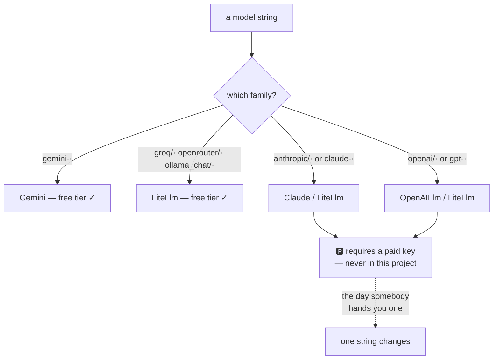

# 6.1 — 🅿️ The spec sheet you can read

## One-line answer

The paid lanes — Claude and the OpenAI models — are **two lines of code away** and permanently out of
scope for this project, and knowing exactly which two lines is the whole of what you need, because
the skill transfers unchanged the day somebody hands you a key.

---

## The story

There is a car you are not going to buy.

You still read about it. You know its engine, roughly what it costs to service, that the boot is
smaller than it looks and that the third variant is the one worth having because of the suspension.
You could hold a conversation with somebody who owns one and not embarrass yourself.

That knowledge is not wasted and it is not aspiration. It is what lets you say something useful when
a friend asks which of two cars to buy, and it is what stops you being sold a story at a showroom.

The one thing it is not is a car. You have not driven it, you do not know how it feels on a bad road,
and if you claimed you did, the first person who has actually owned one would know within a sentence.

So the honest position is a specific one: **read the spec sheet, know what it says, and never claim
the drive.** That is exactly the position this curriculum takes on the paid lanes, and it is a
position worth being able to state out loud in an interview.

---

## The idea in plain language

🅿️ **This part is parked.** Awareness-level, deliberately not built, and it will stay parked for all
ninety-seven days.

Addendum 02 is unambiguous about why. Its Day 9 amendment says the four-provider comparison replaces
the original plan's Gemini/Claude/OpenAI/Ollama one, and that:

> *Claude & OpenAI become a 🅿️ reading comparison — the wiring is identical LiteLLM syntax, so the
> skill transfers the day you ever get a paid key.*

And `CLAUDE.md` states the rule that follows from it: **never write code that requires a billing
account, a paid model, or a paid API.** That is Principle 15, and it is not a preference — it is what
makes this project reproducible by anybody.

### What "identical wiring" actually means

Two ways in, and it is worth knowing both because they behave differently.

**Through the adapter**, exactly like Groq and OpenRouter — same class, same shape, different prefix:

```python
# NOT run in this project. Requires a paid key. Here for the shape only.
from google.adk.models.lite_llm import LiteLlm

paid_claude = LiteLlm(model="anthropic/<a claude model>")
paid_openai = LiteLlm(model="openai/<a gpt model>")
```

**Line by line:**

- The comment on the first line is not decoration. A code block in this repository that would spend
  money gets a header saying so, because somebody will copy it, and the model names are left as
  placeholders for the same reason — Principle 7 forbids inventing them and looking them up would
  invite pinning one.
- `anthropic/` and `openai/` — both are in **ADK's own registry pattern list** from
  [1.1](../01-one-model-field/1.1-a-name-is-a-lookup.md), alongside `groq/` and `ollama_chat/`. So
  these strings resolve to `LiteLlm` on the machine you are sitting at right now, with no extra
  install, and would fail at the call for want of a key rather than for want of support.
- Everything else about the agent is unchanged: the same `LlmAgent`, the same instruction, the same
  runner. That is the sentence Addendum 02 is making — the wiring is not similar, it is the same.

**Natively**, which is the part most people do not know: ADK ships dedicated classes for both, and
their patterns are already in the registry you inspected in
[1.1](../01-one-model-field/1.1-a-name-is-a-lookup.md):

| Pattern | Class | Lives in |
| --- | --- | --- |
| `claude-3-.*`, `claude-.*-4.*`, `claude-.*-5.*` | `Claude` | `google.adk.models.anthropic_llm` |
| `gpt-.*`, `o\d+-.*` | `OpenAILlm` | `google.adk.labs.openai` |

So a **bare** model name — one with no provider prefix — resolves to a dedicated class rather than
failing, for exactly these two families and no others. That is worth knowing because it explains an
asymmetry you have already seen:
[1.1](../01-one-model-field/1.1-a-name-is-a-lookup.md)'s `llama-3.3-70b-versatile` failed with no
prefix, and a bare Claude or GPT name would not have.

### What actually differs, beyond the key

Three things, and they are the useful content of this part.

**Claude carries reasoning state that has to survive the round trip.** ADK's LiteLLM page says it
*"automatically handles thinking blocks and their signatures across multi-turn conversations"*
(checked 2026-08-26). That is a real integration detail rather than a marketing line: a model that
produces internal reasoning alongside its answer needs that reasoning carried back correctly on the
next turn, and a framework that drops it silently degrades multi-turn behaviour. It is also a preview
of a general lesson — **the adapter smooths the common path and the edges need specific work**, which
[2.1](../02-the-translator/2.1-one-charger-many-sockets.md) warned about in the abstract and this is
in the concrete.

**`google.adk.labs.openai` is a `labs` module.** The name is the API stability statement. A `labs`
namespace is where a framework puts things it is not yet promising to keep, and pinning production
behaviour to one is a decision with a maintenance cost attached.

**The economics invert.** Every design pressure in this curriculum comes from quota: Day 70's router,
Day 51's caching, Day 24's budget. On a paid lane those pressures become money, which is *softer* —
you can always spend more — and the engineering that free tiers force is engineering paid users
routinely skip until production teaches it to them expensively. Addendum 02 says this in its closing
line and it is worth agreeing with rather than reading past.

### What you are entitled to say

You have read the spec sheet. You know the wiring is two lines, you know ADK has native classes for
both families, you know one of them lives in `labs`, and you know Claude's thinking blocks are a
handled edge case.

You have not driven it. You do not know how those models behave on your prompts, and
[3.3](../03-local/3.3-the-learner-driver.md) is exactly the reason that matters: a prompt is
qualified against a model, and you have qualified yours against four models, none of which are these.

**Say the first. Never say the second.** An interviewer who has used both will know the difference in
one question, and the honest answer is more impressive than the bluff, because it demonstrates the
thing they are actually testing for.

---

## Why Sutra needs it

**Day 91** is the integrations survey, where paid-only items are noted as *"requires budget"* rather
than skipped silently. This part is the template for how that is written.

**Day 70**'s router is provider-agnostic by construction. The day a paid key appears, adding a lane is
a row in a table, and it is a row in a table because of the shape today's four lanes established.

**Phase 14** takes the repository public. A public repository containing a code path that bills its
reader is a genuine hazard, which is why the block above is commented as unrunnable and
[7.1](../07-failure-lab/7.1-the-free-trial-that-charges.md) is today's failure lab.

**Every interview** you will have about this work will include some version of "why did you not use
the good models?" The answer is on the record: because the constraint is the curriculum, and because
a hiring manager cannot tell from a repository whether the tokens were free but can tell whether the
system is well engineered.

---

## The mechanism

The only thing to run here is the registry, which will happily tell you about lanes you cannot use.
**Zero requests, zero keys:**

```python
# lab/parked_lanes.py - the paid lanes, resolved but never called.
from google.adk.models import LLMRegistry

PARKED = [
    "anthropic/<a claude model>",
    "openai/<a gpt model>",
]

print("--- what a provider-prefixed paid string resolves to ---")
for name in PARKED:
    try:
        print(f"  {name:<28} -> {LLMRegistry.resolve(name).__name__}")
    except Exception as exc:
        print(f"  {name:<28} -> {type(exc).__name__}")

print()
print("--- and the native classes ADK ships for them ---")
for module, symbol in (
    ("google.adk.models.anthropic_llm", "Claude"),
    ("google.adk.labs.openai", "OpenAILlm"),
):
    print(f"  {symbol:<12} declared in {module}")
```

**Line by line:**

- The model names are **placeholders**, deliberately: a working example would need a real model name,
  Principle 7 says look it up, and looking one up in order to demonstrate a lane you must not use is
  an invitation.
- And the placeholders **resolve anyway**, which is the finding. The registry matches on the
  **prefix**, so `anthropic/<a claude model>` — angle brackets and all — selects `LiteLlm` exactly as
  a real name would. That is
  [1.1](../01-one-model-field/1.1-a-name-is-a-lookup.md)'s *resolution is not validation* rule showing
  up where it matters most: **the framework will happily prepare a paid lane for a model that does
  not exist**, and the only thing that would have failed is the call.
- `except Exception` printing only the type — kept as a guard even though it never fires here, because
  a script that would crash on a registry change is a script nobody reruns.
- The second block printing **module paths rather than importing** — importing `anthropic_llm` would
  require the `anthropic` package, which is in the fat extra
  [2.2](../02-the-translator/2.2-the-toolkit-you-did-not-need.md) declined. Printing where a class
  lives is the whole point and costs nothing.
- No key, no call, no network anywhere. **A part about lanes you must not use should not be able to
  use them**, and the strongest way to guarantee that is for the script to contain nothing that
  could.

The output:

```text
--- what a provider-prefixed paid string resolves to ---
  anthropic/<a claude model>   -> LiteLlm
  openai/<a gpt model>         -> LiteLlm

--- and the native classes ADK ships for them ---
  Claude       declared in google.adk.models.anthropic_llm
  OpenAILlm    declared in google.adk.labs.openai
```

Two placeholders that name nothing, both resolved, both ready. Nothing in this machine's
configuration prevented that; the only reason no money moved is that no key was present and no call
was made.



---

## When it breaks

**💥 The paid string that resolved.**

```text
anthropic/<a real model>     -> LiteLlm
```

Nothing warns you. The registry resolves it, the agent builds, and the only thing between you and a
bill is whether an `ANTHROPIC_API_KEY` happens to be in your environment. On your machine it is not.
On a colleague's, or in a CI job with a shared secret, it might be — which is why
[7.1](../07-failure-lab/7.1-the-free-trial-that-charges.md)'s lint checks strings rather than trusting
that a key is absent.

**💥 The key that was there all along.**

Not an error, and the worst version of this. `.env.example` in this repository lists exactly four
names, all free, and that is deliberate. A repository whose example environment file invites a paid
key is a repository that will eventually contain a paid call, because somebody will fill it in and
somebody else will use it.

**💥 Claiming the drive.**

No traceback. You say in an interview that you compared Claude and Gemini for a triage agent, and the
second question is about how the two handled a specific kind of failure, and there is nowhere to go.
The version of that sentence you can actually defend is *"the wiring is identical, so adding it would
be one string — I ran the comparison across four free providers instead, and here is what I
measured"*, which is a better answer to the question they were really asking.

---

## In production

**What a professional writes instead of the teaching version** is a provider list in configuration
with the free and paid lanes marked, and a check at startup that refuses to enable a paid lane unless
something explicitly says so. Not because paid lanes are bad — because *an accidental* paid lane is,
and the difference between the two is a boolean somebody had to set on purpose.

**What degrades at scale** is the assumption that the free lane stays free. Providers change tiers,
free allowances shrink, and a model that was free on a Monday can be paid on a Friday —
[2.4](../02-the-translator/2.4-the-wholesale-market.md) watched a roster lose eight models in fifteen
days. So "we only use free providers" is not a property you configure once; it is a property you
**check**, which is why the Day 31 lint and the freshness check at every phase gate both exist.

**The failure that only shows with real traffic** is a fallback into a paid lane. A router with a
paid provider configured as a backstop is exactly one exhausted free tier away from spending money,
at the moment nobody is watching, in volume — because the free tier ran out precisely because traffic
was high. This is the strongest practical argument for
[5.2](../05-routing/5.2-the-dispatcher-at-the-taxi-stand.md)'s floor being the **local** lane rather
than a paid one: a floor that costs money is not a floor, it is a cliff with a card reader.

**The review comment a senior engineer leaves:** *"We've got a paid provider in the fallback chain. If
the free tier is exhausted it's because we're busy, so that's the moment we'd start spending, at
volume, unattended. Make the floor the local model and put the paid lane behind an explicit flag."*

**The interview question:** *"why did you build this on free tiers rather than the best available
models?"* The answer that turns the constraint into the point: "Because the constraint produced the
engineering. Quota is a harder currency than money — you cannot buy your way past a daily limit — so I
had to build honest backoff, per-provider accounting and a router with a local floor, which are things
paid users usually add after production teaches them expensively. The paid lanes are two lines away:
the framework has native classes for both families and the adapter takes them with a prefix, so
adding one is a string. What I would not claim is that I have compared them — I qualified my prompt
against four models and none of them was Claude or GPT, and a prompt is qualified against a model
rather than in the abstract, so saying otherwise would be inventing a result."

---

## Check yourself

```bash
uv run python days/day-09-four-free-providers/lab/parked_lanes.py
cat .env.example
```

The second command is the point of this part: four names, all free, and none of them is an
invitation.

**Answer out loud, without scrolling up:**

> Say how many lines it would take to add a paid lane, and name the two ADK classes that exist for
> them. Then say precisely what you are and are not entitled to claim about those models, and why the
> distinction matters more than it sounds.

---

**Next:** [7.1 — 💥 The free trial that charges](../07-failure-lab/7.1-the-free-trial-that-charges.md)
