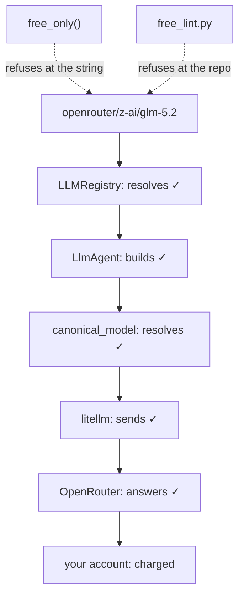

# 7.1 — 💥 The free trial that charges

## One-line answer

Today's deliberate failure costs **nothing to reproduce and everything to miss**: delete five
characters from an OpenRouter model string and every layer — the registry, the agent, the resolver —
accepts it, because the only thing that would have objected is an invoice.

---

## The story

🎬 **The scene.** A free trial. One month, cancel any time, card details required "for
verification".

You use it, it is fine, and a month later there is a charge on your statement for an amount you did
not expect, for a service you had stopped opening.

😬 **The naive fix.** You look for the mistake. There isn't one. You read the page again and the
terms said, in a sentence you did read, that it renews unless cancelled. Nothing was hidden. You
agreed to it.

💥 **Why it fails.** Because at no point between signing up and being charged did **anything ask you
again.** The moment of consent and the moment of consequence were a month apart, and in between there
was no interface, no reminder, no friction of any kind. A system in which the default outcome is the
expensive one, and the cheap outcome requires an action on a date you were not thinking about, will
charge almost everybody eventually — and no individual person in that chain did anything wrong.

💡 **The insight.** The defence is not to be more careful. It is to **put a check at the moment of
the decision**, where being careful is cheap, rather than at the moment of the consequence, where it
is too late. A calendar reminder on the day before renewal is worth more than any amount of resolve.

An OpenRouter model string without `:free` is a free trial that renews. Today you write the reminder.

---

## The idea in plain language

The plan's §17.7 asks every day to carry a part whose subject is a deliberate failure. Today's is the
one from [2.4](../02-the-translator/2.4-the-wholesale-market.md):

> `openrouter/z-ai/glm-5.2:free` costs nothing.
> `openrouter/z-ai/glm-5.2` bills your account.

Five characters. Same model, same provider, same code, and the second one is the paid one.

What makes it a failure lab rather than a warning is **how many layers accept it**. Walk down them:

| Layer | What it does with the paid string |
| --- | --- |
| `LLMRegistry.resolve` | resolves — the registry matches the `openrouter/` **prefix** and does not read the rest |
| `LlmAgent(...)` | builds — the field holds a string, and [1.2](../01-one-model-field/1.2-the-spare-tyre-you-never-checked.md) established that nothing is checked at construction |
| `agent.canonical_model` | resolves — a `LiteLlm` object, correctly built, pointed at a real paid model |
| the library | sends it — the request is well-formed and the key is valid |
| OpenRouter | answers — the model works, the answer is good |
| your account | **is charged** |

Six layers, five of which behave perfectly, and the one that objects does so in a currency rather
than in a traceback.

Compare that with the failures you have met this week. A wrong app name gave a `SessionNotFoundError`
([Day 8, part 5.1](../../../day-08-sessions-and-services/parts/05-failure-lab/5.1-the-name-called-in-the-waiting-room.md)).
A collect-then-return agent gave an `AttributeError`
([Day 7, part 5.1](../../../day-07-events-and-streaming/parts/05-failure-lab/5.1-the-mechanic-who-billed-at-the-end.md)).
Both were unpleasant and both were **loud**. This one is silent by construction, because from every
system's point of view nothing has gone wrong.

**So the check has to be yours, and it has to be at the string.** That is the whole content of this
part, and it is why `CLAUDE.md` carries the rule and Day 31 makes it a lint in `./m check`.

And the best thing about it: **reproducing this failure costs nothing.** The break happens before any
call, so you can demonstrate the entire thing — all six layers accepting a billable string — without
spending a paisa. A failure lab you can run for free, about a failure that costs money, is an unusually
good bargain.

---

## Why Sutra needs it

**Day 31** is the quality gate, where this becomes a lint in `./m check` alongside the skills lint,
closing OPS-08. Writing it today means twenty-two days of protection you would otherwise not have.

**Day 70**'s router builds model strings programmatically, which is where a missing suffix stops being
a typo and becomes a code path. A lint over source text does not catch a string built at runtime —
which is why [5.1](../05-routing/5.1-which-queue-do-you-join.md)'s `choose()` returns constants rather
than assembling names.

**Phase 14** takes this repository public. A committed billable string is then something a stranger
can run, and Principle 9's discipline about secrets has a sibling here: **a repository should not be
able to spend money on behalf of whoever clones it.**

**Day 92** is the pre-publication security review, and "can any code path in this repo incur a charge?"
is on the list. The honest answer wants to be *"no, and here is the check that proves it."*

---

## The mechanism

The failure first, in full, with nothing spent:

```python
# lab/billable.py - six layers accept a paid string. No call, no cost.
from google.adk.agents import LlmAgent
from google.adk.models import LLMRegistry

FREE = "openrouter/z-ai/glm-5.2:free"
PAID = "openrouter/z-ai/glm-5.2"  # five characters shorter. This one bills.

for label, model in (("free", FREE), ("paid", PAID)):
    resolved = LLMRegistry.resolve(model).__name__
    agent = LlmAgent(name="probe", model=model, instruction="You triage tickets.")
    canonical = type(agent.canonical_model).__name__
    print(f"{label}: registry={resolved:<8} builds=yes  canonical={canonical:<8} {model}")

print()
print("nothing above objected. the difference is five characters and an invoice.")
```

**Line by line:**

- `FREE` and `PAID` as two constants differing only in the suffix — so the comparison is exact and
  the diff is visible on two adjacent lines.
- The comment `# five characters shorter. This one bills.` — on the line itself, because a reader
  scanning this file needs the warning where the string is, not in a paragraph above it.
- `LLMRegistry.resolve(model)` — layer one. Both resolve, because the registry matches the prefix and
  [6.1](../06-parked/6.1-the-spec-sheet-you-can-read.md) already showed it does not read what follows.
- `LlmAgent(name=..., model=model, ...)` — layer two. Both build. No validation at construction, from
  [1.2](../01-one-model-field/1.2-the-spare-tyre-you-never-checked.md).
- `agent.canonical_model` — layer three, and the one that *does* raise for a genuinely broken string.
  It does not raise here, because this string is not broken. It is expensive, which is a different
  property and one no framework can see.
- **No `run_async` anywhere.** The script deliberately stops one layer short of a call: the point is
  that everything up to the call is happy, and demonstrating the fourth layer would cost real money to
  prove a thing you can already see.
- The closing `print` stating the finding in words — because the table above it is four identical-
  looking lines and the finding is the *absence* of a difference.

The output:

```text
free: registry=LiteLlm  builds=yes  canonical=LiteLlm  openrouter/z-ai/glm-5.2:free
paid: registry=LiteLlm  builds=yes  canonical=LiteLlm  openrouter/z-ai/glm-5.2

nothing above objected. the difference is five characters and an invoice.
```

Two rows that agree in every column that a program can inspect.

### The check, at the string

```python
# sutra/desk/models.py - the Day 31 lint, twenty-two days early.
class BillableModelError(ValueError):
    """An `openrouter/` model string with no `:free` suffix would be charged."""


def free_only(model: str) -> str:
    """Return the model string, or refuse it. Call this at every construction site."""
    if model.startswith("openrouter/") and not model.endswith(":free"):
        raise BillableModelError(
            f"{model!r} has no ':free' suffix. OpenRouter bills this model. "
            f"Did you mean {model + ':free'!r}? (Addendum 02; CLAUDE.md)"
        )
    return model
```

**Line by line:**

- `class BillableModelError(ValueError)` — its own type, so a caller can catch exactly this and a
  reader of a traceback knows immediately what kind of mistake it was. `ValueError` as the base
  because a bad string is what it is.
- `def free_only(model: str) -> str` returning the string — so it can be used **inline** at the point
  of construction, `LiteLlm(model=free_only(MODEL))`, and cannot be forgotten the way a separate check
  can.
- `model.startswith("openrouter/")` first — the rule is provider-specific. A Gemini or Groq string has
  no `:free` suffix and must not be rejected for lacking one, which is the mistake a more enthusiastic
  version of this function would make.
- `not model.endswith(":free")` — the exact test from
  [2.4](../02-the-translator/2.4-the-wholesale-market.md)'s `free_list.py`, on the other side. One
  finds what is free; this refuses what is not.
- `Did you mean {model + ':free'!r}?` — the suggestion, built from the input. An error that tells you
  the fix is worth several that tell you the rule, and this fix is a string concatenation.
- Citing `Addendum 02` and `CLAUDE.md` **in the message** — so the person who hits it at eleven at
  night can find the reasoning rather than deciding the check is over-cautious and deleting it.
- `raise`, not `warn`. A warning about a billable model is a line in a log you read after the invoice.

### The lint, over the whole repository

The function protects the code that calls it. Day 31's version protects the code that does not:

```python
# lab/free_lint.py - the repo-wide version. Day 31 folds this into ./m check.
import pathlib
import re
import sys

PATTERN = re.compile(r"openrouter/[A-Za-z0-9._\-/]+")
ROOT = pathlib.Path(".")
SEARCH = ["sutra", "sutra_mcp", "tests", "scripts", "days"]

offenders: list[str] = []
for folder in SEARCH:
    for path in ROOT.joinpath(folder).rglob("*.py"):
        for number, line in enumerate(path.read_text(encoding="utf-8").splitlines(), 1):
            for found in PATTERN.findall(line):
                if not found.endswith(":free"):
                    offenders.append(f"{path}:{number}: {found}")

for offence in offenders:
    print(offence)
print(f"{len(offenders)} billable openrouter string(s)")
sys.exit(1 if offenders else 0)
```

**Line by line:**

- `PATTERN` allowing `/`, `.`, `-` and `_` in the model half — because OpenRouter ids contain a vendor
  slash and version dots, and a pattern that stopped at the first slash would match `openrouter/z-ai`
  and report a false offence on every correct line.
- `SEARCH` naming folders rather than scanning everything — `.venv` contains other people's code and
  `legacy/` is frozen; linting either would produce noise that gets the lint disabled.
- `rglob("*.py")` only — and `days` is in `SEARCH`, so this **will** flag `lab/billable.py`, the file
  you wrote two blocks ago to demonstrate the problem. That is correct behaviour and it is the first
  thing you will have to deal with. What it will **not** flag is a model string in a Markdown file,
  including the ones in this very document — which is a real gap, left visible, and Day 31's version
  scans Markdown too.
- `enumerate(..., 1)` — line numbers counted from one, so the output is clickable in an editor. A lint
  that reports a file and not a line is a lint people ignore.
- `sys.exit(1 if offenders else 0)` — **the exit code is the feature.** A lint that prints and exits
  zero is a lint that CI passes. This is what makes it foldable into `./m check` on Day 31 without
  changing a line.
- Printing the count even when it is zero — so a green run says *something*, and a lint that silently
  produced no output cannot be confused with a lint that did not run.

**Watch it go RED**, which is Principle 11 and costs nothing. Note the first run: it is red already.

```bash
# 1 - it is red, and it is right: lab/billable.py contains a billable string on purpose
uv run python days/day-09-four-free-providers/lab/free_lint.py
echo "exit code: $?"

# 2 - make it worse, somewhere a real mistake would land
echo 'BAD = "openrouter/z-ai/glm-5.2"' >> sutra/desk/models.py
uv run python days/day-09-four-free-providers/lab/free_lint.py

# 3 - undo the real one; the teaching one is still there
git checkout sutra/desk/models.py
uv run python days/day-09-four-free-providers/lab/free_lint.py
```

**Line by line:**

- Step 1 is red on a repository where nothing is wrong, because a **teaching file deliberately
  contains the dangerous string.** That is not a bug in the lint. It is the first real decision the
  lint forces, and it is today's `TODO(me)`: decide between an explicit allowance carrying a reason,
  the way `CLAUDE.md` requires of any `# noqa`, and rewriting `lab/billable.py` so the string is
  assembled rather than written. One of those keeps the demonstration and one keeps the lint simple,
  and there is a real argument on both sides.
- `echo "exit code: $?"` — because the exit code is the part that will matter to CI on Day 31, and
  seeing it once is worth more than being told about it.
- `echo ... >>` appending to a real file under `sutra/` — deliberately, because the lint's whole
  purpose is to scan where a real mistake would land, and breaking it only in the lab would test the
  wrong path. Watch the count go from one to two.
- `git checkout sutra/desk/models.py` to undo — the safest possible revert, and it works because the
  file is committed. If it is not yet, use your editor and check `git diff` afterwards.
- Step 3 re-runs after the revert, because "I put it back" and "the check agrees I put it back" are
  different claims. The count should return to one, not zero — and if that irritates you, that is the
  `TODO(me)` asking to be done.



---

## When it breaks

This part is the break, so here are the three defences that **do not** work, and why each one is
tempting.

**💥 Not "I would notice".** You would not. The paid model answers correctly and often better, since
it is the same model without a free-tier queue in front of it. There is no symptom to notice until a
statement arrives.

**💥 Not "there is no key, so it cannot bill".** Your `OPENROUTER_API_KEY` is in `.env` and has been
since Day 1. That key is what makes free calls work, and it is the same key. The absence of a
*payment method* is what protects you today, and it is a property of your account rather than of your
code — so it protects **you** and not the next person who clones this repository with a funded
account.

**💥 Not "the tests would catch it".** `./m check` makes no model calls, deliberately
([1.2](../01-one-model-field/1.2-the-spare-tyre-you-never-checked.md)), so it is green with a billable
string in every file. Green does not mean free, and the lint above is precisely the line that makes
it start to.

The actual diagnostic is one command, and it is the one to reach for before a phase gate or a
publish:

```bash
grep -rn "openrouter/" --include=*.py --include=*.md sutra sutra_mcp tests scripts days | grep -v ":free"
```

**Line by line:**

- `grep -rn` — recursive with line numbers, so the output is a list of places rather than a yes or no.
- `--include=*.py --include=*.md` — **both**, unlike `free_lint.py` above. The day documents contain
  model strings too, and this is the gap the Python-only lint leaves open.
- `| grep -v ":free"` — invert the second match, so what survives is exactly the billable lines.
  Crude, correct, and short enough to type from memory at a phase gate, which is the property that
  matters for a command you use rarely.
- It will match the deliberate example in `lab/billable.py` and in this document, and that is right:
  a check that quietly exempts the file where the dangerous string lives is a check with a hole in it.
  The judgement about which matches are teaching material is yours, and it is a judgement you make
  while looking at a short list rather than one you delegate.

---

## In production

**What a professional writes instead of the teaching version** is the check in **two** places, because
they catch different things. `free_only()` at every construction site catches strings built at
runtime, which no text search can see. The repo-wide lint catches strings nobody remembered to wrap.
Neither is sufficient and both are cheap.

**What degrades at scale** is the number of places a model string can come from. A constant, an
environment variable, a per-tenant configuration row, a value in a database somebody edits through an
admin page. A lint over source text sees the first and none of the others, so the runtime check stops
being a belt-and-braces nicety and becomes the only real defence. **The check belongs where the string
is used, not where it is written.**

**The failure that only shows with real traffic** is volume. One accidental paid call is a rounding
error. The same string in a router's fallback path, firing when the free tier is exhausted — which is
exactly when traffic is high — is thousands of paid calls in an hour, unattended, at the moment
everything else is already going wrong. That is the same argument as
[6.1](../06-parked/6.1-the-spec-sheet-you-can-read.md)'s: **a floor that can bill you is not a floor.**

**The review comment a senior engineer leaves:** *"This builds the model string from config, so the lint
won't see it. Put `free_only()` in the constructor path and make it raise, not warn. And add markdown
to the lint's file types — half our model strings are in the day docs, and one of them is billable."*

**The interview question:** *"tell me about a bug that no test would have caught."* This is a good
honest answer with a mechanism rather than an adjective: "A model identifier on an aggregator where
the free variant of a model is the same id with a suffix — so the paid model is the free one minus
five characters. Every layer accepts it: the registry resolves it, the framework builds the agent,
the client sends it, the provider answers, and the answer is *good*, because it's the same model
without a free-tier queue. There's no exception anywhere, and the test suite is green because it
doesn't make model calls by design. The only thing that objects is an invoice, a month later. So the
defence has to be at the string rather than at the failure: a function that refuses a billable
identifier at every construction site, because config-built strings are invisible to any text search,
plus a repo-wide lint with a non-zero exit code for the ones nobody wrapped. And the reason I'd want
both is that they catch different halves, and the expensive version of this bug is in a fallback path
that fires exactly when you're busiest."

---

## Check yourself

```bash
uv run python days/day-09-four-free-providers/lab/billable.py
uv run python days/day-09-four-free-providers/lab/free_lint.py
grep -rn "openrouter/" --include=*.py --include=*.md sutra tests scripts days | grep -v ":free"
```

Run all three, then break the lint on purpose and watch it go red before you put it back.

**Answer out loud, without scrolling up:**

> Name the six layers that accept a billable model string and say which one objects. Then give the
> two places the check has to live, and say what each catches that the other cannot.

---

**Next:** [back to the hub](../../LESSON.md) — then read the paper in
[`papers/01-routellm.md`](../../papers/01-routellm.md), and the ledger rows in §11.
