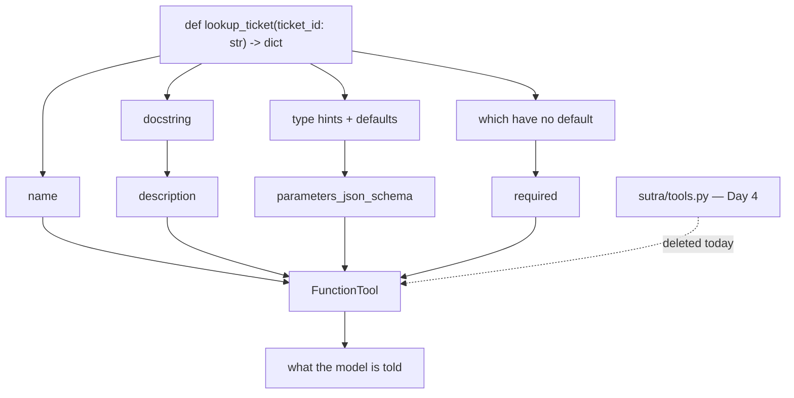

# 1.1 — The declaration you no longer write

## One-line answer

Put a Python function in an agent's `tools` list and ADK builds the JSON declaration from it — the
name from the function's name, the description from its docstring, the parameters from its type
hints — so the dictionary you hand-wrote on Day 4 becomes something the code generates from the code.

---

## The story

You go to a counter to open something — a gas connection, a bank account, a library membership. There
is a form.

The old way: four pages, and the first page and a half is you copying things out of documents you
brought. Name as on the card. Father's name as on the card. Address, exactly as printed. Date of
birth in the format shown. You copy carefully, because a mismatch between what you wrote and what the
card says is what sends the form back.

The new way: the clerk asks for the card, holds it under a scanner, and the first page and a half
appears on the screen already filled.

Notice precisely what changed, because it is not "less work".

**The copying is gone, and the copying was never the point.** Nobody was ever testing whether you can
transcribe your own address. The reason that half of the form existed was that the counter needed the
information in its own format, and the only mechanism available was you, reading and rewriting.

**The mismatch is gone too**, and that is the bigger half. The old form could disagree with your card
— a spelling, a middle name, an old address you wrote from memory — and it was a real cause of
rejection. The scanned version cannot disagree, because it is not a copy. It is the same data,
rendered.

**And what you still have to do is unchanged.** You still choose which account to open. You still
read the terms. You still decide whether you want the thing at all. The form filled itself; the
decision did not.

Day 4 had you write the form by hand. Today the counter gets a scanner.

---

## The idea in plain language

On [Day 4, part 1.2](../../../day-04-tools-by-hand/parts/01-the-schema/1.2-declaring-a-tool.md) you
wrote a **declaration** by hand — a dictionary describing a function to the model:

```text
{"type": "function", "name": "lookup_ticket",
 "description": "Fetch the full text of one support ticket by its id. ...",
 "parameters": {"type": "object",
                "properties": {"ticket_id": {"type": "string", "description": "..."}},
                "required": ["ticket_id"]}}
```

That dictionary lives in `sutra/tools.py` right now. Beside it, in `sutra/loop.py`, lives the actual
`lookup_ticket` function. **Two objects describing one thing**, kept in step by you.

ADK's move is to delete the first one. You give it the function; it produces the declaration.

> `agent = LlmAgent(name="sutra_desk", model=..., instruction=..., tools=[lookup_ticket])`

That is the whole API. `tools` is a list, and a plain Python function is a legal member of it.

**Where each piece of the declaration comes from**, and this is worth memorising because every later
mistake in this section is one of these four rows:

| Part of the declaration | Comes from |
| --- | --- |
| the tool's **name** | the function's name |
| the **description** | the function's docstring, whole |
| the **parameters** | the function's type hints and defaults |
| which parameters are **required** | which ones have no default |

So a Python function is not merely *convertible into* a declaration. Under this scheme the function
**is** the declaration, written in Python instead of JSON, and the JSON is generated on demand.

Two consequences fall straight out, and both of them are the counter's scanner:

**The two cannot drift apart.** On Day 4, renaming the function without editing the dictionary gave
you a declaration pointing at a name that no longer existed — a bug your program could not see. That
class of bug is now impossible, because there is only one thing.

**Your docstring and your type hints are now production artefacts.** They were documentation for
humans. They are now the text a model reads to decide whether to call your function, and the schema
it fills in. [1.2](1.2-the-docstring-is-the-description.md) and
[1.3](1.3-type-hints-are-the-schema.md) are about how much that changes what you write in them.

And one thing that has **not** changed, which is the paragraph the whole day rests on: **the model
still only sees a description.** [Day 4, part 1.3](../../../day-04-tools-by-hand/parts/01-the-schema/1.3-the-description-is-the-prompt.md)
established that a tool's description is not documentation, it is the text the model uses to decide
whether to call the tool. That is still exactly true. ADK changed **where you type it**, not what it
does.

---

## Why Sutra needs it

**Today**: Sutra's agent has had no tools since Day 5, which is why
[Day 6's failure lab](../../../day-06-instructions-and-personas/parts/06-failure-lab/6.1-the-handbook-that-promised-equipment.md)
had an instruction promising a knowledge base that did not exist. This is the day the promise becomes
true, and [5.2](../05-wiring-sutra/5.2-the-first-aid-box-with-bandages.md) is where that lands.

**Day 11** puts `ToolContext` into these functions, which only makes sense once you know what happens
to a function's signature.

**Day 15** brings toolsets and OpenAPI wrappers — tools generated from a specification rather than
from Python. Understanding generation-from-a-function is what makes generation-from-a-spec
unsurprising.

**Day 26** loads Agent Skills through `SkillToolset`, and **Day 32 onwards** exposes Sutra's data over
MCP. Both are the same idea again: something else produces the declaration, and the model sees only
that.

---

## The mechanism

Watch the declaration get built. **No model call, no key, no cost:**

```python
# lab/generated.py - the dictionary you wrote on Day 4, generated from a function.
import asyncio
import json

from google.adk.agents import LlmAgent


def lookup_ticket(ticket_id: str) -> dict:
    """Fetch the full text of one support ticket by its id.

    Args:
        ticket_id: The ticket's id as it appears in the request, e.g. '4521'.
    """
    return {"status": "ok"}


async def main() -> None:
    agent = LlmAgent(
        name="sutra_desk",
        model="gemini-3.7-flash",
        instruction="You triage tickets.",
        tools=[lookup_ticket],
    )
    print("what you put in the list:", type(agent.tools[0]).__name__)

    tools = await agent.canonical_tools()
    print("what ADK made of it    :", type(tools[0]).__name__)

    declaration = tools[0]._get_declaration()
    print()
    print("name       :", declaration.name)
    print("description:", declaration.description.splitlines()[0])
    print("parameters :", json.dumps(declaration.parameters_json_schema, indent=2))


asyncio.run(main())
```

**Line by line:**

- `def lookup_ticket(ticket_id: str) -> dict` — the same function name and the same parameter name as
  Day 4's dictionary, deliberately, so the generated output can be compared with the hand-written one
  line for line.
- The docstring's first line and its `Args:` block — written in the shape ADK reads. That shape is
  [1.2](1.2-the-docstring-is-the-description.md)'s subject and it is not arbitrary.
- `tools=[lookup_ticket]` — **the function object, not a call and not a string.** No parentheses. This
  is the single most common typo in this API, and `tools=[lookup_ticket()]` will call your function
  at construction time and put its return value in the list.
- `type(agent.tools[0]).__name__` — prints `function`. The list holds exactly what you put in it;
  nothing was converted.
- `await agent.canonical_tools()` — **this** is where the wrapping happens, and it is an `async`
  method, so it has to be awaited. The pattern is the same one from
  [Day 9, part 1.2](../../../day-09-four-free-providers/parts/01-one-model-field/1.2-the-spare-tyre-you-never-checked.md):
  the field holds what you gave it and the resolved object arrives later. [1.4](1.4-the-wrapper-that-arrives-late.md)
  is about why that matters.
- `_get_declaration()` — a **private** method, and this is a lab script. Nothing under `sutra/` may
  call it. It is here because it is the only way to see the artefact this part is about, and the same
  allowance [Day 6, part 3.1](../../../day-06-instructions-and-personas/parts/03-the-instruction-fields/3.1-where-your-instruction-lands.md)
  made for the render harness.
- `.description.splitlines()[0]` — the first line only, because the whole docstring comes through and
  printing it here would give away [1.2](1.2-the-docstring-is-the-description.md).
- `json.dumps(..., indent=2)` on `parameters_json_schema` — so the generated schema can be read beside
  the one you wrote by hand.

The output:

```text
what you put in the list: function
what ADK made of it    : FunctionTool

name       : lookup_ticket
description: Fetch the full text of one support ticket by its id.
parameters : {
  "properties": {
    "ticket_id": {
      "title": "Ticket Id",
      "type": "string"
    }
  },
  "required": [
    "ticket_id"
  ],
  "title": "lookup_ticketParams",
  "type": "object"
}
```

Compare that with `sutra/tools.py`, which you wrote by hand on Day 4. The name matches. The `type` and
`required` match. The structure matches.

**Two things do not match, and both are findings rather than details.**

There is a `"title"` on the parameter and on the object — `"Ticket Id"`, `"lookup_ticketParams"` —
which you never wrote. That is Pydantic's schema generator being thorough; it is harmless and it is
noise the model reads.

And there is **no `"description"` on the parameter.** Your hand-written version had one: *"The
ticket's id as it appears in the request, e.g. '4521'."* The generated version does not, and the
`Args:` line that describes it went somewhere else entirely.
[1.2](1.2-the-docstring-is-the-description.md) is where it went, and it changes how you should write
a docstring.



---

## When it breaks

**💥 The function you called instead of passing.**

```python
tools = [lookup_ticket("4521")]
```

```text
ValidationError: 3 validation errors for LlmAgent
tools.0.callable
  Input should be callable [type=callable_type, input_value={'status': 'ok'}, input_type=dict]
tools.0.is-instance[BaseTool]
  Input should be an instance of BaseTool [type=is_instance_of, input_value={'status': 'ok'}, input_type=dict]
tools.0.is-instance[BaseToolset]
  Input should be an instance of BaseToolset [type=is_instance_of, input_value={'status': 'ok'}, input_type=dict]
```

One pair of parentheses, and **three** errors rather than one — because `tools` accepts three kinds
of thing and your dictionary failed to be any of them. Read the three names rather than the first
line: they are the whole menu of what a `tools` list will take. A callable, a `BaseTool`, or a
`BaseToolset` — and the third is Day 15's subject, arriving early inside an error message.

**💥 The method you passed without its object.**

```python
class Desk:
    def lookup_ticket(self, ticket_id: str) -> dict: ...


tools = [Desk.lookup_ticket]  # unbound
```

No error at construction. The generated schema now has **two** parameters, `self` and `ticket_id`,
and the model will be asked to supply a value for `self`. Pass `Desk().lookup_ticket` — the bound
method — and `self` disappears, because a bound method's signature does not include it.

**💥 The name that was fine in Python and is not a tool name.**

A function called `lookup_ticket` becomes a tool called `lookup_ticket`. A function called `_lookup`
becomes a tool called `_lookup`, leading underscore and all, sent to the model as the thing to call.
Python's privacy convention means nothing here, and a model reading a menu of tools with a leading
underscore has been told something it cannot interpret. **Tool functions are public API even when
they live in a private module.**

---

## In production

**What a professional writes instead of the teaching version** is a module whose functions are
*written to be tools* — public names, complete docstrings, fully annotated — and which contains
nothing else. The temptation is to put `tools=[some_existing_helper]` and reuse a function that was
written for other callers. It works, and it quietly promotes that function's name and docstring into
a model-facing contract, so the next person to tidy up its docstring changes agent behaviour without
knowing.

**What degrades at scale** is the menu. One tool is a function. Twenty tools are a *list the model
reads on every single call*, and every one of their descriptions is in the prompt, every turn. This
is [Day 6, part 1.5](../../../day-06-instructions-and-personas/parts/01-writing-the-handbook/1.5-every-line-is-a-tax.md)'s
tax, applied to a place people do not expect it: adding a tool is not free even when it is never
called. Day 15's toolsets exist partly because of this.

**The failure that only shows with real traffic** is a docstring edit changing behaviour. Somebody
improves the wording of a docstring — genuinely improves it, for humans — and the model's willingness
to call that tool moves, because the description *is* the prompt. Nothing in code review flags a
docstring change as a behaviour change. Teams that have been through it put tool functions in one
module and treat edits there like edits to a prompt, which is what they are.

**The review comment a senior engineer leaves:** *"This is passing an internal helper as a tool. Its
name and docstring are now model-facing — move it into `sutra/desk/tools.py`, give it a public name,
and write the docstring for the model rather than for us."*

**The interview question:** *"how does a framework turn a Python function into something a model can
call?"* The answer that shows you have looked: "It introspects the function — the name becomes the
tool name, the docstring becomes the description the model reads, and the type hints and defaults
become the JSON schema for the arguments, with the un-defaulted ones marked required. The important
consequence isn't convenience, it's that there's now only one artefact instead of two, so the
declaration can't drift from the implementation the way a hand-written one does. The trade is that
your docstring and your type hints stop being documentation and become production configuration — a
docstring edit is a prompt change, and nothing in a code review will tell you that."

---

## Check yourself

```bash
uv run python days/day-10-function-tools/lab/generated.py
diff <(uv run python days/day-10-function-tools/lab/generated.py) /dev/null | head -0; cat sutra/tools.py
```

Put the generated schema and your hand-written `LOOKUP_TICKET` side by side and list every difference.
There are more than two.

**Answer out loud, without scrolling up:**

> Name the four things ADK reads off a function, and say which artefact each becomes. Then say what
> class of bug disappears entirely, and what new responsibility your docstring has acquired.

---

**Next:** [1.2 — The docstring is the description](1.2-the-docstring-is-the-description.md)
