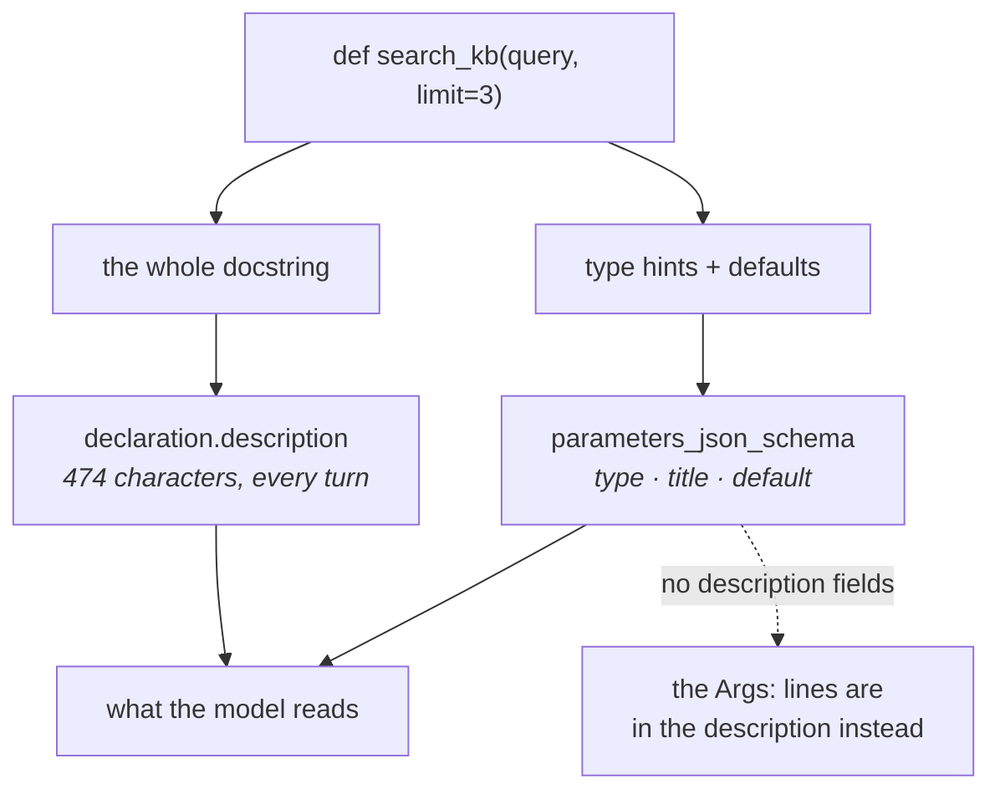

# 1.2 — The docstring is the description

## One-line answer

The **whole** docstring becomes the tool's description — summary, `Args:` block and all — and on
`google-adk` 2.7.1 the parameter descriptions arrive at the model as prose inside that text rather
than as `description` fields in the schema, which changes how you should write one.

---

## The story

There is a washing machine in a shared building, and taped to the lid is a laminated card that
somebody wrote by hand years ago.

*Detergent in the LEFT drawer only. Right one is for softener. Do not overfill — max is the line, not
the top. If it beeps 3 times unplug it for a minute. Programme 4 for normal clothes. DO NOT USE
PROGRAMME 7.*

That card is doing several jobs at once and nobody planned it that way. It explains what the machine
is for. It tells you which knob does what. It warns you about a failure mode. It gives a default for
people who do not want to think. And it forbids one thing, in capitals, for a reason nobody remembers
and everybody obeys.

Now notice how somebody actually uses it: they read the whole card, in about four seconds, and then
they act. They do not read the drawer sentence *while looking at the drawer* and the programme
sentence *while looking at the dial*. There are no labels on the drawers or the dial. **All of the
guidance is in one block of text next to the machine**, and every individual instruction has to
survive being read as part of that block.

Which means the card's author had a constraint they never articulated: each line has to be
understandable **out of order and out of context**, because it is read in a lump. "Max is the line,
not the top" works. "Don't fill past it" would not, because by then you have forgotten which *it*.

An ADK tool's docstring is that card, and this part is about writing for the lump.

---

## The idea in plain language

[Day 4, part 1.3](../../../day-04-tools-by-hand/parts/01-the-schema/1.3-the-description-is-the-prompt.md)
established the rule this whole subject rests on: **a tool's description is not documentation, it is
the text the model uses to decide whether to call the tool.** That is unchanged. What has changed is
where you type it, and — more surprisingly — how much of what you type ends up where you expect.

On Day 4 you wrote a declaration with **two** kinds of description:

- one on the tool: *"Fetch the full text of one support ticket by its id. Use this first whenever…"*
- one on each parameter: *"The ticket's id as it appears in the request, e.g. '4521'."*

Today you write one docstring, and ADK reads it. So the question is: which part of the docstring
becomes which?

Here is what `google-adk` 2.7.1 actually does, observed rather than assumed:

**The entire docstring becomes the tool's `description`.** Not the summary line — the whole thing,
including the `Args:` block and a `Returns:` block if you write one, newlines and indentation intact.

**The parameter schema gets no `description` fields at all.** The generated schema has a `type`, a
`title` that Pydantic invented from the parameter name, and a `default` where there is one. There is
no per-parameter description in it.

That second point is worth being careful about, because ADK's own function-tools page says the
framework *"extracts parameter descriptions from docstring entries"*, and the natural reading is that
they land on the parameters. On the version pinned here they do not — they land in the description
text, which is still shown to the model, so the *information* reaches it either way. The difference
is the **route**, and it is a difference you can see rather than argue about:
[the mechanism](#the-mechanism) prints both.

**Two practical consequences.** The first: your `Args:` lines are being read as part of one block of
prose, so they have to make sense there. `ticket_id: The id.` is fine in a schema field beside a
parameter named `ticket_id`; in a paragraph, three words after a `Returns:` heading, it says nothing.

The second: **there is no length discipline imposed on you.** A schema field invites a phrase. A
docstring invites paragraphs, and everything you write is sent on every turn. That is
[Day 6, part 1.5](../../../day-06-instructions-and-personas/parts/01-writing-the-handbook/1.5-every-line-is-a-tax.md)'s
tax, now attached to a place where verbosity feels virtuous.

### What a tool docstring owes the model

Day 4's answer, restated for this shape. Four things, in this order:

1. **What it does**, in one sentence, in the first line.
2. **When to use it** — and, if there is a sibling tool, when *not* to. The confusion you are
   preventing is between two of your own tools.
3. **Each argument**, described so it makes sense in prose, with an example value.
4. **What comes back**, including what a miss looks like. A model that knows what "not found" reads
   like can react to it instead of inventing.

Everything else is a tax. Implementation notes, thanks to a colleague, the reason you chose a
particular data structure — none of that is for this reader, and all of it is in the prompt on every
turn.

---

## Why Sutra needs it

**[5.1](../05-wiring-sutra/5.1-two-tools-ported.md)** ports Day 4's two declarations into docstrings
today, and the two are easy to confuse: one fetches a ticket by id, the other searches a knowledge
base by symptom. Day 4 spent real effort on the sentence that keeps them apart, and that sentence has
to survive the move.

**Day 15** wraps third-party and OpenAPI tools, where descriptions arrive from somebody else's
specification and are usually terrible. Knowing what a good one looks like is what makes reviewing an
imported one possible.

**Day 26 onwards** loads Agent Skills, and **Day 32 onwards** exposes Sutra's data over MCP. In both,
the description is the interface: the thing another system reads to decide whether to call you.

**Day 24** is token accounting. Tool descriptions are prompt text, sent every turn, and a team that
writes generous docstrings can add a surprising amount of per-turn cost without touching the
instruction.

---

## The mechanism

Where each part of a docstring ends up. **No model call, no cost:**

```python
# lab/docstring.py - the whole docstring goes to the model. Watch where.
import asyncio
import json

from google.adk.agents import LlmAgent


def search_kb(query: str, limit: int = 3) -> dict:
    """Search the internal knowledge base for a known issue matching a symptom.

    Use this after reading a ticket, with the symptom words from the ticket body.
    Do not use this to look up a ticket by id - use lookup_ticket for that.

    Args:
        query: Symptom words taken from the ticket, e.g. 'keeps getting logged out'.
        limit: How many articles to return.

    Returns:
        A dict with 'status', and on success an 'article' key. A miss returns
        status 'not_found' and no article.
    """
    return {"status": "ok"}


async def main() -> None:
    agent = LlmAgent(
        name="sutra_desk", model="gemini-3.7-flash", instruction="x", tools=[search_kb]
    )
    declaration = (await agent.canonical_tools())[0]._get_declaration()

    print("=== the description the model reads ===")
    print(declaration.description)
    print()
    print("=== the parameter schema ===")
    print(json.dumps(declaration.parameters_json_schema, indent=2))
    print()
    print("description characters:", len(declaration.description))
    print(
        "per-parameter 'description' fields:",
        sum(
            1
            for spec in declaration.parameters_json_schema["properties"].values()
            if "description" in spec
        ),
    )


asyncio.run(main())
```

**Line by line:**

- The docstring is written to the four-part shape above: one summary line, a *when to use / when not
  to* paragraph, an `Args:` block with an example value, and a `Returns:` block that says what a miss
  looks like.
- *"Do not use this to look up a ticket by id - use lookup_ticket for that."* — carried across from
  Day 4's hand-written declaration word for word. It is the sentence that keeps two similar tools
  apart, and it is the one most likely to be dropped in a rewrite because it reads like a note to a
  colleague.
- `limit: int = 3` — a defaulted parameter, included so [1.3](1.3-type-hints-are-the-schema.md) has
  something to point at and so the `default` in the schema is visible here first.
- `declaration.description` printed **whole and unmodified** — the point of the script. Compare its
  length with the summary line you might have expected.
- `json.dumps(..., indent=2)` on the parameter schema, printed immediately after, so the two can be
  read as a pair.
- The final `sum(... if "description" in spec)` — a **count**, deliberately, rather than a claim.
  Zero is the finding, and a number is harder to argue with than a sentence.

The output:

```text
=== the description the model reads ===
Search the internal knowledge base for a known issue matching a symptom.

Use this after reading a ticket, with the symptom words from the ticket body.
Do not use this to look up a ticket by id - use lookup_ticket for that.

Args:
    query: Symptom words taken from the ticket, e.g. 'keeps getting logged out'.
    limit: How many articles to return.

Returns:
    A dict with 'status', and on success an 'article' key. A miss returns
    status 'not_found' and no article.

=== the parameter schema ===
{
  "properties": {
    "query": {
      "title": "Query",
      "type": "string"
    },
    "limit": {
      "default": 3,
      "title": "Limit",
      "type": "integer"
    }
  },
  "required": [
    "query"
  ],
  "title": "search_kbParams",
  "type": "object"
}

description characters: 474
per-parameter 'description' fields: 0
```

**Four hundred and seventy-four characters**, sent on every turn this tool is available, whether or not
it is called. And **zero** per-parameter descriptions: everything you wrote about `query` reaches the
model as a line inside that block.

The same result holds on the other code path too, which is worth knowing because it means this is a
property of the version rather than of an experimental flag. ADK gates schema generation behind a
feature named `JSON_SCHEMA_FOR_FUNC_DECL`, on by default in 2.7.1. Turn it off and you get a
`google.genai` `Schema` object instead of a JSON schema — and its per-property `description` is
`None` as well:

```python
# lab/docstring_flag.py - the other code path, same finding. Lab only: feature override.
import asyncio

from google.adk.agents import LlmAgent
from google.adk.features import FeatureName, override_feature_enabled

from docstring import search_kb


async def show(label: str) -> None:
    agent = LlmAgent(name="a", model="gemini-3.7-flash", instruction="x", tools=[search_kb])
    declaration = (await agent.canonical_tools())[0]._get_declaration()
    print(f"--- {label}")
    print("  parameters            :", declaration.parameters)
    print("  parameters_json_schema:", declaration.parameters_json_schema)


asyncio.run(show("JSON_SCHEMA_FOR_FUNC_DECL on (the default)"))
override_feature_enabled(FeatureName.JSON_SCHEMA_FOR_FUNC_DECL, False)
asyncio.run(show("JSON_SCHEMA_FOR_FUNC_DECL off"))
```

**Line by line:**

- `from google.adk.features import FeatureName, override_feature_enabled` — ADK's own feature-flag
  API, public and importable. Worth knowing it exists: a framework that tells you which of its
  behaviours are experimental is one you can reason about.
- `from docstring import search_kb` — importing the previous script's function rather than copying it,
  so the two experiments cannot drift apart. This works because both files sit in `lab/`.
- `override_feature_enabled(..., False)` — **process-wide and permanent for this run.** It is a lab
  move; nothing under `sutra/` should be changing feature flags, because a flag set in library code is
  invisible to everybody who later wonders why behaviour differs between two services.
- Printing **both** `parameters` and `parameters_json_schema` in each arm — because exactly one of
  them is populated at a time, and seeing which is `None` is how you know which path you are on.
- The flag is `EXPERIMENTAL` and `default_on=True` in 2.7.1's registry. Both halves matter: it is on,
  so it is what you get, and it is experimental, so it can change. That is a `PACKAGES.md`-shaped
  fact — a dated observation about behaviour, not a version.

```text
--- JSON_SCHEMA_FOR_FUNC_DECL on (the default)
  parameters            : None
  parameters_json_schema: {'properties': {'query': {'title': 'Query', 'type': 'string'}, 'limit': {'default': 3, 'title': 'Limit', 'type': 'integer'}}, 'required': ['query'], 'title': 'search_kbParams', 'type': 'object'}
--- JSON_SCHEMA_FOR_FUNC_DECL off
  parameters            : ... properties={'query': Schema(type=<Type.STRING: 'STRING'>), 'limit': Schema(default=3, type=<Type.INTEGER: 'INTEGER'>)} required=['query'] ... 
  parameters_json_schema: None
```

Two code paths, and neither carries a parameter description. So the conclusion is about the version
rather than about a setting: **on `google-adk` 2.7.1, write your `Args:` lines to be read as prose,
because that is how the model receives them.**



---

## When it breaks

**💥 The docstring written for a colleague.**

```python
def search_kb(query: str) -> dict:
    """Search the KB.

    NOTE: this is a naive keyword match over a dict, see loop.py. TODO: replace with
    the embedding index once Day 49 lands. Ravi wrote the original.
    """
```

No error. The model is now told, on every turn, that this tool is naive, unfinished and due to be
replaced. It has no way to know that is a note to a future maintainer, and models are — as
[Day 6's failure lab](../../../day-06-instructions-and-personas/parts/06-failure-lab/6.1-the-handbook-that-promised-equipment.md)
established — extremely cooperative readers. Implementation notes belong in comments, which are not
sent anywhere.

**💥 The `Args:` line that only made sense in a schema.**

```text
Args:
    query: The query.
    limit: The limit.
```

Perfectly acceptable Python documentation and worthless here. Read those two lines as part of a
paragraph, which is how they arrive, and they add characters and no information. Day 4's version of
the same line — *"Symptom words taken from the ticket, e.g. 'keeps getting logged out'"* — tells the
model what to *put* there, which is the only thing it needed.

**💥 The missing docstring.**

```python
def search_kb(query: str) -> dict:
    return {"status": "ok"}
```

No error, and the tool works. Its description is empty, so the model is choosing whether to call
`search_kb` on the strength of its **name alone**. Sometimes that is enough. It is never enough for
two similar tools, and this is the shape of "the model keeps using the wrong tool" — which people
debug by editing the instruction, because the instruction is where they expect prompt text to live.

---

## In production

**What a professional writes instead of the teaching version** is a docstring with a fixed shape,
enforced by review: one summary line, one *when to use / when not to* paragraph, an `Args:` block with
example values, and a `Returns:` block naming the failure. The shape matters more than the prose
because it makes review possible — a reviewer can check that four things are present without having
opinions about wording.

**What degrades at scale** is total description length. Twenty tools with four-hundred-character
descriptions is eight thousand characters of prompt on every single turn, before your instruction and
before the conversation. Nobody notices it happening, because each tool was added by a different
person on a different day and each one's docstring was reasonable. The measurement that catches it is
the one from Day 6 — render the request and count — and it belongs in the same lab script.

**The failure that only shows with real traffic** is two tools whose descriptions are individually
excellent and jointly ambiguous. Each was written alone. Together they overlap on some fraction of
real inputs, and the model picks between them by a margin that is not stable, so the same ticket
routes differently on different days. This is
[Day 6, part 3.2](../../../day-06-instructions-and-personas/parts/03-the-instruction-fields/3.2-two-fields-two-readers.md)'s
menu problem one level down: the quality of tool selection is a property of the **set**, and no
individual review can catch it. The fix is the same — read them as a menu, and make each say what the
other is not for.

**The review comment a senior engineer leaves:** *"This docstring has a TODO and a name in it, and
both are going to the model on every turn. And the `Args:` lines restate the parameter names — say
what a good value looks like instead. Also add a `Returns:` that describes a miss; right now the model
has no idea what 'nothing found' will look like, so it'll make something up."*

**The interview question:** *"where do you write the text a model uses to decide whether to call a
tool?"* The answer that shows you have shipped one: "In the function's docstring, because the
framework turns it into the tool description — and in the version I was on, the *whole* docstring goes
across, including the `Args:` and `Returns:` blocks, with no per-parameter description fields in the
generated schema. So the argument descriptions are read as prose rather than beside the parameter,
which changes how you write them: `query: The query` is fine documentation and says nothing in a
paragraph. The two consequences people miss are that a docstring edit is a prompt change with no code
review signal attached, and that every tool's description is in the prompt on every turn whether or
not it's called — so adding a tool has a cost even when it's never used."

---

## Check yourself

```bash
uv run python days/day-10-function-tools/lab/docstring.py
cd days/day-10-function-tools/lab && uv run python docstring_flag.py && cd -
```

Then open `sutra/tools.py` and count how many characters your Day 4 declaration spends on
descriptions. Compare it with 474.

**Answer out loud, without scrolling up:**

> Say which parts of a docstring reach the model and by what route. Then give the four things a tool
> docstring owes, and name the one that a rewrite is most likely to delete.

---

**Next:** [1.3 — Type hints are the schema](1.3-type-hints-are-the-schema.md)
