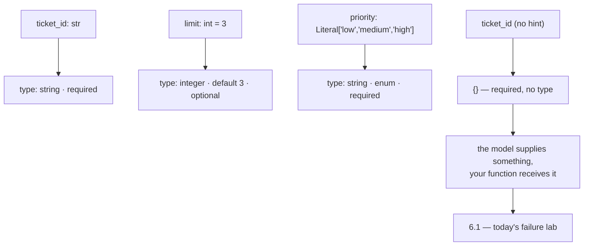

# 1.3 — Type hints are the schema

## One-line answer

The `parameters` half of the declaration is generated from your **type hints and defaults**: an
annotated parameter with no default is required and typed, a defaulted one is optional and carries
its default, and an unannotated one becomes a parameter with **no type at all**.

---

## The story

An idli mould. A metal tray with round dips in it, four to a plate.

You pour batter in and steam it, and what comes out is round and the right size, every time, without
anybody measuring anything. Not because the cook was careful — because the shape was not available.
Pour in too much and it spills; pour in too little and you get a thin one, but you cannot get a
square one, and you cannot get one the size of a plate.

Now imagine one dip in that tray has no rim. Just a flat patch of metal where a dip should be.

Nothing announces this. The tray looks like a tray. Three of the four come out fine. The fourth is
whatever the batter felt like doing on a flat surface that day — sometimes almost round, sometimes
spread halfway across the plate, and different every time depending on how thick the batter was.

The failure is not that the fourth one is wrong. It is that **three of them are constrained and one
is not**, in the same object, with nothing to tell you which. Somebody using that tray will produce
odd idlis for months and blame the batter.

A tool's parameter schema is that tray. A type hint is a rim.

---

## The idea in plain language

[Day 4, part 1.1](../../../day-04-tools-by-hand/parts/01-the-schema/1.1-the-form-that-rejects-itself.md)
called a schema *a form that rejects itself* — a description of the shape an argument must have, sent
to the model so the model can fill it in correctly. You wrote those by hand.

Today they are generated, and the generator reads three things off each parameter:

| What you write | What the schema gets |
| --- | --- |
| `ticket_id: str` | `{"type": "string"}`, and the parameter is **required** |
| `limit: int = 3` | `{"type": "integer", "default": 3}`, and it is **not** required |
| `x` (no annotation) | `{}` — a property with a **title and no type** |

The first two rows are the good news and they are simple. Annotate, and you get a typed parameter.
Give it a default, and it becomes optional and the default travels with it.

**The third row is the subject of this part.** An unannotated parameter does not fail. It produces a
property with no type, which means the model is being asked to supply a value for something whose
shape nobody specified. It will supply *something* — a string, usually — and your function will
receive it, and what happens next depends entirely on what your function does with an argument it
expected to be a number.

That is the mould with no rim, and it is
[6.1](../06-failure-lab/6.1-the-jar-with-no-label.md), today's failure lab.

### Which types work

The generator is Pydantic, so what it accepts is what Pydantic can describe. The ones worth knowing:

- **`str`, `int`, `float`, `bool`** — the four that cover almost every tool argument, and the four you
  should reach for first.
- **`list[str]`** and similar — an array of a stated type. Fine, and worth pausing before using: a
  model producing a list of strings is doing more work than one producing a string, and often the
  thing you wanted was one value.
- **`Literal["low", "medium", "high"]`** — the important one. It generates an **enum**, which is the
  schema saying *these three values and nothing else*. Day 4 discussed exactly this and decided
  against it for `query`, because symptom words are not a closed set. For a priority, a status or a
  plan tier, it is precisely right, and it is the single highest-value annotation available to you.
- **`Optional[str]` / `str | None`** — the parameter may be absent. Reach for a default instead where
  you can: a default says *what to do when it is missing*, and `Optional` only says *it may be
  missing*.

And the ones that do not work the way you would hope: **`*args` and `**kwargs` are ignored entirely**
by ADK — the framework does not pass them and the model never sees them. A tool with a `**kwargs` in
its signature is a tool with a silently invisible part.

### The rule that follows

**Annotate every parameter, always, even where Python does not care.** Not for the type checker, and
not for the reader — for the model, which is the only party here that cannot ask you what you meant.

---

## Why Sutra needs it

**[5.1](../05-wiring-sutra/5.1-two-tools-ported.md)** ports Day 4's declarations today, and Day 4
made a specific decision about `enum` on `search_kb`'s `query` that has to survive the move. Today
that decision is a choice between `str` and `Literal[...]`.

**Day 12** is structured output — a schema on the way *out* — and it is the same machinery pointed
the other way. Understanding how a schema is generated from Python is most of that day.

**Day 21** is trap #4, *surface, don't swallow*. A parameter with no type is a value your function
receives without checking, and that is where a `TypeError` deep inside a tool comes from.

**Day 23** is testing tools, where the schema is one of the few things about a tool you can assert on
without a model call — which makes it cheap to test and therefore worth testing.

---

## The mechanism

Every annotation shape in one script. **No model call, no cost:**

```python
# lab/hints.py - what each annotation becomes in the generated schema.
import asyncio
import json
from typing import Literal

from google.adk.agents import LlmAgent


def annotated(ticket_id: str, limit: int, ratio: float, verbose: bool) -> dict:
    """Four ordinary types.

    Args:
        ticket_id: a ticket id.
        limit: how many.
        ratio: a fraction.
        verbose: whether to be chatty.
    """
    return {"status": "ok"}


def defaulted(query: str, limit: int = 3) -> dict:
    """A default makes a parameter optional.

    Args:
        query: what to search for.
        limit: how many results.
    """
    return {"status": "ok"}


def closed_set(ticket_id: str, priority: Literal["low", "medium", "high"]) -> dict:
    """A Literal becomes an enum - the schema refuses anything else.

    Args:
        ticket_id: a ticket id.
        priority: the priority to set.
    """
    return {"status": "ok"}


def unannotated(ticket_id) -> dict:
    """No type hint at all.

    Args:
        ticket_id: a ticket id.
    """
    return {"status": "ok"}


async def main() -> None:
    for function in (annotated, defaulted, closed_set, unannotated):
        agent = LlmAgent(name="a", model="gemini-3.7-flash", instruction="x", tools=[function])
        schema = (await agent.canonical_tools())[0]._get_declaration().parameters_json_schema
        print(f"--- {function.__name__}")
        print("    required  :", schema.get("required", []))
        for name, spec in schema["properties"].items():
            spec = {k: v for k, v in spec.items() if k != "title"}
            print(f"    {name:<10}: {json.dumps(spec, sort_keys=True)}")


asyncio.run(main())
```

**Line by line:**

- Four functions rather than one with every kind of parameter — so each row of the output is about
  one idea, and `required` can be read per function rather than as a mixed list.
- `annotated` taking all four scalar types — the ones you will actually use, in the order of how often
  you will use them.
- `defaulted` differing from the others in exactly one character (`= 3`) — so the change in `required`
  can be attributed to that and nothing else.
- `Literal["low", "medium", "high"]` — the enum case, and the one worth learning by heart. Note it is
  `typing.Literal` and not a Python `enum.Enum`; both can work, and `Literal` is the one that reads
  like the schema it produces.
- `def unannotated(ticket_id) -> dict` — no annotation on the parameter, and a **return** annotation
  present, deliberately: the return type is not part of the parameter schema at all, so its presence
  proves the omission is on the parameter rather than a general lack of annotations.
- `{k: v for k, v in spec.items() if k != "title"}` — stripping Pydantic's invented `title` before
  printing, because it is on every property, says nothing, and would double the width of every line.
- `schema.get("required", [])` with a default — a function whose parameters are all optional has no
  `required` key at all, and `[]` is the honest rendering of that.
- `json.dumps(..., sort_keys=True)` — stable key order, so two runs produce identical output and a
  diff means something.

The output:

```text
--- annotated
    required  : ['ticket_id', 'limit', 'ratio', 'verbose']
    ticket_id : {"type": "string"}
    limit     : {"type": "integer"}
    ratio     : {"type": "number"}
    verbose   : {"type": "boolean"}
--- defaulted
    required  : ['query']
    query     : {"type": "string"}
    limit     : {"default": 3, "type": "integer"}
--- closed_set
    required  : ['ticket_id', 'priority']
    ticket_id : {"type": "string"}
    priority  : {"enum": ["low", "medium", "high"], "type": "string"}
--- unannotated
    required  : ['ticket_id']
    ticket_id : {}
```

Read the four `required` lines first. Every annotated parameter with no default is required;
`defaulted`'s `limit` is not. That is the whole optionality rule and it is decided by Python syntax
you were going to write anyway.

Then read the last two lines together, because they are the part worth remembering.

`closed_set`'s `priority` is `{"enum": [...], "type": "string"}` — **the tightest thing in this
document.** The model is not being asked to produce a priority; it is being asked to pick one of
three. `float` became `"number"` rather than `"float"`, which is JSON Schema's vocabulary rather than
Python's, and worth noticing once so it is not a surprise when you read a schema somebody else wrote.

And `unannotated`'s `ticket_id` is **`{}`**. An empty object. It is required, it has a name, and it
has no type — a dip in the tray with no rim.



---

## When it breaks

**💥 The parameter with no type.**

```text
    ticket_id : {}
```

That is the whole error, and it is not an error. Nothing raised, nothing warned, and the tool works
for as long as the model happens to send the right kind of value.
[6.1](../06-failure-lab/6.1-the-jar-with-no-label.md) breaks it on purpose.

**💥 The `**kwargs` nobody can see.**

```python
def search_kb(query: str, **options) -> dict: ...
```

No error and no `options` in the schema — ADK's own documentation says `*args` and `**kwargs` are
*"ignored by the ADK framework"* and invisible to the model. So a tool whose real interface includes
`**options` has an interface the model cannot use, and every call arrives with `options` empty. If
those options matter, they have to be named parameters.

**💥 The default that was doing a job the model should have done.**

```python
def search_kb(query: str, product: str = "dashboard") -> dict: ...
```

Legal, generated correctly, and a design mistake ADK's own docs warn about: *"Use defaults only for
values that are truly optional. Do not add defaults for information the model should derive from the
user request."* A default here means the model will usually not supply `product`, so a ticket about
the mobile app quietly gets searched against the dashboard. **A default is an answer, and answering
on the model's behalf is only correct when the answer does not depend on the request.**

**💥 The enum you added to an open set.**

The mirror image, and Day 4 already decided it:
[`sutra/tools.py`](../../../../sutra/tools.py) carries a comment explaining why `query` gets no
`enum` — the symptom words come out of a ticket nobody has read, so the valid values are not knowable
in advance, and an enum would reject every real symptom that is not on the list. Turning that
`query: str` into a `Literal[...]` today would undo a decision that was made carefully.

---

## In production

**What a professional writes instead of the teaching version** is a tool signature where every
parameter is annotated, every closed set is a `Literal`, and every default exists because the value
is genuinely optional rather than because it was convenient. The review question that catches most
problems is one sentence: *"if the model omits this, is the behaviour still correct?"* If the answer
is no, it should not have a default.

**What degrades at scale** is the drift between the schema and the validation. A schema is a request,
not a guarantee — [Day 4, part 4.1](../../../day-04-tools-by-hand/parts/04-the-limits/4.1-validated-is-not-correct.md)
established that a validated argument is not a correct one. As tools multiply, the temptation is to
treat a typed parameter as checked and skip the guard inside the function. The type is a promise the
*model* was asked to keep, and models are usually but not always obliging.

**The failure that only shows with real traffic** is the enum that stopped being closed. `Literal["low",
"medium", "high"]` is right until the product adds an "urgent" tier. The schema then refuses a value
that is now legitimate, and the model — unable to say "urgent" — picks "high", silently, on exactly
the tickets that mattered most. Nothing errors. **A closed set in a schema is a bet that the set
stays closed**, and it is a bet worth taking with a reminder attached: enums are where a schema and a
product roadmap collide.

**The review comment a senior engineer leaves:** *"`priority` should be a `Literal`, not a `str` —
right now the model can return 'Highest' and we'll store it. And drop the default on `product`: if
the model doesn't say, we shouldn't guess, we should ask."*

**The interview question:** *"how do you constrain what a model passes to your tool?"* The answer
that shows you have shipped one: "With the type hints, because the framework generates the JSON
schema from them — annotated with no default means required and typed, a default makes it optional
and carries the default across, and a `Literal` becomes an enum, which is the strongest constraint
available because the model is picking rather than producing. The two mistakes I watch for are an
unannotated parameter, which generates a property with **no type at all** so the model can send
anything and nothing warns you, and defaults used for values the model should have derived from the
request — that's the framework's own warning and it's a good one, because a default quietly answers a
question on the model's behalf. And I still validate inside the function: the schema is a request the
model was asked to honour, not a guarantee."

---

## Check yourself

```bash
uv run python days/day-10-function-tools/lab/hints.py
```

Then add `priority: Literal["low", "medium", "high"] = "medium"` to one of them and predict both
lines of output before you run it.

**Answer out loud, without scrolling up:**

> Say what decides whether a parameter is required, and what an unannotated parameter produces.
> Then give the one annotation that constrains the model most, and the one case where adding it would
> be a mistake.

---

**Next:** [1.4 — The wrapper that arrives late](1.4-the-wrapper-that-arrives-late.md)
