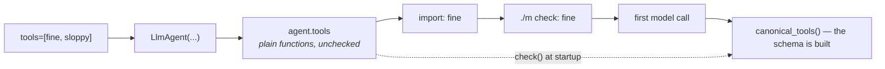

# 1.4 — The wrapper that arrives late

## One-line answer

`agent.tools` holds exactly what you put in it — a plain function stays a plain function — and the
`FunctionTool` is built later, when something asks for `canonical_tools()`, which is why a broken
tool signature survives import and every test that does not run the agent.

---

## The story

You hand a parcel over at a courier counter and ask what it will cost.

They do not know. Not because they are being difficult — because the price depends on the weight, and
the weight depends on the scale, and the scale is behind the counter. So they take the parcel, put it
on the scale, and *then* there is a number.

Until that moment, what you have is a parcel and an intention. There is no price on it. If you had
walked away and come back an hour later, there would still be no price on it, because a price is not
a property of a parcel — it is the result of an operation somebody performs on one.

Now the version of this that costs you something. You bring a parcel that is over the size limit for
the service you wanted. Nobody at the door stops you. Nobody in the queue mentions it. It is only at
the scale, at the counter, at the front, that anyone says so — because the check and the weighing are
the same act, and neither happens until you are at the front.

The queue is your import. The scale is `canonical_tools()`.

---

## The idea in plain language

[1.1](1.1-the-declaration-you-no-longer-write.md) showed the two lines:

```text
what you put in the list: function
what ADK made of it    : FunctionTool
```

Those are two different moments, and the gap between them is this part.

**`agent.tools` is storage.** It holds the objects you passed. A plain function stays a plain
function; nothing is inspected, converted or validated beyond Pydantic's check that each item is
*callable or a `BaseTool` or a `BaseToolset`* — which is the three-way error from
[1.1](1.1-the-declaration-you-no-longer-write.md).

**`await agent.canonical_tools()` is the operation.** That is where each callable is wrapped in a
`FunctionTool`, where the signature is read, and where the schema is generated. In a real run the
runtime calls it for you, once per model call.

You have met this shape before, one day ago.
[Day 9, part 1.2](../../../day-09-four-free-providers/parts/01-one-model-field/1.2-the-spare-tyre-you-never-checked.md)
was about `agent.model` holding a string until `canonical_model` resolved it, and the consequence was
that a broken model string survives import, unit tests and `./m check`. **The same sentence is true of
tools**, for the same reason and with the same list of things that stay green.

That is not a coincidence and it is worth naming as a pattern: **ADK stores what you gave it and
derives what it needs, late.** `model` / `canonical_model`, `tools` / `canonical_tools`, `instruction`
rendered per turn ([Day 6, part 3.1](../../../day-06-instructions-and-personas/parts/03-the-instruction-fields/3.1-where-your-instruction-lands.md)).
Once you see it, three separate surprises become one rule.

**Why late?** Because the derived thing can depend on the run. An instruction is templated against
session state, so it cannot be computed once. Tools can come from a `BaseToolset` that fetches them —
Day 15 — so the list is not knowable at construction either. Deriving late is what makes those
possible, and the cost is that construction validates almost nothing.

**And `canonical_tools` is `async`.** That is a small thing with a real consequence: you cannot check
your tools from a synchronous function, so the cheap validation this part is arguing for has to live
somewhere that can `await` — a startup coroutine, or an `asyncio.run` in a test.

---

## Why Sutra needs it

**[6.1](../06-failure-lab/6.1-the-jar-with-no-label.md)** is a tool that is wrong in a way nothing
catches until it runs. This part is why nothing catches it.

**Day 15** brings toolsets, where the list of tools genuinely is not known until something is
fetched. The late derivation you are meeting on a plain function is what makes that work.

**Day 23** is testing agents, and `canonical_tools()` is the cheapest possible assertion about a tool:
no model, no network, and it catches every signature mistake in this section.

**Day 31** is the quality gate. A tool check that runs without a network belongs in `./m check`, next
to the `:free` lint from
[Day 9, part 7.1](../../../day-09-four-free-providers/parts/07-failure-lab/7.1-the-free-trial-that-charges.md).

---

## The mechanism

The gap, and the check that closes it. **No model call, no cost:**

```python
# lab/late.py - what is validated at construction, and what is not.
import asyncio

from google.adk.agents import LlmAgent


def fine(ticket_id: str) -> dict:
    """Fetch a ticket.

    Args:
        ticket_id: the id.
    """
    return {"status": "ok"}


def sloppy(ticket_id) -> dict:  # no annotation - see 1.3
    """Fetch a ticket.

    Args:
        ticket_id: the id.
    """
    return {"status": "ok"}


agent = LlmAgent(
    name="sutra_desk",
    model="gemini-3.7-flash",
    instruction="You triage tickets.",
    tools=[fine, sloppy],
)

print("construction  : no error")
print("agent.tools   :", [type(t).__name__ for t in agent.tools])
print("their names   :", [getattr(t, "__name__", "?") for t in agent.tools])
print()


async def check(built: LlmAgent) -> list[str]:
    """Wrap the tools and report any parameter that reached the model untyped."""
    problems = []
    for tool in await built.canonical_tools():
        schema = tool._get_declaration().parameters_json_schema or {}
        for name, spec in schema.get("properties", {}).items():
            if "type" not in spec:
                problems.append(f"{tool.name}({name}) has no type")
    return problems


print("canonical_tools:", asyncio.run(check(agent)) or "no problems")
```

**Line by line:**

- Two functions differing only in one annotation — `fine` has `ticket_id: str`, `sloppy` has
  `ticket_id`. Everything else about them is identical, so any difference in the output is that.
- `LlmAgent(..., tools=[fine, sloppy])` at **module level**, not inside a function — so it runs at
  import. That is the point: an import is where this would be caught if it were caught at all.
- `print("construction  : no error")` — a line that states a negative, because the absence of an
  exception is the finding and an absence prints nothing on its own.
- `[type(t).__name__ for t in agent.tools]` — `function` twice. Not `FunctionTool`; nothing has been
  wrapped.
- `getattr(t, '__name__', '?')` — reading the function's own name, with a fallback, because once
  Day 15 puts a `BaseToolset` in this list the items will not all have `__name__`. A one-character
  guard that keeps a lab script from breaking on the day it becomes interesting.
- `async def check(built)` — the validation, and it has to be `async` because `canonical_tools()` is.
  That constraint is the reason this cannot be a plain module-level assertion.
- `tool._get_declaration().parameters_json_schema or {}` — the `or {}` matters: a tool with **no**
  parameters has `parameters_json_schema` of `None`, and `.get` on `None` raises. Nullary tools are
  ordinary.
- `if "type" not in spec` — [1.3](1.3-type-hints-are-the-schema.md)'s finding turned into a check. It
  is deliberately narrow: it does not have opinions about your types, only that you stated one.
- `asyncio.run(check(agent)) or "no problems"` — the empty list is falsy, so a clean run prints a
  sentence rather than `[]`. Small, and it is the difference between a check people read and one they
  skim.

The output:

```text
construction  : no error
agent.tools   : ['function', 'function']
their names   : ['fine', 'sloppy']

canonical_tools: ['sloppy(ticket_id) has no type']
```

Construction said nothing. The list holds two plain functions. And the problem appears only when
something wraps them — which in a real program is the first model call, several seconds and one
request into a run you were hoping to observe.

Six lines of `check()` move that to import time, and it is the same argument
[Day 9, part 1.2](../../../day-09-four-free-providers/parts/01-one-model-field/1.2-the-spare-tyre-you-never-checked.md)
made about model strings: **fail at the door.**



---

## When it breaks

**💥 The tool that was never wrapped.**

There is no error text here either, which is becoming the theme of this section. What you see is a
model that never calls a tool you are certain you registered — because the thing you registered was
not what you thought. The diagnostic is one line and it is the same one as in the script:

```python
print([type(t).__name__ for t in agent.tools])
```

`['function']` is right. `['dict']` means you called it. `[]` means the list you passed was empty,
which happens when a module-level `TOOLS` list is built conditionally and the condition was false.

**💥 `canonical_tools()` called without `await`.**

```text
TypeError: 'coroutine' object is not iterable
```

Plus a `RuntimeWarning: coroutine 'LlmAgent.canonical_tools' was never awaited`. Exactly the shape of
[Day 7, part 5.1](../../../day-07-events-and-streaming/parts/05-failure-lab/5.1-the-mechanic-who-billed-at-the-end.md)'s
failure, in a different place, for the same underlying reason: an async thing used as though it were
not.

**💥 The check that could not run where you wanted it.**

You write `check()` and try to call it from `sutra/desk/agent.py` at module level, and there is no
event loop, so you reach for `asyncio.run(...)` at import time — which works right up until this
module is imported *from* an async context, and then:

```text
RuntimeError: asyncio.run() cannot be called from a running event loop
```

`adk web` is such a context. So the check belongs in a test or an explicit startup coroutine, not at
import.

---

## In production

**What a professional writes instead of the teaching version** is that check as a test, not as
startup code. It needs no model, no key and no network; it runs in milliseconds; and a test failure
names the tool and the parameter. Startup checks are for things that depend on the environment — a
model string that needs a provider library, a key that has to be present — and a tool signature is
none of those. It is wrong the moment it is written, so the earliest thing that can catch it should.

**What degrades at scale** is the number of derived things. `canonical_model`, `canonical_tools`, the
rendered instruction, and from Day 15 a toolset that fetches. Each is derived late for a good reason,
and together they mean **construction validates almost nothing**. Teams that notice this write one
"can this agent actually run?" coroutine that touches every derived property, and call it from a test
and from a readiness probe. It is not elegant and it is the difference between finding out in CI and
finding out in production.

**The failure that only shows with real traffic** is the toolset that resolves differently. A plain
function produces the same `FunctionTool` every time; a toolset can fetch, and what it fetched last
week is not necessarily what it fetches today. So the derived-late property that costs you nothing on
a function becomes, on Day 15, a source of behaviour that changes without any diff. The habit worth
starting now is to **log the resolved tool names once per run** — cheap, and it is the only record of
what the model was actually offered.

**The review comment a senior engineer leaves:** *"Nothing here checks the tools until the first model
call. Add the `canonical_tools` assertion to the test suite — it's free and it catches every signature
mistake in the file. And log the resolved tool names at startup; right now if a tool silently isn't
registered, the symptom is 'the model didn't use it', which is a prompt investigation."*

**The interview question:** *"when is an agent's configuration actually validated?"* The answer that
shows you have debugged one: "Later than you would like. The framework stores what you hand it — the
model as a string, the tools as plain functions — and derives the real objects when it needs them, so
construction and import validate almost nothing. That's deliberate, because the derived thing can
depend on the run: an instruction templated against session state, or a toolset that fetches. The
cost is that a broken tool signature or a bad model name passes every test that doesn't actually run
the agent. So I add one cheap check that forces the derivation — for tools that means awaiting
`canonical_tools` and asserting every parameter has a type — and I put it in the test suite, because
it costs nothing and the alternative is finding out on a request I already paid for."

---

## Check yourself

```bash
uv run python days/day-10-function-tools/lab/late.py
```

Then remove `sloppy` from the list and run it again, so you have seen the check pass as well as fail.

**Answer out loud, without scrolling up:**

> Say what `agent.tools` holds and when the `FunctionTool` is built. Then name the other two ADK
> fields that behave the same way, and say what all three have in common.

---

**Next:** [2.1 — Return a dict with a status](../02-what-a-tool-returns/2.1-return-a-dict-with-a-status.md)
