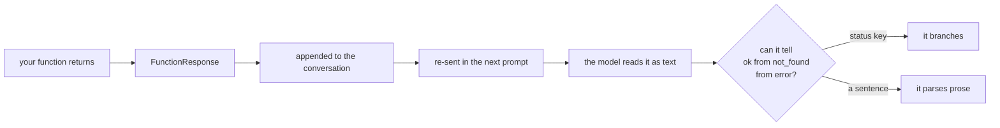

# 2.1 — Return a dict with a status

## One-line answer

A tool's return value goes **back into the prompt** as text the model reads, so it should be a
dictionary with a `status` key and named fields — not a bare string, and not a blob the model has to
interpret.

---

## The story

Somebody in the family asks you to check whether the chemist has a medicine.

You walk down, you come back, and you say: **"Not there."**

Two words, and now there is a conversation. Not there today, or they do not stock it at all? Did you
ask, or did you look at the shelf? Was the shop open? Should we try the other one, or wait until
Tuesday?

Every one of those questions exists because your answer had one piece of information in it and the
situation had five.

Now the version that works. **"Shop was open. They don't have it. He said they get it on Tuesdays,
and the other chemist near the school usually has it."**

Same walk. Same amount of knowing. The difference is entirely in what you brought back — and notice
that the second answer is not longer because you did more work. It is longer because you **reported
the things you already knew and had thrown away**: that the shop was open, that you asked rather than
guessed, and what the man said.

A tool's return value is what you bring back. And the person who has to act on it cannot walk down
and look for themselves.

---

## The idea in plain language

[Day 4, part 2.3](../../../day-04-tools-by-hand/parts/02-the-round-trip/2.3-the-tool-result-turn.md)
established what happens to a tool's result: it goes back to the model as a **function response**,
which becomes part of the conversation, which becomes part of the next prompt. So the result is not a
return value in the ordinary sense. **It is text you are writing into the model's context**, and
everything you know about writing for a model applies to it.

ADK's guidance is short and worth taking literally. The framework's own function-tools page says the
preferred return type is a **dictionary**, that you should *"strive to make your return values as
descriptive as possible"*, and that a `"status"` key indicating the outcome — `"success"`, `"error"`,
`"pending"` — is the recommended shape.

Why a dictionary rather than a string:

**Keys are labels.** `{"article": "KB-104 ..."}` tells the model what it is looking at. A bare string
containing the same text does not, and the model has to infer it from context that may or may not be
there three turns later.

**A status is a branch the model can take.** `{"status": "not_found"}` is something a model can act
on. A sentence saying "nothing matched" is something a model has to *parse*, and parsing prose is
exactly the fragile step [Day 3, part 3.2](../../../day-03-loop-hand-rolled/parts/03-the-protocol/3.2-parsing-a-reply-you-did-not-write.md)
made you do by hand and Day 4 deleted.

**Extra fields cost almost nothing and answer the questions you did not anticipate.** The chemist
sentence, in dictionary form.

### The shape worth standardising on

```text
{"status": "ok" | "not_found" | "error", ...named fields...}
```

Three rules for the fields:

1. **`status` first and always**, from a small fixed set. Not a boolean: `{"found": false}` cannot
   later distinguish *not found* from *the search failed*, and those need different behaviour.
2. **Name what you return.** `{"article": ...}` rather than `{"result": ...}`, because the key is the
   only label the model gets.
3. **Say what you did not find.** A miss should carry the query it missed on:
   `{"status": "not_found", "query": "keeps getting logged out"}`. That single field is what lets the
   model say *"I searched for X and found nothing"* rather than *"nothing was found"* — and the
   difference between those two sentences, to a user, is the difference between a system that is
   working and one that is broken.

### What does not belong in a return value

**Objects.** The result is serialised into the conversation, so it has to be JSON-friendly: strings,
numbers, booleans, and lists or dictionaries of those. This is the same constraint as session state
from [Day 8, part 1.3](../../../day-08-sessions-and-services/parts/01-the-session/1.3-the-register-and-the-key-board.md),
and for the same reason.

**Everything you have.** A tool that returns a whole database row returns forty fields the model does
not need, on every call, forever, in the context window. Return what the next decision needs.

**Anything secret.** A tool result enters the conversation, is stored in the session, and is re-sent
on every subsequent turn. A token, a key or another customer's data placed in a return value is in
the transcript permanently. This is Phase 10's territory and it starts with the habit.

---

## Why Sutra needs it

**[5.1](../05-wiring-sutra/5.1-two-tools-ported.md)** ports Day 3's `lookup_ticket` and `search_kb`,
both of which currently return **strings** — including their misses, as sentences. Today they become
dictionaries, and deciding what goes in them is the actual work of the port.

**Day 12** is structured output, the same idea pointed at the agent's final answer rather than at a
tool's result. The reasoning is identical and the mechanism is different.

**Day 21** is trap #4, *surface, don't swallow*, where the difference between a tool that returns
`{"status": "error"}` and one that returns a polite sentence becomes a whole day.

**Day 49** replaces `search_kb`'s keyword match with real retrieval. If the return shape is stable,
that is a swap. If callers depend on a sentence's wording, it is a rewrite.

---

## The mechanism

The same lookup, four ways, with what each one gives the model:

```python
# lab/returns.py - four return shapes for one tool. No model call, no cost.
import json

TICKETS = {
    "4521": {"title": "Keeps getting logged out", "plan": "Pro"},
}


def bare_string(ticket_id: str) -> str:
    """Worst: the model gets prose and has to parse it."""
    ticket = TICKETS.get(ticket_id)
    return f"Ticket {ticket_id}: {ticket['title']}" if ticket else f"No ticket {ticket_id}."


def bare_bool(ticket_id: str) -> dict:
    """Better, and still stuck: found/not-found cannot express 'the lookup failed'."""
    ticket = TICKETS.get(ticket_id)
    return {"found": ticket is not None, "ticket": ticket}


def status_only(ticket_id: str) -> dict:
    """A status, but a miss says nothing about what was missed."""
    ticket = TICKETS.get(ticket_id)
    return {"status": "ok", "ticket": ticket} if ticket else {"status": "not_found"}


def good(ticket_id: str) -> dict:
    """The shape to standardise on: a status, named fields, and the miss carries its input."""
    ticket = TICKETS.get(ticket_id)
    if ticket is None:
        return {"status": "not_found", "ticket_id": ticket_id}
    return {"status": "ok", "ticket_id": ticket_id, **ticket}


for function in (bare_string, bare_bool, status_only, good):
    print(f"--- {function.__name__}")
    for ticket_id in ("4521", "9999"):
        print(f"    {ticket_id}: {json.dumps(function(ticket_id))}")
```

**Line by line:**

- `TICKETS` as a dictionary of dictionaries rather than of strings — a small change from
  [Day 3's `sutra/loop.py`](../../../../sutra/loop.py), and the one that makes structured returns
  possible at all. You cannot return named fields from a blob of text.
- `bare_string` returning an f-string, including for the miss — **this is exactly what Day 3's
  `lookup_ticket` does today**. It is here as the baseline, not as a straw man.
- `bare_bool` with `{"found": ...}` — the obvious first improvement, and the one worth rejecting
  explicitly. Two states where you need three.
- `status_only` — a real status, and a miss that carries nothing. The improvement over it is one key.
- `good` returning `{"status": "not_found", "ticket_id": ticket_id}` on the miss — **the input echoed
  back.** That is the "I looked for X" half, and it is one field.
- `**ticket` unpacking the record into the top level rather than nesting it — a judgement call worth
  naming: flat is easier for a model to read, and nesting is better when the record is large or when
  two records could collide. For two fields, flat.
- The loop calling each function with a hit **and** a miss — because the whole difference between
  these four shapes is what they do when they fail, and a demonstration that only shows successes
  shows nothing.
- `json.dumps` — printing what the model will actually see, rather than Python's `repr`. `True`
  against `true` is a real difference and this is where you notice it.

The output:

```text
--- bare_string
    4521: "Ticket 4521: Keeps getting logged out"
    9999: "No ticket 9999."
--- bare_bool
    4521: {"found": true, "ticket": {"title": "Keeps getting logged out", "plan": "Pro"}}
    9999: {"found": false, "ticket": null}
--- status_only
    4521: {"status": "ok", "ticket": {"title": "Keeps getting logged out", "plan": "Pro"}}
    9999: {"status": "not_found"}
--- good
    4521: {"status": "ok", "ticket_id": "4521", "title": "Keeps getting logged out", "plan": "Pro"}
    9999: {"status": "not_found", "ticket_id": "9999"}
```

Read the **miss** column down the page, because that is where the four shapes separate.

`"No ticket 9999."` is a sentence. The model has to read it, decide it means failure, and extract the
id from prose it did not write.

`{"found": false, "ticket": null}` is honest and cannot grow. When `search_kb` starts talking to a
real index on Day 49 and the index is *down*, there is nowhere for that to go: `found: false` says
the wrong thing, and the model will tell a user there is no such article.

`{"status": "not_found"}` is right and thin. A model given that on its own can only say "nothing was
found."

`{"status": "not_found", "ticket_id": "9999"}` is the chemist's second answer. The model can say *"I
looked up ticket 9999 and there is no such ticket"* — which is a sentence a user can act on, and it
came from one extra key.



---

## When it breaks

**💥 The two-state flag meeting a third state.**

```text
{"found": false, "ticket": null}
```

...returned because the database timed out. The model, correctly reading its input, tells the
customer their ticket does not exist. Nothing errored anywhere. **A boolean cannot carry three
outcomes**, and *found*, *not found* and *could not look* are three.

**💥 The unserialisable return.**

```python
return {"status": "ok", "ticket": Ticket(id="4521")}
```

```text
TypeError: Object of type Ticket is not JSON serializable
```

A dataclass, a `datetime`, a `Decimal`, a `set` — all reasonable Python and none of them survives the
trip into the conversation. Convert at the boundary: the tool's job includes rendering its answer into
something that can be sent.

**💥 The return value that leaked.**

No error, and the worst one in this part. A tool returns a row that happens to include an internal
customer id, an email, or a token. It goes into the conversation, into the session
([Day 8, part 1.3](../../../day-08-sessions-and-services/parts/01-the-session/1.3-the-register-and-the-key-board.md)),
and is re-sent to the provider on every later turn of that conversation. Nothing you can do afterwards
un-sends it. **Choose the fields; do not return the row.**

---

## In production

**What a professional writes instead of the teaching version** is one return shape shared by every
tool in the system, written down, with `status` drawn from a small fixed vocabulary. Not because
uniformity is pretty — because the *instruction* can then say one thing about failure
(*"if a tool returns status 'error', say so and stop"*) instead of one thing per tool, and because
Day 13's callbacks can inspect results generically.

**What degrades at scale** is result size. One tool returning a generous dictionary is fine. A
research agent making six tool calls per turn, each returning a generous dictionary, has filled the
context window with tool output before the model gets to reason about any of it — and every one of
those results is re-sent on every subsequent turn of that conversation. This is the concrete version
of Day 19 and 20's context engineering, and the cheapest defence is at the source: return the fields
the next decision needs.

**The failure that only shows with real traffic** is a status vocabulary that grew by accident. One
tool returns `"error"`, another `"failed"`, a third `"failure"`, and the instruction's rule about
errors matches one of them. Every tool works, every result is reasonable, and the agent handles
failure correctly a third of the time. Nobody notices because failures are the rare path — which is
exactly why the vocabulary needs to be fixed before there are twenty tools.

**The review comment a senior engineer leaves:** *"`{"found": false}` can't express 'the lookup
failed', and it will. Use the status vocabulary, and put the query on the miss — right now when we
find nothing the model can only say 'nothing found', which reads to a customer like we're broken. And
this returns the whole row: pick the four fields we need."*

**The interview question:** *"what should a tool return?"* The answer that shows you have shipped one:
"A dictionary with a status from a small fixed set, plus named fields — because the return value isn't
a return value, it's text going back into the model's context and then into the transcript for every
later turn. Three specifics I'd defend. A status rather than a boolean, because *found*, *not found*
and *the lookup failed* are three outcomes and the third one turns up. The input echoed back on a
miss, so the model can say 'I searched for X and found nothing' rather than 'nothing found', which is
the difference between sounding correct and sounding broken. And the fields chosen rather than the row
returned — partly for context size, and partly because anything in a tool result is in the transcript
permanently, including whatever was in that row that nobody looked at."

---

## Check yourself

```bash
uv run python days/day-10-function-tools/lab/returns.py
cat sutra/loop.py | sed -n '/def lookup_ticket/,/^def /p'
```

The second command shows what Day 3's version returns today. Write down the three things it does not
tell the model.

**Answer out loud, without scrolling up:**

> Say why a tool's return value is prompt text rather than a return value. Then give the three rules
> for the dictionary, and say which one turns "nothing found" into a sentence a user can act on.

---

**Next:** [2.2 — The bare value the spec rewrites](2.2-the-bare-value-the-spec-rewrites.md)
