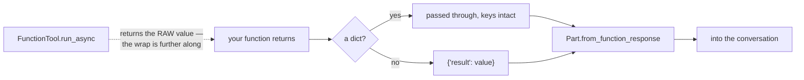

# 2.2 — The bare value the spec rewrites

## One-line answer

Return anything that is not a dictionary and ADK wraps it as `{"result": <your value>}` on its way
into the conversation — because the function-response format requires an object — so the model sees a
key you never chose.

---

## The story

You owe somebody two hundred rupees and you hand it over as two notes, loose, across a table.

They take it, and before putting it away they fold it into an envelope from the drawer and write
**200** on the front.

Nothing was wrong with the notes. The amount is unchanged. But their filing system is envelopes with
amounts on them, so a loose payment cannot go in as-is — it gets an envelope, and the envelope gets a
label, and the label is whatever they decided to write.

Now imagine you had handed over an envelope of your own, with **"200 — for the tyres, Ramesh"**
written on it. That one goes straight into the drawer unchanged.

Both work. In one case you chose the label; in the other somebody else did, and they wrote the least
informative thing that was true.

That is what happens to a bare return value.

---

## The idea in plain language

[2.1](2.1-return-a-dict-with-a-status.md) said to return a dictionary. This part is about what happens
when you do not, because the answer is not "an error".

The function-response part that carries a tool's result back to the model — the shape you built by
hand on
[Day 4, part 2.3](../../../day-04-tools-by-hand/parts/02-the-round-trip/2.3-the-tool-result-turn.md) —
requires an **object**. A bare string is not an object. So ADK wraps it, and its source says exactly
why, in a one-line comment:

> `# Specs requires the result to be a dict.`
> `if not isinstance(function_result, dict): function_result = {'result': function_result}`

So `return "KB-104 'Unexpected logouts': ..."` arrives at the model as
`{"result": "KB-104 'Unexpected logouts': ..."}`.

Three things worth knowing about that.

**It is not an error and it will not be one.** Your tool works. A string, a number, a list, `None` —
all of them go through, wrapped.

**The key is `result`, and `result` means nothing.** [2.1](2.1-return-a-dict-with-a-status.md)'s point
was that keys are labels. `result` is the label somebody else picked because they had to pick
something, and it tells the model exactly as much as the envelope with `200` on it.

**A dictionary is passed through untouched**, keys and all — deliberately. ADK's source is explicit
that it does not inspect the keys, because rewrapping a dictionary would *"silently rewrap it as
{'result': ...} and change what the model sees"*. That is a framework choosing not to be clever, and
it is the reason your own keys survive.

There is a subtlety worth pinning down because it will otherwise confuse you when you go looking.
**The wrapping does not happen in the tool.** Call a `FunctionTool` directly and a bare string comes
back as a bare string; the `{"result": ...}` appears only when the response part is built, further
along. So a test that calls your tool sees the raw value, and the model sees the wrapped one —
[the mechanism](#the-mechanism) shows both.

And one case that is genuinely a decision rather than a mistake: **returning `None`.** A tool that
does something and has nothing to report — a write, a flag set — will produce `{"result": null}`,
which tells the model nothing at all, including nothing about whether it worked. Return
`{"status": "ok"}` instead. It is the same number of characters and it is the difference between a
model that can carry on and one that has to guess.

---

## Why Sutra needs it

**[5.1](../05-wiring-sutra/5.1-two-tools-ported.md)** ports two functions that **currently return
strings** — Day 3's `lookup_ticket` and `search_kb`, both of which return prose for hits and prose for
misses. Without this part, the port would work, and every result the model saw would arrive under the
key `result`.

**Day 13** adds callbacks that can inspect and rewrite a tool's result. Knowing where the wrapping
happens is what tells you what the callback is holding.

**Day 21** is trap #4. A tool that returns a bare error string produces `{"result": "something went
wrong"}`, which is indistinguishable in shape from a successful answer — the failure has been
laundered into the same envelope as everything else.

**Day 23** tests tools directly, and a test that asserts on the raw return value is asserting on
something the model never sees. Knowing which side of the wrap you are on is the difference between a
test that means something and one that does not.

---

## The mechanism

Both sides of the wrap, in one script. **No model call, no cost:**

```python
# lab/wrapping.py - what your tool returns, and what the model receives.
import asyncio
import json

from google.adk.tools import FunctionTool
from google.genai import types


def returns_a_string(query: str) -> str:
    """Search, returning prose. This is Day 3's shape.

    Args:
        query: symptom words.
    """
    return "KB-104 'Unexpected logouts': cookies set with SameSite=Strict end sessions early."


def returns_a_dict(query: str) -> dict:
    """Search, returning named fields.

    Args:
        query: symptom words.
    """
    return {"status": "ok", "article": "KB-104", "summary": "SameSite=Strict ends sessions early."}


def returns_nothing(ticket_id: str) -> None:
    """Mark a ticket as triaged and report nothing.

    Args:
        ticket_id: the id.
    """
    return None


async def main() -> None:
    for function in (returns_a_string, returns_a_dict, returns_nothing):
        tool = FunctionTool(function)
        raw = await tool.run_async(
            args={list(tool._get_declaration().parameters_json_schema["properties"])[0]: "x"},
            tool_context=None,
        )

        # What the runtime does on the way into the conversation.
        wrapped = raw if isinstance(raw, dict) else {"result": raw}
        part = types.Part.from_function_response(name=tool.name, response=wrapped)

        print(f"--- {function.__name__}")
        print("    your tool returned:", json.dumps(raw))
        print("    the model receives:", json.dumps(part.function_response.response))


asyncio.run(main())
```

**Line by line:**

- `FunctionTool(function)` constructed explicitly rather than going through an agent — because this
  part is about the tool's own output, and an agent would add a layer between you and it.
- `tool.run_async(args=..., tool_context=None)` — the tool's own entry point, keyword-only, and
  awaited. Passing `None` for the context is legal **only because none of these three functions asks
  for one**; Day 11's tools will, and then this line raises.
- `list(...parameters_json_schema["properties"])[0]` — reading the first parameter's name out of the
  generated schema rather than hard-coding `"query"` and `"ticket_id"` separately. Slightly clever for
  a lab script, and it earns it: the loop then works for all three functions unchanged.
- `wrapped = raw if isinstance(raw, dict) else {"result": raw}` — **this line is ADK's, restated.** It
  is `_build_function_response_content`'s rule, copied so you can see it operate. In a real run you do
  not write it; the runtime does.
- `types.Part.from_function_response(name=..., response=wrapped)` — the actual `google.genai` builder
  for the part that carries a tool result, the same one Day 4 used by hand. Using it rather than
  printing the dictionary proves the shape is accepted rather than merely plausible.
- `part.function_response.response` — reading it back out of the constructed part, so the printed
  value is what is really in the object rather than what went into it.
- `returns_nothing` typed `-> None` — an honest annotation for a tool that reports nothing, included
  so its output can be looked at rather than described.

The output:

```text
--- returns_a_string
    your tool returned: "KB-104 'Unexpected logouts': cookies set with SameSite=Strict end sessions early."
    the model receives: {"result": "KB-104 'Unexpected logouts': cookies set with SameSite=Strict end sessions early."}
--- returns_a_dict
    your tool returned: {"status": "ok", "article": "KB-104", "summary": "SameSite=Strict ends sessions early."}
    the model receives: {"status": "ok", "article": "KB-104", "summary": "SameSite=Strict ends sessions early."}
--- returns_nothing
    your tool returned: null
    the model receives: {"result": null}
```

Three rows, and the middle one is the only one where the two lines are identical.

Look at the last one hardest. `{"result": null}` is what a model gets from a tool that did something
and said nothing. It cannot tell whether the ticket was marked, whether the tool ran, or whether
something failed quietly — and the honest answer is that **the return value does not contain that
information**, so no amount of prompting will recover it.



---

## When it breaks

**💥 The test that asserted on the wrong side.**

```python
assert await tool.run_async(args={"query": "logout"}, tool_context=None) == {"result": "KB-104..."}
```

```text
AssertionError: assert 'KB-104...' == {'result': 'KB-104...'}
```

The tool returns the raw value; the wrap happens later. Whichever side you assert on, know which one
it is — and prefer asserting on the raw value, because that is your code, and the wrap is the
framework's.

**💥 The `result` key in the instruction.**

Somebody writes a handbook line: *"the search tool returns a `result` field containing the article"*.
It is true today because the tool returns a bare string. Then the tool is improved to return
`{"status": ..., "article": ...}` — a strictly better shape — and the instruction is now describing a
key that no longer exists. Nothing errors. The model was told to look for something that is not there.

**💥 `None` where a status belonged.**

```text
{"result": null}
```

No error, ever. The model carries on, and what it says next about whether the action succeeded is
invention, because it was given nothing. This is Principle 10 arriving from an unexpected direction:
**the fabrication is caused by the tool, not by the model.**

---

## In production

**What a professional writes instead of the teaching version** never relies on the wrap. Every tool
returns a dictionary, including the ones that have nothing to say, and the `result` key does not
appear anywhere in the system. Then `{"result": ...}` showing up in a trace is a **signal** — it means
some tool is returning a bare value, and you can find it by searching for the shape rather than by
reading every tool.

**What degrades at scale** is the inconsistency rather than the wrapping. Twenty tools, three of which
return bare values, is a system where the instruction cannot say anything general about tool results
and the model has to handle two shapes. It costs nothing to fix and nothing forces you to, which is
exactly the class of thing that survives until it is expensive.

**The failure that only shows with real traffic** is the wrapped error. A tool catches an exception
and returns the message as a string; it arrives as `{"result": "connection refused"}`, structurally
identical to a successful answer. The model reads it, does its best, and produces something plausible
about a connection. Meanwhile every dashboard counts that turn as a successful tool call, because from
the runtime's point of view it was. Day 21 is about this and it starts here, in the shape of a return
value.

**The review comment a senior engineer leaves:** *"Three of these tools return bare strings, so the
model sees them under `result`. Make them all return dicts with a status — and the one returning
`None` is worse: the model can't tell whether the write happened, so it'll guess, and it'll guess
confidently."*

**The interview question:** *"what happens if a tool returns something that isn't a dictionary?"* The
answer that shows you have read the runtime: "It gets wrapped — the function-response format requires
an object, so a bare value arrives at the model under a `result` key. It isn't an error and that's the
problem: the key is chosen for you and it's the least informative label that's true, so the model
loses whatever your own key would have said. A dictionary passes through untouched, deliberately —
the framework doesn't inspect the keys, because rewrapping would change what the model sees. The case
I care about most is a tool returning `None`, which becomes `{"result": null}`: the model can't tell
whether the action succeeded, so it invents an answer, and that fabrication is caused by the tool
rather than by the model."

---

## Check yourself

```bash
uv run python days/day-10-function-tools/lab/wrapping.py
```

**Answer out loud, without scrolling up:**

> Say what happens to a bare string on its way to the model, and why the framework does that rather
> than raising. Then say where the wrapping happens, and why that matters when you write a test.

---

**Next:** [2.3 — A failed tool is still a result](2.3-a-failed-tool-is-still-a-result.md)
