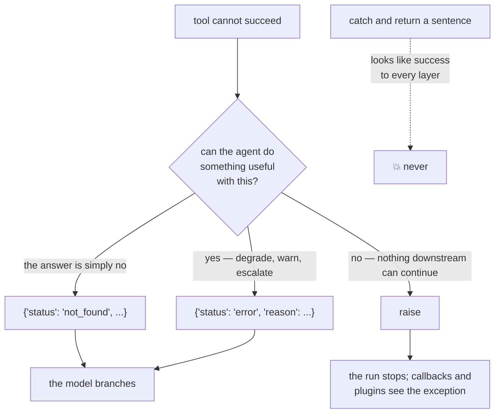

# 2.3 — A failed tool is still a result

## One-line answer

A tool that cannot do its job should return a **result saying so** — a status the model can branch on
— because an exception ends the run and a polite sentence hides the failure from everything that
counts.

---

## The story

You take a phone to a repair shop with a cracked screen.

**The first shop** looks at it and says: "Screen for this model, not available. It's an old one — we
can order it, takes four days, or you try the market."

You leave knowing what to do next. Nothing was repaired and the visit was not wasted, because you
came out with a fact you did not have.

**The second shop** takes the phone, keeps it for a day, and hands it back saying "sorry, could not
do it." You ask why. "It's not possible." You still do not know whether the part exists, whether they
tried, or whether it is worth going anywhere else. You have lost a day and learned nothing.

**The third shop** takes the phone and never opens again. Shutter down, no answer. You have lost the
phone.

Three ways of not fixing a screen, and they are not equally bad. The difference between the first and
the second is not effort — it is **whether they told you what they found**. The third is a different
category: they did not fail at the job, they removed themselves from the situation entirely.

Your tool has these three options every time it cannot do what it was asked.

---

## The idea in plain language

[Day 3, part 2.3](../../../day-03-loop-hand-rolled/parts/02-tools-and-dispatch/2.3-a-failed-tool-is-an-observation.md)
established the rule when you were writing the loop yourself: *a miss returns a message, not an
exception — the model must be able to read the failure and react to it.* `sutra/loop.py` still carries
that comment.

That rule survives the move to ADK, and today it acquires a shape.

**Three ways a tool can not-succeed, and they are for different things:**

| What you do | What the model gets | Use it when |
| --- | --- | --- |
| return `{"status": "not_found", ...}` | a result it can branch on | the tool worked and the answer is *no* |
| return `{"status": "error", "reason": ...}` | a result it can branch on | the tool could not run, and the agent can still do something useful |
| let the exception propagate | nothing — the run stops | continuing would be wrong |

The first row is not a failure at all and is worth separating clearly. "No ticket 9999" is a
**successful lookup with a negative answer**. Conflating it with an error is what produces an agent
that apologises for the database when the user simply typed a wrong number.

The second row is the interesting one. A search index that is unreachable is a real failure, and the
agent can still do something sensible: tell the user it could not check, offer what it does know, or
escalate. It can only do that if it is *told*, and a `status` is how you tell it.

The third row is not a failing — it is a design choice with real uses. The plan's §5.1 **trap #4** is
about it from the other side:

> *1.x habit: tool/model errors caught and returned as strings, hiding failures. 2.x reality: 2.x
> surfaces exceptions through the runtime so callbacks/plugins can act on them. Swallowing them
> silently breaks retries, tracing, and honesty.*

So ADK 2.x deliberately lets a tool exception travel, because callbacks (Day 13) and plugins (Day 14)
are watching, and a swallowed exception is invisible to both. **An exception is not the wrong answer.
It is the right answer when nothing downstream can usefully continue** — a missing configuration
value, a programming error, a violated precondition.

### The one that is always wrong

```python
except Exception:
    return "Sorry, I couldn't look that up right now."
```

**Line by line:**

- `except Exception:` with no `as exc` — the exception is caught and **discarded**, so even the
  information needed to write a useful message is gone before the next line runs.
- `return` rather than `raise` — the function completes normally, which is what makes every layer
  above it report success.
- A **string**, so [2.2](2.2-the-bare-value-the-spec-rewrites.md)'s wrap applies and it reaches the
  model as `{"result": "Sorry, ..."}` — structurally identical to an answer.
- The apology itself is well written, which is the trap: this looks like care rather than like a bug.

This is the second repair shop, and what it produces is a **successful** tool call — as far as the
runtime, the trace and any dashboard are concerned — plus a model that reads a polite sentence and,
being cooperative, carries on as though it had information.

Every layer reports health. This is
[Day 7, part 3.3](../../../day-07-events-and-streaming/parts/03-the-yield-contract/3.3-your-own-emitter.md)'s
swallowed error, arriving inside a tool, and it is the single most common way an agent system quietly
lies.

### How to choose

One question: **can the agent do something useful with this information?**

If yes, return it as a result with a status. If no — if the only correct next step is for a human or
an outer system to intervene — let it raise.

And a rule that follows from the table rather than from taste: **`not_found` is not an error.** Give
it its own status, because the agent's correct behaviour is different (say so, and carry on) and
because Day 79's evals will want to count them separately. An agent whose "error rate" includes every
ticket number a user mistyped is an agent whose error rate means nothing.

---

## Why Sutra needs it

**[5.1](../05-wiring-sutra/5.1-two-tools-ported.md)** ports two tools whose misses are currently
prose. Today they get statuses, and `not_found` and `error` become different things for the first
time.

**[5.2](../05-wiring-sutra/5.2-the-first-aid-box-with-bandages.md)** is where the handbook's honesty
section from [Day 6](../../../day-06-instructions-and-personas/parts/01-writing-the-handbook/1.2-six-sections-of-a-handbook.md)
finally has something to be honest *about* — and what it says depends on being able to tell a miss
from a failure.

**Day 13** adds `after_tool_callback`, which can see and rewrite a tool's result — but only a result.
An exception takes a different path, and knowing which you produced decides which hook sees it.

**Day 21** is trap #4 in full, closing ADK-23 and SEC-02.

**Day 79 onwards** is evals, where *"how often does Sutra fail to find an answer"* and *"how often
does Sutra break"* are two metrics, and they are two metrics only if the tool distinguished them.

---

## The mechanism

The three shapes, and what each does to a run. **No model call, no cost** — a custom agent stands in
for the model, the technique from
[Day 7, part 3.1](../../../day-07-events-and-streaming/parts/03-the-yield-contract/3.1-one-paper-at-a-time.md):

```python
# lab/failing_tools.py - three ways to not succeed, and what each does to the run.
import asyncio

from google.adk.tools import FunctionTool

KB = {"logout": "KB-104 'Unexpected logouts': force https."}
INDEX_IS_UP = False


def honest_miss(query: str) -> dict:
    """Search the KB. A miss is a successful search with a negative answer.

    Args:
        query: symptom words.
    """
    for keyword, article in KB.items():
        if keyword in query.lower():
            return {"status": "ok", "query": query, "article": article}
    return {"status": "not_found", "query": query}


def honest_failure(query: str) -> dict:
    """Search the KB, reporting an outage the agent can act on.

    Args:
        query: symptom words.
    """
    if not INDEX_IS_UP:
        return {"status": "error", "query": query, "reason": "search index unreachable"}
    return {"status": "ok", "query": query, "article": "..."}


def swallowed(query: str) -> str:
    """The shape to never write.

    Args:
        query: symptom words.
    """
    try:
        if not INDEX_IS_UP:
            raise ConnectionError("search index unreachable")
        return "..."
    except Exception:
        return "Sorry, I couldn't look that up right now."


def raises(query: str) -> dict:
    """No fallback is correct here, so stop the run.

    Args:
        query: symptom words.
    """
    raise ConnectionError("search index unreachable")


async def main() -> None:
    for function in (honest_miss, honest_failure, swallowed, raises):
        tool = FunctionTool(function)
        print(f"--- {function.__name__}")
        try:
            result = await tool.run_async(
                args={"query": "keeps getting logged out"}, tool_context=None
            )
            wrapped = result if isinstance(result, dict) else {"result": result}
            print("    the model receives:", wrapped)
            print(
                "    can it branch?    :",
                "yes" if "status" in wrapped else "no - it must read prose",
            )
        except Exception as exc:
            print(f"    raised            : {type(exc).__name__}: {exc}")
            print("    the model receives: nothing - the run stops here")


asyncio.run(main())
```

**Line by line:**

- `INDEX_IS_UP = False` as a module constant — a switch, so the outage is deliberate and repeatable
  rather than a random failure you cannot reproduce. Every "when it breaks" section in this
  curriculum wants a switch like this.
- `honest_miss` returning `{"status": "not_found", "query": query}` — the input echoed back, from
  [2.1](2.1-return-a-dict-with-a-status.md). **A miss is `not_found`, not `error`**, and the two
  functions are adjacent so the difference is visible rather than asserted.
- `honest_failure` carrying a `reason` — a short machine-ish phrase rather than a sentence, because
  the model needs to branch on it and a human reading a trace needs to recognise it. Not a stack
  trace: that is for your log, not for the conversation.
- `swallowed` returning a **string**, deliberately, so [2.2](2.2-the-bare-value-the-spec-rewrites.md)'s
  wrap applies to it and the output shows what that does to a failure.
- `except Exception:` with no `as exc` in `swallowed` — the real shape of the mistake, and note it
  discards the exception entirely. Even the information needed to write a good message is thrown away.
- `raises` with no `try` at all — the third option, and the shortest function here. Letting an
  exception travel requires writing nothing, which is worth noticing: **the honest option is the one
  that needs no code.**
- `tool_context=None` — legal because none of these four asks for a context. Day 11 changes that.
- `"yes" if "status" in wrapped else "no - it must read prose"` — the finding, computed rather than
  claimed.
- The `except` around `run_async` printing *"the model receives: nothing"* — because the absence is
  the point, and an absence needs a line of its own or it reads as an omission.

The output:

```text
--- honest_miss
    the model receives: {'status': 'not_found', 'query': 'keeps getting logged out'}
    can it branch?    : yes
--- honest_failure
    the model receives: {'status': 'error', 'query': 'keeps getting logged out', 'reason': 'search index unreachable'}
    can it branch?    : yes
--- swallowed
    the model receives: {'result': "Sorry, I couldn't look that up right now."}
    can it branch?    : no - it must read prose
--- raises
    raised            : ConnectionError: search index unreachable
    the model receives: nothing - the run stops here
```

Rows one and two are the same shape carrying different news, which is exactly what you want: one
handler in the instruction, two behaviours.

Row three is the one to look at longest. `{"result": "Sorry, I couldn't look that up right now."}` is
**structurally identical to a successful answer.** Nothing in that dictionary says failure. The
runtime counted a successful tool call. Any dashboard counting tool errors counts zero.

Row four stops the run, loudly, with the real exception type and the real message — which is the right
outcome when there is nothing useful left to do, and the wrong one when there is.



---

## When it breaks

**💥 The apology that counted as a success.**

```text
    the model receives: {'result': "Sorry, I couldn't look that up right now."}
```

No error text, because there is no error. The tool ran, returned, and the run completed. What you find
later is a support conversation where the agent was vague, a trace that is entirely green, and an
eval that scored the turn as a response. The only place the failure exists is in the wording of a
sentence, and nothing downstream reads wording.

**💥 `not_found` reported as `error`.**

Also not an error, and it distorts everything built on top. A user mistypes a ticket number; the tool
reports `error`; the agent apologises for a system problem that did not happen; the error-rate metric
goes up. At scale you end up investigating an outage that is a hundred people typing the wrong
number.

**💥 The exception that should have been a result.**

```text
ConnectionError: search index unreachable
```

Correct behaviour in the wrong place. The search index being down does not mean the agent can do
nothing — it can say the knowledge base is unavailable and still summarise the ticket, which is worth
more to a user than a failed request. Raising here converts a degraded answer into no answer.

---

## In production

**What a professional writes instead of the teaching version** is a fixed status vocabulary and one
sentence in the agent's instruction that handles all of them:
[Day 6's handbook](../../../day-06-instructions-and-personas/parts/01-writing-the-handbook/1.2-six-sections-of-a-handbook.md)
gains a line like *"if a tool returns status 'error', tell the user what could not be checked and
answer from what you have."* One rule, every tool, and the honesty section finally has a mechanism
rather than a hope.

**What degrades at scale** is the boundary between "result" and "exception" drifting per author. Tool
six raises on a timeout; tool seven returns `{"status": "error"}`; both are defensible, and together
they mean the agent behaves differently depending on which tool was slow. This is a decision that has
to be written down once — usually as *"transport and dependency failures are results, programming
errors are exceptions"* — because it will not converge on its own.

**The failure that only shows with real traffic** is the retry that never happened. ADK surfaces
exceptions through the runtime *so that callbacks and plugins can act on them* — that is the whole
point of trap #4. A tool that catches its own exception has opted out of every retry policy, every
circuit breaker and every alert that Day 13 and Day 14 will install, and it has done so invisibly.
The system's resilience machinery is bypassed by the one function that most needed it.

**The review comment a senior engineer leaves:** *"This catches everything and returns an apology, so
the trace is green and our tool-error metric is zero while the index is down. Return a status the
model can branch on, and let the genuinely unrecoverable ones raise — the plugin can't retry something
it never saw."*

**The interview question:** *"how should a tool report that it failed?"* The answer that shows you
have been on call: "Three cases, not one. A negative answer isn't a failure — 'no such ticket' is a
successful lookup, and giving it its own status keeps it out of the error rate. A dependency being
down is a result with an error status and a reason, because the agent can still degrade usefully and
it can only do that if you tell it. And something genuinely unrecoverable should raise, because the
framework deliberately surfaces exceptions so retries, tracing and alerting can act on them. The one
thing I'd never do is catch and return an apology string: the runtime counts it as a successful tool
call, the trace is green, the eval scores it as a response, and the only record of the failure is the
wording of a sentence nothing downstream reads."

---

## Check yourself

```bash
uv run python days/day-10-function-tools/lab/failing_tools.py
```

Then set `INDEX_IS_UP = True` and run it again, so you have seen all four succeed as well as fail.

**Answer out loud, without scrolling up:**

> Give the one question that decides between returning a result and raising. Then say why
> `not_found` deserves its own status, and what a caught-and-apologised failure looks like to a
> dashboard.

---

**Next:** [3.1 — What the courier took](../03-the-dispatch-you-deleted/3.1-what-the-courier-took.md)
