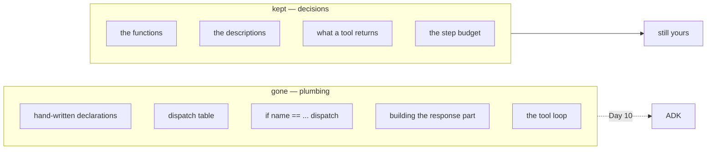

# 3.1 — What the courier took

## One-line answer

ADK took four things you wrote by hand on Days 3 and 4 — the declarations, the dispatch table, the
result turn and the loop that repeats — and left you the two that were always the real work: **the
functions and their descriptions**.

---

## The story

A small shop that sells online starts by doing its own deliveries. Somebody's cousin has a bike, and
every evening he takes the day's parcels out.

It works. It also means the shop owns a bike, worries about petrol, and loses an evening whenever the
cousin has an exam.

Then they sign up with a courier. Now a man comes at six, takes the parcels, and that is that.

Ask the owner what changed and the first answer is "we don't do deliveries any more", which is true
and is not the interesting part. The interesting part is what they still do, and it is almost
everything that ever mattered: deciding what to stock, packing carefully, writing the address
correctly, and choosing whether an order is worth sending at all.

What they gave up was **the mechanism**. What they kept was **every decision**.

And there is one more thing they gained, which nobody predicts and everybody notices within a month:
they stopped having a category of problem. Nobody forgets to write the address on the parcel now,
because the label is printed from the order. That whole class of mistake — the one caused by copying
information from one place to another by hand — is gone, and it did not go because anybody became
more careful.

Days 3 and 4 were the cousin with the bike. This is worth doing once, so you know what a courier
actually does.

---

## The idea in plain language

[Day 5, part 5.1](../../../day-05-first-adk-agent/parts/05-the-comparison/5.1-the-seam-list-checked.md)
did this for the runner: a list of seams, checked one by one, so the framework became a set of answers
rather than a mystery. This part does it for tools, and it is Principle 4's payoff —
*build first, compare after*.

Here is what you wrote by hand, and where each piece went.

| You wrote (Day 3 / Day 4) | Today | Where it lives now |
| --- | --- | --- |
| `DECLARATIONS` — hand-written JSON per tool | **gone** | generated from the function ([1.1](../01-the-form-fills-itself/1.1-the-declaration-you-no-longer-write.md)) |
| a dict mapping tool names to functions | **gone** | ADK holds the `FunctionTool` objects |
| `if name == "lookup_ticket": ...` dispatch | **gone** | the runtime calls the matching tool |
| building the function-response part | **gone** | built for you ([2.2](../02-what-a-tool-returns/2.2-the-bare-value-the-spec-rewrites.md)) |
| the `for` loop that runs until no tool is asked for | **gone** | the runtime's loop ([3.2](3.2-the-loop-you-no-longer-write.md)) |
| the step budget that stops a runaway | **kept, renamed** | `RunConfig.max_llm_calls` ([3.3](3.3-the-brakes-still-matter.md)) |
| **the functions themselves** | **kept** | `sutra/desk/tools.py`, from [5.1](../05-wiring-sutra/5.1-two-tools-ported.md) |
| **the descriptions** | **kept, moved** | the docstrings ([1.2](../01-the-form-fills-itself/1.2-the-docstring-is-the-description.md)) |
| **the decision about what a tool returns** | **kept** | [2.1](../02-what-a-tool-returns/2.1-return-a-dict-with-a-status.md) |

Five things gone, four kept. Read the two lists rather than the count, because they are not the same
kind of thing.

**Everything that went was plumbing** — mechanical, error-prone, and identical for every project that
has ever done this. The declarations had to match the functions; the dispatch table had to match the
declarations; the response part had to echo the call id
([Day 4's failure lab](../../../day-04-tools-by-hand/parts/06-failure-lab/6.1-the-call-id-you-did-not-echo.md)
was about exactly that). None of it was a decision. All of it could be got wrong.

**Everything that stayed is a decision.** What the tool does. How it describes itself. What it returns
when it cannot find anything. Those are the parts that make one agent better than another, and no
framework can take them, because there is no general answer.

And the class of bug that disappeared is the one the courier's printed label removed: **two artefacts
describing one thing, kept in step by a human.** You cannot rename a function without renaming the
tool now, because they are the same name.

### What you should be able to say

The honest version of "we use a framework" is a sentence naming what it does for you. After today:

> *"ADK generates the tool declaration from the function, matches the model's call to it, runs it,
> builds the response part, and loops until the model stops asking. I write the function, its
> docstring, and what it returns."*

That is a sentence you can say in a review or an interview, and it is checkable —
[3.2](3.2-the-loop-you-no-longer-write.md) checks the middle of it.

---

## Why Sutra needs it

**Day 15** brings toolsets and OpenAPI wrappers, where the declaration comes from a specification
rather than a function. That is one more thing moving from the "you write it" column to the
"generated" one, and it is only legible if you know what the column contains.

**Day 21** is trap #4, and this table is where you can see what it applies to: the runtime now owns
the call, so the runtime is where an exception has to reach.

**Day 53 onwards** is multi-agent, where an entire agent becomes a tool. The same table applies one
level up, which is a good sign that the shape is right.

**Every interview** about this work will include some version of *"what does the framework actually
do for you?"* — and the difference between a good answer and a bad one is whether you have ever
written the thing it replaced.

---

## The mechanism

The comparison, side by side, running. **No model call, no cost** — both halves are inspected rather
than executed:

```python
# lab/seams.py - what you wrote by hand, and what ADK generates from the function.
import asyncio
import json

from google.adk.agents import LlmAgent

from sutra.tools import LOOKUP_TICKET  # Day 4, hand-written


def lookup_ticket(ticket_id: str) -> dict:
    """Fetch the full text of one support ticket by its id.

    Use this first whenever the user names or implies a specific ticket, before
    offering any diagnosis.

    Args:
        ticket_id: The ticket's id as it appears in the request, e.g. '4521'.

    Returns:
        status 'ok' with title and body, or status 'not_found' with the id.
    """
    return {"status": "ok"}


async def main() -> None:
    agent = LlmAgent(
        name="sutra_desk", model="gemini-3.7-flash", instruction="x", tools=[lookup_ticket]
    )
    generated = (await agent.canonical_tools())[0]._get_declaration()

    print("=== Day 4, written by hand ===")
    print("name       :", LOOKUP_TICKET["name"])
    print("description:", LOOKUP_TICKET["description"][:60] + "...")
    print("parameters :", json.dumps(LOOKUP_TICKET["parameters"], sort_keys=True))
    print()
    print("=== Day 10, generated from the function ===")
    print("name       :", generated.name)
    print("description:", generated.description.splitlines()[0][:60] + "...")
    print("parameters :", json.dumps(generated.parameters_json_schema, sort_keys=True))
    print()
    print("same name  :", LOOKUP_TICKET["name"] == generated.name)
    print(
        "same required:",
        LOOKUP_TICKET["parameters"]["required"] == generated.parameters_json_schema["required"],
    )


asyncio.run(main())
```

**Line by line:**

- `from sutra.tools import LOOKUP_TICKET` — importing **your own Day 4 artefact**, still in the
  repository, so the comparison is against the thing you actually wrote rather than against a
  reconstruction of it. This is the last day that import will be interesting;
  [5.1](../05-wiring-sutra/5.1-two-tools-ported.md) decides its fate.
- The docstring reproducing Day 4's description text — including *"Use this first whenever the user
  names or implies a specific ticket"*, which was the load-bearing sentence — so that what moved is
  the *location* and not the content.
- A `Returns:` block the hand-written version did not have, because Day 4's declaration format had
  nowhere to put one. That is a small thing ADK's shape gives you for free.
- `LOOKUP_TICKET["description"][:60]` and the same slice on the generated one — truncated to the same
  width so the two lines can be compared by eye rather than by scrolling.
- `json.dumps(..., sort_keys=True)` on both — because dictionary order differs between the two and is
  not a difference that means anything.
- The two `same ...` lines at the bottom — assertions printed as booleans. `True` on both is the
  claim of this part, and printing it is cheaper than arguing it.

The output:

```text
=== Day 4, written by hand ===
name       : lookup_ticket
description: Fetch the full text of one support ticket by its id. Use thi...
parameters : {"properties": {"ticket_id": {"description": "The ticket's id as it appears in the request, e.g. '4521'.", "type": "string"}}, "required": ["ticket_id"], "type": "object"}

=== Day 10, generated from the function ===
name       : lookup_ticket
description: Fetch the full text of one support ticket by its id....
parameters : {"properties": {"ticket_id": {"title": "Ticket Id", "type": "string"}}, "required": ["ticket_id"], "title": "lookup_ticketParams", "type": "object"}

same name  : True
same required: True
```

The names match, the required list matches, and the types match. Two differences remain and both are
[1.2](../01-the-form-fills-itself/1.2-the-docstring-is-the-description.md)'s: the hand-written version
has a per-parameter `description` and the generated one has a Pydantic `title` instead — with the
parameter's description living inside the tool description instead.

Which is worth saying plainly: **the generated declaration is not identical to the one you wrote. It
is equivalent in the ways that matter and differs in one way you should know about.** A part that
claimed they were the same would be teaching you not to look.



---

## When it breaks

**💥 Assuming "generated" means "identical".**

The per-parameter description is the concrete case: your carefully written *"as it appears in the
request, e.g. '4521'"* is still sent to the model, in a different place. If you had assumed the
generated schema was a drop-in copy and never printed it, you would not know where it went — and on a
day when the model kept passing the wrong thing, you would be looking in the wrong file.

**💥 Assuming "gone" means "not your problem".**

The dispatch is ADK's now, and the *consequences* are still yours.
[Day 4's failure lab](../../../day-04-tools-by-hand/parts/06-failure-lab/6.1-the-call-id-you-did-not-echo.md)
was about failing to echo a call id — a bug you can no longer write, and the underlying constraint has
not changed. When Day 15 introduces a tool whose call ids come from somewhere else, the constraint is
still there and you will need to recognise it.

**💥 The Day 4 artefact left behind.**

`sutra/tools.py` still exists and is now describing tools nothing uses. It is not an error and it is
worse than one: a future reader will find two descriptions of `lookup_ticket` and have no way to know
which is live. [5.1](../05-wiring-sutra/5.1-two-tools-ported.md) makes you decide.

---

## In production

**What a professional writes instead of the teaching version** is nothing — this comparison is a
learning artefact and it gets deleted. What survives is the *sentence*: being able to say what the
framework does and what it does not, without hedging. Teams that cannot say it end up either
reimplementing things the framework already does or assuming it does things it does not, and both
mistakes are expensive in the same way.

**What degrades at scale** is the boundary blurring. Every framework grows features, and each one
moves something from your column to its column: retries, caching, validation, routing. A team that
checked the boundary once and never again ends up with three layers of retry, because nobody was sure
whether the framework had one. The habit worth keeping is the one from this part — **when you adopt a
capability, write down what you stopped owning.**

**The failure that only shows with real traffic** is a version upgrade moving the boundary without
telling you. Something that was yours becomes the framework's, your implementation is still there,
and the two interact — a retry inside a retry, a timeout inside a timeout. Release notes describe
additions, not the things they subsume, which is why Principle 14's freshness check reads them.

**The review comment a senior engineer leaves:** *"We've still got the hand-written declarations in
`sutra/tools.py` and now the docstrings as well. Two descriptions of the same tool, and nothing says
which is live — delete one, and note in the commit message which."*

**The interview question:** *"what does an agent framework actually do for you?"* The answer that
shows you have written the alternative: "For tools, five things: it generates the declaration from
the function signature, matches the model's call to the right tool, runs it, builds the response part
the model expects, and loops until the model stops asking. What it doesn't do is the part that
matters — what the tool does, how it describes itself, and what it returns when it fails. I know the
split because I wrote it by hand first, and the thing that surprised me was that the generated
declaration isn't identical to the hand-written one: parameter descriptions end up inside the tool
description rather than on the parameters. Equivalent in effect, different in shape, and worth
knowing before you go looking for a value in the wrong place."

---

## Check yourself

```bash
uv run python days/day-10-function-tools/lab/seams.py
```

**Answer out loud, without scrolling up:**

> Name the five things ADK took and the four you kept, and say what the two lists have in common
> within themselves. Then say what class of bug disappeared, and why it disappeared without anybody
> becoming more careful.

---

**Next:** [3.2 — The loop you no longer write](3.2-the-loop-you-no-longer-write.md)
