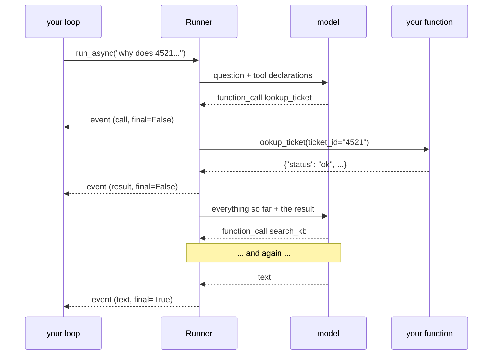

# 3.2 — The loop you no longer write

## One-line answer

One user message now produces **several model calls** — ask, call a tool, ask again with the result —
and ADK's runtime drives that loop, which is why Day 7's events stop being an academic subject and
start being the only way to see what happened.

---

## The story

The old way at a bank branch: one queue, and everybody watching each other. When somebody left a
counter, the next person went, and if two people moved at once there was a small negotiation. Anybody
stepping away to fill in a form lost their place and had to argue about it.

It worked, and the work of making it work was distributed across everybody in the room. Every person
was, part-time, a queue manager.

Then a machine appeared by the door printing tokens, and a screen above the counters calling numbers.

Nobody manages the queue now. You take a token, you sit down, you look up when the screen changes.
The negotiation is gone, the arguing is gone, and — this is the part people notice second — **you can
no longer see the queue.** Before, you could look at the line and know you were seventh. Now you have
a number and a screen, and if the screen is broken you have no idea what is happening at all.

The mechanism got better and the *visibility* moved. It did not disappear; it moved onto the screen,
and the screen became something you have to know how to read.

Day 3's loop was the room full of people watching each other. ADK's runtime is the token machine.
Day 7's events are the screen.

---

## The idea in plain language

On [Day 3, part 4.1](../../../day-03-loop-hand-rolled/parts/04-running-the-loop/4.1-assembling-the-loop.md)
you wrote the loop: ask the model, look at what it said, call a tool if it asked for one, append the
result, ask again. A `for` with a budget, and every iteration visible in your own code.

Today that loop is inside `run_async`. **You do not write it and you cannot see it directly.** What
you can see is what it emits — events — and this is where
[Day 7](../../../day-07-events-and-streaming/LESSON.md) stops being preparation.

The shape of one turn with a tool, in events:

| Event | `author` | what it carries | `is_final_response()` |
| --- | --- | --- | --- |
| 1 | `user` | the question | not yielded ([Day 8, 2.2](../../../day-08-sessions-and-services/parts/02-the-run/2.2-the-complaint-book.md)) |
| 2 | `sutra_desk` | a **function call** — name and arguments | `False` |
| 3 | `sutra_desk` | a **function response** — your tool's return value | `False` |
| 4 | `sutra_desk` | the text answer | `True` |

Four events, **two model calls**, one user message. And every one of those rows is something
[Day 7, part 1.3](../../../day-07-events-and-streaming/parts/01-the-event-object/1.3-is-final-response-is-not-the-last-one.md)
told you about before you had a tool to produce it:

- events 2 and 3 answer `False` to `is_final_response()`, because a function call and a function
  response both imply something else has to happen;
- event 4 answers `True`;
- and a display loop that prints everything shows the user a function call.

**This is the day that stops being hypothetical.** `sutra/desk/run_once.py` currently keeps *the last*
final response, which has been correct since Day 5 because there was exactly one. From today there is
still exactly one — but the run now contains events that are not answers, and the guard that skips
them is doing real work for the first time.

The second thing that changes, and it is the one with a bill attached: **one turn is now several
model calls.** Day 9's benchmark counted requests per run assuming one call per turn; a tool-using
agent breaks that assumption immediately. On a twenty-a-day free tier, a triage that reads a ticket
and then searches the knowledge base is **three** requests, not one.

---

## Why Sutra needs it

**[3.3](3.3-the-brakes-still-matter.md)** is the direct consequence: a loop you do not control needs a
ceiling you do.

**Day 13** puts callbacks around each model call and each tool call — which is to say, around the
edges of this loop. Knowing the loop's shape is knowing where the four hooks go.

**Day 24** is quota accounting, and the number it counts is model calls. Today is the day model calls
and user turns stop being the same number.

**Day 22**'s structured logging writes a line per event. With one tool, a turn produces four; with a
research agent, dozens. The `describe()` function from
[Day 7, part 1.5](../../../day-07-events-and-streaming/parts/01-the-event-object/1.5-which-run-which-agent-which-branch.md)
is about to earn its keep.

---

## The mechanism

The loop, watched. This is today's one live demo and it **costs two requests** — the run makes two
model calls, which is the finding:

```python
# lab/watch_the_loop.py - one question, several model calls. 2 requests.
import asyncio
import sys

from google.adk.agents import LlmAgent
from google.adk.runners import Runner
from google.adk.sessions import InMemorySessionService
from google.genai import types

from sutra.config import load_env, require_free_tier
from sutra.desk.events import describe
from sutra.desk.tools import lookup_ticket, search_kb

QUESTION = "Why does ticket 4521 keep logging people out?"


async def main() -> None:
    load_env()
    require_free_tier()

    agent = LlmAgent(
        name="sutra_desk",
        model="gemini-3.7-flash",
        instruction=(
            "You triage support tickets. Read the ticket before diagnosing it, then "
            "search the knowledge base using the symptom words from the ticket body."
        ),
        tools=[lookup_ticket, search_kb],
    )
    service = InMemorySessionService()
    session = await service.create_session(app_name="sutra", user_id="local")
    runner = Runner(agent=agent, app_name="sutra", session_service=service)

    calls = 0
    async for event in runner.run_async(
        user_id="local",
        session_id=session.id,
        new_message=types.Content(role="user", parts=[types.Part(text=QUESTION)]),
    ):
        print(describe(event), file=sys.stderr)
        for call in event.get_function_calls():
            calls += 1
            print(f"        -> {call.name}({dict(call.args)})", file=sys.stderr)
        for response in event.get_function_responses():
            print(f"        <- {response.name} {dict(response.response)}", file=sys.stderr)
        if event.is_final_response() and event.content and event.content.parts:
            print("".join(p.text or "" for p in event.content.parts))

    stored = await service.get_session(app_name="sutra", user_id="local", session_id=session.id)
    print(f"\nevents in the session : {len(stored.events)}", file=sys.stderr)
    print(f"tool calls made       : {calls}", file=sys.stderr)


asyncio.run(main())
```

**Line by line:**

- `from sutra.desk.tools import lookup_ticket, search_kb` — the module
  [5.1](../05-wiring-sutra/5.1-two-tools-ported.md) creates. Write that first; this script does not
  run without it.
- `tools=[lookup_ticket, search_kb]` — **two** tools, not one, deliberately. With one tool there is no
  choosing and the interesting behaviour — the model picking between two similar-sounding functions —
  never happens. That choice is what
  [1.2](../01-the-form-fills-itself/1.2-the-docstring-is-the-description.md)'s *when not to use this*
  sentence exists for.
- The instruction naming the order — *read the ticket, then search* — because without it the model may
  reasonably do only one of the two, and this script is trying to produce a multi-call turn.
- `describe(event)` from
  [Day 7, part 1.5](../../../day-07-events-and-streaming/parts/01-the-event-object/1.5-which-run-which-agent-which-branch.md)
  — reused unchanged, and this is the first day its `call` and `result` labels have anything to label.
- `event.get_function_calls()` and `get_function_responses()` — the two helpers from
  [Day 7, part 1.3](../../../day-07-events-and-streaming/parts/01-the-event-object/1.3-is-final-response-is-not-the-last-one.md).
  Printing the **arguments** matters: that is the model's schema-filling from
  [1.3](../01-the-form-fills-itself/1.3-type-hints-are-the-schema.md), observed rather than assumed.
- `dict(call.args)` — `args` is a mapping-like object and printing it raw is unreadable; `dict()`
  renders it as something you can compare against your schema.
- `calls` counted and reported — because "several model calls" is a claim and a number is not.
- Everything diagnostic on **stderr**, the answer on stdout — the split from
  [Day 7, part 2.2](../../../day-07-events-and-streaming/parts/02-the-stream/2.2-the-partial-flag.md).

```text
TODO(me): run it and paste your own output, from
    uv run python days/day-10-function-tools/lab/watch_the_loop.py 2>&1 >/dev/null
This document prints no transcript it did not produce (Principle 10). What you are looking for:
at least one `call` line and one `result` line with final=False between the question and the answer,
and an events count larger than the two you would have got yesterday.

Then answer the question the trace is for: how many model calls did one user message cost? Write the
number down - Day 24's budget starts from it.
```

The **shape** you are looking for, which you can check against your own output:

```text
run-a1b2  user         text    final=True  'Why does ticket 4521 keep logging people out?'
run-a1b2  sutra_desk   call    final=False ''
        -> lookup_ticket({'ticket_id': '4521'})
run-a1b2  sutra_desk   result  final=False ''
        <- lookup_ticket {'status': 'ok', 'ticket_id': '4521', ...}
run-a1b2  sutra_desk   call    final=False ''
        -> search_kb({'query': 'keeps getting logged out'})
run-a1b2  sutra_desk   result  final=False ''
        <- search_kb {'status': 'ok', 'article': 'KB-104', ...}
run-a1b2  sutra_desk   text    final=True  'Ticket 4521 is a known issue...'
```

**One `invocation_id` down the whole column** — one run, from
[Day 8, part 2.1](../../../day-08-sessions-and-services/parts/02-the-run/2.1-one-dish-from-one-recipe.md).
Three model calls: one to decide to look up the ticket, one to decide to search, one to write the
answer. Four events that are not the answer, and one that is.



Compare that with
[Day 4, part 3.2](../../../day-04-tools-by-hand/parts/03-rebuilding-the-loop/3.2-the-loop-that-shrank.md)'s
diagram. It is the same picture. The only difference is which box you wrote.

---

## When it breaks

**💥 The function call printed to the user.**

```text
Ticket 4521 is a known issue...
{'ticket_id': '4521'}
```

A display loop that prints every event's content, rather than filtering on
`is_final_response()`, shows the user the model's internal request. It looks like the assistant
babbling JSON. This is
[Day 7, part 1.3](../../../day-07-events-and-streaming/parts/01-the-event-object/1.3-is-final-response-is-not-the-last-one.md)'s
warning, arriving on the first day it can.

**💥 Three requests where you budgeted one.**

```text
429 RESOURCE_EXHAUSTED
```

Nothing in the code changed except adding tools, and your daily quota now empties three times faster.
On Gemini's twenty a day that is six triages instead of twenty. **Adding a tool is a budget change**,
and it is one that never appears in a diff as a number.

**💥 The tool that was never called.**

No error. The model read your two descriptions, decided neither applied, and answered from what it
knew — which is exactly what
[Day 6's failure lab](../../../day-06-instructions-and-personas/parts/06-failure-lab/6.1-the-handbook-that-promised-equipment.md)
was about, now with real tools present. The trace shows zero `call` events, which is the diagnosis:
the problem is in the descriptions or the instruction, not in the wiring.

---

## In production

**What a professional writes instead of the teaching version** is a per-run summary line: the run id,
the number of model calls, the tools called in order, and the elapsed time. One line, written once
per run, and it answers most operational questions about a tool-using agent without anybody opening a
trace. It is also the input to Day 24's budget, so writing it now costs nothing later.

**What degrades at scale** is the number of round trips. Each tool call is a full model call carrying
the whole conversation so far — including every previous tool result — so a turn with four tool calls
sends the growing context five times. That is
[Day 8, part 2.3](../../../day-08-sessions-and-services/parts/02-the-run/2.3-a-journey-and-a-pass.md)'s
quadratic, arriving inside a single turn instead of across a conversation, and it is why a chatty
agent gets expensive faster than the call count suggests.

**The failure that only shows with real traffic** is the tool-calling loop that oscillates. The model
calls `search_kb`, gets `not_found`, rephrases slightly, calls it again, gets `not_found` again. Each
step is individually reasonable. On your test tickets the search always hits, so you never see it; on
real tickets it misses, and the loop can run until something stops it. What stops it is
[3.3](3.3-the-brakes-still-matter.md), and this is the failure it exists for.

**The review comment a senior engineer leaves:** *"Adding these two tools triples our per-turn model
calls and nothing in the PR says so. Put the call count in the run summary line, and check what
happens when `search_kb` returns `not_found` twice — I want to know we stop rather than rephrase
forever."*

**The interview question:** *"what happens between a user's question and the answer, in a tool-using
agent?"* The answer that shows you have watched one: "Several model calls, not one. The model is sent
the question plus the tool declarations; it replies with a function call rather than text; the runtime
runs your function and appends the result; and the model is called again with everything so far. That
repeats until it replies with text instead of a call. Two consequences people miss. The intermediate
events aren't answers — a display loop has to filter, or the user sees the model's internal function
calls — and one user turn is now three or four model calls, so a quota budgeted per turn is wrong the
day you add a tool. And each of those calls carries the whole conversation including previous tool
results, so the cost grows faster than the call count."

---

## Check yourself

```bash
uv run python days/day-10-function-tools/lab/watch_the_loop.py
uv run python days/day-10-function-tools/lab/watch_the_loop.py 2>&1 >/dev/null
```

The second form shows only the trace. Count the `call` lines.

**Answer out loud, without scrolling up:**

> Describe the four kinds of event one tool-using turn produces and say which answer `True` to
> `is_final_response()`. Then say how many model calls one user message cost you, and what that does
> to a quota budgeted per turn.

---

**Next:** [3.3 — The brakes still matter](3.3-the-brakes-still-matter.md)
