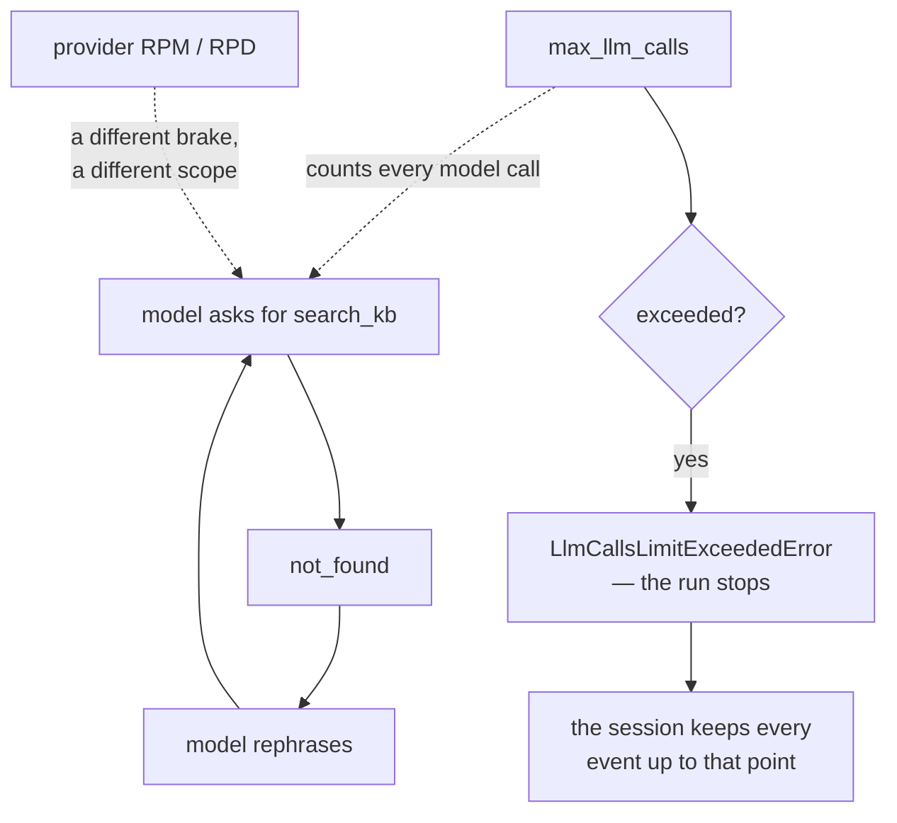

# 3.3 — The brakes still matter

## One-line answer

Day 3's step budget did not become unnecessary when ADK took the loop — it became
`RunConfig.max_llm_calls`, and today is the first day Sutra can actually loop, so today is the day the
default of 500 stops being a number and becomes a decision.

---

## The story

You call somebody, the call connects, and the phone goes into your pocket without ending it.

Nothing dramatic happens. There is no noise, no warning, no screen you would have looked at. The call
sits there, connected, doing nothing anybody wants, for as long as the other side stays on the line
or the battery lasts.

What ends it is never attention. It is either the other person hanging up, or the phone doing
something automatic, or the battery. **Nobody notices a thing that is quietly continuing** — noticing
requires an interruption, and a stuck call is the absence of one.

The insight is not "be careful with your phone". It is that **some failures have no symptom until
they have a large symptom**, and for those the only defence is a limit that fires without anybody
watching.

Until today, Sutra could not loop. It had no tools, so a turn was one model call and then it was over.
From today it can, and the thing that will stop it is a number nobody has looked at.

---

## The idea in plain language

[Day 3, part 5.1](../../../day-03-loop-hand-rolled/parts/05-containment/5.1-the-step-budget.md) had
you write a step budget into your own loop, because a think→act→observe loop with no ceiling can run
until the quota is gone.

[Day 7, part 4.1](../../../day-07-events-and-streaming/parts/04-the-brakes/4.1-the-meter-that-cuts-off.md)
introduced ADK's version — `RunConfig.max_llm_calls`, default **500**, per run, raising
`LlmCallsLimitExceededError` when exceeded — and said, honestly, that it could not be demonstrated
against Sutra because Sutra had no tools and therefore could not loop.

Today it can. The brake is the same; the risk is new.

**How a tool-using agent loops.** Not by a bug in ADK. By a perfectly reasonable model making a
perfectly reasonable decision several times:

- it calls `search_kb`, gets `{"status": "not_found"}`, decides to rephrase, calls it again;
- it calls `lookup_ticket`, gets a ticket, decides the symptom is unclear, looks it up again;
- two tools whose descriptions overlap, and it alternates between them looking for a better answer.

Every step is defensible in isolation. That is the property that makes it hard to prevent by
prompting: there is no single bad decision to forbid.

**Three numbers, and they are not the same brake.** This is the part worth getting straight, because
they are easy to conflate and they protect against different things:

| Limit | Scope | Protects against |
| --- | --- | --- |
| `max_llm_calls` (default 500) | one run | a runaway loop inside a single turn |
| a provider's RPM / RPD | your account | everything, across all runs, per window |
| Day 70's Quota-Router | across providers | one lane exhausting while others have headroom |

`max_llm_calls` is a **blast-radius** limit, not a budget — Principle 13, *containment before
capability*. It does not stop you spending your daily quota across many runs; it stops one run
spending it alone.

**And the default is not a decision.** Five hundred model calls in one triage is not a workload; it
is a malfunction that ran for a long time first. On a twenty-a-day free tier the daily quota is gone
after twenty, so the default would never fire — the *provider* would stop you, at the cost of your
whole day.

Which gives the rule this part exists for: **set it just above your real workload, so hitting it is an
alarm rather than a backstop.** Sutra's triage path reads a ticket and searches the knowledge base —
three model calls in the good case, four or five if the model checks something twice. A limit of
**eight** is generous and diagnostic. Hitting eight means something is wrong, and you find out on the
ticket it happened on.

---

## Why Sutra needs it

**Today**: this is the first day Sutra can loop at all, and the brake has to be set before the
capability ships, not after it misbehaves. That ordering is Principle 13 and it is the reason this
part is in Day 10 rather than in Day 24.

**Day 16** adds code execution and search grounding — tools that do more than read a dictionary — and
SEC-01's sandboxing concept arrives with them. A call ceiling is one wall of that box.

**Day 24** is quota accounting in RPM and RPD, the *other* two rows of the table above.

**Day 70**'s Quota-Router is the third row, and it needs an honest per-run count to route on.

**Day 79 onwards** is evals, where a run that hit the limit is a data point rather than a crash —
provided it is counted as one.

---

## The mechanism

Two halves. First, the limit set where Sutra will actually use it — free, because setting a number
costs nothing:

```python
# sutra/desk/run_once.py - the ceiling, chosen rather than defaulted (Day 10, part 3.3).
from google.adk.agents.run_config import RunConfig

# Sutra's triage path: one call to read the ticket, one to search, one to answer.
# Eight is generous and diagnostic - hitting it means something is looping, and we
# find out on the ticket it happened on rather than after 500 calls. (Day 10, 3.3)
DESK_RUN_CONFIG = RunConfig(max_llm_calls=8)
```

**Line by line:**

- `RunConfig(max_llm_calls=8)` as a **module constant** with a name — so it is imported rather than
  retyped, and so a reviewer sees one number rather than a literal in four call sites.
- The comment stating the arithmetic — *one to read, one to search, one to answer* — because a limit
  without its reasoning is a limit somebody will raise the first time it fires. The number is
  defensible only if the reasoning travels with it.
- **Eight rather than three.** Not the exact workload: a model that legitimately checks something
  twice would trip a limit of three, and a brake that fires on correct behaviour gets disabled. The
  gap between the workload and the limit is deliberate.
- Not `0` and not `500`. `0` disables it entirely with only a log warning
  ([Day 7, part 4.1](../../../day-07-events-and-streaming/parts/04-the-brakes/4.1-the-meter-that-cuts-off.md)),
  and `500` is a number nobody chose.

Then, passed to the run — one argument, from
[Day 7, part 2.2](../../../day-07-events-and-streaming/parts/02-the-stream/2.2-the-partial-flag.md)'s
per-call `RunConfig`:

```python
# inside say(), in sutra/desk/run_once.py
async for event in runner.run_async(
    user_id=USER_ID,
    session_id=session_id,
    new_message=message,
    run_config=DESK_RUN_CONFIG,
):
    ...
```

**Line by line:**

- `run_config=DESK_RUN_CONFIG` — **per call**, not on the runner. Attaching it to the runner is the
  mistake [Day 7, part 2.2](../../../day-07-events-and-streaming/parts/02-the-stream/2.2-the-partial-flag.md)
  documented: `Runner` accepts arbitrary attributes and silently ignores them.
- The rest of the loop unchanged — this is a one-argument change, which is the point. Containment
  should be cheap to add or it will not be added.

Second half: watch it fire, **for free**, using a tool that always misses so the model has a reason to
keep trying. This costs quota only if you let it run — which is why the limit is set to three:

```python
# lab/runaway.py - a tool that never finds anything, and the brake. Up to 3 requests.
import asyncio
import sys

from google.adk.agents import LlmAgent
from google.adk.agents.invocation_context import LlmCallsLimitExceededError
from google.adk.agents.run_config import RunConfig
from google.adk.runners import Runner
from google.adk.sessions import InMemorySessionService
from google.genai import types

from sutra.config import load_env, require_free_tier
from sutra.desk.events import describe


def search_kb(query: str) -> dict:
    """Search the knowledge base for a known issue matching a symptom.

    Args:
        query: Symptom words taken from the ticket.

    Returns:
        status 'not_found' with the query, when nothing matches.
    """
    return {"status": "not_found", "query": query}


async def main() -> None:
    load_env()
    require_free_tier()

    agent = LlmAgent(
        name="sutra_desk",
        model="gemini-3.7-flash",
        instruction="You triage tickets. Search the knowledge base until you find the cause.",
        tools=[search_kb],
    )
    service = InMemorySessionService()
    session = await service.create_session(app_name="sutra", user_id="local")
    runner = Runner(agent=agent, app_name="sutra", session_service=service)

    try:
        async for event in runner.run_async(
            user_id="local",
            session_id=session.id,
            new_message=types.Content(
                role="user", parts=[types.Part(text="Users are logged out at random. Why?")]
            ),
            run_config=RunConfig(max_llm_calls=3),
        ):
            print(describe(event), file=sys.stderr)
    except LlmCallsLimitExceededError as exc:
        print(f"\nstopped: {type(exc).__name__}: {exc}", file=sys.stderr)

    stored = await service.get_session(app_name="sutra", user_id="local", session_id=session.id)
    print(f"events kept in the session: {len(stored.events)}", file=sys.stderr)


asyncio.run(main())
```

**Line by line:**

- `search_kb` that **always** returns `not_found` — a tool that cannot succeed, so the model has a
  reason to keep trying. Note it is an honest `not_found` from
  [2.3](../02-what-a-tool-returns/2.3-a-failed-tool-is-still-a-result.md), not a broken tool: the
  loop is caused by the *situation*, not by a bug.
- The instruction saying *"until you find the cause"* — a prompt that encourages persistence, which
  is exactly the kind of reasonable-sounding line that produces a loop in production. This script is
  not simulating a bug; it is reproducing a design mistake.
- `RunConfig(max_llm_calls=3)` — three, not eight, **so the demonstration is cheap**. Three model
  calls is a demonstration you can afford on a twenty-a-day tier; eight is not.
- `from google.adk.agents.invocation_context import LlmCallsLimitExceededError` — the exception's real
  home, checked rather than guessed. It is public even though the counter that raises it is not
  ([Day 7, part 4.1](../../../day-07-events-and-streaming/parts/04-the-brakes/4.1-the-meter-that-cuts-off.md)),
  which is the library telling you to catch it and not to touch the meter.
- `except LlmCallsLimitExceededError` specifically — not `Exception`. A rate limit, a bad key and a
  runaway loop are three different problems and only one of them is this.
- Reading the session afterwards — because the run raised, and the question *"what survived?"* is the
  interesting one. Everything committed before the limit is still there, exactly as
  [Day 7, part 3.2](../../../day-07-events-and-streaming/parts/03-the-yield-contract/3.2-saved-is-not-submitted.md)
  said: **a failed run leaves a prefix, not nothing.**

```text
TODO(me): run it and paste your own output, from
    uv run python days/day-10-function-tools/lab/runaway.py 2>&1 >/dev/null
Three requests at most. This document prints no transcript it did not produce (Principle 10). What
you are looking for: repeated `call` / `result` pairs for search_kb with slightly different queries,
then the exception - and a session that still holds every event up to the moment it stopped.

If the model gives up before the third call, that is also a result: your instruction is better than
this one. Write down which line made the difference.
```



---

## When it breaks

**💥 The limit that fired.**

```text
LlmCallsLimitExceededError: Max number of llm calls limit of `8` exceeded
```

The instinct is to raise the number. **Read the events first** — they are all in the session, and the
last few will usually show the same tool being called with almost the same arguments. That is a
prompt problem or a tool-description problem, and raising the limit converts a caught malfunction
into an expensive one.

**💥 The limit that never fires because the provider gets there first.**

```text
429 RESOURCE_EXHAUSTED
```

With the default of 500 and a twenty-a-day tier, a runaway run exhausts your **whole day** long
before the framework's brake notices. You get a rate-limit error rather than a limit error, which
points you at the provider rather than at the loop. **A brake set above your provider's ceiling is
not a brake.**

**💥 The limit set on the runner instead of the call.**

```python
runner.max_llm_calls = 8
```

No error. `Runner` is an ordinary Python object and accepts the attribute; nothing reads it. The run
uses the default of 500 and you believe it is 8. Same shape as
[Day 7, part 2.2](../../../day-07-events-and-streaming/parts/02-the-stream/2.2-the-partial-flag.md)'s
`runner.run_config`, and the check is the same: pass it to `run_async`.

---

## In production

**What a professional writes instead of the teaching version** is a limit per **path**, not per
system. A triage turn and a research turn have genuinely different call counts, and one number that
accommodates the larger is not a brake for the smaller. Since `RunConfig` is per call, that costs
nothing: one constant per path, each with its arithmetic in a comment.

**What degrades at scale** is that this brake is per run and every other limit you have is per window.
One runaway run is contained. Two hundred concurrent runs each making a legitimate eight calls is
sixteen hundred calls a minute, and `max_llm_calls` will not have complained once — which is why
Addendum 02 denominates budgets in RPM and RPD and why Day 70 builds a router. **Per-run and
per-window brakes do not substitute for each other**, and a system with only one of them is
uncontained in the other direction.

**The failure that only shows with real traffic** is the loop that needs an unusual input. Your test
tickets match the knowledge base, so `search_kb` always succeeds and the model never rephrases. Real
tickets miss, and the miss is what starts the loop — so the behaviour that trips the limit is
*correlated with the tickets that were already hardest*. The alarm fires on your worst cases, which
is either exactly right or exactly wrong depending on whether anybody is watching it.

**The review comment a senior engineer leaves:** *"`max_llm_calls` is still the default here, which on
our tier means the provider's daily limit fires first and we lose the day instead of the run. Set it
from the actual path — three calls plus slack — and put the arithmetic in the comment so the next
person doesn't just raise it."*

**The interview question:** *"what stops a tool-using agent from looping forever?"* The answer that
shows you have seen one loop: "A per-run ceiling on model calls, which the framework provides and
defaults high. The important part is that it's a blast-radius limit rather than a budget — it
contains one run and does nothing about concurrency, so you still need per-provider rate accounting.
And the default is usually wrong in a specific way: if it's set above your provider's own limit, the
provider fires first and you lose the whole window instead of one run. I set it just above the real
workload so that hitting it is an alarm, and when it fires I read the events before touching the
number — a runaway is almost always the same tool called with almost the same arguments, which is a
prompt or a tool-description problem."

---

## Check yourself

```bash
uv run python days/day-10-function-tools/lab/runaway.py 2>&1 >/dev/null
grep -n "max_llm_calls" sutra/desk/run_once.py
```

**Answer out loud, without scrolling up:**

> Name the three limits and what each one's scope is. Then say why setting `max_llm_calls` just above
> your real workload is better than leaving it at the default, and what you do first when it fires.

---

**Next:** [4.1 — The tailor's receipt](../04-tool-shapes/4.1-the-tailors-receipt.md)
