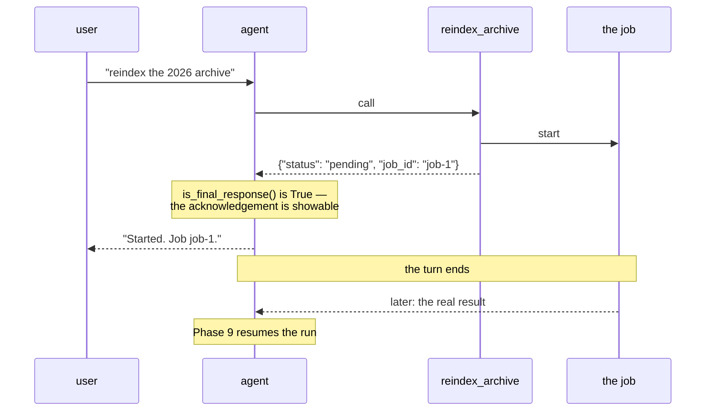

# 4.1 — 🅿️ The tailor's receipt

## One-line answer

`LongRunningFunctionTool` is for work that outlives the turn: the function returns a **pending
receipt** immediately, the agent carries on, and the real answer arrives later — and ADK marks the
tool so the model knows not to ask again.

---

## The story

You leave cloth with a tailor for a shirt.

He does not stand there and stitch it. He measures you, writes on a slip of paper, tears it in half,
gives you one half and says Thursday.

That slip is not the shirt. Everybody involved knows it is not the shirt. It is worth having because
it is a **promise with a handle on it**: it says something was started, it says roughly when, and it
gives you a way to ask about it later without re-explaining who you are.

And notice the thing that would go wrong without it. If he had simply said "come back Thursday" with
no slip, you might come back on Thursday and find a busy shop and a man who does not remember you.
Or — worse, and more relevant — **you might come back on Wednesday and describe the shirt again, and
he might start a second one.**

The slip prevents the second shirt. That is most of what it is for.

---

## The idea in plain language

🅿️ **This part is parked**: awareness-level, deliberately not built today. Sutra has no long-running
work yet. It gets built when there is some — the nightly re-index on **Day 73**, and the
human-approval pauses of **Phase 9** — and what is worth having now is the shape and the reason.

Every tool you have written so far is **synchronous** in the only sense that matters here: the
runtime calls your function, waits, gets a value, and hands it to the model. The whole thing happens
inside one turn.

Some work does not fit in a turn. Re-indexing an archive. Sending something for a human to approve.
Kicking off a job on another system. The pattern for all of them is the same, and it is the tailor's:

1. Your function **starts** the work and returns immediately with a **pending** result carrying a
   handle — a job id.
2. The agent sees that result, tells the user something has been started, and the turn ends.
3. Later, the real result arrives and the agent is resumed.

ADK's marker for this is a wrapper:

> `LongRunningFunctionTool(reindex_archive)`

It is a subclass of `FunctionTool` — nothing about the declaration generation changes — and it does
two things.

**It sets `is_long_running = True`** on the tool. That flag reaches the *event*: you met
`long_running_tool_ids` on
[Day 7, part 1.2](../../../day-07-events-and-streaming/parts/01-the-event-object/1.2-the-fields-that-were-renamed.md)
as one of the thirty-four fields with no obvious use, and on
[Day 7, part 1.3](../../../day-07-events-and-streaming/parts/01-the-event-object/1.3-is-final-response-is-not-the-last-one.md)
as one of the two shortcuts that make `is_final_response()` return `True`. **This is what puts it
there.** An acknowledgement of a long-running call is treated as a showable answer, because it is the
most complete thing that exists right now.

**It appends a warning to the description**, automatically. ADK adds, verbatim:

> *"NOTE: This is a long-running operation. Do not call this tool again if it has already returned
> some intermediate or pending status."*

That sentence is the slip of paper. It exists to prevent the second shirt — a model that sees a
`pending` result, decides nothing happened, and starts the job again.

And it is worth noticing **where** it lives: appended to your docstring, in the description, in the
prompt. The framework's mechanism for stopping duplicate work is *asking the model nicely*. That is
not a criticism — it is the only lever available at that layer — but it means the guarantee is a
prompt-strength guarantee, and anything that must not happen twice needs idempotency underneath as
well ([Day 8, part 1.4](../../../day-08-sessions-and-services/parts/01-the-session/1.4-minted-or-chosen.md)).

---

## Why Sutra needs it

**Day 73** is the nightly ambient job: re-index, run the evalset, post a digest. That is the first
piece of Sutra work that genuinely outlives a turn.

**Day 64** is human-in-the-loop resumption, closing ADK-76. A run that pauses for a person to approve
something is the same shape with a human in the middle, and
[4.2](4.2-are-you-sure.md) is its smaller sibling.

**Day 51** is caching, and Day 49 is retrieval — both involve index-building work that no user should
wait for.

**Phase 6** is MCP in production, where a tool call can reach a server that returns a task handle
rather than a result. MCP has an entire Tasks extension for this (`tasks/get|update|cancel`, MCP-28,
Day 36), and it is the same idea agreed between systems rather than inside one.

---

## The mechanism

The wrapper, and what it changes. **No model call, no cost:**

```python
# lab/long_running.py - the same function, two shapes.
import asyncio

from google.adk.agents import LlmAgent
from google.adk.tools import FunctionTool, LongRunningFunctionTool


def reindex_archive(scope: str) -> dict:
    """Start a full reindex of the ticket archive.

    Args:
        scope: which archive to reindex, e.g. 'tickets-2026'.

    Returns:
        status 'pending' with a job_id to ask about later.
    """
    return {"status": "pending", "job_id": "job-1"}


async def main() -> None:
    plain = FunctionTool(reindex_archive)
    patient = LongRunningFunctionTool(reindex_archive)

    print("FunctionTool.is_long_running        :", plain.is_long_running)
    print("LongRunningFunctionTool.is_long_running:", patient.is_long_running)
    print()
    print("=== the description ADK sends for the long-running one ===")
    print(patient._get_declaration().description)

    agent = LlmAgent(name="sutra_desk", model="gemini-3.7-flash", instruction="x", tools=[patient])
    resolved = (await agent.canonical_tools())[0]
    print()
    print("through an agent, still long-running:", resolved.is_long_running)


asyncio.run(main())
```

**Line by line:**

- **One function, two wrappers** — the same `reindex_archive` passed to both, so every difference in
  the output comes from the wrapper and not from the function.
- `return {"status": "pending", "job_id": "job-1"}` — the tailor's slip, in
  [2.1](../02-what-a-tool-returns/2.1-return-a-dict-with-a-status.md)'s shape. `pending` is the third
  status ADK's own guidance names alongside `success` and `error`, and this is what it is for. The
  `job_id` is the handle.
- `plain.is_long_running` printed for the ordinary tool too — because the attribute exists on both and
  is `False` on the plain one, which is more informative than it being absent.
- `patient._get_declaration().description` printed **whole** — the point of the script. You wrote the
  first two paragraphs; the third arrived on its own.
- Wrapping it in an agent and re-reading the flag — because
  [1.4](../01-the-form-fills-itself/1.4-the-wrapper-that-arrives-late.md) established that
  `canonical_tools()` re-derives things, and a reasonable worry is that a hand-built tool gets
  replaced. It does not: a `BaseTool` in the list is passed through as itself.

The output:

```text
FunctionTool.is_long_running        : False
LongRunningFunctionTool.is_long_running: True

=== the description ADK sends for the long-running one ===
Start a full reindex of the ticket archive.

Args:
    scope: which archive to reindex, e.g. 'tickets-2026'.

Returns:
    status 'pending' with a job_id to ask about later.

NOTE: This is a long-running operation. Do not call this tool again if it has already returned some intermediate or pending status.

through an agent, still long-running: True
```

The `NOTE:` line is not in the source file. ADK appended it, and it is now part of what the model
reads on every turn this tool is available — which makes it, precisely,
[1.2](../01-the-form-fills-itself/1.2-the-docstring-is-the-description.md)'s tax, spent by the
framework on your behalf for a reason you would agree with.



---

## When it breaks

**💥 The job started twice.**

No error. The model calls `reindex_archive`, gets `{"status": "pending"}`, reads it as *nothing
happened yet*, and calls it again. Two reindexes. ADK's appended `NOTE:` exists to prevent exactly
this and it is a **prompt**, not a lock — so on a model that is having a bad day, or with a
description that buried the note, it happens anyway. **Anything that must not run twice needs an
idempotency key**, which is Phase 9's subject and
[Day 8, part 1.4](../../../day-08-sessions-and-services/parts/01-the-session/1.4-minted-or-chosen.md)'s
create-then-catch pattern one level up.

**💥 The long-running tool that blocks.**

```python
def reindex_archive(scope: str) -> dict:
    do_the_whole_reindex()  # forty minutes
    return {"status": "ok"}
```

Marking a tool long-running does **not** make it asynchronous. The wrapper is a declaration about
*shape*, not an execution strategy: if your function blocks, the runtime waits, the turn does not
end, and the user watches a spinner. The function must genuinely start the work and return.

**💥 The pending result with no handle.**

```text
{"status": "pending"}
```

Honest and useless. The agent has told the user something started and has no way to ask about it
later, and neither does the user. The `job_id` is not decoration — it is the half of the slip you
keep.

---

## In production

**What a professional writes instead of the teaching version** is a pending result that a human can
act on: a job id, a rough expectation of when, and — where possible — where to look. The agent's
sentence to the user is only as good as the fields it was given, and *"I've started that, reference
job-1"* is a different customer experience from *"I've started that"*.

**What degrades at scale** is the number of outstanding jobs nobody is tracking. Every pending result
is a promise, and promises accumulate. A system that starts long-running work and has no way to
enumerate what is outstanding will eventually have jobs that failed silently and users who were told
something was happening. **The job store is not optional infrastructure** — it is the thing that makes
the pattern honest, and it is usually the part that gets built last.

**The failure that only shows with real traffic** is the resumption that arrives for a session that
has moved on. The job finishes twenty minutes later and the run is resumed — into a conversation where
the user has since asked about something else entirely, or into a session that no longer exists
because it was ended
([Day 8, part 2.3](../../../day-08-sessions-and-services/parts/02-the-run/2.3-a-journey-and-a-pass.md)).
Both are ordinary, and both need a decision made in advance rather than an exception handled late.

**The review comment a senior engineer leaves:** *"This returns `pending` with no job id, so we've told
the user something is happening and we can't answer 'is it done?'. And the note ADK adds is a prompt,
not a guard — if a double reindex would actually hurt, put an idempotency key on the job rather than
trusting the model to read the note."*

**The interview question:** *"how does an agent handle work that takes longer than a turn?"* The
answer that shows you have built one: "The tool starts the work and returns immediately with a pending
status and a handle — a job id — and the framework marks that tool as long-running, which does two
things: the acknowledgement counts as a showable final response so the turn can end, and the framework
appends a note to the tool's description telling the model not to call it again if it already got a
pending status. That second part is the interesting one, because it's a prompt rather than a lock: the
mechanism preventing duplicate work is asking the model nicely. So for anything where starting twice
actually matters, I'd want an idempotency key underneath as well. And the piece people leave until
last is the job store — without a way to enumerate outstanding work, every pending result is a promise
nobody can check."

---

## Check yourself

```bash
uv run python days/day-10-function-tools/lab/long_running.py
```

**Answer out loud, without scrolling up:**

> Say the two things `LongRunningFunctionTool` changes, and which of them is a prompt rather than a
> guarantee. Then say what the `job_id` is for, and what breaks without it.

---

**Next:** [4.2 — Are you sure?](4.2-are-you-sure.md)
