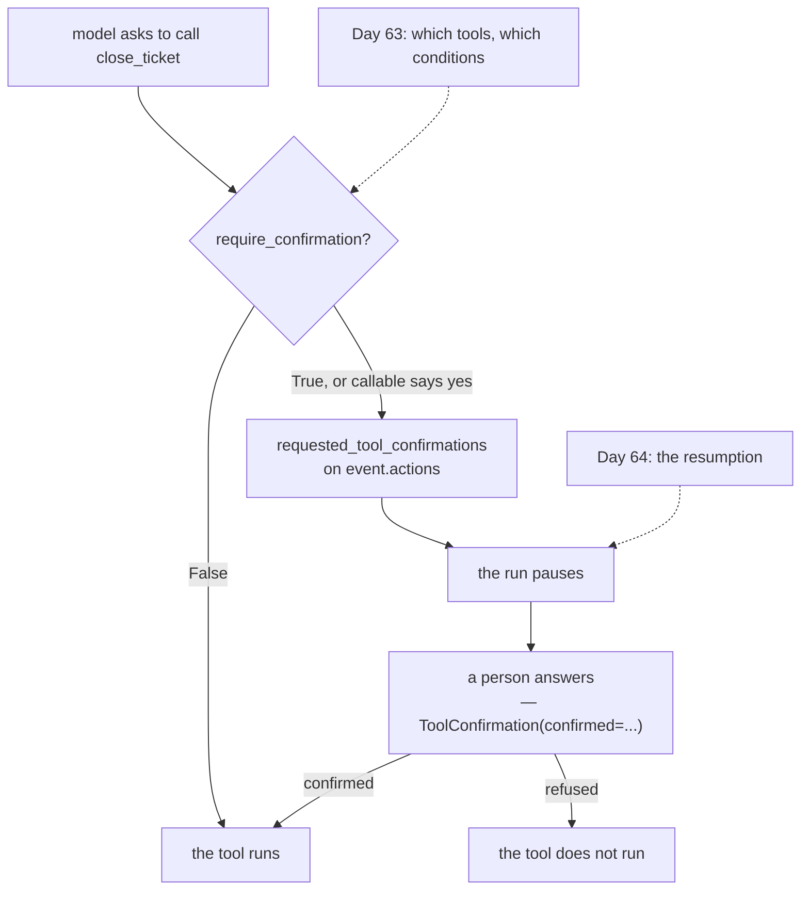

# 4.2 — 🅿️ Are you sure?

## One-line answer

`FunctionTool(fn, require_confirmation=True)` puts a person between the model's decision and the
action — the first mechanism in this curriculum for a tool that **writes** — and Principle 13 says
that mechanism arrives with the capability rather than after it.

---

## The story

You are transferring money on a banking app.

Small amount, somebody you have paid before: it just goes. Tap, done, no ceremony.

Larger amount, a new payee: the app stops. *You are sending ₹85,000 to an account you have not paid
before. Confirm the last four digits.* And you look at the screen properly for the first time in the
whole flow.

The bank did not add that screen because their transfer code is unreliable. The transfer works. They
added it because **the cost of a wrong transfer is not symmetrical with the cost of a wrong
hesitation.** A moment of friction on a large payment costs three seconds. A wrong large payment costs
somebody their money and both of you a fortnight.

And notice where the friction is placed: not on every transfer. On the ones that are **large or
unfamiliar**. A confirmation on every payment would be trained out within a week — everybody would
tap through it without reading, and it would be worse than nothing because it would look like a
safeguard.

Sutra's tools have been read-only for four days. Today they are still read-only. This part is about
the day one of them is not.

---

## The idea in plain language

🅿️ **This part is parked**: awareness-level, deliberately not built today, because Sutra has nothing
to confirm — `lookup_ticket` and `search_kb` read a dictionary. It gets built on **Day 64**, where
human-in-the-loop approval closes ADK-76, and its design is **Day 63**'s (SEC-05, approval-gate
design).

What is worth having now is the mechanism's existence and one sentence of principle, because
[5.1](../05-wiring-sutra/5.1-two-tools-ported.md) is the day Sutra grows tools at all and **Principle
13 is explicit about the ordering**: *every new power arrives together with its containment story.*

ADK's mechanism is an argument on the tool:

> `FunctionTool(close_ticket, require_confirmation=True)`

It takes a boolean **or a callable**, and the callable is the interesting half: it receives the same
arguments the tool was called with, so *whether* confirmation is needed can depend on *what is being
done*. That is the bank's asymmetry, available directly:

```text
require_confirmation=lambda amount, **_: amount > 10_000
```

When confirmation is required, the tool does not run. Instead the run produces a request, carried on
`event.actions.requested_tool_confirmations` — one of the `EventActions` fields you listed on
[Day 7, part 1.2](../../../day-07-events-and-streaming/parts/01-the-event-object/1.2-the-fields-that-were-renamed.md)
and had no use for. A `ToolConfirmation` carries a `hint` explaining what is being asked, a
`confirmed` boolean, and an optional `payload` for anything extra the person has to supply.

Then the run pauses, and something outside it — a UI, a Slack message, a human — answers. Which is
[4.1](4.1-the-tailors-receipt.md)'s shape exactly, with a person where the job was, and it is why the
two parts are neighbours.

**The principle underneath is worth stating separately from the API**, because the API will change and
this will not:

> **A tool that changes something in the world is a different kind of object from a tool that reads.**

Read-only tools fail by being wrong, and the cost is a bad answer. Writing tools fail by being wrong
*and doing it*, and the cost is a closed ticket, a sent email, a deleted record. The blast radius is
not comparable, and the mechanisms are not interchangeable.

Two supporting habits, neither of which is ADK-specific:

**Separate the read from the write.** `lookup_ticket` and `close_ticket` should be two tools even when
one function could do both, because only one of them needs a gate.

**Confirm the unusual, not the routine.** A gate on every call is a gate people click through. This is
the bank's design and it is the part most often got wrong — the callable form exists precisely so
that "unusual" can be defined in code.

---

## Why Sutra needs it

**Day 63** is approval-gate design, closing SEC-05, and **Day 64** builds the resumption that makes it
work, closing ADK-76.

**Phase 9's gate** is stated in the plan as *"kill it mid-run; it resumes; a human approved the
write."* That sentence is this mechanism.

**Day 16** adds code execution — the first tool whose blast radius is not a ticket but a machine — and
SEC-01's sandboxing arrives with it.

**Sutra's product description** in the plan's §3 says tools that *write* anything sit behind approval
gates with human-in-the-loop resumption. Today is the day the first tools exist; the day the first
write exists, this has to be there already.

---

## The mechanism

The flag, and the callable. **No model call, no cost:**

```python
# lab/confirmation.py - a gate on a tool, and a gate that depends on the arguments.
import asyncio

from google.adk.tools import FunctionTool


def close_ticket(ticket_id: str) -> dict:
    """Close a support ticket. This cannot be undone.

    Args:
        ticket_id: the id of the ticket to close.
    """
    return {"status": "ok", "ticket_id": ticket_id}


def refund(ticket_id: str, amount: int) -> dict:
    """Issue a refund against a ticket.

    Args:
        ticket_id: the id.
        amount: the amount in rupees.
    """
    return {"status": "ok", "ticket_id": ticket_id, "amount": amount}


async def main() -> None:
    ungated = FunctionTool(close_ticket)
    gated = FunctionTool(close_ticket, require_confirmation=True)
    conditional = FunctionTool(refund, require_confirmation=lambda amount, **_: amount > 10_000)

    args = {"ticket_id": "4521"}
    print(
        "ungated close_ticket   :",
        await ungated.check_require_confirmation(args=args, tool_context=None),
    )
    print(
        "gated close_ticket     :",
        await gated.check_require_confirmation(args=args, tool_context=None),
    )
    print()
    for amount in (500, 85_000):
        needs = await conditional.check_require_confirmation(
            args={"ticket_id": "4521", "amount": amount}, tool_context=None
        )
        print(f"refund of {amount:>6}      : confirmation required = {needs}")


asyncio.run(main())
```

**Line by line:**

- Two functions, `close_ticket` and `refund` — both **writes**, and both invented for this part.
  Neither goes into `sutra/`: Sutra has no write tools and adding one to demonstrate a gate would be
  adding the capability before the day that designs it.
- *"This cannot be undone."* in the docstring — because the description is what the model reads, and a
  model that knows an action is irreversible behaves more carefully. The gate is the guarantee; the
  sentence is the first line of defence.
- `FunctionTool(close_ticket)` and `FunctionTool(close_ticket, require_confirmation=True)` — the same
  function twice, so the flag is the only variable.
- `require_confirmation=lambda amount, **_: amount > 10_000` — the callable form. It receives the
  **tool's own arguments**, which is what makes conditional gating possible.
- `**_` in the lambda — accepting and ignoring the other arguments. Without it the lambda would need
  every parameter `refund` takes, and would break the day somebody adds one. The underscore says the
  ignoring is deliberate.
- `10_000` with an underscore separator — Python's readable-number syntax, worth using anywhere a
  threshold appears, because `10000` and `100000` differ by one character on a screen.
- `check_require_confirmation(args=..., tool_context=None)` — the tool's own method, awaited. Calling
  it directly is a lab move: in a real run the runtime calls it before deciding whether to execute.
- `tool_context=None` — legal here because neither the boolean nor this lambda touches the context.
  A gate that needed to look at session state — *"has this user already approved today?"* — would take
  one, and that is Day 63's territory.

The output:

```text
ungated close_ticket   : False
gated close_ticket     : True

refund of    500      : confirmation required = False
refund of  85000      : confirmation required = True
```

The last two lines are the bank. Same tool, same code path, and the gate appears only on the amount
that would hurt.



---

## When it breaks

**💥 The gate on everything.**

Not an error — a design failure with a human cause. Confirm every tool call and the person confirming
stops reading within a week, at which point you have added latency and removed nothing. The
confirmation that gets read is the one that is rare.

**💥 The read and the write in one tool.**

```python
def ticket(ticket_id: str, close: bool = False) -> dict: ...
```

One tool, two blast radii, and a single `require_confirmation` flag that has to cover both. Set it
`True` and every read is gated; set it `False` and every close is not. **The gate is per tool, so the
tools have to be split along the same line as the risk.**

**💥 The callable that assumed a parameter.**

```python
require_confirmation = lambda amount: amount > 10_000
```

```text
TypeError: <lambda>() got an unexpected keyword argument 'ticket_id'
```

The callable is invoked with the tool's arguments, all of them. Without `**_` it breaks the moment
the tool has more than one parameter — which it already does.

---

## In production

**What a professional writes instead of the teaching version** is a written list: which tools write,
what each one's blast radius is, and what condition triggers a confirmation. Not because the list is
clever, but because *"which of our tools can change something?"* is a question somebody will ask
during an incident, and the answer should not require reading the code.

**What degrades at scale** is confirmation fatigue, and it degrades in a way that looks like success:
the confirmations are all being answered, quickly, by somebody who has stopped reading them. The
metric that catches it is the **refusal rate**. A gate that is never refused is not a gate, and if
nobody has said no in three months, either the threshold is wrong or nobody is looking.

**The failure that only shows with real traffic** is the confirmation that never reached a person. The
run pauses correctly, the request is emitted correctly, and the surface that was supposed to show it
— a UI, a Slack message — is broken, or nobody is on shift, or it went to somebody who left. The agent
is not wrong and the work is not done, silently, and the user is told something is in progress. Any
approval mechanism needs a **timeout and an escalation**, and that is a design decision rather than a
framework feature.

**The review comment a senior engineer leaves:** *"`close_ticket` has no confirmation and it's
irreversible. Either gate it or tell me why the model deciding alone is acceptable — and if we do
gate it, what happens when nobody answers? Right now that's a run that pauses forever."*

**The interview question:** *"how do you stop an agent from doing something destructive?"* The answer
that shows you have thought past the API: "Put a person between the decision and the action, on the
tools that write — the framework has a per-tool confirmation flag, and usefully it takes a callable
that receives the tool's arguments, so you can gate on the *size* of the action rather than on every
call. That conditional part matters more than it sounds: a gate on everything gets clicked through
within a week, so the confirmation that works is the rare one. Two things I'd design rather than
configure. Read tools and write tools have to be separate functions, because the gate is per tool and
it has to line up with the risk. And an approval that nobody answers is a run that pauses forever, so
it needs a timeout and an escalation — the framework will pause it correctly and has no opinion about
whether a human is on shift."

---

## Check yourself

```bash
uv run python days/day-10-function-tools/lab/confirmation.py
grep -rn "def " sutra/desk/tools.py
```

The second command should show only functions that **read**. If it ever shows one that writes, this
part stops being parked.

**Answer out loud, without scrolling up:**

> Say what `require_confirmation` accepts besides a boolean, and why that form matters more than the
> boolean. Then say why a gate on every tool call is worse than no gate at all.

---

**Next:** [5.1 — Two tools, ported](../05-wiring-sutra/5.1-two-tools-ported.md)
