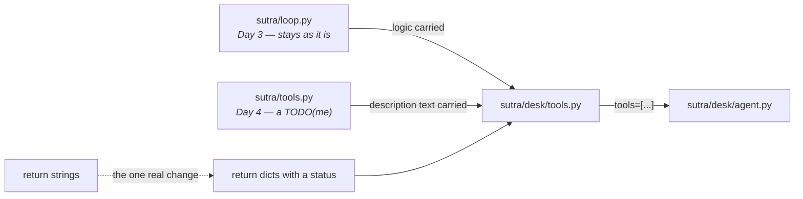

# 5.1 — Two tools, ported

## One-line answer

Sutra's two functions move from `sutra/loop.py` into `sutra/desk/tools.py`, keeping Day 3's logic and
Day 4's descriptions, and changing exactly one thing: **they return dictionaries with a status instead
of sentences.**

---

## The story

An old diary is falling apart and you buy a new one, and now you have to move things across.

You do not copy it page for page. You sit with both open and make decisions. The phone numbers come
across. The address of a shop that closed does not. Half the birthdays come across and half of them
you realise you have not needed in nine years. There is a note in the margin from a conversation you
cannot reconstruct, and it goes, because a note nobody can read is not information.

And a few things get **improved** on the way. The number written as *"Ravi (tyres)"* becomes *"Ravi —
tyre shop, near the school"*, because you have been meaning to write that properly for years and this
is the moment where it costs nothing.

The rule that makes the copying quick: **carry the thing, decide about the wrapper.** The phone number
is the thing. How you wrote it down is the wrapper, and the wrapper is allowed to change.

`sutra/loop.py` is the old diary.

---

## The idea in plain language

Two functions move today, and it is worth being precise about what changes, because most of it does
not.

**`lookup_ticket` and `search_kb`** currently live in `sutra/loop.py`, written on
[Day 3](../../../day-03-loop-hand-rolled/parts/02-tools-and-dispatch/2.1-tools-are-plain-functions.md).
They work. Their **logic** is not in question and is not being rewritten.

**Their descriptions** currently live in `sutra/tools.py`, written by hand on
[Day 4](../../../day-04-tools-by-hand/parts/01-the-schema/1.2-declaring-a-tool.md). That file exists
only to describe the two functions, and after today ADK generates the description from the docstring
([1.1](../01-the-form-fills-itself/1.1-the-declaration-you-no-longer-write.md)). The **text** is
carried across; the **file** is a decision, and it is one of today's `TODO(me)` items.

**What genuinely changes** is one thing: the return values. Day 3's versions return **strings** — for
hits and for misses. [2.1](../02-what-a-tool-returns/2.1-return-a-dict-with-a-status.md) and
[2.3](../02-what-a-tool-returns/2.3-a-failed-tool-is-still-a-result.md) argued for dictionaries with
a status, and this is where that is paid for.

**Where they go.** A new module, `sutra/desk/tools.py`, and the location is a decision rather than
tidiness:

- **not** in `sutra/loop.py`, because that is Day 3's hand-rolled loop and it stays as it is —
  Principle 4 keeps the comparison honest, and a file you keep editing is not a comparison any more;
- **not** in `sutra/desk/agent.py`, because the agent module is a *configuration* and mixing
  implementation into it makes both harder to read;
- in a module whose functions are **written to be tools**, for
  [1.1](../01-the-form-fills-itself/1.1-the-declaration-you-no-longer-write.md)'s reason: their names
  and docstrings are model-facing contracts now, and that is easier to remember when they live
  somewhere that says so.

**The data.** `TICKETS` and `KB` are in `sutra/loop.py` as module constants. They move too — the same
synthetic data, Principle 9's *never real personal or employer data* unchanged — and
[2.1](../02-what-a-tool-returns/2.1-return-a-dict-with-a-status.md) argued that `TICKETS` should hold
**records rather than strings**, because you cannot return named fields from a blob of text. That is
the second real change, and it is small.

---

## Why Sutra needs it

**Today**: without this module there are no tools, and
[5.2](5.2-the-first-aid-box-with-bandages.md) — the day's actual point — cannot happen.

**Day 11** adds `ToolContext` to these same two functions, so their signatures change again tomorrow.

**Day 16** adds tools that reach outside the process, and this module is where they go.

**Day 32 onwards** puts Sutra's data behind MCP servers, at which point these two functions stop
reading local dictionaries and start calling a server — and if the return shape has been stable, that
is a swap rather than a rewrite.

**Day 49** replaces `search_kb`'s keyword match with real retrieval, for the same reason.

---

## The mechanism

The module, given whole. This is the day's main deliverable and it costs **nothing** to write:

```python
# sutra/desk/tools.py - Sutra's tools (Day 10, ADK-10/ADK-11).
#
# The functions are Day 3's, unchanged in logic. The descriptions are Day 4's, moved
# into the docstrings because ADK generates the declaration from them (part 1.1).
# What changed: every return value is now a dict with a status (parts 2.1, 2.3).
#
# These names and docstrings are MODEL-FACING. Editing a docstring here is a prompt
# change (part 1.2). Synthetic data only, always (Principle 9).

TICKETS: dict[str, dict[str, str]] = {
    "4521": {
        "title": "Keeps getting logged out",
        "body": "I keep getting logged out of the dashboard every few minutes. Started yesterday.",
        "plan": "Pro",
    },
    "4522": {
        "title": "CSV export empty",
        "body": "Exporting my project as CSV gives an empty file. Small projects "
        "work; the big one does not.",
        "plan": "Free",
    },
}

KB: dict[str, str] = {
    "logout": "KB-104 'Unexpected logouts': cookies set with SameSite=Strict plus "
    "an http:// dashboard URL end sessions early; fix is forcing https.",
    "export": "KB-201 'Large exports time out': exports over 10k rows hit the worker "
    "deadline and return an empty file; use the async export API.",
}


def lookup_ticket(ticket_id: str) -> dict:
    """Fetch the full text of one support ticket by its id.

    Use this first whenever the user names or implies a specific ticket, before
    offering any diagnosis. Do not use this to search for a symptom - use
    search_kb for that.

    Args:
        ticket_id: The ticket's id as it appears in the request, e.g. '4521'.

    Returns:
        status 'ok' with the ticket's title, body and plan; or status 'not_found'
        with the ticket_id that was looked up.
    """
    ticket = TICKETS.get(ticket_id.strip())
    if ticket is None:
        return {"status": "not_found", "ticket_id": ticket_id}
    return {"status": "ok", "ticket_id": ticket_id, **ticket}


def search_kb(query: str) -> dict:
    """Search the internal knowledge base for a known issue matching a symptom.

    Use this after reading a ticket, with the symptom words from the ticket body
    rather than the user's phrasing. Do not use this to look up a ticket by id -
    use lookup_ticket for that.

    Args:
        query: Symptom words taken from the ticket, e.g. 'keeps getting logged out'.

    Returns:
        status 'ok' with the matching article; or status 'not_found' with the
        query that matched nothing.
    """
    lowered = query.lower()
    for keyword, article in KB.items():
        if keyword in lowered:
            return {"status": "ok", "query": query, "article": article}
    return {"status": "not_found", "query": query}
```

**Line by line:**

- The header comment naming **what moved, from where, and what changed** — three lines that stop a
  future reader diffing this against `sutra/loop.py` and wondering which is authoritative.
- *"These names and docstrings are MODEL-FACING"* — in capitals, in the file, because
  [1.2](../01-the-form-fills-itself/1.2-the-docstring-is-the-description.md)'s failure is somebody
  improving a docstring without knowing it is a prompt.
- `TICKETS: dict[str, dict[str, str]]` — records rather than strings, which is what makes
  `{"status": "ok", **ticket}` possible. Day 3's version stored one blob per ticket and could only
  return it whole.
- `KB` unchanged from Day 3, still a keyword dictionary — because
  [2.1](../02-what-a-tool-returns/2.1-return-a-dict-with-a-status.md) is about the return shape, not
  about the search, and changing both at once would make it impossible to tell which mattered. Day 49
  changes the search.
- `"""Fetch the full text of one support ticket by its id.` — Day 4's exact first sentence, carried
  across rather than rewritten. The port should be recognisable as a port.
- *"Do not use this to search for a symptom - use search_kb for that."* — and its mirror in
  `search_kb`. **Both directions**, which Day 4 only wrote in one. Two similar tools need the sentence
  on both sides, from [1.2](../01-the-form-fills-itself/1.2-the-docstring-is-the-description.md).
- The `Returns:` blocks — new. Day 4's declaration format had nowhere to put one, and now the model is
  told what a miss looks like before it sees one.
- `ticket_id.strip()` — carried across from Day 3, which added it because a model can pass `" 4521"`.
  A small defensive line that survived because it was earned.
- `{"status": "not_found", "ticket_id": ticket_id}` — the **un-stripped** id echoed back, deliberately.
  If the model sent whitespace, the miss should say so; echoing the cleaned version would hide the
  input that caused the miss.
- `{"status": "ok", "ticket_id": ticket_id, **ticket}` — flat rather than nested, from
  [2.1](../02-what-a-tool-returns/2.1-return-a-dict-with-a-status.md). Three fields, so flat.
- `for keyword, article in KB.items()` returning on the **first** match — Day 3's behaviour, kept, and
  worth naming as a known limitation rather than a bug: two matching articles return one, arbitrarily.
  That is a `TODO(me)`.
- No `try` and no `except` anywhere. Neither function can fail — they read a dictionary — so there is
  no error path to write, and inventing one would be
  [2.3](../02-what-a-tool-returns/2.3-a-failed-tool-is-still-a-result.md)'s mistake in reverse.

And the wiring, which is one line in a file you already have:

```python
# sutra/desk/agent.py - the agent gains its tools (Day 10).
from sutra.desk.tools import lookup_ticket, search_kb

root_agent = LlmAgent(
    name="sutra_desk",
    model="gemini-3.7-flash",
    description=(
        "Triages incoming customer support tickets: explains what a ticket is "
        "about, proposes a likely cause as a hypothesis, and recommends a "
        "priority. Looks up tickets by id and searches a known-issue knowledge "
        "base. Does not handle refunds, billing or account changes."
    ),
    instruction=INSTRUCTION,
    tools=[lookup_ticket, search_kb],
)
```

**Line by line:**

- `tools=[lookup_ticket, search_kb]` — the functions, no parentheses
  ([1.1](../01-the-form-fills-itself/1.1-the-declaration-you-no-longer-write.md)).
- The `description` gaining *"Looks up tickets by id and searches a known-issue knowledge base."* —
  because [Day 6, part 3.2](../../../day-06-instructions-and-personas/parts/03-the-instruction-fields/3.2-two-fields-two-readers.md)
  established that `description` is read by **other agents** deciding whether to route here, and what
  this agent can do has just changed. It previously said *"Works only from ticket text supplied in the
  request. Does not look anything up"* — which is now false, and a false advertisement is worse than a
  thin one.
- The negative clause kept — *"Does not handle refunds, billing or account changes"* — because that is
  still true and is the clause Day 6 said everybody omits.
- `model` and `instruction` untouched. The instruction changes in
  [5.2](5.2-the-first-aid-box-with-bandages.md), for a reason that deserves its own part.



---

## When it breaks

**💥 The import that went the wrong way.**

```python
from sutra.loop import lookup_ticket  # Day 3's version
```

No error. The agent gets a working tool that returns **strings**, so every result reaches the model
as `{"result": "..."}` ([2.2](../02-what-a-tool-returns/2.2-the-bare-value-the-spec-rewrites.md)) and
every miss is a sentence. Everything works and nothing you learned today is in effect. Check the
import.

**💥 The two files that both describe `lookup_ticket`.**

`sutra/tools.py` still holds Day 4's hand-written declaration. It is not wired to anything and it
reads as though it were. A future reader — or you, in six weeks — finds two descriptions and no
indication of which is live. Delete it, or add a header saying it is a Day 4 artefact kept for
comparison. **Either is fine; leaving it undecided is not.**

**💥 The stale `description`.**

Not an error, and invisible until Phase 8. The old text said the agent *"does not look anything up"*.
It now does. A dispatcher reading that on Day 53 will route lookup work elsewhere, correctly, based on
an advertisement that stopped being true today.

---

## In production

**What a professional writes instead of the teaching version** is exactly this, plus a test that
imports the module and asserts on the tool declarations —
[1.4](../01-the-form-fills-itself/1.4-the-wrapper-that-arrives-late.md)'s check. Tool modules are the
easiest thing in an agent system to test without a model, and the last thing people get round to
testing.

**What degrades at scale** is the module. Two tools is a file. Twenty tools in one file is a file
nobody reads, and worse, it is a file where every tool's description is in the same prompt because
they were all registered together. The split that works is **by data source** — the tickets tool, the
knowledge-base tool, the billing tool — because that is also how they will eventually become separate
MCP servers on Day 32.

**The failure that only shows with real traffic** is the return-shape change that broke a consumer
nobody remembered. Once Day 13's callbacks and Day 22's logging read tool results, the shape of what
a tool returns is an interface with several readers. Renaming `article` to `kb_article` is then a
breaking change with no compiler to catch it. **Write the status vocabulary and the common field
names down once**, before there are twenty tools rather than after.

**The review comment a senior engineer leaves:** *"The `description` still says we don't look anything
up, and as of this PR we do — that's what other agents route on. And `sutra/tools.py` is now a second
description of the same two tools with nothing marking it dead; delete it in this PR rather than
leaving it for someone to find."*

**The interview question:** *"you're moving hand-rolled tool plumbing onto a framework. What actually
changes?"* The answer that shows you have done the port: "Less than you expect. The functions don't
change — the logic was never the framework's business. The descriptions move from a hand-written
declaration into the docstrings, because the framework generates the declaration from the function.
The one substantive change is the return shape: hand-rolled tools tend to return strings, because a
string is what you were pasting into a prompt, and once the framework is building the function
response you want a dictionary with a status the model can branch on. The thing I'd watch in review is
everything *around* the tools that silently became stale — in my case the agent's own description
still said it couldn't look anything up, which is the text other agents route on."

---

## Check yourself

```bash
uv run python -c "
import asyncio
from sutra.desk.agent import root_agent
print([t.__name__ for t in root_agent.tools])
print(asyncio.run(root_agent.canonical_tools())[0].name)
"
uv run python -c "from sutra.desk.tools import lookup_ticket, search_kb; print(lookup_ticket('9999')); print(search_kb('keeps getting logged out'))"
```

**Answer out loud, without scrolling up:**

> Name the one thing that genuinely changed in the port, and the two things that only moved. Then say
> why `sutra/loop.py` is left alone, and what the agent's `description` had to gain.

---

**Next:** [5.2 — The first-aid box with bandages](5.2-the-first-aid-box-with-bandages.md)
