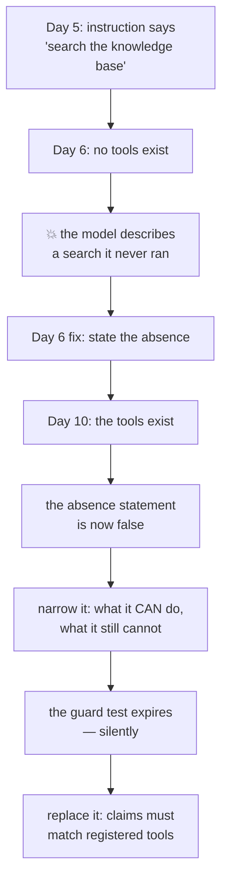

# 5.2 — The first-aid box with bandages

## One-line answer

Day 6's failure lab was an instruction promising a knowledge base that did not exist; today the
knowledge base exists, so the handbook's honesty section changes from *"you cannot look anything up"*
to something narrower and truer — and the test that enforced it stops applying.

---

## The story

There is a first-aid box on the wall of a small office. Green, with a white cross, screwed on
properly.

Somebody cuts their hand on a drawer. Everybody points at the box. It is opened and there is: an
expired tube of something, a pair of scissors, and a lot of empty compartments with little pictures
showing what should be in them.

Nobody stole the bandages. There were never any bandages. The box was bought, mounted, and never
filled, and for two years it did a very good job of looking like the answer to a question nobody had
asked yet.

The interesting damage is not the cut hand. It is that **for two years, everybody in that office
believed the problem was solved.** Nobody kept plasters in their desk. Nobody checked. The box was a
promise, and a promise is indistinguishable from a provision until the day you need it.

Now somebody buys bandages and puts them in. And on that day two things change, not one. The obvious
change is that the box works. The less obvious change is that **the notice on the wall can stop
lying** — the one that said *"for anything serious, go to the clinic on the corner"*, which was there
because the box was empty and is now over-cautious.

Day 6 wrote the notice. Today you fill the box.

---

## The idea in plain language

[Day 6's failure lab](../../../day-06-instructions-and-personas/parts/06-failure-lab/6.1-the-handbook-that-promised-equipment.md)
was a specific bug, carried forward from Day 5 by an honest paste. Sutra's instruction said:

> *"…then **search the knowledge base** using the symptom words from the ticket body…"*

and Sutra had no tools. A cooperative model, asked to search something it could not reach, described
a search it had not done. Day 6's fix was the **honesty section**: state the absence, in words —
*"You have no ticket database, no knowledge base and no search."*

That fix was correct and it was temporary. Today `sutra/desk/tools.py` exists, and the sentence
Day 6 added is now **false**.

**This is the more interesting half of Day 6's lesson**, and it is why that day's failure lab was
worth doing rather than reading. A handbook is not written once. It describes a machine, and when the
machine changes the handbook is wrong until somebody changes it too. The failure mode Day 6 taught —
*the instruction promises equipment the agent does not have* — has an exact mirror, and it is the one
that bites today: **the instruction denies equipment the agent now has.**

An agent told it cannot look anything up will not look anything up. The tools are registered, the
declarations are generated, and the model has been instructed not to use them. Nothing errors. The
tool-call count is zero and the answers are worse than they were yesterday, because yesterday's
answers at least did not pretend to be researched.

### What actually changes in the handbook

Only the honesty section, and it should get **narrower rather than shorter**. The Day 6 version:

> *You have no ticket database, no knowledge base and no search. If you cannot see something, say so.*

The version that is true today:

> *You can look up a ticket by id and search the knowledge base by symptom. You cannot see anything
> else: no billing records, no account history, no live system status. If a tool returns status
> `not_found`, say what you looked for and that it was not there. Never state a fact no tool result
> gave you.*

Four things are doing work in that, and each is a rule from a different day:

- **naming what it can do**, so it uses the tools;
- **naming what it still cannot**, because
  [Day 6, part 1.2](../../../day-06-instructions-and-personas/parts/01-writing-the-handbook/1.2-six-sections-of-a-handbook.md)
  established that stating the *absence* is what stops invention, and the absence has moved rather
  than disappeared;
- **naming the `not_found` status by name**, which is only possible because
  [2.1](../02-what-a-tool-returns/2.1-return-a-dict-with-a-status.md) made it a status rather than a
  sentence. The handbook can now refer to a tool's output precisely;
- **keeping the last line unchanged**, because it was true before any tools existed and is true now.

### And the test changes meaning

Day 6's `tests/test_persona.py` carries this:

```python
def test_the_handbook_promises_no_equipment_the_agent_lacks() -> None:
    from sutra.desk.agent import root_agent

    if not root_agent.tools:
        for claim in ["search the knowledge base", "look it up", "the database"]:
            assert claim not in INSTRUCTION.lower()
```

**Line by line:**

- `from sutra.desk.agent import root_agent` **inside** the function — a Day 6 choice, so importing the
  test module does not construct the agent. It also means the test reads whatever `root_agent` is
  *now*, which is the whole subject of this part.
- `if not root_agent.tools:` — the guard. It was `True` for four days and became `False` today, and
  nothing about the test changed.
- `for claim in [...]` — three phrases that would indicate the handbook promising equipment, checked
  against the instruction.
- `assert claim not in INSTRUCTION.lower()` — the actual assertion, and the line that no longer runs.

Read the `if`. **The test guards itself with `if not root_agent.tools`** — and as of
[5.1](5.1-two-tools-ported.md) that list is not empty, so the body no longer runs.

That was deliberate on Day 6 and it is worth noticing rather than passing over. The test does not
say *"never mention a knowledge base"*; it says *"do not mention one while you have no tools"*. It
was written to expire, and today it expires — quietly, with no failure and no diff.

Which is itself a small lesson about tests: **a test that silently stops testing is a test you have
to notice.** Today's `TODO(me)` is to decide what replaces it, and there is a genuinely better
version available now that tools exist: assert that every capability the handbook claims corresponds
to a registered tool.

---

## Why Sutra needs it

**Today**: the tools are useless if the instruction forbids them, and the handbook is a lie if it
does not.

**Day 11** adds `ToolContext`, and the handbook will need to know what the agent can remember.

**Day 21** is trap #4, where the handbook's `not_found` line grows a sibling for `error`.

**Day 79 onwards** is evals. Day 6's three probes — scope, honesty, happy path — all change meaning
today, and re-running them is the only way to find out how. The honesty probe in particular was
*"What does ticket 4521 say?"*, whose correct answer yesterday was *"I cannot see tickets"* and today
is *the contents of ticket 4521*.

---

## The mechanism

The handbook's honesty section, before and after, and the check that they match reality.
**Editing costs nothing; re-running the probes costs three requests:**

```python
# sutra/desk/agent.py - the honesty section, narrowed (Day 10, part 5.2).
INSTRUCTION = """\
# Role
You are Sutra, a support-ticket triage assistant.

# Scope
You explain what a ticket is about, propose a likely cause as a hypothesis, and
recommend a priority. You do not handle refunds, billing or account changes.

# Refusal
For anything outside that scope, say: "That is outside what this desk handles -
I can only triage the ticket itself."

# Honesty
You can look up a ticket by its id and search the knowledge base by symptom.
You cannot see anything else: no billing records, no account history, no live
system status. If a tool returns status 'not_found', say what you looked for and
that it was not there. Never state a fact that no tool result gave you.

# Tone
Two or three sentences. Plain words. No apologies for things that are not your
fault.

# Example
User: "Ticket 4600 - export is empty."
You: look up 4600, search the knowledge base for the symptom, then answer from
what came back.
"""
```

**Line by line:**

- The six named sections from
  [Day 6, part 1.2](../../../day-06-instructions-and-personas/parts/01-writing-the-handbook/1.2-six-sections-of-a-handbook.md),
  unchanged in structure. **Only the Honesty section's contents changed**, which is the point: a
  handbook with named sections is a handbook you can edit surgically.
- *"You can look up a ticket by its id and search the knowledge base by symptom."* — the capability,
  stated in the same words as the tool docstrings, so the model is not being asked to reconcile two
  descriptions.
- *"You cannot see anything else: no billing records, no account history, no live system status."* —
  **the absence, moved rather than deleted.** Three concrete things, because
  [Day 6, part 1.2](../../../day-06-instructions-and-personas/parts/01-writing-the-handbook/1.2-six-sections-of-a-handbook.md)
  established that naming specific absences works and *"be accurate"* does not.
- *"If a tool returns status 'not_found'"* — referring to a tool's output **by its status value**.
  This sentence is impossible with Day 3's string-returning tools and is the clearest single argument
  for [2.1](../02-what-a-tool-returns/2.1-return-a-dict-with-a-status.md).
- *"Never state a fact that no tool result gave you."* — carried from Day 4's original instruction,
  through Day 6, unchanged. Four days and three rewrites later it is still the right sentence, which
  is worth noticing.
- The Example section describing a **two-tool sequence** rather than an answer — because the tone
  section already covers phrasing, and what the example is for now is demonstrating the *order*.
- No mention of `search_kb` or `lookup_ticket` **by function name**. The model gets those from the
  declarations; repeating them here would be two descriptions of one thing, which is
  [5.1](5.1-two-tools-ported.md)'s complaint about `sutra/tools.py` in a different file.

And the replacement for the expired test — the better version that tools make possible:

```python
# tests/test_persona.py - the Day 6 test, replaced now that tools exist (Day 10, 5.2).
import asyncio

from sutra.desk.agent import INSTRUCTION, root_agent


def test_the_handbook_claims_only_capabilities_that_exist() -> None:
    """5.2: every capability the honesty section claims must be a registered tool."""
    tool_names = {t.name for t in asyncio.run(root_agent.canonical_tools())}
    claims = {
        "look up a ticket": "lookup_ticket",
        "search the knowledge base": "search_kb",
    }
    for phrase, tool in claims.items():
        if phrase in INSTRUCTION.lower():
            assert tool in tool_names, f"handbook claims {phrase!r} but {tool} is not registered"
```

**Line by line:**

- `asyncio.run(root_agent.canonical_tools())` — the derivation from
  [1.4](../01-the-form-fills-itself/1.4-the-wrapper-that-arrives-late.md), needed because `tools`
  holds functions and `.name` lives on the wrapped `FunctionTool`.
- `claims` mapping **phrase → tool name** — the handbook's words on one side, the registry's on the
  other. That mapping is the assertion, and writing it down is what makes the test readable.
- `if phrase in INSTRUCTION.lower()` — the test only fires on claims that are **actually made**. A
  handbook that stops claiming something is not a failure; a handbook that claims something absent is.
- The failure message naming both halves — *"handbook claims X but Y is not registered"* — so a
  failure is a fix rather than an investigation.
- **This test would have caught Day 6's original bug**, and it keeps working after today, which the
  version it replaces does not. That is the standard for a replacement: it has to cover the old case
  and survive the change that expired the old test.

Then the probes, unchanged, from
[Day 6, part 2.2](../../../day-06-instructions-and-personas/parts/02-testing-a-persona/2.2-the-three-probes.md):

```text
TODO(me): re-run all three probes and write a verdict for each, from
    uv run python days/day-09-four-free-providers/lab/portability.py gemini-3.7-flash
Three requests. This document prints no transcript it did not produce (Principle 10).

The honesty probe - "What does ticket 4521 say?" - had a CORRECT answer yesterday of "I cannot see
tickets" and has a correct answer today of the ticket's contents. Same probe, opposite verdicts,
because the machine changed. Write down what that means for an evalset you have not built yet.
```



---

## When it breaks

**💥 The tools nobody used.**

```text
tool calls made       : 0
```

The trace from
[3.2](../03-the-dispatch-you-deleted/3.2-the-loop-you-no-longer-write.md) with no `call` events in it.
The tools are registered and the instruction still says the agent cannot look anything up, so it does
not. **The wiring is fine and the prompt forbade it**, and no error exists anywhere for that.

**💥 The handbook that got shorter instead of narrower.**

```text
# Honesty
You can look things up. Never state a fact no tool result gave you.
```

Tempting, and it deletes the part that was doing the work. *"You cannot see billing records"* is what
stops the model answering a billing question from memory, and the fact that billing was never in
scope does not help — the scope section says what the desk *does*, and the honesty section says what
it can *see*, and a user asking about a refund gets an invented answer from the gap.

**💥 The test that expired quietly.**

No output. `test_the_handbook_promises_no_equipment_the_agent_lacks` still passes, still runs, and its
body no longer executes. A green suite with a hollow test in it is worse than a red one, because
nobody is looking. The only defence is the habit: **when a capability arrives, go and read the tests
that were about its absence.**

---

## In production

**What a professional writes instead of the teaching version** is a handbook whose capability claims
are **generated or checked**, never hand-maintained. The test above is the cheap version of that. The
expensive version — worth it once there are ten tools — is generating the capability sentence from the
registered tool names, so the handbook cannot drift from the registry because it is derived from it.

**What degrades at scale** is the number of places that describe what the agent can do. The
instruction says it. The agent's `description` says it, for routing
([Day 6, part 3.2](../../../day-06-instructions-and-personas/parts/03-the-instruction-fields/3.2-two-fields-two-readers.md)).
Each tool's docstring says it. The product documentation says it. Four descriptions of one capability,
maintained by different people, and the day a tool is removed three of them are wrong. Deciding which
one is the **source** and deriving or checking the others is a small piece of work that pays
indefinitely.

**The failure that only shows with real traffic** is the capability that was removed. Adding a tool
and forgetting the handbook produces an agent that under-uses it — irritating, visible, fixable.
*Removing* a tool and forgetting the handbook produces an agent that promises something it cannot do,
which is Day 6's failure lab again, in production, and the symptom is confident invention. The
asymmetry is worth remembering: **forgetting on the way in costs quality; forgetting on the way out
costs honesty.**

**The review comment a senior engineer leaves:** *"The honesty section still says we can't look
anything up, so the tools we just added won't get used. And the Day 6 guard test is now vacuous —
`if not root_agent.tools` is False — so replace it with something that still fires, or delete it and
say why in the commit."*

**The interview question:** *"an agent has tools and never uses them. Where do you look?"* The answer
that shows you have had this exact afternoon: "The instruction, before the wiring. The trace tells you
immediately whether it's a registration problem or a prompt problem — if there are zero tool-call
events, the model chose not to call, and that's the prompt or the tool descriptions. In my case the
instruction still carried a line from an earlier version saying the agent couldn't look anything up,
which had been correct when it was written and became false the day the tools landed. What I took from
it is that a system prompt describes a machine, so it goes stale when the machine changes, in both
directions — claiming a capability that's gone is the dangerous one, because the failure is confident
invention rather than under-use. So I keep a test that asserts every capability the prompt claims
corresponds to a registered tool."

---

## Check yourself

```bash
uv run python -m pytest tests/test_persona.py -q -m "not live"
uv run python days/day-10-function-tools/lab/watch_the_loop.py 2>&1 >/dev/null | grep -c "call"
```

The second command counts tool calls in a real run. Zero means the handbook is still forbidding them.

**Answer out loud, without scrolling up:**

> Say what Day 6's honesty section said, why it is false today, and what replaces it. Then say what
> happened to the test that enforced it, and why a silently-expiring test is worse than a failing one.

---

**Next:** [6.1 — 💥 The jar with no label](../06-failure-lab/6.1-the-jar-with-no-label.md)
